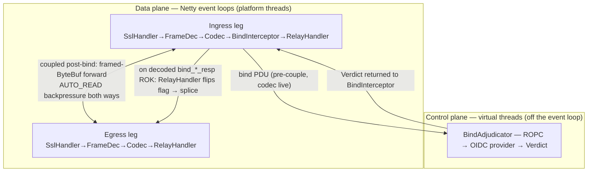
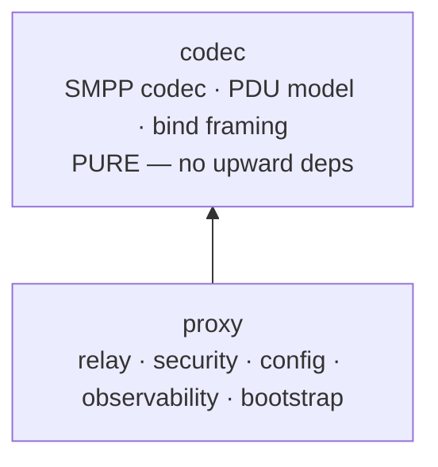
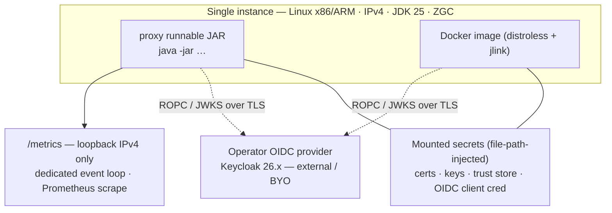

# Architecture Spine — Companions v1 (SMPP 3.4 Security-Transit Proxy)

> A headless, operator-configured, open-source SMPP 3.4 security-transit proxy. The PRD (`status: final`) is the binding product contract; this spine fixes only the architecture-level invariants and resolves the items the PRD deferred here (OQ-4, OQ-11, the relay/splice core, the module boundary, config/fail-fast, the OIDC flow, the threat model). Decisions, not rationale — rationale lives in `.memlog.md`. Versions web-verified 2026-07. Revised after the 8-lens reviewer gate (see `reviews/`).

## Design Paradigm

**Event-loop relay.** A pipes-and-filters **data plane** on Netty `ChannelPipeline`s owns the steady-state byte splice; a **control plane** of structured virtual-thread concurrency (`StructuredTaskScope` + `ScopedValue`) owns bind adjudication (OIDC), graceful shutdown, and lifecycle. Virtual threads never carry steady-state bytes; Netty event loops never run on virtual threads.

- **Data plane** (Netty event loops, platform threads): each socket leg is a pipeline `SslHandler → SmppFrameDecoder → SmppCodec → BindInterceptor → RelayHandler`. The bind→splice transition (AD-25) is a one-way flag flip; post-bind the pair is coupled into a bidirectional framed-ByteBuf pipe.
- **Control plane** (virtual threads, off the event loop): `BindAdjudicator` (ROPC → OIDC provider → `Verdict`), JWKS cache, lifecycle/graceful-drain, Spring-managed beans.



Maps to two Gradle modules: **`codec`** (the pure protocol layer) and **`proxy`** (everything else).

## Invariants & Rules

### AD-1 — Event-loop relay paradigm  · `[ADOPTED]`
- **Binds:** relay core, PERF-1/2/4, lifecycle.
- **Prevents:** per-PDU parsing on the hot path; data-plane/control-plane threading confusion.
- **Rule:** Netty event loops own the steady-state byte splice; virtual threads own the control plane (bind adjudication, OIDC, graceful shutdown). Virtual threads never carry steady-state bytes. *(Settled by user over the VT-per-connection alternative; PRD positioning line "virtual-thread relay" is reconciled — see Cross-artifact items.)*

### AD-2 — Relay coupling + framed-ByteBuf splice
- **Binds:** relay core, REL-1, REL-2, PERF-1.
- **Prevents:** live-pipeline-mutation races; unbounded buffering on slow egress; arbitrary byte-boundary forwarding; partial/duplicate/corrupt PDU forwarding.
- **Rule:** build on the canonical Netty relay pattern (HexDumpProxy: shared event loop for both legs, `AUTO_READ=false`, write-complete-gates-read backpressure). The relay forwards **framed-PDU `ByteBuf`s, not raw stream bytes** — each PDU is forwarded exactly once with boundaries preserved (transit integrity, REL-1). `SmppFrameDecoder` stays active on both legs; `SmppCodec` (object decode) is bypassed/dormant post-couple. No live pipeline surgery (`pipeline.remove()` on a live channel is forbidden). The flag flip itself is governed by AD-25.

### AD-3 — Hybrid PDU model  · `[ADOPTED]`
- **Binds:** FR-TRANSIT-1..4, SEC-2.
- **Prevents:** content-inspection / filtering / type-enforcement creep.
- **Rule:** inspect/handle ONLY the bind family **pre-couple / on a standalone (single-side) leg** (session establishment + auth); SMPP 3.4 only — **5.x is not implemented**. Once coupled (AD-25), **every** PDU — including `unbind`/`unbind_resp` — is an opaque framed byte stream forwarded like any other; the session ends on TCP half/close. All other PDUs are opaque framed bytes, never inspected, never filtered. Payload-transparent; MT-only is a deployment expectation, not a proxy-enforced filter. **Pre-couple PDU handling corollary (AD-32):** before the splice flip, ONLY the bind family is handled cooperatively (AD-25); `unbind`/`unbind_resp` and `enquire_link` are NOT specially handled — they close under AD-32's uniform "everything else" rule (the former cooperative carve-outs were dropped for simplicity). AD-3's opacity is about the PDU **body**; AD-32 reads only the fixed-layout header (`command_id` octets 4–7, `sequence_number` octets 12–15) — header inspection for routing/classification is permitted; body parsing of non-bind PDUs remains forbidden. *(Inherited from PRD OQ-2.)*

### AD-4 — No blocking work on the event loop
- **Binds:** relay, PERF-1.
- **Prevents:** event-loop stalls / carrier-thread pinning under load.
- **Rule:** OIDC/JWKS/DNS/file and any blocking call run on virtual threads. `SslHandler` is constructed with a **bounded delegating `Executor`** so handshake-crypto delegated tasks do not run on the event loop; on saturation the executor **fails the TLS handshake** (deny the connection, AD-11) — never `CallerRunsPolicy` (would run crypto on the event loop) and never unbounded queueing. The executor itself is fixed by AD-28.

### AD-5 — Control plane on StructuredTaskScope + ScopedValue
- **Binds:** control plane, COMP-2.
- **Prevents:** unstructured thread fan-out; request-context loss across the adjudication fan; orphaned tasks surviving cancellation/shutdown.
- **Rule:** build the control plane on **`StructuredTaskScope` (JEP 505) + `ScopedValue` (JEP 506)** — structured concurrency for the bind-adjudication fan-out (fork the ROPC token call and the local JWKS defense-in-depth verify concurrently, join, collapse to one `Verdict`), graceful shutdown, and lifecycle. `ScopedValue` carries the per-bind `RequestContext` (`system_id`, `ChannelId`, deadlines) — **never `ThreadLocal`**; the scope's lifetime bounds the fan, so a denied/timed-out/cancelled adjudication tears its tasks down with the scope (no orphans). **Adoption note (reverses the prior "stable-primitives-only" stance):** `StructuredTaskScope` is **preview-only on JDK 25** (5th preview, JEP 505; 6th preview JEP 525 in JDK 26; not final until ~JDK 27) while `ScopedValue` is **final** (JEP 506). Using STS requires `--enable-preview` **process-wide**, placing the whole runtime (Netty, Nimbus, the codec) under preview semantics — an **accepted risk** (register). Pin the exact JDK 25 build + the STS preview shape so toolchain drift cannot silently change semantics; confine STS to the control plane (`security/` adjudication + `bootstrap/` lifecycle) so the data-plane splice (event loops) stays pure-stable API. **Composition with AD-28:** STS structures the fan-out *within* one adjudication; the bounded hand-managed VT entry pool (AD-28(4)) still gates how many adjudications run concurrently and supplies fail-closed-on-saturation (AD-11) — STS does **not** replace that bounding. Virtual threads carry the control plane only; Netty event loops never run on virtual threads (AD-1/AD-6).

### AD-6 — Three threading models kept coherent
- **Binds:** concurrency, all.
- **Prevents:** threading-model cross-contamination.
- **Rule:** three models coexist by separation — (1) Netty event loops (platform threads, data plane), (2) hand-managed virtual threads (control plane), (3) Spring-managed executors. `spring.threads.virtual.enabled` is permitted **only** for Spring's own internal executors; **no load-bearing path may depend on it**, and the relay/adjudication threading is hand-managed, not delegated to Spring. Netty event loops never run on virtual threads.

### AD-7 — Two-module Gradle seam, inward-only  · `[ADOPTED]`
- **Binds:** MAINT-2, MAINT-3.
- **Prevents:** the extractable SMPP core coupling to proxy concerns.
- **Rule:** **`codec`** = codec + PDU model + bind-family framing; **PURE** — zero dependency on relay/TLS/OIDC/config/metrics/app. **`proxy`** = relay + security + config + observability + bootstrap. Dependency direction is strictly inward (`proxy → codec`); codec depends on nothing in the family. (Intra-`proxy` package ownership is fixed by AD-27.)

**Bind framing — what `codec` owns:**
- **PDU length-framing** (`SmppFrameDecoder`): read the 4-octet `command_length` header, accumulate exactly one PDU's bytes, emit one framed `ByteBuf` per PDU — the unit the relay forwards (AD-2). Generic to every PDU on both legs; stays active during splice. Enforces max `command_length` (65 536), rejects lengths < 16, and guards length-arithmetic overflow before any allocation (AD-30).
- **Bind-family parsing** (`SmppCodec`, bind branch): parse *only* the bind family (`bind_transmitter` / `bind_receiver` / `bind_transceiver` and their `_resp`) from a framed `ByteBuf` into typed objects exposing exactly the fields the proxy needs — header `command_id` / `command_status` / `sequence_number`, plus `system_id`, `password`, `system_type`, `interface_version`. That is what lets `BindInterceptor` route on `system_id`, hand the password to `BindAdjudicator` (AD-12), and lets `RelayHandler` detect `command_status == ESME_ROK` on `bind_*_resp` — the AD-25 flip trigger.
- **The bind-family `command_id` set** — `SmppCommandIds.BIND_FAMILY`, the single source of truth for which `command_id`s are parsed vs opaque-spliced (AD-27).
- **Out of scope:** every non-bind PDU (`submit_sm`, `deliver_sm`, `unbind`, …) is an opaque framed `ByteBuf`, never parsed into a typed object (AD-3). The parsed attack surface is therefore exactly two decoders — the generic framer and the bind-family parser — and both are fuzzed (AD-24).



### AD-8 — State-ownership (shape + home)
- **Binds:** REL-4, PRIV-1, relay, all.
- **Prevents:** independently-mutable shared state across units; in-place mutation visibility races; lost drain enumeration.
- **Rule:** the ONLY mutable runtime state is (a) ephemeral per-bind connection-pair state, (b) monotonic metrics counters/gauges, (c) the JWKS cache (public keys). **Config, the routing table, and TLS material are immutable after startup validation.** `message_id → system_id` correlation never exists; **no SMS message body is ever persisted** (PRIV-1). Homes: per-bind state lives in a single concurrent **`ConnectionRegistry`** bean (keyed by ingress `ChannelId`; holds the peer-egress `Channel`, the flip-flag, and ephemeral session metadata) plus a `Channel` attribute caching the entry for O(1) on the event loop; teardown removes via `channelInactive`. *(AD-32 case-3 additionally removes the entry synchronously in the violation handler and marks it tearing-down before `ctx.close()` — a case-specific override that closes the flip-race window; the later `channelInactive` removal is then a harmless no-op.)* The JWKS cache is an **`AtomicReference<JwkSet>` swapped whole on refresh** (never in-place mutation) and exposes `close()` for graceful-drain ordering (AD-22).

### AD-9 — Stateless relay on assumption A-1  · `[ADOPTED]`
- **Binds:** REL-4, FR-TRANSIT-2.
- **Prevents:** hidden message-state that breaks the stateless/HA premise.
- **Rule:** the relay holds socket-pairing state only; `deliver_sm`/DLRs ride the splice back to the originating bind via the coupled channel pair (that coupling *is* the session affinity). Load-bearing on **A-1** (carrier allows multiple concurrent binds under one `system_id` + DLR affinity, author-confirmed) — if A-1 is false the design must become stateful. Smoke-test A-1 early against a real/conformance SMSC (AD-24).

### AD-10 — Credential-free proxy tier (at rest)  · `[ADOPTED]`
- **Binds:** FR-SEC-1, FR-SEC-4, PRIV-1.
- **Prevents:** a persisted password vault / credential stash in the proxy tier; an overclaimed blast radius.
- **Rule:** the proxy is **credential-free at rest** — it holds no persisted SMPP passwords, no vault, no CA, no issuing private keys. What it *does* hold at runtime: (1) the OIDC client credential (one operational secret, file-path-injected per AD-18); (2) cached JWKS public verification keys; (3) the per-bind plaintext SMPP password **in memory only** during adjudication and forward to the SMSC (legacy → forward proxy → reverse proxy → SMSC) — never persisted, never logged, never cached, zeroized on completion/teardown (AD-12); (4) the proxy's own TLS end-entity private key(s) — internet-leg server/client cert (AD-17/AD-29) and optional IdP mTLS client cert (AD-12) — file-path-injected (AD-18), held by the `SslContext`; not an issuing/CA key. **Blast radius:** proxy compromise yields no stealable-at-rest credential stash; a *live memory* compromise exposes only the passwords of sessions active during the compromise window — materially "network position + transient in-flight secrets," not "network position only." Trust roots are the operator's OIDC provider, the operator's PKI/trust store, and the SMSC (sole password authority). *(Brainstorm's unified-trust-root is relaxed to three roots — see Cross-artifact items.)*

### AD-11 — Fail-closed universal default  · `[ADOPTED]`
- **Binds:** FR-SEC-5.
- **Prevents:** accept-on-indeterminate anywhere in an auth path.
- **Rule:** every auth-adjacent decision denies on indeterminate. **OIDC:** token-endpoint 401 → DENY; any non-401 response that does not yield a locally-verifiable JWT (200-with-non-JWT/HTML/empty body, 200-with-malformed-JWT, 3xx, 4xx≠401, 5xx, timeout, network error) → DENY; **JWT signature/iss/aud/exp/nbf mismatch → DENY**; **a 200 verdict overridden by failed local JWT verification → DENY (DENY always wins on disagreement between verdict and defense-in-depth)**; JWT with a `kid` absent from the cached JWKS → DENY (a background refresh is scheduled; **no foreground refresh-and-retry on the bind path**). **Introspection path (opaque tokens, AD-12):** anything other than HTTP 200 + JSON + boolean `active:true` → DENY (5xx/timeout/network error/3xx/4xx/200-non-JSON/200-missing-`active`/200-`active:false`). **Mode C:** no client cert or cert not reaching a configured anchor → TLS handshake fails (**REQUIRE never WANT**). **Ingress routing:** a `system_id` not in the routing table → DENY (no default route). **Startup:** trust store absent/empty → fail-fast refuse. Deny-on-ambiguous, always.

### AD-12 — OIDC via ROPC, disposable JWT verdict, `BindCredentialVerifier` port
- **Binds:** FR-AUTH-1, SEC-3.
- **Prevents:** verdict-cache security hole; tight coupling to a specific IdP token API.
- **Rule:** validate the SMPP password-grant via **ROPC** (Keycloak Direct Access Grants) — the **token-endpoint status (200/401) is the verdict**; verify the returned JWT locally via cached JWKS as defense-in-depth (precedence per AD-11); **discard the token and relay the ORIGINAL bind** to the SMSC (sole credential authority). **Re-validate every bind (no verdict cache; cache JWKS only).** Opaque tokens fall back to RFC 7662 introspection — **its results are never cached** (the no-verdict-cache rule covers introspection identically to JWT verdicts); operators should configure the IdP to issue JWTs for the ROPC flow (introspection is online to the same IdP with no offline cryptographic backstop — a defense-in-depth asymmetry vs the JWT path). **Provider link (SEC-3):** the proxy→provider token + JWKS endpoints are reached **over TLS (HTTPS), never HTTP**; the proxy authenticates as a confidential client via **mTLS (RFC 8705) or `client_secret`**, credential file-path-injected (AD-18); fail-fast at startup if the provider URL is not `https`; if OIDC discovery advertises `grant_types_supported`, probe it for Direct Access Grants (non-default since Keycloak 26.2) and warn — otherwise defer to runtime: a grant-type error from the provider → DENY per AD-11 (the DAG-enabled predicate is not reliably startup-detectable; discovery is optional). **Secret hygiene:** password and access token are held in `char[]`/`byte[]` (never `String`), zeroized on adjudication completion, connection teardown, JVM shutdown, and any exception path. Accurate clocks (NTP, A-4) are a precondition for `exp`/`nbf` adjudication.
- **Port contract** (single interface, owns the seam): `smpp.companion.proxy.security.BindCredentialVerifier` — `VerdictRequest verify(BindCredential cred, ScopedValue<RequestContext> ctx)` (see Cancellation below); `BindCredential(SystemId, char[] password)` lives in `security`; `sealed interface Verdict permits Allow, DenyInvalid, DenyIndeterminate` (no `Throwable`, no free-form reason, no Nimbus type crosses the port — the ROPC adapter absorbs Nimbus). Runs on the relay's hand-managed VT pool (AD-6/AD-28); never `@Async`. **Cancellation (AD-32):** the port MUST expose a handle that aborts the underlying HTTP ROPC call (not only the `CompletableFuture`) — `verify` returns a **`VerdictRequest`** exposing `CompletableFuture<Verdict> future()` + `void cancelHttp()` (the ROPC adapter binds `cancelHttp()` to the HTTP client's abort; `ScopedValue<RequestContext>` carries per-bind context only, not control flow) — so AD-32 case-3 teardown can spare the IdP the abandoned ROPC (the IdP-amplification mitigation in the Accepted-Risk Register is otherwise unreachable through the seam).
- **Two-proxy flow (both directions owned):** the **forward role performs OIDC verification**. The reverse proxy authenticates to the forward proxy as the TLS client. **In Mode C** the forward proxy validates the reverse proxy's mTLS client cert. **In Mode A (one-way TLS) the forward proxy CANNOT authenticate the reverse proxy** — so the forward proxy's internet-port listener **MUST be ACL-isolated to operator reverse-proxy hosts** (mirroring A-3), or **Mode C must be used for the internet leg**; a Mode A two-proxy deployment without ACL isolation is an **accepted risk** (register entry + loud startup warning — the Mode B pattern): any peer reaching the forward proxy's internet port receives relayed plaintext passwords. The reverse proxy forwards to the SMSC. (Mode B has no forward role — see AD-17.)
- **Honesty:** the port decouples adjudication from a specific IdP token API; **it does not by itself mitigate the architectural dependency on ROPC**, for which no standard replacement grant exists (see Accepted-Risk Register).

### AD-13 — mTLS = PKIX defaults; trust store never `cacerts` for ANY peer path (resolves OQ-4)  · `[ADOPTED]`
- **Binds:** FR-AUTH-4, OQ-4, FR-AUTH-3.
- **Prevents:** trust-root collapse; custom crypto; a shared golden-image key.
- **Rule:** validate peer certs to the operator-supplied trust anchor via `SslContextBuilder.trustManager(trustStore).clientAuth(REQUIRE)`; **rely on PKIX defaults for chain depth** (maxPathLength 5, tightened by `BasicConstraints.pathLenConstraint`) — do not override, no custom `PKIXBuilderParameters`, **no custom chain-validation code**. **The trust store never falls back to JDK `cacerts`** — this applies to **every peer-certificate validation path**, not only Mode C: Mode C client certs AND Mode A egress validation of the SMSC server cert (AD-26). Use a minimal single-purpose trust store (operator issuing-CA roots only); endpoint-identification is a no-op on client certs by JSSE design. **FR-AUTH-3:** Mode C client certs are **per-instance** (one cert per runtime instance, used for all egress targets; per-target cert IDs permitted via AD-29's optional `tlsContextId`); **never a shared golden-image key**. Trust-store startup validation: refuse if absent, empty, wrong format, wrong password, or containing zero `trustedCertEntry` entries. Revocation OUT (re-deploy-to-rotate).

### AD-14 — Identity forwarded, not mapped  · `[ADOPTED]`
- **Binds:** FR-SEC-3.
- **Prevents:** identity pooling / surrogation.
- **Rule:** legacy `system_id` == carrier `system_id`; the bind is forwarded to the SMSC with identity preserved end-to-end. No pooling, mapping, or surrogate identity.

### AD-15 — Legacy ingress leg: no local password check  · `[ADOPTED]`
- **Binds:** FR-SEC-2.
- **Prevents:** assuming the proxy authenticates the legacy leg locally.
- **Rule:** on the legacy↔proxy leg, the trusted network is the sole ingress gate; the proxy performs **no local password check and holds no local password store** — password validation is delegated per AD-12. The proxy reads `system_id` from the bind and routes on it. Trusted-network isolation (A-3) is the deployer's responsibility, stated explicitly.

### AD-16 — Spring Boot platform, Netty driven directly
- **Binds:** config, FR-DEPLOY-3, OBS.
- **Prevents:** Reactor fighting the relay; fragmented config.
- **Rule:** Spring Boot owns externalized config (`@ConfigurationProperties` + relaxed binding + fail-fast), DI, lifecycle, graceful shutdown, and the Micrometer metric model. Netty is driven **DIRECTLY** (own `ServerBootstrap`/`Bootstrap` in a `SmartLifecycle` bean); **NO WebFlux, NO Reactor.** No Spring web server on the SMPP path.

### AD-17 — Config fail-fast + (role × mode) matrix + Mode B posture
- **Binds:** FR-DEPLOY-2, FR-DEPLOY-3, §8.
- **Prevents:** silent insecure startup; ambiguous role/mode; divergent cert-material expectations per role.
- **Rule:** validate configuration at startup and refuse to start (non-zero exit, clear error) on any ambiguous/insecure/missing value. One instance = one role (`forward` | `reverse`) + one mode (`A` | `B` | `C`), mutually exclusive. **Mode B is reverse-only** — a forward-role instance configured in Mode B is rejected (Mode B has no forward proxy / legacy-facing leg). **Mode B posture (PRD §8): not refused — loud startup warning + explicit opt-in acknowledgment, then starts.** Required-config matrix (required / optional / forbidden per cell):

| | Mode A (one-way TLS) | Mode B (plaintext, reverse-only) | Mode C (mTLS) |
| --- | --- | --- | --- |
| **forward** | server cert+key (internet leg); routing table; OIDC provider; **SMSC endpoint NOT required** (forwards to the reverse proxy) | **forbidden** (Mode B is reverse-only) | server cert+key + trust store (client certs); routing table; OIDC provider |
| **reverse** | client trust store for forward-proxy/SMSC server cert (AD-26, never `cacerts`); SMSC endpoint | opt-in ack; SMSC endpoint | client cert+key + trust store; SMSC endpoint |

TLS floor: TLS 1.2 minimum, 1.3 preferred (a concrete default cipher/protocol allowlist ships in config, operator-tunable — SEC-1). Trust-store validation per AD-13. Bad ports / unset provider URL / non-`https` provider URL → refuse.

### AD-18 — Secrets file-path-injected  · `[ADOPTED]`
- **Binds:** DEP-1.
- **Prevents:** secret leakage via the environment.
- **Rule:** secrets (TLS cert/key files, trust store, OIDC client credential) are **file paths** in config pointing at mounted files (Docker secrets / bind-mount / k8s secrets); never a secret value in an env var (they leak via `/proc/<pid>/environ` and `docker inspect`). Fail-fast if a secret file is missing/unreadable.

### AD-19 — `/metrics` on own Netty (Micrometer); observability posture
- **Binds:** FR-OBS-1, FR-OBS-2, OBS-1..3, PRIV-1.
- **Prevents:** a management attack surface; content leakage in metrics; relay-event-loop stalls from scraping; metrics-cardinality DoS.
- **Rule:** expose a read-only Prometheus `/metrics` scrape via a **tiny loopback HTTP handler on a DEDICATED, hand-managed Netty event loop group** (started/stopped via `SmartLifecycle`; **never shares the SMPP relay event loop group**) calling `PrometheusMeterRegistry.scrape()` — **no Actuator web stack, no embedded Tomcat, no WebFlux**. **Handler hardening:** uses Netty's `HttpServerCodec` + `HttpObjectAggregator` (no hand-rolled HTTP parsing); method MUST be `GET`, path MUST be exactly `/metrics`, all other method/paths hard-rejected (`404`/`405`); bounded max header/body size. Bind **loopback IPv4 only** — the loopback binding is the sole authentication of the endpoint (the operator's host process model is the trust boundary); non-loopback binding is forbidden in v1. `system_id` labels emitted **only for `system_id` values present in the routing table** (cardinality = routing-table size, bounded at startup); unknown/rejected `system_id` values increment an unlabeled counter (`binds.rejected.unknown_system_id`) — **no free-form `system_id` is ever a label**. **Counter-label rule (AD-32 generalization):** NO `system_id`, NO `command_id`, NO `ChannelId` label on ANY close/reject counter (incl. `relay_connections_closed_total{direction, reason}` / `relay_pdus_rejected_total`) — this counter spans BOTH pre- and post-flip windows and is never labeled in either (pre-couple identity is untrusted; post-flip `system_id` labels are already bounded by the routing table elsewhere). **Read-vs-emit (AD-32):** READING the offender `command_id` via a proxy-side `ByteBuf.getInt(4)` for AD-32 case selection is always permitted at any log level; only EMITTING `command_id` to logs/metrics is TRACE-gated (off by default) — never via a codec helper (preserves AD-7 inward-only + "codec never emits metrics"). Message content never emitted. Baseline ops logging = structured JSON-lines (startup/errors/bind accept-reject; full PDU/body only at TRACE, off by default). Track active-virtual-threads via a custom gauge (Micrometer `jvm_threads_*` does not count VTs). No dashboard / telemetry backend / management API. *(PRD addendum A2's "opt-in to bind elsewhere" is superseded — loopback-only in v1; see Cross-artifact items.)*

### AD-20 — Egress TLS endpoint-identification + SMSC-leg default
- **Binds:** SEC-1.
- **Prevents:** Netty 4.2 hostname-verification default breaking raw-IP SMSC connects; ambiguous SMSC-leg posture.
- **Rule:** on the egress leg, **explicitly set `SslContextBuilder.endpointIdentificationAlgorithm`** — `null` for IP-addressed SMSC targets (or provision SMSC certs with IP SANs and keep verification on) — because Netty 4.2 defaults it to `HTTPS` and fails raw-IP connects. SMSC-leg TLS is **operator-choice, default off** under the trusted-network assumption (mirrors AD-15's legacy-leg stance); when on, the SMSC is authenticated via the operator SMSC trust store (AD-26).

### AD-21 — ByteBuf allocator posture
- **Binds:** PERF-2, memory.
- **Prevents:** per-channel allocator memory multiplication; OOM.
- **Rule:** one shared `PooledByteBufAllocator` across all channels; size `-XX:MaxDirectMemorySize` (derivation in AD-30) and expose `ByteBufAllocatorMetric`. Start with `io.netty.allocator.type=pooled` and load-test against the adaptive allocator (PERF-1 + PERF-2 soak) before choosing.

### AD-22 — Graceful shutdown coordination
- **Binds:** REL-3.
- **Prevents:** dropped in-flight traffic on shutdown; shutdown-race completing a partial verdict.
- **Rule:** on SIGTERM, Spring lifecycle (`SmartLifecycle` / graceful-shutdown callback) drives: stop the Netty SMPP acceptor (no new binds) → **DENY in-flight bind adjudications** (fail-closed; no new adjudications after the acceptor stops) → drain in-flight splices up to a configured timeout (enumerate the `ConnectionRegistry`, AD-8) → **stop the JWKS refresh** (`ScheduledExecutorService.shutdown` + await — the refresh VT drains here, not in the general VT-drain) → **close the JWKS cache** → VT control-plane drain → exit. Spring's graceful-shutdown timeout bounds the drain window.

### AD-23 — No native-image build target in v1 (resolves OQ-11)
- **Binds:** MAINT-5, OQ-11.
- **Prevents:** a second, underperforming build matrix; a ZGC regression.
- **Rule:** v1 ships the JVM build (runnable JAR + Docker) only. Keep the codebase **native-image-compatible as a documented stretch** (avoid reflection-heavy patterns in codec/splice) but produce no native binary. Revisit only if a cold-start-sensitive deployment shape (edge/serverless/memory-hard container) emerges. *(ZGC is unavailable in native-image — a native build would regress the flagship GC for an always-on single instance.)*

### AD-24 — Test & conformance toolchain
- **Binds:** FR-TRANSIT-3, MAINT-4, A-1, SM-3, SEC-2.
- **Prevents:** false conformance coverage; benchmark overclaim; an under-fuzzed continuously-exposed parser.
- **Rule:** (1) **author** a from-scratch SMPP 3.4 conformance/regression suite in the test module (no OSS suite exists); structurally fuzz **both the bind-family parser AND the framing decoder** — the framing decoder runs on every PDU on both legs for the connection lifetime and is the more-exposed surface (SEC-2). The suite asserts the proxy's **above-spec bare-close for every pre-couple non-bind PDU (AD-32)** — `unbind`, `enquire_link`, `submit_sm`, unknown `command_id`, etc. all close with no `_resp`, NOT the SMPP-3.4-conformant responses (`unbind_resp`, `enquire_link_resp`, `ESME_RINVBNDSTS _resp`, `generic_nack`) — the documented above-spec deviation; only the bind-family handshake (`bind_*` / `bind_*_resp`) is asserted conformant. (2) Primary mock SMSC = an **in-JVM mock built on `codec`** (A-1 fixture + PERF sink; emulates N binds/`system_id` + `deliver_sm` session affinity). (3) **jSMPP 3.0.2** (Apache-2.0) as the independent interop counterpart (alternate ESME client + server-side mock) — never the production codec. (4) A-1 carrier-side check = a separate **non-CI ops step** against the real target carrier. (5) Scope the SM-3 "first-of-kind" claim to "no published SMPP **proxy/stateless-relay** benchmark." **Concurrency-test posture (resolves test-design Q2):** adopt `jcstress` scoped to CROSS-THREAD state only (`ConnectionRegistry` teardown, `AtomicReference<JwkSet>` swap, `CompletableFuture`×`ScopedValue` handoff) as a nightly target, PAIRED with a delay-injection / event-loop-jitter race-soak — jcstress proves happens-before (visibility races); only the soak surfaces event-ordering races (half-close/`unbind`/RST). Three modalities, three failure classes. **Composed-integration E2E (resolves test-design Q4):** a two-real-instance forward↔reverse E2E (weekly/manual tier; real Spring Boot processes over the in-JVM mock SMSC + mock IdP, Mode C via the deploy-time contract — also validates DEP-1) is the sole coverage of the product's composed integration.

### AD-25 — Bind→splice transition state machine
- **Binds:** relay core, FR-TRANSIT-1, AD-2.
- **Prevents:** two flippers; flip on a non-ROK `bind_resp`; divergent post-couple `unbind` handling.
- **Rule:** the splice flag is flipped by **exactly one unit — the data-plane `RelayHandler`** (the control-plane `BindAdjudicator` never mutates a data-plane flag; it returns a `Verdict` to the `BindInterceptor`). **Trigger:** on the ingress channel's event loop, upon receipt of the **decoded `bind_*_resp` with `command_status == ESME_ROK`** (codec live pre-couple) — never a peeked `command_id`, never "any frame from egress." A non-ROK `bind_resp` → do **not** flip; tear down. **`bind_*_resp` forwarder:** `BindInterceptor` forwards the `bind_*_resp` to the legacy client (it owns bind-family pre-couple per AD-3); `RelayHandler` observes the decoded `bind_*_resp` **read-only** to flip the flag and **never forwards it** — the first spliced PDU is the first PDU **after** the `bind_*_resp`. **Post-couple:** `unbind`/`unbind_resp` are opaque framed bytes forwarded like any other PDU; the session ends on TCP half/close (`channelInactive`) on either leg, which tears the per-bind pair (AD-8). (Pre-couple, `unbind` is closed per AD-32 — no cooperative handling remains.) **Close-on-violation (AD-32):** closing the connection on a pre-couple non-bind violation is an **above-spec fail-closed product policy, always on** (SMPP 3.4 prescribes the error `_resp` while remaining in state) — not SMPP-mandated, no config knob; it implicitly fails any in-flight bind without a `bind_resp` (acceptable per AD-11). **Verdict-callback re-check (race-free, with AD-32):** BOTH the Allow/flip path AND the Deny callback (`onBindReject` + `bind_*_resp`) MUST re-check the `ConnectionRegistry` entry before proceeding — if the entry is absent or marked tearing-down (AD-32 case 3 tore it down on a concurrent pre-couple violation, and its `cancelHttp()` makes the aborted-verdict land near-instantly), the callback is a no-op (no flip, no `onBindReject`, no `bind_resp`). This upholds AD-32 case 3's invariant that Q1 never emits a `bind_*_resp` (or any `_resp`) on a connection it is tearing down. *(Defense-in-depth: case-3 teardown also shuts the adjudication's `StructuredTaskScope` per AD-5, so a late Verdict is unlikely to be produced at all.)*

### AD-26 — Egress TLS trust anchoring
- **Binds:** SEC-1, SEC-3, AD-13, AD-20.
- **Prevents:** trust-root collapse on the egress side (any publicly-trusted cert authenticating a MitM SMSC).
- **Rule:** the reverse proxy's TLS client validates the peer (forward proxy / SMSC) server cert against an **operator-supplied trust store with the same posture as AD-13 — never JDK `cacerts`**, fail-fast if absent/empty. Disabling hostname verification (AD-20) is conditional on either (a) IP-SAN-provisioned peer certs with verification ON, or (b) the operator SMSC trust store being the sole gate. If an operator explicitly requires `cacerts`/public-PKI SMSC trust, it is an **explicit opt-in with a loud startup warning + acknowledgment, permitted in ANY mode** (the threat — trusting a public root for the SMSC peer — is identical across modes; this is the Mode B pattern, not Mode-B-only) — never the default.

### AD-27 — Intra-`proxy` ownership seams
- **Binds:** AD-3, AD-7, AD-19.
- **Prevents:** two owners of the bind-family set or the splice metric; double/under-counting.
- **Rule:** (1) the **bind-family `command_id` set** is owned by `codec` as the single source of truth (`SmppCommandIds.BIND_FAMILY`); `BindInterceptor` (`relay/`) MUST consume it — redefining it locally is forbidden. `outbind` and `generic_nack` are declared **opaque-spliced, not bind-family**. (2) A **`SpliceObserver`** interface is owned by `observability/` (methods: `onFramedPdu(Direction)`, `onBindAccept(SystemId)`, `onBindReject(SystemId, Verdict)`, `onByteTransfer(Direction, long)`, `onConnectionClosed(Direction, CloseReason)` — no PDU type, no content; `CloseReason` is a closed enum exhaustive over the spine's close paths: `{PEER_HALF_CLOSE, PEER_RST, EGRESS_CONNECT_FAILED, OVERSIZED_FRAME, UNDERSIZED_FRAME, DECODE_ERROR, UNKNOWN_COMMAND_ID, PRE_COUPLE_NON_BIND_PDU, CLEAN_UNBIND_HANDSHAKE, GENERIC_NACK_PRE_BIND, BIND_REJECTED, BIND_FAILED_NON_ROK, INGRESS_TLS_HANDSHAKE_FAILED, EGRESS_TLS_HANDSHAKE_FAILED, SHUTDOWN_DRAIN, OTHER}`). **Trigger events are pinned:** `onBindAccept` fires exactly at the AD-25 flip (decoded `bind_*_resp` ROK), not at the verdict; `onBindReject` is called **only** for `Verdict` values returned by `BindCredentialVerifier` (`DenyInvalid`/`DenyIndeterminate`) — routing-miss, `kid`-miss, and config denies go to AD-19's unlabeled counter, never through `onBindReject`. The `SpliceObserver` implementation **MUST apply AD-19's cardinality rule** (a `SystemId` not in the routing table is never a label). `RelayHandler` holds an injected reference and calls it; **the codec never emits metrics**. One counter source; the Micrometer impl is the only thing behind the seam. **Connection-close telemetry (AD-32):** `onConnectionClosed` is **exactly-once per channel** (idempotent, CAS-guarded on the channel attribute; owned by the `channelInactive` teardown site — the violation handler only stashes the `CloseReason`, never calls `onConnectionClosed` directly) and **fires for every `channelInactive`**. It backs `relay_connections_closed_total{direction, reason}` (cardinality = 2 × |CloseReason|, bounded; spans both pre- and post-flip windows; NO `system_id`/`command_id`/`ChannelId` label ever — AD-19). This replaces the latent RELAY-010 "increment-on-teardown" assumption; the full 5-method shape (incl. `onConnectionClosed`) is seeded by Epic 2's noop impl, so Epic 4 swaps only the impl behind the unchanged interface.

### AD-28 — Bounded delegating executors: hand-managed, platform-thread, shared
- **Binds:** AD-4, AD-6, AD-22.
- **Prevents:** divergent executor models on the data-plane accept path; carrier pinning from VT-bound SSLEngine tasks; orphaned refresh threads on shutdown.
- **Rule:** (1) the `SslHandler` delegating-task `Executor` is **ONE hand-managed fixed platform-thread pool** (NOT virtual threads — SSLEngine delegated tasks are CPU-bound and may pin carriers; NOT a Spring `ThreadPoolTaskExecutor`), shared by ingress + egress, bounded queue, abort-and-fail-handshake on saturation (AD-4). (2) JWKS refresh is a **hand-rolled virtual thread on a `ScheduledExecutorService` owned by `security/`** (not `@Scheduled`); the AD-22 drain stops it (in its dedicated step) **before** the JWKS cache closes. (3) `spring.threads.virtual.enabled` (AD-6) permitted only for Spring's own internal executors. (4) **Bind adjudication runs on a single bounded hand-managed VT `ExecutorService` (JEP 444) owned by `security/`**, shared across all binds, sized via config, fail-closed on saturation (AD-11), registered with the AD-22 drain (DENY-in-flight = `shutdownNow()` + await); **spawning one VT per bind outside this pool is forbidden** — this is the executor AD-12 references.

### AD-29 — Routing cardinality (v1 = 1:1) + value schema
- **Binds:** AD-8, AD-15, FR-AUTH-3.
- **Prevents:** divergent routing-table schemas; ambiguous multi-carrier semantics; metrics-cardinality explosion.
- **Rule:** a **v1 forward-role instance fronts exactly one carrier egress (1:1)**; the routing table is a `system_id` allow-list, every permitted `system_id` mapping to the **single** configured egress target. Multi-carrier routing (`system_id` → per-carrier egress) is **deferred to post-v1** (simplicity + single-instance + statelessness + bounded metrics cardinality). Value schema: `{host, port, tlsContextId?}`; `tlsContextId` optional — if absent, the instance-level TLS context is used. Mode C client cert is **per-instance by default**; per-target cert IDs permitted via `tlsContextId` + an explicit `tls.contexts` map. *(User-confirmed 1:1 for v1; multi-carrier remains deferred — see Deferred.)*

### AD-30 — Max frame size + per-channel inbound budget + direct-memory derivation
- **Binds:** SEC-2, REL-2, AD-21.
- **Prevents:** declared-length memory/CPU exhaustion; uncoordinated codec/allocator budgets → OOM under load.
- **Rule:** `SmppFrameDecoder` enforces a single pinned **max `command_length` (65 536 octets — covers `message_payload` TLV max)**; frames exceeding are dropped and the channel closed (fail-closed). The decoder rejects declared lengths < 16 and guards length-arithmetic overflow/underflow **before allocation** (independent of `-XX:MaxDirectMemorySize`). Per-channel inbound queue depth (in framed-PDU buffers) is bounded; `AUTO_READ=false` + write-completes-gates-read (AD-2) is the trip-wire with an explicit low-water mark to re-arm read. `MaxDirectMemorySize` is derived from `max_frame × max_inbound_depth × concurrent_pairs × safety_factor` and exposed via `ByteBufAllocatorMetric` — one named formula so the codec max and the allocator budget cannot drift. **Shared-constant assertion (resolves test-design Q5):** the codec max `command_length` (65 536), the `MaxDirectMemorySize` formula input, and the config default MUST reference ONE named constant — asserted by an ArchUnit/Gradle static test (catches conservative drift a runtime soak cannot). PLUS a startup self-check: live `MaxDirectMemorySize` (read via `ByteBufAllocatorMetric`) MUST be ≥ the computed budget, else fail-fast (AD-17) — closes the JVM-flag gap the ArchUnit test cannot reach.

### AD-31 — Documentation is the operator surface (OPS-1)
- **Binds:** OPS-1, SEC-1.
- **Prevents:** a headless product with no governed operator interface.
- **Rule:** because the product is headless with no UI/management API, **documentation is a v1 deliverable** governed by the architecture: config reference, per-mode (A/B/C) deployment guide, and troubleshooting/runbooks ship alongside the release. SEC-1's published cipher-allowlist policy, the Mode B warning text, and the A-1 real-carrier operational test plan all dock here. Docs live under `docs/` in the repo.

### AD-32 — Pre-couple non-bind PDU policy (resolves test-design Q1)  · `[ADOPTED]`
- **Binds:** relay wire behavior, FR-TRANSIT-1/3, FR-SEC-5, REL-1, RELAY-002.
- **Prevents:** malformed/non-conformant error PDUs; pre-couple buffering state (statelessness AD-9); a bind-in-flight wire oracle; silent loss masquerading as an intended drop.
- **Rule:** on EITHER leg, BEFORE the AD-25 splice flip (decoded `bind_*_resp` ROK), a received PDU is handled by case — fail-closed, **zero config knobs**, uniform above-spec close:
  - **bind family** (`bind_*` / `bind_*_resp`) → handled per AD-3/AD-25 (the bind handshake and the ROK flip). These are the **only** pre-couple PDUs that receive a cooperative response.
  - **egress `generic_nack` (or non-ROK `bind_*_resp`) from the SMSC, pre-`bind_resp`** → **forwarded verbatim** to the legacy ESME as the bind result — the SMSC is the sole credential authority, so its actual response is ground truth and passes through unchanged (no splice flip; tear down both legs). (Distinct from the proxy's OWN pre-SMSC denials — IdP/verifier or routing-miss — which collapse per AD-33; and from SMSC transport-death — connect-fail/RST/`unbind`/half-close with no SMSC response PDU — which the proxy synthesizes via AD-33.)
  - **Everything else** — `unbind`/`unbind_resp`, `enquire_link`, `submit_sm`, `data_sm`, `query_sm`, `replace_sm`, `cancel_sm`, `submit_multi`, `deliver_sm`, a `*_resp`, `alert_notification`, an unknown `command_id`, etc. (direction-agnostic) — emit **no response** and **close** the connection. This is an **above-spec fail-closed policy** (the SMPP-3.4-conformant response to most of these would be a `_resp` — `unbind_resp`, `enquire_link_resp`, or the matching `_resp` with `ESME_RINVBNDSTS`; `generic_nack` (§4.3) for an unknown `command_id` — but we drop the connection instead, **uniformly**, for implementation simplicity: no response synthesis, no flush-before-close PDU ordering, no request-vs-response-direction handling, no carve-out branches). The offender's body is never parsed (AD-3 opacity); `command_id` is read only to confirm "not bind-family." An invalid/corrupt `command_length` (< 16 or overflow) → AD-30 drop + close.
  **Teardown ordering (race-free):** on the same event loop, **synchronously remove the `ConnectionRegistry` entry and mark it tearing-down BEFORE closing**; cancel the in-flight ROPC via the port's cancellation handle (AD-12) and zeroize the password; then close. **"Bind in flight"** ≡ a `ConnectionRegistry` entry exists for the connection and has not yet been flipped to coupled (AD-25); the teardown predicate is the entry's state, not a separate boolean. **Uniform whether or not a bind is in flight** — Q1 emits no `bind_*_resp` (and no synthetic `_resp` at all) on a violation, eliminating the bind-in-flight wire oracle. **Above-spec, always on, no knob** (SMPP 3.4 prescribes a `_resp` while remaining in state); it implicitly fails any in-flight bind without a `bind_resp` (acceptable per AD-11). The offending `command_id` appears **only in TRACE logs**, never as a metric label (AD-19). *(User-locked: the former `unbind`-handshake and `enquire_link`-keepalive carve-outs are deliberately dropped for simplicity — see the Accepted-Risk Register for the resulting carrier-keepalive/pipelining constraint.)*

### AD-33 — Bind-denial wire collapse (resolves test-design Q7)  · `[ADOPTED]`
- **Binds:** FR-SEC, FR-AUTH-1, the bind-denial wire contract, SEC-078..080.
- **Prevents:** `system_id` enumeration / IdP-availability probing via distinct denial codes.
- **Rule:** a bind denial collapses to **two** wire values: ALLOW → `bind_*_resp` with `command_status == ESME_ROK`; **every** bind denial — every verifier `Deny*` (invalid credential, indeterminate/timeout/network-error/`kid`-miss/JWT-fail/cert-fail/introspection-fail), the ingress **routing-miss** (`system_id` not in the routing table, AD-11), AND egress-side bind-establishment failures that produce **no SMSC response PDU** (egress connect-fail, egress RST/`unbind`/half-close pre-`bind_resp`) → the matching `bind_*_resp` carrying **one generic bind-failure code** (exact code owned by a single story; scoped to `bind_*_resp` answering a `bind_*` request only). **SMSC-originated response PDUs (`generic_nack`, non-ROK `bind_*_resp`) are forwarded verbatim per AD-32 case 4 — NOT collapsed** (the SMSC is the sole credential authority; a prober can distinguish "reached the SMSC" from "proxy-rejected," a mild credential-validity oracle accepted within the no-rate-limit risk). The rich OIDC outcome (`DenyInvalid` vs `DenyIndeterminate` + sub-reason) appears **only** in structured JSON-lines logs and bounded `Verdict`-type metrics counters — **never on the wire**. **AD-32 case 3 is NOT a bind denial under AD-33** — a pre-couple non-bind violation closes the connection and emits NO `_resp` (and NO `bind_resp`), even if a bind was in flight (reconciling AD-25's "without a `bind_resp`"). **Residual timing side-channel (accepted risk):** a routing-miss resolves instantly while an IdP rejection incurs IdP RTT/timeout, so a trusted-network attacker can time the deny to infer "not routed" vs "credential rejected" — accepted under the trusted-network assumption (AD-15); full timing normalization is deferred. *(Q1's non-bind violation handling is a separate contract — bare-close, no `_resp`, AD-32 case 3 — and does not propagate this collapse.)*

### AD-34 — TLS cipher/protocol allowlist default (resolves test-design Q3, SEC-1)  · `[ADOPTED]`
- **Binds:** SEC-1, AD-17.
- **Prevents:** weak/legacy cipher negotiation drift; SEC-089 unimplementable.
- **Rule:** ship a conservative default, operator-tunable under `companion.tls.*`. **Protocols:** `["TLSv1.3", "TLSv1.2"]` (1.3 preferred). **TLS 1.2 cipher set:** `TLS_ECDHE_ECDSA_WITH_AES_256_GCM_SHA384`, `TLS_ECDHE_ECDSA_WITH_AES_128_GCM_SHA256`, `TLS_ECDHE_RSA_WITH_AES_256_GCM_SHA384`, `TLS_ECDHE_RSA_WITH_AES_128_GCM_SHA256` (no CBC, no static-RSA key exchange, no RC4/3DES/null/anon); `TLS_ECDHE_*_WITH_CHACHA20_POLY1305_SHA256` optional where the provider offers it. At startup, intersect the configured set with each `SSLContext`'s supported suites **for EVERY context** (ingress server + every egress target context + the IdP mTLS client context, AD-12/AD-29); **each empty intersection → fail-fast** (AD-17). **TLS 1.3 ciphers:** restricted to the JDK AEAD set `{TLS_AES_256_GCM_SHA384, TLS_AES_128_GCM_SHA256, TLS_CHACHA20_POLY1305_SHA256}` (parity with the TLS-1.2 posture; ChaCha20 optional). *(Resolves the Deferred "exact cipher allowlist" item — the default is pinned; operators may tune.)*

### AD-35 — Compile-time null-safety enforcement via JSpecify + NullAway  · `[ADOPTED]`
- **Binds:** AD-7, AD-17, AD-27, CODEC-040; the mechanical-enforcement ethos.
- **Prevents:** runtime NPEs; silent null-contract drift; an unchecked null surface in the proxy (config wiring, Spring beans) and codec.
- **Rule:** standardize on **JSpecify** (`org.jspecify.annotations`) — the ecosystem nullness-annotation standard Spring Framework 7 / Spring Boot 4 migrated to (deprecating `org.springframework.lang.*`); tool-neutral, so it locks nothing in. Enforce with **NullAway** (Uber, on **Error Prone**), `CheckSeverity.ERROR` → **compile-time fail-fast** (javac fails on a nullness violation), reading JSpecify (`-XepOpt:NullAway:JSpecifyMode=true`), applied to BOTH modules via a new **buildSrc convention plugin** (`smpp.null-safety`), fail-closed — a peer to CODEC-040/OBS-013/SEC-099. This **complements** AD-17's runtime `@Validated`/`@NotNull` bean validation with build-time enforcement. **Codec purity (AD-7) relaxation:** CODEC-040's io.netty-only allowlist is amended to **also permit `org.jspecify`** so the codec module can carry the JSpecify jar; declare it **`compileOnly`** on codec so codec RUNTIME stays `{io.netty}+JDK` (JSpecify is `RUNTIME`-retained but its types load only on reflection). **Rejected alternatives:** Checker Framework Nullness Checker (sounder full pluggable type system, but high annotation/stub burden + GPL2 framework jar — wrong cost/benefit here); SpotBugs (flow-insensitive bug-finder, blind to JSpecify — issue #3143 — weaker for systematic nullness); JSpecify-alone (documentation-only, no enforcement). **Verified fit (2026-07):** Error Prone 2.50.0 + NullAway 0.13.5 are CI-green on JDK 25 (NullAway builds on Gradle 9.5.0); JEP 505 StructuredTaskScope is API-only so `--enable-preview` is safe. *(Layered on the 2026-07-25 null-safety feasibility analysis — see Story 1.4.)*

## Accepted-Risk Register

*A security product owns its accepted risks explicitly. SM-2 (trust model survives a security-architect review) probes these. Inherited from PRD §11 unless marked.*

- Password-only ingress on the legacy leg — by design; mitigated by trusted-zone confinement (AD-15).
- `system_id` spoofing on the trusted network — any trusted-net host can claim any permitted `system_id`; sole control = network isolation (A-3).
- **Authority-provider / PKI-CA compromise** — the OIDC provider can **mint verdicts**; it can mint client **certs only if the operator runs the same entity as its Mode C PKI CA** (brainstorm's unified-trust-root is relaxed — see Cross-artifact items). Provider/CA HA and security are the operator's responsibility (A-2).
- Mode B plaintext password over the public internet — opt-in + loud startup warning, starts (not refused) (AD-17).
- **Mode A two-proxy without ACL isolation** — in one-way TLS the forward proxy cannot authenticate the reverse proxy, so any peer reaching the forward proxy's internet port is relayed plaintext passwords/content; mitigation = ACL-isolate the forward proxy's internet-port listener to operator reverse-proxy hosts (mirroring A-3) or use Mode C (AD-12).
- Payload transparency = no content-level protection — no inspection/filtering/type-enforcement; operators own what transits (AD-3).
- Long-lived baked Mode C client certs — rotation = re-deploy; per-instance keys bound the blast radius (OPS-2).
- Authority-provider outage blocks new binds — ongoing splices survive on cached JWKS/trust (A-2).
- No local brute-force / rate-limit protection — planned future companion; acknowledged gap. **Sharpened (AD-32):** the bind-in-flight branch abandons an in-flight ROPC call the IdP still completes — an attacker on the trusted network (or spoofing a `system_id`) can drive IdP ROPC rate up to the proxy's adjudication-executor throughput, faster than failed-bind-wait-for-401 churn. AD-28(4)/AD-4 protect the PROXY, not the IdP; **operator-side IdP rate-limiting / Keycloak brute-force protection is REQUIRED (operator-scope, D4).**
- **Pre-couple non-bind PDUs are closed uniformly (AD-32) — *new.*** Only the bind family is handled cooperatively pre-couple; an ESME that pipelines `submit_sm` before `bind_resp`, whose bind-timeout is shorter than PERF-3 cold/DENY latency, **or whose `enquire_link` keepalive interval is shorter than PERF-3 bind latency**, has its connection closed (the `unbind`/`enquire_link` cooperative carve-outs were dropped for simplicity). Hard product constraint — docks under OPS-1 + the A-1 non-CI carrier check (carrier must not pipeline pre-`bind_resp`; carrier bind-timeout **and** keepalive interval must exceed PERF-3 bind latency).
- No metrics dashboard / telemetry backend / management API — read-only `/metrics` + baseline logging only.
- Single-instance, no HA/failover — statelessness is a future-HA enabler, not a v1 commitment.
- **ROPC hard-dependency — *new from research.*** v1 architecture **hard-depends on ROPC (Direct Access Grants)**, a deprecated grant (RFC 9700 "MUST NOT"; OAuth 2.1 removes). The first-party/headless/in-memory framing places this build outside the deprecation's *primary* rationale (3rd-party end-user apps), but does **not** neutralize the normative language or the trajectory. The `BindCredentialVerifier` port (AD-12) **localizes a future rework to one adapter; it does not eliminate the dependency** — no standard replacement grant exists. Keycloak 26.7 still ships Direct Access Grants; if it is removed, v1 must be reworked. This is the single most fragile external dependency in the trust model.
- **Preview-API dependency (StructuredTaskScope) — *new.*** The control plane adopts `StructuredTaskScope` (JEP 505), which is **preview-only on JDK 25** (still preview in JDK 26 per JEP 525; not final until ~JDK 27) — `ScopedValue` (JEP 506) is already final. Using STS requires `--enable-preview` **process-wide**, placing Netty, Nimbus, and the codec under preview semantics, and the STS API shape (the "joiner" design) may change before finalization. Mitigations: pin the exact JDK 25 build; confine STS to the control plane so the data-plane splice stays pure-stable API; keep usage behind the `security/`/`bootstrap/` seam so a future API change is localized. Revisit at the next LTS where STS is final. *(Reverses the earlier "stable-primitives-only" stance — see `.memlog.md`.)*

## Consistency Conventions

| Concern | Convention |
| --- | --- |
| Modules | `codec` (pure protocol layer) · `proxy` (the runnable proxy). Gradle multi-module; versions via `netty-bom` + Spring Boot 4.1.x dependency management. |
| Naming | SMPP identifiers verbatim from the v3.4 spec (`bind_transceiver`, `system_id`, `command_length`). Java packages `smpp.companion.codec.*` / `smpp.companion.proxy.*` (sub-packages `relay`/`security`/`config`/`observability`/`bootstrap`). Config keys `companion.*` (relaxed binding). |
| Data & formats | SMPP 3.4 on the wire (length-prepended PDUs; no 5.x). Logs = structured JSON-lines (UTC ISO-8601). Metrics = Prometheus text exposition. Config = `application.yml` + env-var override. |
| Identity | `system_id` is the single end-to-end identity, forwarded verbatim — never pooled, mapped, or logged as a password. |
| Secrets | Passwords/tokens in `char[]`/`byte[]`, zeroized (AD-12); file-path-injected at rest (AD-18). |
| State & mutation | Only AD-8's three mutable buckets; JWKS cache swapped whole (`AtomicReference`); everything else immutable post-startup. Monotonic counters only. |
| Errors | Fail-closed on every auth-adjacent path (AD-11); fail-fast at startup on bad config (AD-17). Bind denials collapse to one generic `bind_resp` failure code (AD-33; exact code owned by a single story) — rich OIDC outcome logs-only. Pre-couple: only the bind family is handled cooperatively; everything else closes with no `_resp` emitted (AD-32, above-spec fail-closed). Never a stack trace on the wire. |
| Crypto & libs | Never roll crypto/TLS/JWT — mature libs only (JDK SSLEngine, Nimbus). `cacerts` is never a trust source for peer auth (AD-13, AD-26). |

## Stack

*SEED — web-verified current at authoring (2026-07). The code owns this once it exists.*

| Name | Version |
| --- | --- |
| JDK | 25 LTS (pin build 25.0.x) |
| Netty | 4.2.16.Final (via `netty-bom`; 4.2 IoHandler transport SPI, `ChannelHandler` pipeline retained; NIO/Epoll, not io_uring). 5.x has no GA (alpha-only, main-branch active) — 4.2.x is the production line. |
| Spring Boot | 4.1.x (Spring Framework 7.0.8+) |
| Micrometer | ships with Spring Boot 4 |
| Nimbus JOSE+JWT | 10.9.1 (≥10.0.2 for CVE-2025-53864) |
| jSMPP (test/interop only) | org.jsmpp:jsmpp:3.0.2 (not 2.3.11) |
| GraalVM (stretch only, no v1 build) | for JDK 25 (Oracle ≥ 25.1.3 / CE ≥ 25.0.2) |
| GC | generational ZGC (the only ZGC mode in JDK 25) |
| Runtime image | jlink ~45–66 MB; Docker image = distroless + jlink runtime (JDK 25 modules) |
| Reference IdP (operator-provided, not part of project) | Keycloak 26.x |
| Build / platform | Gradle multi-module · Linux x86/ARM · IPv4 · Apache-2.0 |

## Structural Seed

### Two-proxy topology & per-leg TLS (modes A/B/C)

```mermaid
graph LR
  L["Legacy SMPP 3.4<br/>password-grant only<br/>no mTLS"]
  FWD["Companions — forward proxy"]
  REV["Companions — reverse proxy"]
  S["SMSC<br/>sole credential authority"]
  L -->|trusted net — SMPP plaintext<br/>proxy does NOT authn this leg| FWD
  FWD -->|internet leg — Mode A: one-way TLS<br/>Mode C: mTLS| REV
  REV -->|trusted net — SMPP password-grant<br/>system_id preserved end-to-end| S
  L -.->|Mode B only (reverse role): plaintext SMPP over public internet| REV
```

One instance runs exactly one role + one mode (AD-17). Single-side adoption (enterprise-only or carrier-only) is a valid v1 deployment. Mode B is reverse-only.

### Deployment & environments (operational envelope)



Single-instance (no HA/failover). Certs provisioned at deploy (no runtime ACME/SPIFFE); Mode C rotation = re-deploy. No bundled authority provider, no cert issuance.

### Source tree

```text
companions/
  codec/              # SMPP 3.4 codec, PDU model, bind-family framing, command_id set — PURE, extractable (MAINT-2)
    src/main/java/smpp/companion/codec/…
    src/test/…                   # codec unit tests + JQF/jqwik bind-PDU AND framing-decoder fuzz
  proxy/              # the runnable proxy application (the JAR + Docker image)
    src/main/java/smpp/companion/proxy/
      relay/                     # Netty pipelines, BindInterceptor, RelayHandler, coupling, ConnectionRegistry
      security/                  # TLS modes A/B/C, trust-store loading, OIDC/JWKS (Nimbus), BindCredentialVerifier port + ROPC adapter
      config/                    # @ConfigurationProperties model, fail-fast validation, role×mode matrix, routing table
      observability/             # JSON-lines logging, SpliceObserver, /metrics scrape handler (Micrometer), MetricsRegistry
      bootstrap/                 # Spring Boot main, SmartLifecycle, graceful-shutdown wiring, dedicated metrics event loop
    src/test/…                   # from-scratch conformance suite, in-JVM mock SMSC, jSMPP interop, TLS/OIDC vectors
  docs/                          # OPS-1 operator surface: config reference, per-mode deployment guide, runbooks (AD-31)
  settings.gradle / build.gradle # 2-module Gradle; netty-bom; Spring Boot 4.1.x
```

## Capability → Architecture Map

| Capability / Area | Lives in | Governed by |
| --- | --- | --- |
| FR-TRANSIT (hybrid transit, DLR affinity, 3.4 interop, no 5.x) | `relay` + `codec` | AD-2, AD-3, AD-9, AD-24, AD-25, AD-32 |
| FR-SEC (credential-free at rest, fail-closed, end-to-end identity, consume trust) | `security` + `relay` | AD-10, AD-11, AD-14, AD-15, AD-26 |
| FR-AUTH (OIDC delegation, mTLS Mode C, per-instance certs) | `security` | AD-12, AD-13, AD-29 |
| FR-DEPLOY (JAR+Docker parity, dual-role, fail-fast, deploy-time certs) | `bootstrap` + `config` | AD-7, AD-16, AD-17, AD-18 |
| FR-OBS / PRIV-1 (JSON-lines logging, read-only /metrics, no body persistence) | `observability` | AD-8, AD-19 |
| PERF-1..4 (throughput, concurrency, latency) | `relay` + `codec` | AD-1, AD-2, AD-4, AD-21, AD-30 |
| SEC-1..5 (TLS floor + allowlist, parser robustness, provider link, no rolled crypto, CVE hygiene) | `security` + `codec` | AD-3, AD-12, AD-13, AD-20, AD-24, AD-26, AD-30, AD-33, AD-34 |
| REL-1..4 (integrity, backpressure, graceful shutdown, statelessness) | `relay` + `bootstrap` | AD-2, AD-8, AD-9, AD-22 |
| COMP/MAINT (JDK 25, Linux/IPv4, single codebase, extractable codec, test strategy, native-image stretch) | all | AD-5, AD-6, AD-7, AD-23, AD-24 |
| DEP-1 (Docker secrets contract) | `config` + `bootstrap` | AD-18 |
| OPS-1/OBS (docs-as-surface, cert rotation, read-only metrics, no mgmt API) | `observability` + `docs` | AD-19, AD-23, AD-31 |

## Deferred

*Decisions intentionally pushed down — each can wait without letting two units diverge. Half of the contract that keeps this spine lean.*

- **Exact cipher/TLS allowlist contents** — default now **pinned (AD-34)**; operator-tunable under `companion.tls.*`; the exact suite list is a `security`-package + docs detail.
- **JWKS cache TTL / refresh-ahead / rate-limit values, ROPC timeouts** — tune to the PERF-3 latency budget; config, not invariant. (`kid`-miss policy is fixed — AD-11.)
- **`bind_resp` status-code → OIDC-outcome mapping** — the collapse invariant is fixed (AD-33: all denials → one generic bind-failure code; rich outcome logs-only); the exact status code is owned by a single story, wire-visible only, low blast radius.
- **Routing-table YAML shape + multi-carrier routing** — v1 is 1:1 (AD-29); multi-carrier deferred post-v1.
- **Prometheus histogram buckets / scrape-handler exacts** — observability-package detail (AD-19 fixes the posture + cardinality mechanism).
- **`application.yml` exact keys** — `config` detail (AD-17 fixes the role×mode matrix).
- **DLR-splice byte mechanics** — determined by AD-2/AD-9/AD-25; per-PDU detail belongs in `relay` tests.
- **A-1 real-carrier operational test plan** — a non-CI ops step (AD-24); docks under docs (AD-31).
- **Full STRIDE/DFD threat model** — this spine carries the load-bearing trust invariants + the accepted-risk register; exhaustive enumeration belongs in the walkthrough artifact.
- **Perf-harness exacts** (JMH codec bench, end-to-end relay percentile table, idle-CPU-at-N demo) — the `proxy` test module + the portfolio artifact; AD-24 fixes the toolchain.
- **Native-image build** — explicitly out of v1 (AD-23); revisit trigger stated.
- **Scaffolding for future Companions siblings** — out of v1 (PRD §5/§13); the only forward-looking invariant is the inward-only codec seam (AD-7).

## Cross-artifact items — reconciled into brief / PRD (2026-07-20)

*All five items below were folded into `brief.md`, the brief addendum, `prd.md`, and the PRD addendum on 2026-07-20 (edits embedded with `(architecture AD-…)` / `supersedes …` markers). The list is retained as the reconciliation record.*

- **"virtual-thread relay"** (PRD §2, PERF-1's benchmark *condition*, addendum A1's harness plan) → reconcile to *"Netty event-loop relay; virtual threads own the control plane."* Must extend to PERF-1's proof condition + the A1 harness methodology (so the SM-3 published benchmark matches what is built), not just §2 prose.
- **Spring Boot** is now part of the stack (AD-16) but unnamed in the brief's positioning ("JDK 25, Netty, virtual threads"). Reconcile the brief/PRD stack framing to name Spring Boot as the config/DI/lifecycle/Micrometer substrate. Not a Decision-B violation ("from scratch" is scoped to the SMPP layer).
- **Brainstorm's unified-trust-root** (§3/§7: provider = password validator AND mTLS CA) → relaxed to **three trust roots** (AD-10: OIDC provider + operator PKI + SMSC), user-confirmed in the memlog. Disclosed here; the register's authority-provider-compromise entry is rewritten to condition "mint certs" on the provider also being the operator PKI CA.
- **PRD addendum A2 `/metrics` "opt-in to bind elsewhere"** → superseded by AD-19 (loopback IPv4 only in v1). Reconcile the PRD wording.
- **PRD §11 ROPC risk entry** → carry the strengthened "hard-dependency, port localizes-but-doesn't-eliminate" framing (AD-12 + register), not the weaker "hedged by port" wording.
- **ROPC deprecation** is the single most fragile external dependency — flagged in the register for SM-2.
