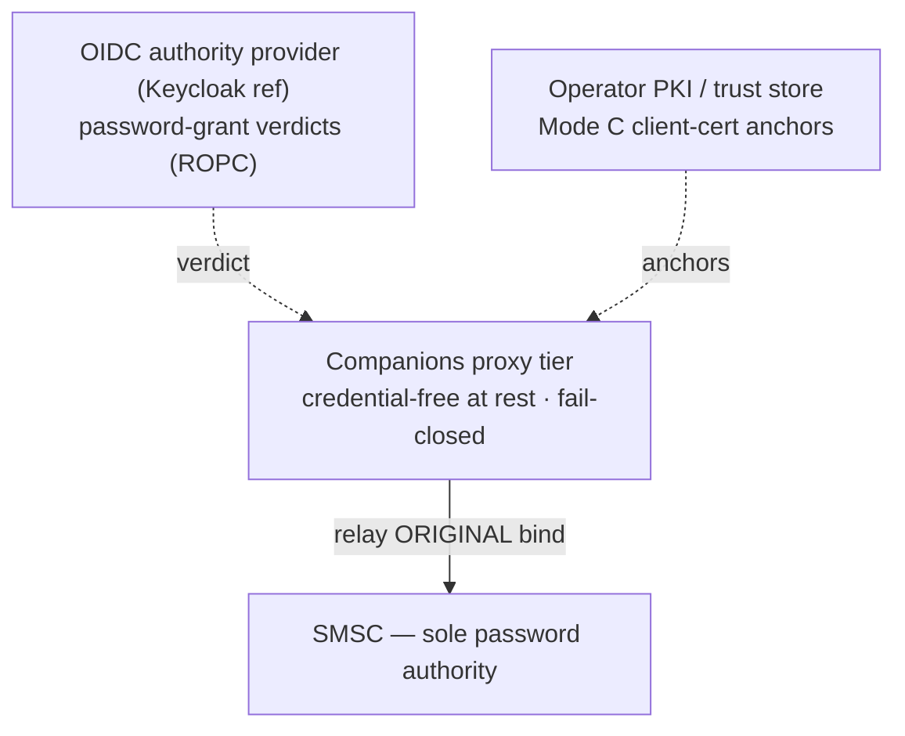
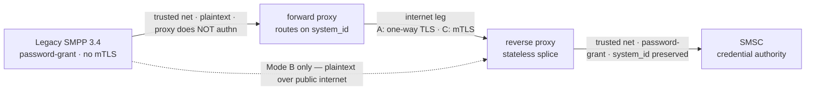
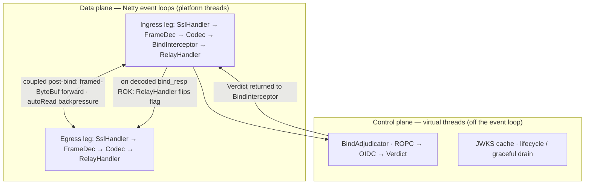
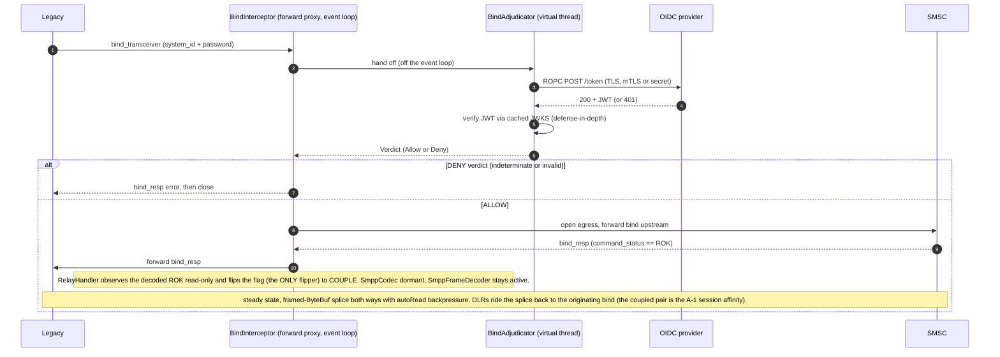
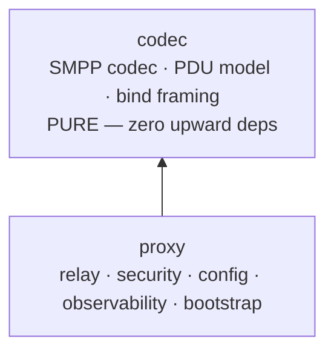

# Companions v1 — Architecture Walkthrough

> A walkthrough of the architecture spine for **author + tech-fluent reviewers** — deep on the trust model and the relay internals. JVM / Netty / SMPP fluency assumed. The binding contract is [`ARCHITECTURE-SPINE.md`](ARCHITECTURE-SPINE.md) (34 ADs); the decision trail is [`.memlog.md`](.memlog.md); the 8-lens reviewer-gate output is in [`reviews/`](reviews/).

**Companions v1** is a headless, operator-configured, open-source SMPP 3.4 security-transit proxy. It lets unmodifiable legacy SMPP 3.4 systems and carrier SMSCs exchange traffic **securely over the internet** — confining the legacy password-grant weakness to a trusted zone, brokering one credential end-to-end, and keeping the proxy tier **credential-free at rest**.

`JDK 25 LTS (--enable-preview)` · `Netty 4.2 (event-loop relay)` · `StructuredTaskScope + ScopedValue` · `Spring Boot 4.1 (no WebFlux/Reactor)` · `ZGC` · `Linux · IPv4` · `Apache-2.0`

---

## 1. The itch — untouchable legacy, exposed credentials

Legacy SMPP 3.4 systems must reach carrier SMSCs over untrusted networks, but they **cannot be modified** and carry a hard weakness: password-grant binds only, no client certificates, no mTLS. That weakness cannot be safely exposed to the internet.

> **The trap a naïve proxy falls into.** A security proxy in front of the legacy system typically *backfires*: it ends up **holding** the credentials it was meant to protect — a password vault — so any proxy compromise yields a stash of working carrier passwords with a huge blast radius.

Companions takes the other road: **broker a single credential end-to-end and keep the proxy tier credential-free.** The SMSC remains the sole credential authority; proxy compromise yields no stealable-at-rest stash.

---

## 2. The trust model is the product

For a security-branded tool this is the part that must survive a hostile review (the project's own SM-2 success criterion). Three load-bearing properties, stated honestly.

### Credential-free — at rest, not in transit

The proxy holds **no persisted passwords, no vault, no CA, no issuing private keys.** It does transit the plaintext password *in memory, per bind* (legacy → forward proxy → reverse proxy → SMSC) to relay the original bind, zeroized on completion. At runtime it holds: the OIDC client credential, cached JWKS public keys, its own TLS end-entity private keys, and the transient per-bind password.

**Blast radius:** a live memory compromise exposes only sessions active during the compromise window — materially “network position + transient in-flight secrets,” not “network position only.”

### The three trust roots

Trust lives **off** the proxy. Provider/CA compromise can mint verdicts/certs; the SMSC alone owns passwords. The proxy only consumes trust. *(The brainstorm’s “unified trust root” is relaxed to three roots — a deliberate, user-confirmed departure disclosed in the spine.)*

### Fail-closed is the universal default

Every auth-adjacent decision denies on indeterminate. OIDC verdict unreachable / timed-out / malformed / signature-mismatched → **DENY**. Mode C peer with no client cert or an unanchored cert → handshake fails. Missing trust store → refuse to start. A `200` verdict overridden by failed local JWT verification → **DENY always wins** on disagreement. Deny-on-ambiguous, everywhere.

> **Owned, not hidden — the ROPC hard-dependency.** Password validation uses **ROPC (Direct Access Grants)** — the only standard grant that validates a raw password with no browser. ROPC is deprecated (RFC 9700 “MUST NOT”). The first-party/headless/in-memory framing puts this build outside the deprecation’s *primary* rationale, but **does not neutralize it**: v1 hard-depends on ROPC, and the `BindCredentialVerifier` port localizes a future rework to one adapter — it does *not* eliminate the dependency. It is the single most fragile external dependency, owned openly in the risk register.

---

## 3. Topology — two roles, one codebase, three modes

One runnable JAR plays both sides of the wire; role + mode are deployment-time config, not forks. Each instance runs exactly one role and one mode.

Security order **C > A > B**. The forward→reverse internet leg runs **Mode A or C only**; **Mode B is the separate legacy→reverse path** (no forward proxy in that topology) — reverse-only, never the default, opt-in + loud warning, starts (not refused). Single-side adoption (one party only) is valid.

---

## 4. Design paradigm — event-loop relay

The steady-state byte splice runs on **Netty event loops** — the proven low-overhead path the performance targets require (the codec is ~60× faster than the wire). **Virtual threads** own only the control plane: bind adjudication, OIDC, graceful shutdown. Three threading models kept coherent by separation.

Virtual threads never carry steady-state bytes; Netty event loops never run on virtual threads. Spring-managed executors are incidental — no load-bearing path depends on them. The control plane uses **`StructuredTaskScope` + `ScopedValue`** for structured concurrency (the bind-adjudication fan-out, shutdown). STS is **preview-only on JDK 25** (still preview in JDK 26; final ~JDK 27), so the build runs with `--enable-preview` — but the preview surface is confined to the control plane; the data-plane splice (event loops) is pure-stable API. Accepted risk (register); the bounded adjudication pool (AD-28) still gates entry + fail-closed-on-saturation.

---

## 5. The heart — the bind→splice transition

Inspect only the bind family; splice everything else. The transition is a one-way atomic flag flip — the single load-bearing mechanism of the runtime.

**Why this is fast and safe.** No live pipeline surgery (avoids `pipeline.remove()` races). The codec never re-parses on the hot path; `SmppFrameDecoder` stays active so the relay forwards **framed-PDU ByteBufs, not raw bytes**. Backpressure is symmetric `autoRead` — a slow leg pauses its peer; never unbounded buffering. The bind-family parser **and** the framing decoder are the only parsed surfaces; both are structurally fuzzed.

---

## 6. Authentication — OIDC: validate, discard, relay

The proxy intercepts the legacy password, asks the operator's OIDC provider for a verdict, then relays the **original** bind to the SMSC — which remains the sole credential authority. The OIDC token is a **disposable verdict, never forwarded.**

| Step | Mechanism |
|---|---|
| Intercept | `system_id` + password read in memory, never persisted |
| Verdict | ROPC POST `/token` over TLS (proxy = confidential client, mTLS RFC 8705 or `client_secret`); **token-endpoint status 200/401 is the verdict** |
| Defense-in-depth | returned JWT verified locally via cached JWKS (DENY wins on disagreement) |
| Discard | the OIDC token is thrown away; the **original** bind is relayed to the SMSC |
| Cache | **re-validate every bind** (no verdict cache); cache JWKS only |
| Fallback | opaque tokens → RFC 7662 introspection (never cached) |
| Fail-closed | any indeterminate response → DENY; non-`https` provider URL → fail-fast |
| Secret hygiene | password + token in `char[]`/`byte[]`, zeroized on completion / teardown / exception |

All of it flows through a single pluggable **`BindCredentialVerifier`** port (`VerdictRequest verify(BindCredential, ScopedValue<RequestContext>)`, exposing `future()` + `cancelHttp()` per AD-32), so the ROPC adapter is swappable without touching the relay core.

---

## 7. Structure — two modules, one inward seam

A Gradle module boundary enforces the extractable-core story (MAINT-2) more strongly than a test-time rule ever could.

Strictly inward: `proxy → codec`. The codec is the seed of a future SMPP library; **v1 ships an application, not a published library artifact.**

---

## 8. Verified stack (2026-07)

Every version below was web-verified at authoring. The from-scratch line covers the SMPP layer only; mature libraries are mandatory for TLS and OIDC.

| Component | Version | Role |
|---|---|---|
| JDK | `25 LTS` (pin build 25.0.x) | Loom-era runtime; virtual threads, generational ZGC, `ScopedValue` |
| Netty | `4.2.16.Final` (netty-bom) | Event loops + `ChannelHandler` pipelines; NIO/Epoll (not io_uring) |
| Spring Boot | `4.1.x` (Framework 7.0.8+) | Config, DI, lifecycle, Micrometer — Netty driven directly, **no WebFlux/Reactor** |
| Nimbus JOSE+JWT | `10.9.1` (≥10.0.2, CVE fix) | JWKS + JWT signature verification |
| jSMPP | `3.0.2` | Independent interop/test counterpart only — never the production codec |
| GraalVM | for JDK 25 — **stretch only** | No v1 native build (ZGC unavailable in native-image) |
| Reference IdP | Keycloak 26.x | Operator-provided, not part of the project |

---

## 9. Performance — demonstrated, not promised

Targets are proven via a reproducible load-test harness against a mock SMSC + the `/metrics` surface — a first-of-kind benchmark for an SMPP **proxy / stateless relay** (no published one exists; library-level codec benchmarks do, and are cited as priors).

| Target | Value | Context |
|---|---|---|
| **Throughput** | ≥ 10K submit_sm/s | sustained, mTLS both legs + OIDC cached · ~25K stretch |
| **Concurrency** | 10K idle socket pairs | (~20K sockets) < 1 GB heap / < 1 vCPU idle |
| **Bind latency** | p99 ~250 ms | warm · ≤ 2 s cold · fail-closed DENY beyond 2–5 s |
| **Relay latency** | < 1 ms per-PDU added | the SMSC round-trip dominates |

The codec is ~60× faster than the network path, so mTLS on both legs, OIDC, and SMSC latency govern throughput — never the relay. Real carrier ceilings (single-digit to low-hundreds MPS per bind) are 1–2 orders below this, so the proxy is never the production bottleneck; the targets demonstrate **headroom and craft**.

---

## 10. Accepted-risk register (highlights)

A security product states its accepted risks explicitly. SM-2 probes these.

- **ROPC hard-dependency** — deprecated grant (RFC 9700); the most fragile external dependency.
- **Mode B** plaintext password over the public internet — opt-in + loud warning, starts.
- **Mode A two-proxy without ACL isolation** — in one-way TLS the forward proxy can't authenticate the reverse proxy; mitigate with ACL isolation or use Mode C.
- **`system_id` spoofing** on the trusted network — sole control = network isolation (A-3).
- **Authority-provider / PKI-CA compromise** = full impersonation (mint verdicts; mint certs iff provider == operator PKI CA).
- **Payload transparency = no content-level protection** — no inspection/filtering; operators own what transits.
- **No local brute-force / rate-limit** — planned future companion. **Single-instance, no HA.**

---

## 11. What v1 does not decide

The spine fixes invariants; it leaves detail to the level below — each item can wait without letting two units diverge.

- Exact cipher/TLS allowlist contents (a default ships in config; operator-tunable).
- JWKS TTL / refresh-ahead / ROPC timeouts; `bind_resp` status-code → outcome mapping.
- Multi-carrier routing (v1 forward role = 1:1); the A-1 real-carrier operational test plan.
- Full STRIDE/DFD threat model; perf-harness exacts; native-image build (out of v1).

> **Read the contract.** The full invariant set — 34 ADs with Binds / Prevents / Rule, the complete register, conventions, and the capability map — lives in [`ARCHITECTURE-SPINE.md`](ARCHITECTURE-SPINE.md).
