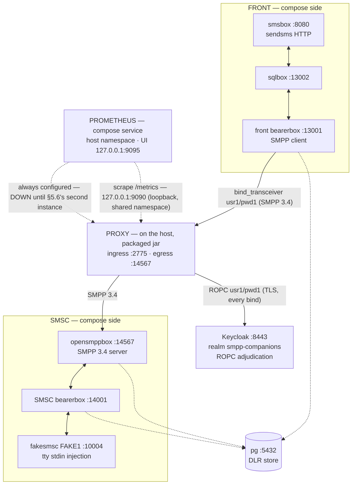

# The Kannel Sandbox — a real-SMPP rig for debugging and correctness proof

> **Status:** Story 6.3, tasks T1–T5 — T1 the Kannel rig itself (compose file,
> pinned-source Dockerfile, `conf/`, `init.sql`, this bring-up guide); T2 the compose Keycloak
> service (the ROPC adjudication the reverse cell requires, AD-17 fail-closed — no auth-bypass
> exists) and the host-run proxy launch recipe (§5, machine-executed from this page); T3 the
> correctness journeys with expected observations per hop (§6) and the debugging guide (§7), both
> executed live from this page on 2026-09-17's rig. T4 the close-out, same date: the Gradle-inert
> claim verified (`./gradlew clean build --console=plain` GREEN, 521 tests, zero Gradle-file
> changes), the journeys landed in the test catalog as dated manual-rig ops-tier rows
> (E2E-002..005), and `epic-6-context.md` regenerated to as-built. T5 (2026-09-18, owner-added):
> the three docker-packaged combo runbooks under `runbooks/` (§5.6) — reverse.mode-b,
> forward+reverse mode A, forward+reverse mode C, every proxy container `network_mode: host`
> with the host-built jar bind-mounted over the image's copy — each followed verbatim to
> `bind_accept coupled` on the live rig, RU twins beside. The host-run `java -jar` recipe (§5)
> REMAINS the debugger posture. Spec:
> `_bmad-output/implementation-artifacts/6-3-kannel-sandbox.md`. The sandbox is developer tooling,
> not shipped product: it changes zero main-source lines, is inert to Gradle (`./gradlew clean build`
> untouched), wires into no CI, and publishes no performance numbers (measurement is within
> Epic 7's scope).
> T6 (2026-09-19, owner-added): operator-first docs — the three runbooks restructured (Quick start →
> checks → Troubleshooting → Details; every command and live-observed value preserved verbatim,
> zero factual/behavioral change), a NEW project-root README (EN + RU) linking the runbooks as
> usage samples, this page reoriented ("Start here") and swept with the rest of the scope to the
> owner terms (use case = role + mode; connect for wire interactions; coupling for app/memory);
> RU twins conformed.
> Русский перевод: [`README.ru.md`](README.ru.md).

## Start here — which page do I need?

This sandbox wraps the proxy in a **real, unmodified third-party SMPP stack** — Kannel 1.5.0 on
both sides plus a Keycloak that adjudicates every bind — so you can debug and prove the proxy
against a stack you didn't write. It complements the automated suites; it replaces nothing.

| I want to… | Go to |
|------------|-------|
| Run a deployment the easy way (docker) | The three use-case runbooks — one per use case (role + mode), quick-start style: [`reverse.mode-b`](runbooks/reverse-mode-b.md) · [`forward.mode-a` + `reverse.mode-a`](runbooks/forward-reverse-mode-a.md) · [`forward.mode-c` + `reverse.mode-c`](runbooks/forward-reverse-mode-c.md) |
| Debug the proxy (IDE debugger, `jcmd`, JFR) | §5 — the host-run `java -jar` recipe (the debugger posture) |
| Understand the rig (layout, ports, bring-up) | §2–§4 |
| Prove correctness end to end | §6 — the journeys, with the expected observation at every hop |
| Find where things are logged | §7 — the debugging entry points |

## 1. What this rig is

A docker-compose chain of **Kannel 1.5.0** on both sides of the proxy. Until now the proxy's
interop evidence rested on in-repo mocks (`MockSmsc` on this repo's own codec) plus jSMPP 3.0.2 as
the independent oracle; this rig adds the missing tier — a REAL, unmodified, third-party SMPP 3.4
stack (COMP-1 context). It **complements, never replaces**, the automated oracles: the in-repo
suites stay the machine-checked conformance surface; Kannel is the real-stack, human-driven
debugging and correctness tier.

The chain, with the proxy wedged in the middle (the front bearerbox's SMPP client connects to the proxy's
host ingress instead of straight at opensmppbox — the ONE wiring re-point from the ported source;
the one further conf delta, the MO `smsbox-route` group the §6.2 journey required, is §10's honesty
list) and the compose Keycloak adjudicating every bind over ROPC:



Everything compose-side speaks `host.docker.internal` and every inter-service hop hairpins through
the host's published ports — the ported pattern that lets the host-run proxy sit in the chain with a
single conf re-point. The proxy itself runs on the **host** as the packaged jar
(`java -jar` under the ONE operator flag set, reverse.mode-b — the [B] topology's plaintext
posture, an accepted risk whose WARN banner is part of the documented launch; the recipe is §5).
Keeping the proxy on the host is the point of the sandbox: debugger and flag access.

**Why the proxy runs on the host (`java -jar`) rather than as a docker-packaged service.** The
sandbox exists to DEBUG the proxy against a real SMPP stack — the component under study runs where
it can be instrumented. The host launch gives IDE-debugger attach, the full JDK toolbox (`jcmd`,
JFR, heap dumps), and instant operator-flag edits on the exact `java -jar` launch contract (the
`PackagedBootSmokeTest` idiom); the Epic-5 distroless image is deliberately minimal — no shell, no
JDK tooling — and debugging inside it would mean JDWP/entrypoint drift away from the shipped deploy
shape. Everything else in the chain (Kannel, pg, Keycloak) is fixed infrastructure, which is what
compose is for. The docker-packaged proxy is not rejected — Story 6.2's E2E already proved the
two-container shape end-to-end (allow + auth-DENY) — and §5.5 documents it as an optional variant for
a one-command, all-compose run (owner decision ratified 2026-09-17: host stays the default).

The one compose-side exception to the `host.docker.internal` pattern is the rig's Prometheus
(Story 8.2): the service runs `network_mode: host` — the same network namespace both default
proxy postures listen in (the host-run §5.2 jar and the runbooks' `--network host` containers
alike) — so it scrapes the AD-19 loopback-only `/metrics` at the literal `127.0.0.1:9090` (plus
the always-configured second-instance `127.0.0.1:9091`, §5.6) with no bind widening and no port
publishing, and serves its own web UI loopback-only on `127.0.0.1:9095`. It is rig fixture, not
product — the "no metrics dashboard / telemetry backend" non-goal stands (addendum A7); §4 brings
it up with everything else and §5.3 reads it. The scrape pattern assumes a Linux host — true host
networking (`network_mode: host` semantics differ on Docker Desktop-class runtimes).

## 2. Layout

| File | What it is |
|------|------------|
| `compose.yml` | The 9-service chain: the ported 7 — `pg`, front side (`front-bearer-box`, `front-sql-box`, `front-sms-box`), SMSC side (`smsc-bearer-box`, `smsc-opensmpp-box`, `smsc-fake-smsc`) — plus `keycloak` (T2) and `prometheus` (8.2: always-on, `network_mode: host`, web UI loopback-only on `127.0.0.1:9095`, TSDB on the named `prometheus-tsdb` volume); healthchecks on `pg` + both bearerboxes + `keycloak`'s TCP probe (prometheus carries none — fixture, §4), `smsc-fake-smsc` tty-attached for `deliver_sm` injection. |
| `kannel/Dockerfile` | The Kannel 1.5.0 pinned-source build, ported byte-for-byte from the playground (gateway-1.5.0.tar.gz, `--with-pgsql`, `test/fakesmsc`, addons opensmppbox + sqlbox; UBI10 builder / UBI10-minimal runtime, including the automake-1.11 symlink bootstrap quirk). No version drift, no distro swap. |
| `conf/front-kannel.conf` | Front bearerbox + smsbox: the SMPP-**transceiver** `group = smsc` (`usr1`/`pwd1`, `interface-version = 34`) that connects to the proxy at `host.docker.internal:2775`, and the `sendsms` HTTP user (`user`/`password`). |
| `conf/front-sqlbox.conf` | Front sqlbox (smsbox → sqlbox → bearerbox routing leg). |
| `conf/smsc-kannel.conf` | SMSC-side bearerbox: admin 14000, fake SMSC `FAKE1` on 10004, pgsql DLR (`smsc_bearer_dlr`), and the `smsbox-route` group (T3's MO-routing delta, §10 — routes FAKE1's MOs to the opensmppbox connection so §6.2's injection journey works). |
| `conf/smsc-opensmppbox.conf` | opensmppbox on 14567: `smpp-logins` from `smsc-users.txt`, `route-to-smsc = FAKE1`, pgsql DLR (`smsc_smpp_dlr`). This box is the real SMSC the proxy's egress connects to. |
| `conf/smsc-users.txt` | opensmppbox's SMPP credential list (`usr1 pwd1 smsc1 *.*.*.*`) — the SMSC-side authority the deny journeys exercise (AD-32 case 4). |
| `conf/db.conf` | Shared pgsql connection (via `host.docker.internal`). |
| `init.sql` | The pgsql DLR tables (`front_bearer_dlr`, `smsc_bearer_dlr`, `smsc_smpp_dlr`), applied by the postgres entrypoint at every fresh container boot (the anonymous-volume lifetime — §9). |
| `keycloak/realm-smpp-companions.json` | The realm export the `keycloak` service imports at boot (T2): mirrors the test-tier `KeycloakFixture` realm shape — realm `smpp-companions`, the confidential client `smpp-client-confidential` with Direct Access Grants ON (per-client, off by default since KC 26.2), ROPC users (§5.1). Deliberately carries NO client secret: Keycloak generates one at import — the ONE AD-18 secret in the rig, fetched into `secrets/` (§5.1). |
| `keycloak/certs/` | The Keycloak TLS material, copied byte-identical from the committed test fixtures (`proxy/src/test/resources/keycloak/certs/`): `server.pem`/`server-key.pem` (SANs `localhost`, `keycloak`, `127.0.0.1` — the host-run proxy connects to `localhost:8443`, the optional docker variant connects to `keycloak:8443`), `truststore.p12` (pw `smpp-test` — the proxy's IdP trust anchor), `ca.pem` (for host-side `curl --cacert` verification). Fixture-tier test PKI, NOT production secrets — the same class of material the test tier commits; the rig's one real secret-by-path is the client secret. |
| `certs/` | The SMPP-leg TLS material for the T5 use-case runbooks (§5.6), copied byte-identical from the same committed test fixtures: `smpp-reverse-server.pem`/`-key.pem` (SANs `localhost`/`127.0.0.1` — the composed reverse's listener cert; the forward connects to `localhost` with hostname verification ON, AD-20), `smpp-forward-client.pem`/`-key.pem` (the forward's per-instance mTLS client cert), `smpp-truststore.p12` (pw `smpp-test`, anchoring `CN=smpp-test-ca` — both connect-side and REQUIRE-side). Same fixture-tier class as `keycloak/certs/`; keep the files world-readable (`0644`) so the image's UID 65532 reads the mounts. |
| `runbooks/` | The three T5 docker-packaged use-case runbooks (§5.6), EN normative + RU twins: [`reverse-mode-b.md`](runbooks/reverse-mode-b.md), [`forward-reverse-mode-a.md`](runbooks/forward-reverse-mode-a.md), [`forward-reverse-mode-c.md`](runbooks/forward-reverse-mode-c.md) — one per use case (role + mode), every proxy instance the Epic-5 distroless image on `network_mode: host` with the host-built jar bind-mounted over the image's copy. |
| `prometheus/prometheus.yml` | The rig's scrape config (8.2), mounted read-only by the `prometheus` service: job `smpp-proxy`, `metrics_path: /metrics`, and the two always-configured loopback targets `127.0.0.1:9090` (every FIRST proxy instance — §5.2's host-run jar, the single reverse instance, or the composed forward) and `127.0.0.1:9091` (the two-instance runbooks' second instance — DOWN until it runs), 5 s scrape interval / 3 s timeout. The loopback literals work because the service shares the host namespace with the proxies; on a single-instance rig the 9091 target simply shows DOWN (accepted, §5.3). |
| `secrets/` | Operator-created (gitignored, AD-18): `oidc-client-secret` — the Keycloak client's generated secret, written by the §5.1 bootstrap. Nothing here is ever committed. |

### 2.1 Why opensmppbox is required — fakesmsc is not an SMPP endpoint

The proxy's egress speaks SMPP 3.4 and must connect to an SMPP **server**. fakesmsc cannot be that server
at any port: it is a *client* that connects INTO a bearerbox's `smsc = fake` port and speaks
Kannel's internal box protocol — it never listens for SMPP and never parses a PDU. Pointing the
proxy's egress at anything fakesmsc-side is a category error, not a configuration option.

opensmppbox is the only SMPP 3.4 listener in the rig, and it carries three jobs nothing else can:

1. **Terminate the proxy's egress connection** — the real-SMPP-server face: it answers
   `bind_transceiver`, authenticates against `smpp-logins` (`conf/smsc-users.txt`), and is the
   SMSC-side credential authority the wrong-credential deny journey exercises (AD-32 case 4: its
   non-ROK `bind_resp` must forward verbatim through the proxy).
2. **Translate SMPP ↔ Kannel box protocol** — `submit_sm` arriving from the proxy is routed
   (`route-to-smsc = FAKE1`) through the SMSC bearerbox to fakesmsc, and an MO message typed into
   fakesmsc's stdin rides back as a real `deliver_sm` toward the ESME through the proxy (the A-1
   session-affinity property against a real stack).
3. **Own its DLR hop** — `smsc_smpp_dlr` in pg is one of the observable hops of the DLR round
   trip (the pgsql wiring the pinned Dockerfile exists to provide).

The division of labor, then: **opensmppbox is the SMSC-side SMPP face; fakesmsc is the terminal
fake center behind the bearerbox** (MO injection via stdin, MT receipt printed to its tty). Drop
opensmppbox and the proxy has no SMPP peer at all — the deny, affinity, and DLR journeys become
unprovable, and fakesmsc cannot serve any of them alone.

## 3. Prerequisites

- Docker Engine with the compose plugin (verified on Docker 29.6.1 / compose v5.3.1).
- These **host ports free** (the rig publishes them; the hairpin pattern depends on them):

| Port | Used by | Role |
|------|---------|------|
| 5432 | `pg` | DLR store (also reachable from the host for the DLR journey observations) |
| 8080 | `front-sms-box` | `sendsms` HTTP ingress — the journey entry point |
| 13000 | `front-bearer-box` | Front admin status page |
| 13001 | `front-bearer-box` | Front box port (sqlbox connects to it via the host) |
| 13002 | `front-sql-box` | sqlbox port (smsbox connects to it via the host) |
| 10004 | `smsc-bearer-box` | The fake SMSC port `fakesmsc` connects to |
| 14000 | `smsc-bearer-box` | SMSC-side admin status page |
| 14001 | `smsc-bearer-box` | SMSC-side box port (opensmppbox connects to it via the host) |
| 14567 | `smsc-opensmpp-box` | The REAL SMSC listener — the proxy's egress target |
| 8443 | `keycloak` | The ROPC adjudicator's HTTPS realm port (the host-run proxy connects to it as `localhost:8443`; the fixed bind keeps the issuer deterministic, mirroring the test fixture's coordinates) |
| 2775 | — | Must stay free: the proxy's SMPP ingress (the SMPP-standard port) — the host-run §5.2 proxy, or the §5.6 docker use case's listener (the lone reverse, or the FORWARD of the composed pairs — the front conf is the same `host.docker.internal:2775` either way) |
| 2776 | — (docker use cases, two-instance) | Must stay free for the §5.6 mode A/C runbooks: the two-instance use cases' reverse listener (the reverse moves off 2775 so the forward can take it — each runbook's port plan) |
| 9090 | — (a proxy) | A proxy's read-only `/metrics`, bound to the `127.0.0.1` literal inside the proxy's own process — occupied only while a proxy runs (§5.3's observation point; compose publishes nothing here — the rig's Prometheus reaches it by sharing the namespace, never a publish). Host-run §5.2 and every §5.6 use case's FIRST instance use it |
| 9091 | — (docker use cases, the second instance) | The §5.6 second instance's `/metrics` — the second host-network proxy process cannot share 9090's loopback bind, so its runbook moves it (the port plan, documented not discovered); always configured as the rig Prometheus's second target, DOWN until that instance runs (§5.3) |
| 9095 | `prometheus` | The rig's Prometheus web UI (8.2), bound loopback-only `127.0.0.1:9095` by the service itself — `network_mode: host` makes this a direct bind in the host namespace, not a compose publish (9090/9091 belong to the proxies; 9093 is the Alertmanager convention) |

The 8443 row has one collision to know about: the test tier's `KeycloakContainer` binds the SAME
fixed `localhost:8443` — so the sandbox's Keycloak and a concurrently running `:proxy:test` live
slice contend for it. Bring one down before the other (the test container waits up to its startup
timeout, then fails its row — loud, not silent).

## 4. Bring-up (zero → rig healthy)

From `sandbox/`:

```bash
docker compose up -d --build   # first run compiles Kannel from the pinned source — be patient;
                               # subsequent runs hit the build cache and are fast
docker compose ps              # wait for pg, front-bearer-box, smsc-bearer-box to show (healthy)
```

Readiness per service:

| Service | How you know it is up |
|---------|----------------------|
| `pg` | compose healthcheck (`pg_isready`) green. |
| `front-bearer-box` | compose healthcheck green — `curl "http://127.0.0.1:13000/status.txt?password=test"` answers; its `Box connections:` list shows `smsbox:sqlbox1` and `smsbox:smsbox1` on-line. |
| `smsc-bearer-box` | compose healthcheck green — `curl "http://127.0.0.1:14000/status.txt?password=test"` answers, and its `SMSC connections:` list shows `FAKE1 ... (online ...)`. |
| `front-sql-box` | No admin page exists (sqlbox has none); gated on `front-bearer-box: healthy`. Connected once the front status page lists `smsbox:sqlbox1`; its tables (`front_sms_log`, `front_sms_insert`) exist in `pg`. |
| `front-sms-box` | No healthcheck (gated on `front-sql-box`); answers HTTP on 8080 — a `sendsms` curl gets an smsbox answer (202 Accepted/queued while the SMSC leg is down — Kannel queues; connection-refused would mean it is not up). |
| `smsc-opensmpp-box` | No admin page; listening on 14567 (the port the proxy's egress will connect to); `docker compose logs smsc-opensmpp-box` shows `Connected to bearerbox at host.docker.internal port 14001`. |
| `smsc-fake-smsc` | Stays attached (tty) once connected to 10004; `docker compose logs smsc-fake-smsc` shows `Entering interactive mode`, and `FAKE1` appears online in the SMSC status page. |
| `keycloak` | Compose healthcheck green — a TCP connect to the HTTPS listener (the rig's Keycloak is HTTPS-only and the image ships no TLS-capable client, so the healthcheck asserts the listener; see the service comment in `compose.yml`). REALM readiness is proven by the §5.1 discovery curl, which the secret bootstrap runs anyway. |
| `prometheus` | Always-on with the plain `docker compose up` — no compose profile, no extra command (8.2). Fixture: no healthcheck and no `depends_on` (it depends on nothing; its scrape targets are EXPECTED to be DOWN at idle). Ready when `curl http://127.0.0.1:9095/-/ready` answers `Prometheus Server is Ready.` — and the web UI at `http://127.0.0.1:9095/graph` answers (loopback-only, like everything on that port). |

Only the services with admin status pages carry compose healthchecks (that is the ported pattern:
`pg` + the two bearerboxes; `keycloak` joins them with its TCP-connect check — the strongest probe
its HTTPS-only, client-less image admits); the rest are ordered by `depends_on` and verified by
their function, per the table above. The `prometheus` fixture (8.2) carries neither a healthcheck
nor a `depends_on`: it starts unconditionally and its targets being DOWN until a proxy launches is
the honest idle state, not a failure — its own readiness is the `/-/ready` curl in the smoke block
below.

At-a-glance smoke (all observed on the verified bring-up):

```bash
curl "http://127.0.0.1:13000/status.txt?password=test"   # front: boxes on-line, DLR using pgsql
curl "http://127.0.0.1:14000/status.txt?password=test"   # SMSC: FAKE1 online
curl "http://127.0.0.1:8080/cgi-bin/sendsms?user=user&pass=password&from=79876543210&coding=0&to=79033374423&text=hello"   # -> 202
docker compose exec pg psql -U postgres -d postgres -c '\dt'   # the DLR + sqlbox tables
curl --cacert keycloak/certs/ca.pem https://localhost:8443/realms/smpp-companions/.well-known/openid-configuration   # -> JSON, "password" in grant_types_supported
curl --retry 30 --retry-connrefused http://127.0.0.1:9095/-/ready   # -> Prometheus Server is Ready.
```

**Expected state after §4 — the front SMSC is DOWN until the proxy launches.** The front bearerbox
connects to `host.docker.internal:2775`, and the proxy is not part of the compose file (it runs on the
host; the launch recipe is §5). Until then the bearerbox retries every 10 s — the log names it
exactly:

```text
ERROR: error connecting to server `host.docker.internal' at port `2775'
ERROR: SMPP[smsc1]: Couldn't connect to SMS center (retrying in 10 seconds).
```

That is the rig being honest, not a fault, and `front-bearer-box` still reports healthy (its
healthcheck is the admin page, not the SMSC link). The couple happens when the proxy is launched
per §5; the front bearerbox rebinds on its own retry schedule above.

The rig's Prometheus shows the same honest idle from its side: both of its always-configured
`smpp-proxy` targets (`127.0.0.1:9090` and `127.0.0.1:9091`) read DOWN — connection refused —
while no proxy runs, and every other service is unaffected (§5.3's item 7). The 9090 target flips
UP at the first §5.2 launch; the 9091 target stays DOWN for good on any single-instance rig
(accepted — it exists for §5.6's two-instance use cases).

## 5. The proxy launch recipe (Keycloak + the packaged jar)

T2's deliverable, machine-executed from this page on the verified bring-up (every observation below
was observed live; the mutation table in §5.4 was run the same way). The recipe launches the REAL
artifact — the packaged boot jar under the ONE operator flag set, `reverse.mode-b` (the [B]
topology's plaintext posture exactly) — with ingress 2775 for the front bearerbox, egress to the
published opensmppbox 14567, and OIDC to the compose Keycloak. The Mode B WARN banner is part of
the documented accepted-risk launch, not noise to silence.

### 5.1 The Keycloak service and the one-time secret bootstrap (AD-18)

The `keycloak` compose service (T2) mirrors the test-tier `KeycloakFixture` realm shape so the
sandbox's IdP matches the one the proxy already proves against: pinned
`quay.io/keycloak/keycloak:26.7.0` (the ≥26.7.0 floor of the 3.1 viability verdict), the verified
`start --import-realm --hostname-strict=false` launch with the fixture server cert (SANs
`localhost`/`keycloak`/`127.0.0.1`), HTTPS-only (`KC_HTTP_ENABLED=false` — the provider link must be
TLS, SEC-053), and the fixed `8443:8443` bind that keeps the issuer deterministic
(`https://localhost:8443/realms/smpp-companions`). Two deliberate posture deltas from the test
container, both commented in `compose.yml`: the production proxy's IdP SSLContext is trust-ONLY (no
client cert toward the provider — client auth is the ROPC `client_secret`), so
`KC_HTTPS_CLIENT_AUTH` stays unset; and the admin env uses KC 26's bootstrap spelling
(`KC_BOOTSTRAP_ADMIN_*`) to avoid the deprecated `KEYCLOAK_ADMIN` warning.

The realm principals (in `keycloak/realm-smpp-companions.json`, mirroring the fixture realm with
the rig's own users):

| Principal | Value | Role in the rig |
|-----------|-------|-----------------|
| Client | `smpp-client-confidential` — confidential, DAG **enabled** (`directAccessGrantsEnabled: true` — per-client and OFF by default since KC 26.2; without it every bind denies at first bind) | The proxy's ROPC client; its secret is the rig's ONE AD-18 secret |
| User | `usr1` / `pwd1` | The happy path — exactly the front bearerbox's `smsc-username/-password` (`conf/front-kannel.conf`), so BOTH authorities accept: ROPC allows, and opensmppbox's `smsc-users.txt` (`usr1 pwd1 …`) answers ROK → the bind couples |
| User | `usr2` / `pwd2` | The wrong-SMSC-credential deny journey (T3): valid in the realm (ROPC allows), ABSENT from `smsc-users.txt` (opensmppbox answers non-ROK → forwarded verbatim, AD-32 case 4). Landed now because a realm edit forces the secret re-fetch cycle below |

**The one secret, by path (AD-18).** The realm export deliberately carries NO client secret:
Keycloak GENERATES one at import, and the operator fetches it into the gitignored
`sandbox/secrets/oidc-client-secret` (the directory is ignored via `.gitignore`; `git status` never
sees the file). The sandbox is a debug replica of the deploy contract — never a place where a secret
value is "just sandbox data". Bootstrap (from `sandbox/`, once per fresh Keycloak container):

```bash
# (a) realm readiness, authoritatively — the discovery doc over TLS, anchored by the committed CA:
curl --cacert keycloak/certs/ca.pem \
     https://localhost:8443/realms/smpp-companions/.well-known/openid-configuration
# -> JSON with "issuer":"https://localhost:8443/realms/smpp-companions" and "password" in grant_types_supported

# (b) kcadm login (the committed truststore anchors the self-signed server cert inside the container):
docker compose exec keycloak /opt/keycloak/bin/kcadm.sh config truststore \
     /opt/keycloak/conf/truststore.p12 --trustpass smpp-test
docker compose exec keycloak /opt/keycloak/bin/kcadm.sh config credentials \
     --server https://localhost:8443 --realm master --user admin --password admin

# (c) fetch the GENERATED secret and write it to the gitignored file (AD-18):
CID=$(docker compose exec -T keycloak /opt/keycloak/bin/kcadm.sh get clients -r smpp-companions \
      -q clientId=smpp-client-confidential --fields id --format csv --noquotes)
docker compose exec -T keycloak /opt/keycloak/bin/kcadm.sh get "clients/$CID/client-secret" -r smpp-companions
#   -> {"type":"secret","value":"<generated>"} — then:
mkdir -p secrets && printf '%s\n' '<generated>' > secrets/oidc-client-secret && chmod 0600 secrets/oidc-client-secret
```

Regeneration semantics (same shape as pg's, §7): `stop`/`start` preserves the imported realm and
its secret; a re-create (`down` then `up`) re-imports the checked-in realm and REGENERATES the
secret — the proxy then denies every bind (401 `invalid_client`) until you re-run (b)+(c). The
`kcadm` config (truststore + session) also lives inside the container and dies with it, so re-run
both steps after any re-create. The zero-tooling alternative for (c): the admin console at
`https://localhost:8443/admin` (admin/admin) → Clients → `smpp-client-confidential` → Credentials →
copy the secret into the file.

### 5.2 Build and launch

From the **repository root** (the jar path and the secret paths below are root-relative):

```bash
./gradlew :proxy:bootJar
java --enable-preview -XX:+UseZGC -XX:MaxDirectMemorySize=6442450944 -Djava.net.preferIPv4Stack=true \
     -jar proxy/build/libs/proxy.jar \
     --companion.bind.host=0.0.0.0 \
     --companion.bind.port=2775 \
     --companion.reverse.mode-b.smsc.host=127.0.0.1 \
     --companion.reverse.mode-b.smsc.port=14567 \
     --companion.reverse.mode-b.acknowledged=true \
     --companion.reverse.mode-b.oidc.provider-url=https://localhost:8443/realms/smpp-companions \
     --companion.reverse.mode-b.oidc.client-id=smpp-client-confidential \
     --companion.reverse.mode-b.oidc.client-secret-path=sandbox/secrets/oidc-client-secret \
     --companion.reverse.mode-b.oidc.trust-store.path=sandbox/keycloak/certs/truststore.p12 \
     --companion.reverse.mode-b.oidc.trust-store.password=smpp-test \
     --companion.reverse.mode-b.oidc.timeout=4s \
     --companion.reverse.mode-b.oidc.max-in-flight=64
```

The four JVM flags are the ONE operator set — this page cites
[`docs/operator-jvm-flag-contract.md`](../docs/operator-jvm-flag-contract.md) and never duplicates
its rationale (a flag change is a story touching the contract page, the smoke-test constant, the
Docker ENTRYPOINT — and by review duty, this recipe). The Gradle `bootJar` task tracks its inputs,
so the normal path never serves a stale jar (the `PackagedBootSmokeTest` wiring — §5.4's other arm
is therefore only reachable by pointing the `-jar` path somewhere stale on purpose).

Why these use-case args (each maps to a wiring fact of the rig):

| Arg | Why |
|-----|-----|
| `bind.host=0.0.0.0` | The front bearerbox reaches the proxy through `host.docker.internal` → the host's gateway address — the listener must not be loopback-scoped. This is the Mode B plaintext leg binding all interfaces: the sandbox posture (the deployment guide's scoping advice applies to real deployments). |
| `bind.port=2775` | The rig's wiring contract (`conf/front-kannel.conf` connects to `host.docker.internal:2775`). Also the shipped yml default — stated for self-documentation. |
| `smsc.host=127.0.0.1`, `smsc.port=14567` | The proxy connects to the compose-published opensmppbox on the host loopback — the real SMSC-side SMPP 3.4 server (§2.1). |
| `acknowledged=true` | The Mode B opt-in (SEC-052) — without it the boot refuses; with it, the WARN banner below. |
| `provider-url=https://localhost:8443/realms/smpp-companions` | The compose Keycloak's realm base (the REALM base, not the host root — the token endpoint is derived as `<provider-url>/protocol/openid-connect/token`). The server cert's SAN `localhost` satisfies the JDK HttpClient's hostname verification against the dedicated trust store. |
| `client-secret-path` | The §5.1 file — the deploy contract's AD-18 channel, unchanged in the sandbox. |
| `trust-store.path`/`password` | The committed fixture-tier PKI (`keycloak/certs/truststore.p12`, pw `smpp-test`) anchoring the sandbox CA — never JDK `cacerts` (AD-13). |
| `timeout=4s`, `max-in-flight=64` | The documented adapter defaults, stated explicitly (they must sit within the adjudication-deadline budget). |

Everything else rides the jar's `application.yml` defaults (`companion.metrics.port=9090`,
`companion.shutdown.drain-timeout=10s`, the memory trio with `budget-check: fail`, the TLS lists) —
the same defaults every documented launch relies on.

### 5.3 Expected observations (in order — the recipe's proof)

On the proxy's stdout (a pure JSON-lines stream):

1. **The Mode B banner** — ONE WARN-level JSON line carrying the `MODE B (plaintext) is ACTIVE on
   a REVERSE instance` text verbatim (`CompanionModeBWarning`) — the accepted-risk stance, part of
   the launch.
2. **The readiness line** — `"event":"startup_summary"` with `"role":"reverse"`, `"mode":"b"`,
   `"smpp_bind_host":"0.0.0.0"`, `"smpp_bind_port":2775`, `"metrics_port":9090`,
   `"routing_system_ids":[]`, and the AD-30 interlock `"memory_budget_bytes":6442450944` ==
   `"direct_memory_ceiling_bytes":6442450944` (the yml-default derivation 65536 × 64 × 1024 × 1.5
   against the contract flag — the boot reaching ready at all IS the `budget-check: fail` pass).
3. **The couple, within ~10 s** (the front bearerbox's retry interval): `"event":"bind_accept"`,
   `"system_id":"usr1"`, `"outcome":"coupled"` — the front's bind crossed the proxy, ROPC-succeeded
   against the compose Keycloak (the §5.1 secret doing real work), connected to opensmppbox, and coupled
   on its ROK.

Then the same fact from the other two vantage points:

4. **`/metrics`** (loopback, read-only): `relay_binds_unknown_total 1.0`. Honesty note: the spec's
   I/O matrix phrases this as "`relay_binds_accepted_total` in `/metrics`" — on a REVERSE use case the
   accepted counter has no pre-registered series, because reverse use cases carry no routing table and
   AD-19 forbids free-form `system_id` labels; the couple therefore lands on the unlabeled
   off-table counter (`relay.binds.unknown` → `relay_binds_unknown_total`). The labeled
   `relay_binds_accepted_total{system_id=…}` series exists only on forward use cases with routing
   tables. After the first keepalive interval, `relay_pdus_total{direction="INGRESS"}` and
   `{direction="EGRESS"}` tick up — Kannel's `enquire_link` crossing the coupled pair both ways
   (T3's keepalive journey, already visible here).
5. **The front status page** — `curl "http://127.0.0.1:13000/status.txt?password=test"` now shows
   `smsc1[smsc1]    SMPP:host.docker.internal:2775/2775:usr1:smsc1 (online …)` — Kannel's own view
   of the couple. The §4 reconnect ERROR lines stop.
6. **opensmppbox's log** — the real SMSC's answer to the relayed bind:
   `docker compose logs smsc-opensmpp-box` shows the `bind_transceiver_resp` PDU dump with
   `command_id: 2147483657 = 0x80000009`, `command_status: 0 = 0x00000000` — the ROK that crossed
   the proxy back to the front.
7. **The rig's Prometheus** (the always-on 8.2 service; UI at `http://127.0.0.1:9095`): Status →
   Targets shows the `smpp-proxy` job with its two always-configured targets —
   `http://127.0.0.1:9090/metrics` **UP** (item 4's endpoint, now scraped every 5 s instead of by
   hand) and `http://127.0.0.1:9091/metrics` **DOWN** with
   `dial tcp 127.0.0.1:9091: connect: connection refused` — the second-instance target of §5.6's
   two-instance runbooks, which this single-proxy posture never runs; both stay configured by
   design so the two-instance shape needs no config edit (the accepted trade-off, owner decision
   2026-09-20). In the Graph view the couple is already in the TSDB:
   `relay_binds_adjudication_seconds_count` = 1 (the bind's own adjudication) and
   `relay_pdus_transit_seconds_count{direction="INGRESS"|"EGRESS"}` starts ticking with the first
   keepalives (§6.3) and accumulates through the §6 journeys — every relayed PDU lands in the
   transit histogram, each direction's count equal to its `relay_pdus_total`. Scrape failures
   surface as the target reading DOWN (`up == 0`) with the connection-refused error on the
   Targets page: with NO proxy launched the 9090 target reads the same
   DOWN while every other service stays unaffected — §4's honest idle state seen from here, not a
   fault.

Teardown (the AD-22 walk, re-observed here as part of the recipe): `kill -TERM <pid>` → the drain
WARN — `shutdown drain deadline (PT10S) expired — force-closed 1 live pair(s) as SHUTDOWN_DRAIN
(OBS-020: …)` (Kannel never half-closes its side, so the walk always force-closes at the deadline —
expected here, not a fault) → the process exits **143** (the JVM's hook-completed-SIGTERM
convention; a crash is 1, a forcible kill 137). The front bearerbox returns to its §4 retry loop
and re-couples on the next launch.

### 5.4 When the recipe fails loudly (verified live — the T2 mutation and deny runs)

The recipe's expected-observation steps are the failure detector — a launch that never couples is
loudly absent everywhere it should be present. The wrong-port, wrong-secret, and
Keycloak-down arms were each run live on this rig; the last two rows stand on machine-pinned
in-repo evidence (`PackagedBootSmokeTest`'s no-stale-jar wiring; the DEPLOY-009 live-pinned
refusal texts):

| Broken input | What you observe (all three vantage points) |
|--------------|---------------------------------------------|
| **Wrong egress port** (live run: `smsc.port=14568` — nothing listening) | Proxy stdout: `startup_summary` appears, then SILENCE — no `bind_accept`, ever (and no `bind_reject`: the verdict was Allow, the failure is the post-verdict connection — AD-27's pinned triggers log verifier verdicts only). Front log, every 10 s: `ERROR: SMPP[smsc1]: SMSC rejected login to transmit, code 0x0000000d (Bind Failed).` — the AD-33 collapsed generic code on the wire. `/metrics`: `relay_connections_closed_total{direction="INGRESS",reason="EGRESS_CONNECT_FAILED"}` climbing by 1 per retry; `relay_binds_*` stay 0. |
| **Stale jar** (a `-jar` path pointed at an old build) | Structurally prevented on the normal path — `./gradlew :proxy:bootJar` tracks its inputs and rebuilds on any source change (the `PackagedBootSmokeTest` no-stale-jar wiring). If you point the path somewhere stale on purpose, the couple still fails exactly like the wrong-port arm above (the jar's wiring facts no longer match the rig's). |
| **Secret mismatch** (live run: the launch pointed at a file with a wrong value — the stale-after-re-create case of §5.1) | ROPC 401 `invalid_client` → `bind_reject` JSON lines per front retry: `verdict":"DenyInvalid"` + `bind_resp_command_status":"0x0000000D"`; `relay_binds_rejected_total` climbing. The front's wire line is the SAME `code 0x0000000d (Bind Failed)` as the wrong-port arm — the deny is rich only in the proxy's logs. |
| **Keycloak down / unreachable** (live run: `docker compose stop keycloak`, correct secret) | ROPC network error → `bind_reject` (`verdict":"DenyIndeterminate"`) per retry, `0x0000000D` on the wire — indistinguishable ON THE WIRE from the 401 arm (AD-33; no IdP-availability enumeration); the two arms are distinguished ONLY by the verdict field in the proxy's log lines. |
| **Missing/unreadable secret file** | The boot itself refuses before any listener binds — exit 1 with the SEC-060/AD-18 refusal naming the path (§8's table). |

### 5.5 Optional variant — the compose-side (docker) proxy

The ratified default is the host launch above. For a one-command, all-compose run, the Epic-5
distroless image can take the proxy's place in the same chain (the shape Story 6.2's E2E already
proved end-to-end — allow + auth-DENY + drain; this variant is documented, not re-proven here, and
the wiring deltas are exactly these):

```bash
./gradlew :proxy:dockerImage        # builds and tags smpp-proxy:local (the same jar bytes)
docker run -d --name smpp-proxy \
      --network smpp-bmad-sandbox_default \
      -p 2775:2775 \
      -v "$(pwd)/sandbox/secrets/oidc-client-secret:/run/secrets/oidc-client-secret:ro" \
      -v "$(pwd)/sandbox/keycloak/certs/truststore.p12:/run/secrets/idp-truststore.p12:ro" \
      smpp-proxy:local \
      --companion.bind.host=0.0.0.0 \
      --companion.reverse.mode-b.smsc.host=smsc-opensmpp-box \
      --companion.reverse.mode-b.smsc.port=14567 \
      --companion.reverse.mode-b.acknowledged=true \
      --companion.reverse.mode-b.oidc.provider-url=https://keycloak:8443/realms/smpp-companions \
      --companion.reverse.mode-b.oidc.client-id=smpp-client-confidential \
      --companion.reverse.mode-b.oidc.client-secret-path=/run/secrets/oidc-client-secret \
      --companion.reverse.mode-b.oidc.trust-store.path=/run/secrets/idp-truststore.p12 \
      --companion.reverse.mode-b.oidc.trust-store.password=smpp-test \
      --companion.reverse.mode-b.oidc.timeout=4s \
      --companion.reverse.mode-b.oidc.max-in-flight=64
```

The deltas from the host recipe, each load-bearing: the container joins the sandbox's compose
network (explicit project name → `smpp-bmad-sandbox_default`) so it resolves `keycloak` and
`smsc-opensmpp-box` BY SERVICE NAME — the server cert's `keycloak` SAN exists for exactly this, and
the SMSC connection skips the host hairpin; `-p 2775:2775` re-publishes the ingress for the front
bearerbox's `host.docker.internal:2775` (unchanged conf); the two secret files mount read-only at
the conventional `/run/secrets` paths (mode `0444` on the host files so UID 65532 can read them —
see the deployment guide's mount rules, which also forbid env-var JVM-flag forks and memory caps
below the AD-30 budget). Observations are §5.3's list with `docker logs smpp-proxy` as the stdout
and `docker stop --timeout 30 smpp-proxy` (exit 143) as the teardown. What you LOSE is the point of
§1: no debugger, no JDK toolbox, no flag edits — which is why the host launch stays the default.
The rig's Prometheus cannot see this variant either: the bridge-network proxy's `/metrics` stays
bound to that container's own loopback, unreachable from the host namespace the `prometheus`
service runs in — a documented variant limitation (not shared by §5.6's host-network runbooks,
whose `/metrics` is scrapeable by design), fixed by nothing here.

**T5 graduated the docker-packaged proxy into first-class runbooks (owner, 2026-09-17):** the
three per-use-case guides under `runbooks/` (§5.6 below) are now the canonical docker
documentation — one per use case (role + mode), every proxy container `network_mode: host` with the
host-built jar bind-mounted over the image's copy. This §5.5 remains what it documents: the
BRIDGE-NETWORK variant (compose network, service-name connects, `-p 2775:2775`), kept as the
one-command all-compose snapshot; the runbooks' host-network shape is the one to reach for.

## 5.6 The docker-packaged use-case runbooks (T5)

One runbook per use case (role + mode), all three sharing ONE docker shape: the Epic-5 distroless image
(`./gradlew :proxy:dockerImage` → `smpp-proxy:local`), the container on **`network_mode: host`**
(the proxy joins the host's network namespace — its `127.0.0.1` connections reach the compose-published
14567/8443, its 2775 listener is the host's own, and `/metrics` is scrapeable from the host
loopback), and the **host-built jar bind-mounted over the image's `/opt/proxy.jar`** — the debug
story the docker posture keeps: rebuild `./gradlew :proxy:bootJar` + `docker restart` swaps the
jar in (a RUNNING container keeps the old inode; the restart re-resolves the path — mechanics
verified live, 2026-09-18), no image rebuild in the loop.

| Runbook | The use case | The couple observable |
|---------|-----------|----------------------|
| [`runbooks/reverse-mode-b.md`](runbooks/reverse-mode-b.md) (+ [RU](runbooks/reverse-mode-b.ru.md)) | The lone reverse, legacy clients direct — §5's use case, dockerized; no certs, the Mode B banner as contract | `bind_accept … coupled` on the one instance; `relay_binds_unknown_total` |
| [`runbooks/forward-reverse-mode-a.md`](runbooks/forward-reverse-mode-a.md) (+ [RU](runbooks/forward-reverse-mode-a.ru.md)) | Two instances: plaintext trusted-leg forward + one-way-TLS connection; the Mode A banner, its ACL-isolate mitigation live (the reverse loopback-scoped) | `bind_accept` on BOTH instances; the forward's labeled `relay_binds_accepted_total{system_id="usr1"}` |
| [`runbooks/forward-reverse-mode-c.md`](runbooks/forward-reverse-mode-c.md) (+ [RU](runbooks/forward-reverse-mode-c.ru.md)) | Two instances, the mTLS connection (`DockerRig.launchComposedModeCChain`'s topology against the real Kannel chain); no banner — the REQUIRE handshake is the gate | `bind_accept` on BOTH; the mTLS gate probe (a no-cert connect never reaches SMPP) |

The shared port plan across the three (each runbook carries its own table): the lone reverse and
the composed FORWARD both hold **2775** — so the front conf (`host.docker.internal:2775`) never
changes between use cases — the two-instance use cases' **reverse moves to 2776**, and the second proxy
process's `/metrics` moves to **9091** (two host-network processes cannot share the 9090 loopback
bind). All three runbooks were followed verbatim to `bind_accept coupled` on the live rig
(2026-09-18), sends included; their failure tables carry the live-observed arms (reverse-down in
the composed chain; the UID-65532 mount refusals; the metrics-port collision). What held live on
the composed use cases is the §6.1 send journey (byte-intact at fakesmsc through both hops) and
§6.3's keepalives — the sends above were run through each. The §6.4 **D1** deny journey does NOT
cross a composed use case unchanged: `usr2` is off the forward's routing table (`usr1` is its one
entry), so the FORWARD itself denies the bind — the AD-33 generic 0x0d on the wire, a log-only
`routing miss: system_id not in the routing table — AD-33 deny (AD-29/AD-11)` WARN, NO connection out
(opensmppbox never sees the bind, so the AD-32 case-4 verbatim non-ROK forward is unreachable in
this shape — D1 belongs to the single-proxy postures: §5's host launch, the mode B runbook).
**D2** (a wrong password for the routed `usr1`) does reach the reverse and denies there — §6.4's
D2 shape unchanged; the composed runbooks' failure tables carry this routing-miss row.

## 6. The correctness journeys (T3)

The proof artifact this sandbox exists for. Each journey is a procedure against the §5-coupled
chain with the EXPECTED OBSERVATION named at every hop — the A-1 carrier plan's ops-tier shape in
miniature (oracle, preconditions, what PASS looks like). The Always rule that governed authoring:
a journey whose expected observation is unstated or unobservable is not shipped. Every observation
below was executed live on this rig (2026-09-17); where a value is run-specific the tables state
the DELTA to observe, not the absolute.

Preconditions for all four: §4's rig healthy, §5.2's proxy launched, §5.3's couple observed
(`bind_accept … coupled`; the front status page showing `smsc1 … (online`).

### 6.1 The happy send — `submit_sm` relayed + the DLR round trip

```bash
curl "http://127.0.0.1:8080/cgi-bin/sendsms?user=user&pass=password&dlr-mask=31&from=79876543210&coding=0&to=79033374423&text=hello"
```

| Hop | Expected observation (where to look) |
|-----|--------------------------------------|
| smsbox accepts | HTTP `202`, body `0: Accepted for delivery`. |
| sqlbox logs the MT | pg `front_sms_log` gains a `momt=MT` row: `msgdata=hello`, `dlr_mask=31`, `boxc_id=smsbox1`. |
| the DLR reservations | pg `front_bearer_dlr` gains a row (`mask=31`, `status=0`, empty `url` — no `dlr-url` was requested); pg `smsc_bearer_dlr` gains its own (`mask=19` — Kannel's SMSC-side re-interpretation); `smsc_smpp_dlr` stays empty in this flow. |
| the submit crosses the relay | `/metrics`: `relay_pdus_total{direction="INGRESS"}` +1 (the `submit_sm`) and `{direction="EGRESS"}` +1 moments later (the `submit_sm_resp`). |
| the real SMSC answers | `docker compose logs smsc-opensmpp-box`: `Got PDU:` dump `type_name: submit_sm`, then `Sending PDU:` `type_name: submit_sm_resp` (`command_id: 2147483652 = 0x80000004`, `command_status: 0`) carrying `message_id: "<yours>"`. |
| the fake center receipts | `docker compose logs smsc-fake-smsc`: `DEBUG: Got message 1: <79876543210 79033374423 text hello>` — the text intact through proxy + opensmppbox + bearerbox. |
| the DLR returns THROUGH the proxy | opensmppbox: `Sending PDU:` `type_name: deliver_sm` (short_message `id:<mid> sub:001 dlvrd:001 submit date:… done date:… stat:DELIVRD err:000`, `message_state: 2`, `receipted_message_id: "<mid>"`) then `Got PDU:` `type_name: deliver_sm_resp` (`command_status: 0` — the FRONT's answer, relayed back). `/metrics`: +1 `EGRESS` (the DLR) +1 `INGRESS` (its resp). |
| the front completes the DLR | `docker compose logs front-bearer-box`: `DEBUG: removing DLR from database`; pg `front_sms_log` gains two `momt=DLR` rows — `ACK/` (`dlr_mask=8`, the sme-ack Kannel derives from the ROK `submit_sm_resp` itself) and the `id:…stat:DELIVRD…` text (`dlr_mask=1`); smsbox logs `Starting delivery report <user> from <79876543210>` plus the harmless no-url pair `ERROR: URL <> doesn't start with 'http://' nor 'https://'` / `Couldn't send request to <>`. |
| the status pages count it | front 13000: the `smsc1` line's `sent: sms` +1, and after the DLRs `rcvd: dlr` +2; SMSC 14000: FAKE1 `sent: sms 1 / dlr 0`, `rcvd: dlr 1`. |

Transit-integrity reading: the text that left smsbox is the text fakesmsc printed, and the DLR's
`receipted_message_id` is the `message_id` opensmppbox issued — end to end through the relay with
nothing dropped, duplicated, or rewritten (the reservation rows persist with `status=0` in this
no-`dlr-url` rig — the DLR completion itself is the `front_sms_log` rows + the `removing DLR from
database` log line). For BYTE-level sight of the relay crossing, relaunch the proxy with §7's TRACE
arm: the submit appears as
`relayed pdu: direction=INGRESS command_id=0x4 length=66 body=0x00000042…` with the message text
readable in the hex. Submit lost/duplicated/corrupted at any hop = a REL-1 defect → §11's findings
discipline, never tuned away.

### 6.2 `deliver_sm` toward the ESME — MO injection at the SMSC side

The A-1 session-affinity property against a real stack: an MO typed into the fake center rides back
as a real `deliver_sm` over the SAME coupled pair that submitted the MT.

Prerequisite — the T3 conf delta: `conf/smsc-kannel.conf` carries a `group = smsbox-route` routing
`FAKE1`'s traffic to `usr1` (the opensmppbox connection). Kannel's bearerbox broadcasts MOs only to
boxes WITHOUT a boxc-id; opensmppbox registers as `usr1`
(`use-systemid-as-smsboxid = true`), so without the route every injected MO dies queued with
`WARNING: smsbox_list empty!` — observed live; that is why the delta exists (§10).

Injection (the service is tty-attached; `docker attach` requires a terminal on YOUR side):

```bash
docker compose attach smsc-fake-smsc     # interactive: type the line, detach with Ctrl-p Ctrl-q
79033374423 79876543210 text hello from the mobile
```

Line syntax: `<sender> <receiver> text <message>` — sender first (the mobile), then the receiver
(the short code), then the REQUIRED coding keyword `text`, then the body. Scripted feeding without
a terminal: hold a fifo through `script -qec "docker attach --sig-proxy=false <container>" /dev/null`
(a plain pipe is refused with `cannot attach stdin to a TTY-enabled container because stdin is not
a terminal`).

| Hop | Expected observation |
|-----|----------------------|
| fakesmsc accepts | its tty prints `DEBUG: fakesmsc: sent message N`. NOTE: it prints this even for a malformed line — the syntax verdict is the BEARERBOX's: `docker compose logs smsc-bearer-box` shows `WARNING: smsc_fake: invalid message syntax from client, ignored` for a bad line, `DEBUG: smsc_fake: new message received` for a good one. |
| the MO becomes a `deliver_sm` | opensmppbox: `Sending PDU:` `type_name: deliver_sm` with `source_addr: "79033374423"`, `destination_addr: "79876543210"`. |
| it crosses the relay | `/metrics`: +1 `{direction="EGRESS"}` (the `deliver_sm`) then +1 `{direction="INGRESS"}` (the `deliver_sm_resp`). |
| the front receives it | `docker compose logs front-bearer-box`: the `SMPP[smsc1]: Got PDU:` dump shows the SAME `short_message` octets (`data: … hello from the m…obile`); the front status page's `rcvd: sms` +1. |
| the ESME answers | opensmppbox: `Got PDU:` `type_name: deliver_sm_resp`, `command_status: 0`. |

Wrong-leg delivery — the `deliver_sm` arriving anywhere but the originating pair — is the affinity
defect class → bounce (§11). (The single-pair rig demonstrates the property; the multi-pair
falsification is the A-1 carrier plan's, which this rig complements but does not replace.)

### 6.3 `enquire_link` — Kannel's keepalive crossing the coupled pair

A passive journey: launch, couple, watch. Kannel's SMPP client enquires every
`enquire-link-interval` — 30 s by default (the conf does not set it; observed: the first
`enquire_link` at couple + 30 s, then one per ~30 s).

| Observation | Where |
|-------------|-------|
| `relay_pdus_total{direction="INGRESS"}` and `{direction="EGRESS"}` EACH +1 per interval — the `enquire_link` in, its resp out, never out of step | `/metrics` |
| the actual PDUs | opensmppbox log: `Got PDU:` `type_name: enquire_link` (`command_id: 21 = 0x00000015`) answered `Sending PDU:` `type_name: enquire_link_resp`; the front bearerbox log shows the mirror pair (`SMPP[smsc1]: Sending enquire link:`). |
| the session stays up across idle windows | front status page: `smsc1 … (online Ns` — N grows without bound while both ends live. |

**The keepalive-vs-`pre-couple-idle-timeout` note (the accepted-risk constraint, stated for this
rig).** Post-couple, `enquire_link` is OPAQUE RELAY both ways (AD-3/AD-32): the proxy never
answers it and never synthesizes `enquire_link_resp` — opensmppbox does; keepalive traffic costs
the proxy a relay and tells you nothing about it. PRE-couple, the opposite: any non-bind PDU — an
`enquire_link` included — is bare-closed, no response at all (AD-32's uniform rule; the pre-couple
windows are `companion.bind.adjudication-deadline` 4 s and `companion.bind.pre-couple-idle-timeout`
30 s by default). The constraint is that the client's keepalive interval must exceed its bind
latency: here the pre-couple window is bounded by the 4 s deadline (the §5.2 `oidc.timeout=4s`
sits inside it) — an order of magnitude under Kannel's 30 s interval — and Kannel enquires only on
a BOUND session, so this rig's front never trips the rule. A client whose keepalive fires inside
the adjudication window would see its bind attempt bare-closed as a keepalive-driven disconnect:
understood-by-design behavior, not a proxy defect (the accepted-risk register's interop note; the
A-1 carrier plan carries the carrier-side check).

### 6.4 The deny journeys — where each failure surfaces (wire vs. log vs. metric)

Two journeys, one operational skill: reading a bind denial by its SURFACE. All the failure arms
collapse to the SAME wire code — the discrimination lives in the proxy's logs/metrics and in
whether the SMSC ever saw the bind. (§5.4 already runs the OIDC-side client-secret and
Keycloak-down arms live; these two complete the set with the credential the FRONT controls.)

**D1 — wrong SMSC credential (AD-32 case 4: the SMSC is the sole credential authority).** The
front conf's `smsc-username/-password` valid at Keycloak, absent from `smsc-users.txt`:

```bash
# conf/front-kannel.conf: smsc-username = usr2 / smsc-password = pwd2 (the realm user that exists for exactly this)
docker compose restart front-bearer-box && docker compose up -d     # dependents follow the bearerbox
```

**D2 — bad OIDC credential (AD-33: the proxy's own denial collapses on the wire).** Valid
everywhere except Keycloak:

```bash
# conf/front-kannel.conf: smsc-password = anything-but-pwd1 (username stays usr1)
docker compose restart front-bearer-box && docker compose up -d
```

Restore either by reverting the conf and restarting the same way — the couple returns within one
10 s retry (observed both times).

| Surface | D1 (the SMSC says no) | D2 (Keycloak says no) |
|---------|-----------------------|-----------------------|
| The wire (front log, every 10 s) | `ERROR: SMPP[smsc1]: SMSC rejected login to transmit, code 0x0000000d (Bind Failed).` | the IDENTICAL line |
| Proxy stdout | SILENT — no `bind_accept`, no `bind_reject`, no WARN: no verdict was returned and the SMSC's own answer IS the answer (AD-27's pinned triggers) | one `bind_reject` line per retry: `"verdict":"DenyInvalid"`, `"bind_resp_command_status":"0x0000000D"` — the rich reason lives ONLY here |
| `/metrics` | `relay_connections_closed_total{direction="INGRESS",reason="BIND_FAILED_NON_ROK"}` AND `{direction="EGRESS",…}` +1 per retry on BOTH legs; `relay_binds_rejected_total` flat; `relay_binds_unknown_total` flat | `relay_binds_rejected_total` +1 per retry AND `relay_binds_unknown_total` +1 (a reverse use case counts every reject on both); `relay_connections_closed_total{direction="INGRESS",reason="BIND_REJECTED"}` +1; NO egress-leg activity |
| The SMSC's view | opensmppbox log: `Got PDU:` `type_name: bind_transceiver` with `system_id: "usr2"`, answered by ITS OWN `bind_transceiver_resp` — `command_status: 13 = 0x0000000d`, `system_id: NULL` — and THOSE bytes reach the front unchanged (the verbatim forward, AD-32 case 4) | opensmppbox sees NOTHING (zero `bind_transceiver` dumps) — the deny fired before the forward |

The D1 note worth internalizing: opensmppbox happens to answer `0x0000000d` itself, so in THIS rig
the two arms are wire-identical down to the code; the verbatim-forward property is still directly
visible in opensmppbox's dump (its own answer, un-collapsed, `system_id: NULL` and all) and in the
metric shape (`BIND_FAILED_NON_ROK` on both legs = the SMSC answered; `BIND_REJECTED` on the
ingress only = the proxy answered). A collapsed or synthesized response on D1's wire — e.g. the
front's code failing to match opensmppbox's dump — would violate the verbatim contract → defect,
bounce (§11).

## 7. The debugging guide — the entry points

Where to look, roughly in reach order. The proxy-side surfaces are the SHIPPED ones (no logging or
metrics were added for the sandbox — the JSON stream and `/metrics` as they ship ARE the debugging
surface being proven); their full reference is
[`docs/runbooks.md`](../docs/runbooks.md) (the deny-surface table, the log-event reference, the
`/metrics` reference).

| Entry point | How | What it gives you |
|-------------|-----|-------------------|
| The proxy's JSON stdout | the terminal §5.2 launched in (or its redirect) | the event spine: `startup_summary` (readiness), `bind_accept` / `bind_reject` (the couple and the verdict), the WARN catalog (drain deadline, idle watchdog, cap exhaustion). Grep `"event":`. |
| The proxy's `/metrics` | `curl -s http://127.0.0.1:9090/metrics` | the discriminating counters: `relay_pdus_total{direction}` (is data flowing), `relay_binds_unknown_total` / `relay_binds_rejected_total`, and the full `relay_connections_closed_total{direction,reason}` grid — §6.4's table is read off exactly these. |
| The proxy's TRACE arm (PDU bodies) | relaunch §5.2 with ONE more run arg: `--logging.level.smpp.companion.proxy.relay.pdu=TRACE` | one line per relayed PDU — `relayed pdu: direction=INGRESS command_id=0x4 length=66 body=0x00000042…` — the exact framed bytes crossing the relay, message text readable in the hex (observed live, §6.1). The bind family is redacted at EVERY level (the password never crosses); OFF by default. |
| Kannel front status page | `curl "http://127.0.0.1:13000/status.txt?password=test"` | the front's world: box connections, the `smsc1` line (online vs reconnecting), per-SMSC counters (`rcvd: sms / dlr, sent: sms / dlr`), queue depth, DLR storage. |
| Kannel SMSC status page | `curl "http://127.0.0.1:14000/status.txt?password=test"` | FAKE1's health, the SMSC-side DLR counters, the box connection list (the opensmppbox leg as `smsbox:usr1`). |
| Kannel box logs — the byte view | `docker compose logs front-bearer-box` / `smsc-opensmpp-box` / `smsc-bearer-box` / `front-sms-box` | every box ships `log-level = 4` — the most verbose, with full SMPP PDU dumps. The front's `Sending PDU:` / `Got PDU:` dumps vs opensmppbox's are a two-ended wire tap AROUND the proxy: what left the front vs what the SMSC got is the verbatim-forward check without touching the proxy. (No runtime log knob — a level change is a conf edit + restart.) |
| pg — the DLR stores | `docker compose exec pg psql -U postgres -d postgres -c 'SELECT * FROM front_bearer_dlr;'` (likewise `smsc_bearer_dlr`, `smsc_smpp_dlr`) | the DLR reservations and their `status`/`mask` columns — §6.1's hop rows. |
| pg — sqlbox's log | `… -c 'SELECT sql_id,momt,sender,receiver,msgdata,dlr_mask,boxc_id FROM front_sms_log;'` | every MT and every DLR text that completed (`momt` = `MT` / `DLR`) — the durable transcript of the sends. |
| fakesmsc's tty | `docker compose attach smsc-fake-smsc` (a terminal is required — §6.2) | inject MOs (§6.2's line syntax) and watch MT receipts print (`Got message N: <…>`). |

Debugging heuristics — the §6.4 skill generalized:

- **A bind that never couples** → proxy stdout first. `bind_reject` lines: the OIDC arm (read the
  `verdict`; §5.4 names the sub-arms). Silence + `BIND_FAILED_NON_ROK` closes: the SMSC refused —
  diff `conf/smsc-users.txt` against the front's `smsc-username/-password`. Silence +
  `EGRESS_CONNECT_FAILED` closes: the egress connection — is opensmppbox up, is the §5.2 port right?
- **A message that vanishes** → walk §6.1's hop table top-down; the first hop without its expected
  observation is where it stopped. The proxy's counters tell you whether it crossed
  (`relay_pdus_total`); the TRACE arm shows the bytes; the Kannel dumps show what each end saw.

## 8. Bring-up troubleshooting — failures are named, never hidden

| Symptom | What broke | Where to look / what to do |
|---------|-----------|----------------------------|
| `docker compose up` fails with `bind: address already in use` for a port in §3 | A host process (most often a local postgres on 5432) owns the port | Free the port or remap the publish — do NOT delete the publish: the hairpin pattern means a unpublished port silently breaks the box that connects to it through the host (next row) |
| A box's log shows it failing to connect to `host.docker.internal:<port>` | The matching publish was removed/changed, or the target service is down | Each conf names its targets (§2); restore the publish or the target service — the conf files are the port map's source of truth |
| `pg` never turns healthy | Postgres not accepting connections (failed volume init, low disk) | `docker compose logs pg` — note `init.sql` runs on every FRESH container boot (anonymous volume, §7): a `down`/`up` cycle re-creates the tables empty; only `stop`/`start` preserves rows |
| `front-bearer-box` / `smsc-bearer-box` stuck `starting`, then `unhealthy`, or `exited` | Bearerbox refused its conf (syntax, unreadable mount) or crashed after start — the healthcheck curls the admin page, so no admin page = no health | `docker compose logs <service>` — Kannel names the offending group, file, and line before exiting (`Group '...' is no valid group identifier. Error found on line N of file '/etc/kannel/front-kannel.conf'`, exit 1; verified by the T1 mutation run). With no restart policy the container stays exited until you fix the conf and run `docker compose up -d` |
| `front-sql-box` / `front-sms-box` `exited (0)` | Kannel boxes terminate cleanly when they lose their bearerbox — if `front-bearer-box` exited (row above), the dependents go with it | Bring the bearerbox back first, then `docker compose up -d` restores the dependents (verified: both re-registered as box connections within seconds) |
| `front-sql-box` / `front-sms-box` crash-loop | Same conf-refusal class (they mount the same `./conf`), or their upstream box port is unreachable | `docker compose logs <service>`; then the box-port rows above |
| `smsc-opensmpp-box` exits | `smpp-users.txt` missing/unreadable in the mounted conf, or 14001 unreachable | `docker compose logs smsc-opensmpp-box`; the logins file and bearerbox port are named in `conf/smsc-opensmppbox.conf` |
| `smsc-fake-smsc` exits immediately | 10004 unreachable (smsc-bearer-box down) — fakesmsc dies fast when its connect fails; a RESTART of a running `smsc-bearer-box` can also take it down with a glibc crash (`free(): double free detected in tcache 2` in its tty — observed, a Kannel 1.5.0 quirk; interop note, COMP-1 flavor) | Bring `smsc-bearer-box` healthy first (compose ordering does this; a manual `docker compose up -d` re-attaches after a crash). MO injection (§6.2) needs it attached — re-attach after any SMSC-side restart |
| Front status page shows `smsc1` reconnecting forever | EXPECTED while the proxy is down (see §4) — or the proxy is up but not listening on 2775 | This is §5's precondition, not a rig bug: the couple is observed in the proxy's logs + `/metrics` once launched. If the proxy IS up, §5.4's table names the broken-input signatures |
| `smsc-opensmpp-box` log shows `ERROR: Invalid SMPP PDU received` | A zero-byte/blind TCP probe hit 14567 (e.g. a port scanner, or your own `nc`/TCP liveness check) — opensmppbox treats the immediate close as a zero-length PDU and logs it per-connection thread | Probe artifact, not a rig fault; the box keeps serving (its own bearerbox connection is unaffected). Interop note (COMP-1 flavor): expect these lines whenever something polls 14567 without speaking SMPP |
| `sendsms` curl returns 403 Authorization failed | Wrong sendsms credentials | The `sendsms-user` is `user`/`password` (`conf/front-kannel.conf`) |
| An injected MO never arrives (§6.2) and `docker compose logs smsc-bearer-box` shows `WARNING: smsbox_list empty!` | The `group = smsbox-route` delta is missing from `conf/smsc-kannel.conf` (the MO has no route to the opensmppbox connection) | Restore the group (`smsbox-id = usr1`, `smsc-id = FAKE1`) and restart `smsc-bearer-box` — the bearerbox broadcasts MOs only to boxes WITHOUT a boxc-id, and opensmppbox carries one (§6.2's prerequisite note) |
| fakesmsc printed `sent message N` but the bearerbox logged `smsc_fake: invalid message syntax from client, ignored` | The injected line's syntax is wrong — fakesmsc accepts and forwards anything; the BEARERBOX is the parser that rejects | Use §6.2's line syntax: `<sender> <receiver> text <message>` — the coding keyword (`text`) is required |
| `keycloak` never turns healthy | The HTTPS listener never came up — cert/key mount unreadable, port 8443 taken on the host, or the container crashed at boot | `docker compose logs keycloak` (refusals name the file/option); check the §3 8443 row — including a concurrently running `:proxy:test` suite, whose `KeycloakContainer` binds the same fixed port |
| The §5.1 discovery curl fails (404 / TLS error / connection refused) | 404: the realm did not import (bad JSON — the log says `Realm 'smpp-companions' imported` when it did); TLS error: hostname/cert mismatch (use `--cacert keycloak/certs/ca.pem` against `localhost`, not an IP or other name); refused: container down | `docker compose logs keycloak`; the curl is the authoritative realm-ready probe (the compose healthcheck asserts the listener only — see `compose.yml`'s service comment) |
| The proxy refuses at boot: `…client-secret-path=… does not exist (OIDC client secret file missing) — refusing to start (SEC-060/AD-18)` | The §5.1 bootstrap was skipped (or the file moved) — AD-18 makes the path non-optional | Run the §5.1 steps; the refusal fires BEFORE any listener binds (exit 1, no `startup_summary` — no partial start) |
| Proxy up, but every bind denies: `bind_reject` lines, verdict `DenyInvalid`, wire code 0x0d | The Keycloak client secret in `sandbox/secrets/oidc-client-secret` is stale — a container re-create regenerated it (§5.1's regeneration semantics) | Re-run the §5.1 fetch and overwrite the file; the next front retry couples |
| A §5.6 use-case container refuses at boot, exit 1, naming a `cert-path`/`key-path`/secret path (SEC-060), no `startup_summary` | The mounted file is unreadable by the image's UID 65532 — a `0600` copy (the test-resource KEY files land `0600` when copied naively; `cp` preserves it), or the §5.1 secret still at `0600` | `chmod 0644 sandbox/certs/*` (key files included — fixture-tier PKI) and `chmod 0444 sandbox/secrets/oidc-client-secret`; restart the container |
| A `docker run` from a runbook reports `is a directory, not a file (OIDC client secret)` (or cert) at boot | The `-v` SOURCE path had a typo — Docker silently creates a DIRECTORY at a nonexistent source path, and the proxy names it (SEC-060) instead of a mount error appearing | Fix the `-v` path (runbooks are root-relative — run them from the repository root); remove the accidentally created directory |
| A §5.6 composed use case's SECOND container refuses at boot with a bind-in-use refusal naming `metrics.port` | Both proxy containers were left on the yml-default 9090 — the port-plan miss | Move the reverse's metrics to `--companion.metrics.port=9091` (the runbook's launch already does) |
| A §5.6 composed chain never couples: the forward's stdout silent, its `relay_connections_closed_total{INGRESS,EGRESS_CONNECT_FAILED}` climbing, the front wire the usual 0x0d | The REVERSE container is down (or its port/cert is wrong) — the forward's egress connection is the TLS leg | `docker ps` for the reverse container; `docker start` it (re-couples within one retry — observed), or re-check the runbook's port plan and cert SAN vs `routing[0].host` |
| A §5.6 use case's container refuses at boot with a bind-in-use error on 2775 (or the `/metrics` loopback 9090/9091) | A leftover proxy still holds the port — the §5.2 host-run proxy still running, or a prior use case's containers not stopped (one front conf means ONE 2775 listener; the loopback metrics ports are single-occupancy too) | One proxy posture at a time: `kill -TERM <pid>` the host proxy (`pgrep -f proxy/build/libs/proxy.jar`), or `docker stop --timeout 30 <name>` the prior use case's containers (exit 143 each), then launch — the refusal names the port and fires before any listener serves |

## 9. Teardown

The ported compose gives `pg` no named volume (the playground pattern, kept as-is), so postgres
data lives in an anonymous volume whose lifetime is the CONTAINER, not the project. Verified
behavior (T1 bring-up, probe rows inserted and observed):

```bash
docker compose stop        # pause: containers kept — the DLR store SURVIVES stop/start
docker compose start       # resume with the data intact

docker compose down        # containers + network gone; pg's anonymous volume is left orphaned
                           # and a fresh `up` starts a NEW EMPTY store (init.sql re-runs) — for
                           # practical purposes `down` WIPES the DLR observations, which is also
                           # the reproducible-from-clean posture for a correctness rig
docker compose down -v     # additionally removes the anonymous volume — no orphan left behind
```

Keycloak's state follows the same shape: its H2 store lives in the container (no volume), so
`stop`/`start` preserves the imported realm AND its generated client secret, while any re-create
(`down` then `up`) re-imports the checked-in realm with a REGENERATED secret — §5.1's regeneration
semantics and re-fetch steps apply after every re-create. The named `prometheus-tsdb` volume sits
at the durable end of that shape: it survives `docker compose down`, and only `down -v` removes it
(§10's delta).

The host-run proxy (once launched per §5.2) is torn down separately with SIGTERM — the AD-22
graceful drain, proven in Story 5.1 and re-observed as part of §5.3's recipe proof: the drain WARN
force-closing the live pair at the PT10S deadline (Kannel never half-closes — expected), then exit
143.

The §5.6 docker use-case containers tear down with `docker stop --timeout 30 <name>` (exit 143
each — java is PID 1 via the exec-form ENTRYPOINT; the 30 s wait covers the 10 s drain deadline,
per the deployment guide's stop rule) and `docker rm <name>`. In the composed use cases stop the
FORWARD first (it holds the live pair — its stdout carries the ordered summary → couple → drain
WARN stream); the reverse's own WARN then depends on whether its pair was still draining at its
deadline — observed both ways, both correct walks (the runbooks state this).

## 10. Deltas from the ported source (honesty list)

The porting source is the proven playground chain; these are ALL the deltas, so the rig never
drifts silently:

1. **`conf/front-kannel.conf`, the ONE wiring re-point:** the front `group = smsc` `port`
   re-pointed `14567 → 2775` (`host` stays `host.docker.internal`) — the front bearerbox binds
   THROUGH the host-run proxy instead of straight at opensmppbox. A sandbox with two wiring
   re-points is a different rig; there is exactly one.
2. **`compose.yml` identity:** an explicit project `name: smpp-bmad-sandbox` (the compose default
   would otherwise be the checkout directory name — and would collide with the playground's own
   compose project on this machine), and `build: ./kannel` (the self-contained `sandbox/` layout;
   the Dockerfile itself is ported byte-for-byte).
3. **The Keycloak service + the proxy launch recipe (T2, as landed):** the `keycloak` compose
   service mirroring the test-tier `KeycloakFixture` launch/realm (with the two posture deltas
   commented in `compose.yml`), the committed `keycloak/` material (realm export + fixture-tier
   PKI copied byte-identical from `proxy/src/test/resources/keycloak/certs/`), the gitignored
   `sandbox/secrets/oidc-client-secret` (AD-18 — the sandbox is a debug replica of the deploy
   contract, never a place where a secret value is "just sandbox data"), the `.gitignore` entry
   covering it, and the §5 recipe. Keycloak was never part of the ported source — it is the
   reverse cell's missing adjudicator, not a port.
4. **`conf/smsc-kannel.conf`, the MO-routing addition (T3, as landed):** a `group = smsbox-route`
   (`smsbox-id = usr1`, `smsc-id = FAKE1`) the ported source never had — the playground never
   routed MOs. Kannel's bearerbox broadcasts MOs only to boxes WITHOUT a boxc-id, and opensmppbox
   registers as `usr1`; without the route every fakesmsc-injected MO dies queued with
   `WARNING: smsbox_list empty!` (observed live). Found by executing the §6.2 journey; required
   for it, documented here.
5. **The journeys + the debugging guide (T3, as landed):** §6's four journeys and §7's entry-point
   table, all observations executed live on the rig the same day; their one conf requirement is
   delta 4 above.
6. **The docker use-case runbooks + `certs/` (T5, as landed 2026-09-18):** the three per-use-case
   runbooks under `runbooks/` (§5.6, EN + RU) — docker-only additions; the compose file, the
   Kannel conf, and everything ported gain nothing (the front conf's `2775` connect serves every
   use case unchanged). The ONE new material is `sandbox/certs/` — the SMPP-leg fixture PKI,
   byte-identical copies (`cmp`-verified) of the committed test resources — the T2
   `keycloak/certs/` precedent applied to the mTLS/one-way-TLS legs. No Gradle file, no build
   file, no main-source line anywhere in T5.
7. **The Prometheus service + scrape config (Story 8.2, as landed 2026-09-20):** the ninth compose
   service — `prom/prometheus:v3.14.0` (pinned exactly, the Keycloak 26.7.0 precedent),
   `network_mode: host`, always-on (no compose profile; it starts with the plain
   `docker compose up`) — plus `prometheus/prometheus.yml` (job `smpp-proxy`, the two
   always-configured loopback targets `127.0.0.1:9090`/`127.0.0.1:9091`, 5 s scrape interval) and
   the named `prometheus-tsdb` volume with a 24 h retention (dev rig, no durability promise — it
   SURVIVES `docker compose down`; only `down -v` removes it). Access to the AD-19 loopback-only
   `/metrics` comes from namespace sharing alone: no `ports:` publish, no bind widening, nothing
   under `proxy/` changed. Fixture scope per addendum A7 — the product's "no metrics dashboard /
   telemetry backend" non-goal stands; the access pattern was proven live before the service
   landed (the story's Implementation Notes).

## 11. Findings discipline

- A proxy defect surfaced via Kannel is bounced to the owning epic (the honest-exception pattern)
  and recorded in deferred-work — it is never patched inside the sandbox, and never tuned away.
- A genuine Kannel quirk becomes an interop note in this README (COMP-1 context).
- Submit lost/duplicated/corrupted in transit is a REL-1 defect — bounced, never tuned away.
