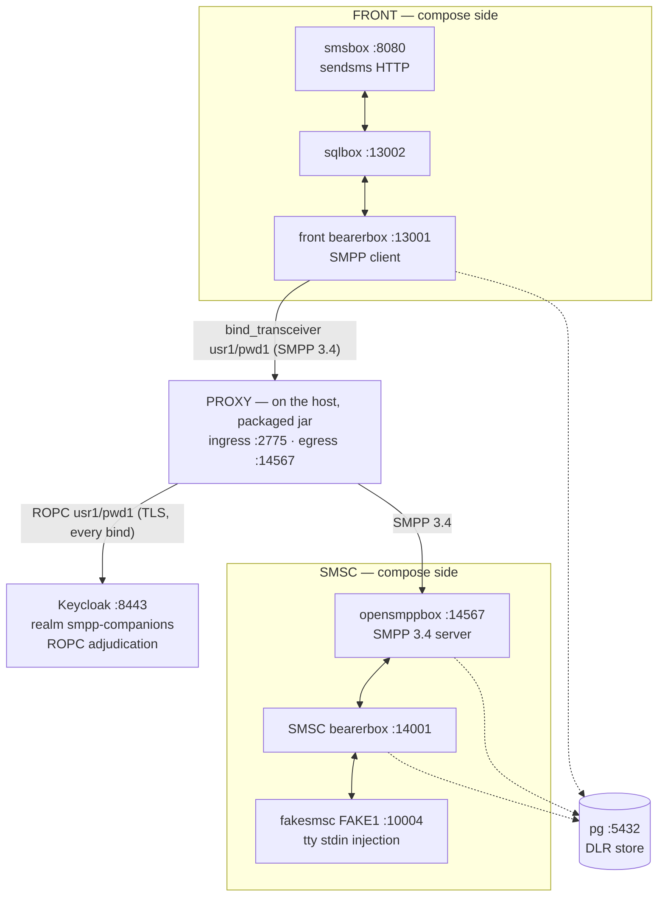

# The Kannel Sandbox — a real-SMPP rig for debugging and correctness proof

> **Status:** Story 6.3, tasks T1+T2 (2026-09-17) — T1 the Kannel rig itself (compose file,
> pinned-source Dockerfile, `conf/`, `init.sql`, this bring-up guide); T2 the compose Keycloak
> service (the ROPC adjudication the reverse cell requires, AD-17 fail-closed — no auth-bypass
> exists) and the host-run proxy launch recipe (§5, machine-executed from this page). The remaining
> story tasks append in order: **T3** adds the correctness journeys with expected observations per
> hop; **T4** the proofs/catalog/ledger close-out. Spec:
> `_bmad-output/implementation-artifacts/6-3-kannel-sandbox.md`. The sandbox is developer tooling,
> not shipped product: it changes zero main-source lines, is inert to Gradle (`./gradlew clean build`
> untouched), wires into no CI, and publishes no performance numbers (Epic 7 owns measurement).
> Русский перевод: [`README.ru.md`](README.ru.md).

## 1. What this rig is

A docker-compose chain of **Kannel 1.5.0** on both sides of the proxy, ported from the proven
pre-project playground (`/home/ildar/Documents/smpp-sandbox` — the repo's origin playground, whose
plan item 3 is literally this proxy). Until now the proxy's interop evidence rested on in-repo mocks
(`MockSmsc` on this repo's own codec) plus jSMPP 3.0.2 as the independent oracle; this rig adds the
missing tier — a REAL, unmodified, third-party SMPP 3.4 stack (COMP-1 context). It **complements,
never replaces**, the automated oracles: the in-repo suites stay the machine-checked conformance
surface; Kannel is the real-stack, human-driven debugging and correctness tier.

The chain, with the proxy wedged in the middle (the front bearerbox's SMPP client dials the proxy's
host ingress instead of straight at opensmppbox — the ONE wiring delta from the ported source) and
the compose Keycloak adjudicating every bind over ROPC:



Everything compose-side speaks `host.docker.internal` and every inter-service hop hairpins through
the host's published ports — the ported pattern that lets the host-run proxy sit in the chain with a
single conf re-point. The proxy itself runs on the **host** as the packaged jar
(`java -jar` under the ONE operator flag set, reverse.mode-b — the [B] topology's plaintext
posture, an accepted risk whose WARN banner is part of the documented launch; the recipe is §5).
Keeping the proxy on the host is the point of the sandbox: debugger and flag access.

**Why the proxy runs on the host (`java -jar`) rather than as a docker-packaged service.** The
sandbox exists to DEBUG the proxy against a real SMPP stack — the component under study runs where
it can be instrumented. The host launch gives IDE-debugger attach, the full JDK toolbox (`jcmd`,
JFR, heap dumps), and instant operator-flag edits on the exact `java -jar` launch contract (the
`PackagedBootSmokeTest` idiom); the Epic-5 distroless image is deliberately minimal — no shell, no
JDK tooling — and debugging inside it would mean JDWP/entrypoint drift away from the shipped deploy
shape. Everything else in the chain (Kannel, pg, Keycloak) is fixed infrastructure, which is what
compose is for. The docker-packaged proxy is not rejected — Story 6.2's E2E already proved the
two-container shape end-to-end (allow + auth-DENY) — and §5.5 documents it as an optional variant for
a one-command, all-compose run (owner decision ratified 2026-09-17: host stays the default).

## 2. Layout

| File | What it is |
|------|------------|
| `compose.yml` | The 8-service chain: the ported 7 — `pg`, front side (`front-bearer-box`, `front-sql-box`, `front-sms-box`), SMSC side (`smsc-bearer-box`, `smsc-opensmpp-box`, `smsc-fake-smsc`) — plus `keycloak` (T2); healthchecks on `pg` + both bearerboxes + `keycloak`'s TCP probe, `smsc-fake-smsc` tty-attached for `deliver_sm` injection. |
| `kannel/Dockerfile` | The Kannel 1.5.0 pinned-source build, ported byte-for-byte from the playground (gateway-1.5.0.tar.gz, `--with-pgsql`, `test/fakesmsc`, addons opensmppbox + sqlbox; UBI10 builder / UBI10-minimal runtime, including the automake-1.11 symlink bootstrap quirk). No version drift, no distro swap. |
| `conf/front-kannel.conf` | Front bearerbox + smsbox: the SMPP-**transceiver** `group = smsc` (`usr1`/`pwd1`, `interface-version = 34`) that dials the proxy at `host.docker.internal:2775`, and the `sendsms` HTTP user (`user`/`password`). |
| `conf/front-sqlbox.conf` | Front sqlbox (smsbox → sqlbox → bearerbox routing leg). |
| `conf/smsc-kannel.conf` | SMSC-side bearerbox: admin 14000, fake SMSC `FAKE1` on 10004, pgsql DLR (`smsc_bearer_dlr`). |
| `conf/smsc-opensmppbox.conf` | opensmppbox on 14567: `smpp-logins` from `smsc-users.txt`, `route-to-smsc = FAKE1`, pgsql DLR (`smsc_smpp_dlr`). This box is the real SMSC the proxy's egress dials. |
| `conf/smsc-users.txt` | opensmppbox's SMPP credential list (`usr1 pwd1 smsc1 *.*.*.*`) — the SMSC-side authority the deny journeys exercise (AD-32 case 4). |
| `conf/db.conf` | Shared pgsql connection (via `host.docker.internal`). |
| `init.sql` | The pgsql DLR tables (`front_bearer_dlr`, `smsc_bearer_dlr`, `smsc_smpp_dlr`), applied by the postgres entrypoint at every fresh container boot (the anonymous-volume lifetime — §7). |
| `keycloak/realm-smpp-companions.json` | The realm export the `keycloak` service imports at boot (T2): mirrors the test-tier `KeycloakFixture` realm shape — realm `smpp-companions`, the confidential client `smpp-client-confidential` with Direct Access Grants ON (per-client, off by default since KC 26.2), ROPC users (§5.1). Deliberately carries NO client secret: Keycloak generates one at import — the ONE AD-18 secret in the rig, fetched into `secrets/` (§5.1). |
| `keycloak/certs/` | The Keycloak TLS material, copied byte-identical from the committed test fixtures (`proxy/src/test/resources/keycloak/certs/`): `server.pem`/`server-key.pem` (SANs `localhost`, `keycloak`, `127.0.0.1` — the host-run proxy dials `localhost:8443`, the optional docker variant dials `keycloak:8443`), `truststore.p12` (pw `smpp-test` — the proxy's IdP trust anchor), `ca.pem` (for host-side `curl --cacert` verification). Fixture-tier test PKI, NOT production secrets — the same class of material the test tier commits; the rig's one real secret-by-path is the client secret. |
| `secrets/` | Operator-created (gitignored, AD-18): `oidc-client-secret` — the Keycloak client's generated secret, written by the §5.1 bootstrap. Nothing here is ever committed. |

### 2.1 Why opensmppbox is required — fakesmsc is not an SMPP endpoint

The proxy's egress speaks SMPP 3.4 and must dial an SMPP **server**. fakesmsc cannot be that server
at any port: it is a *client* that connects INTO a bearerbox's `smsc = fake` port and speaks
Kannel's internal box protocol — it never listens for SMPP and never parses a PDU. Pointing the
proxy's egress at anything fakesmsc-side is a category error, not a configuration option.

opensmppbox is the only SMPP 3.4 listener in the rig, and it carries three jobs nothing else can:

1. **Terminate the proxy's egress dial** — the real-SMPP-server face: it answers
   `bind_transceiver`, authenticates against `smpp-logins` (`conf/smsc-users.txt`), and is the
   SMSC-side credential authority the wrong-credential deny journey exercises (AD-32 case 4: its
   non-ROK `bind_resp` must forward verbatim through the proxy).
2. **Translate SMPP ↔ Kannel box protocol** — `submit_sm` arriving from the proxy is routed
   (`route-to-smsc = FAKE1`) through the SMSC bearerbox to fakesmsc, and an MO message typed into
   fakesmsc's stdin rides back as a real `deliver_sm` toward the ESME through the proxy (the A-1
   session-affinity property against a real stack).
3. **Own its DLR hop** — `smsc_smpp_dlr` in pg is one of the observable hops of the DLR round
   trip (the pgsql wiring the pinned Dockerfile exists to provide).

The division of labor, then: **opensmppbox is the SMSC-side SMPP face; fakesmsc is the terminal
fake center behind the bearerbox** (MO injection via stdin, MT receipt printed to its tty). Drop
opensmppbox and the proxy has no SMPP peer at all — the deny, affinity, and DLR journeys become
unprovable, and fakesmsc cannot serve any of them alone.

## 3. Prerequisites

- Docker Engine with the compose plugin (verified on Docker 29.6.1 / compose v5.3.1).
- These **host ports free** (the rig publishes them; the hairpin pattern depends on them):

| Port | Used by | Role |
|------|---------|------|
| 5432 | `pg` | DLR store (also reachable from the host for the DLR journey observations) |
| 8080 | `front-sms-box` | `sendsms` HTTP ingress — the journey entry point |
| 13000 | `front-bearer-box` | Front admin status page |
| 13001 | `front-bearer-box` | Front box port (sqlbox dials it via the host) |
| 13002 | `front-sql-box` | sqlbox port (smsbox dials it via the host) |
| 10004 | `smsc-bearer-box` | The fake SMSC port `fakesmsc` connects to |
| 14000 | `smsc-bearer-box` | SMSC-side admin status page |
| 14001 | `smsc-bearer-box` | SMSC-side box port (opensmppbox dials it via the host) |
| 14567 | `smsc-opensmpp-box` | The REAL SMSC listener — the proxy's egress target |
| 8443 | `keycloak` | The ROPC adjudicator's HTTPS realm port (the host-run proxy dials it as `localhost:8443`; the fixed bind keeps the issuer deterministic, mirroring the test fixture's coordinates) |
| 2775 | — | Must stay free: the host-run proxy's SMPP ingress (the SMPP-standard port) |
| 9090 | — (host-run proxy) | The proxy's read-only `/metrics`, bound to the `127.0.0.1` literal inside the proxy's own process — occupied only while the proxy runs (§5.3's observation point; compose publishes nothing here) |

The 8443 row has one collision to know about: the test tier's `KeycloakContainer` binds the SAME
fixed `localhost:8443` — so the sandbox's Keycloak and a concurrently running `:proxy:test` live
slice contend for it. Bring one down before the other (the test container waits up to its startup
timeout, then fails its row — loud, not silent).

## 4. Bring-up (zero → rig healthy)

From `sandbox/`:

```bash
docker compose up -d --build   # first run compiles Kannel from the pinned source — be patient;
                               # subsequent runs hit the build cache and are fast
docker compose ps              # wait for pg, front-bearer-box, smsc-bearer-box to show (healthy)
```

Readiness per service:

| Service | How you know it is up |
|---------|----------------------|
| `pg` | compose healthcheck (`pg_isready`) green. |
| `front-bearer-box` | compose healthcheck green — `curl "http://127.0.0.1:13000/status.txt?password=test"` answers; its `Box connections:` list shows `smsbox:sqlbox1` and `smsbox:smsbox1` on-line. |
| `smsc-bearer-box` | compose healthcheck green — `curl "http://127.0.0.1:14000/status.txt?password=test"` answers, and its `SMSC connections:` list shows `FAKE1 ... (online ...)`. |
| `front-sql-box` | No admin page exists (sqlbox has none); gated on `front-bearer-box: healthy`. Connected once the front status page lists `smsbox:sqlbox1`; its tables (`front_sms_log`, `front_sms_insert`) exist in `pg`. |
| `front-sms-box` | No healthcheck (gated on `front-sql-box`); answers HTTP on 8080 — a `sendsms` curl gets an smsbox answer (202 Accepted/queued while the SMSC leg is down — Kannel queues; connection-refused would mean it is not up). |
| `smsc-opensmpp-box` | No admin page; listening on 14567 (the port the proxy's egress will dial); `docker compose logs smsc-opensmpp-box` shows `Connected to bearerbox at host.docker.internal port 14001`. |
| `smsc-fake-smsc` | Stays attached (tty) once connected to 10004; `docker compose logs smsc-fake-smsc` shows `Entering interactive mode`, and `FAKE1` appears online in the SMSC status page. |
| `keycloak` | Compose healthcheck green — a TCP connect to the HTTPS listener (the rig's Keycloak is HTTPS-only and the image ships no TLS-capable client, so the healthcheck asserts the listener; see the service comment in `compose.yml`). REALM readiness is proven by the §5.1 discovery curl, which the secret bootstrap runs anyway. |

Only the services with admin status pages carry compose healthchecks (that is the ported pattern:
`pg` + the two bearerboxes; `keycloak` joins them with its TCP-connect check — the strongest probe
its HTTPS-only, client-less image admits); the rest are ordered by `depends_on` and verified by
their function, per the table above.

At-a-glance smoke (all observed on the verified bring-up):

```bash
curl "http://127.0.0.1:13000/status.txt?password=test"   # front: boxes on-line, DLR using pgsql
curl "http://127.0.0.1:14000/status.txt?password=test"   # SMSC: FAKE1 online
curl "http://127.0.0.1:8080/cgi-bin/sendsms?user=user&pass=password&from=79876543210&coding=0&to=79033374423&text=hello"   # -> 202
docker compose exec pg psql -U postgres -d postgres -c '\dt'   # the DLR + sqlbox tables
curl --cacert keycloak/certs/ca.pem https://localhost:8443/realms/smpp-companions/.well-known/openid-configuration   # -> JSON, "password" in grant_types_supported
```

**Expected state after §4 — the front SMSC is DOWN until the proxy launches.** The front bearerbox
dials `host.docker.internal:2775`, and the proxy is not part of the compose file (it runs on the
host; the launch recipe is §5). Until then the bearerbox retries every 10 s — the log names it
exactly:

```text
ERROR: error connecting to server `host.docker.internal' at port `2775'
ERROR: SMPP[smsc1]: Couldn't connect to SMS center (retrying in 10 seconds).
```

That is the rig being honest, not a fault, and `front-bearer-box` still reports healthy (its
healthcheck is the admin page, not the SMSC link). The couple happens when the proxy is launched
per §5; the front bearerbox rebinds on its own retry schedule above.

## 5. The proxy launch recipe (Keycloak + the packaged jar)

T2's deliverable, machine-executed from this page on the verified bring-up (every observation below
was observed live; the mutation table in §5.4 was run the same way). The recipe launches the REAL
artifact — the packaged boot jar under the ONE operator flag set, `reverse.mode-b` (the [B]
topology's plaintext posture exactly) — with ingress 2775 for the front bearerbox, egress to the
published opensmppbox 14567, and OIDC to the compose Keycloak. The Mode B WARN banner is part of
the documented accepted-risk launch, not noise to silence.

### 5.1 The Keycloak service and the one-time secret bootstrap (AD-18)

The `keycloak` compose service (T2) mirrors the test-tier `KeycloakFixture` realm shape so the
sandbox's IdP matches the one the proxy already proves against: pinned
`quay.io/keycloak/keycloak:26.7.0` (the ≥26.7.0 floor of the 3.1 viability verdict), the verified
`start --import-realm --hostname-strict=false` launch with the fixture server cert (SANs
`localhost`/`keycloak`/`127.0.0.1`), HTTPS-only (`KC_HTTP_ENABLED=false` — the provider link must be
TLS, SEC-053), and the fixed `8443:8443` bind that keeps the issuer deterministic
(`https://localhost:8443/realms/smpp-companions`). Two deliberate posture deltas from the test
container, both commented in `compose.yml`: the production proxy's IdP SSLContext is trust-ONLY (no
client cert toward the provider — client auth is the ROPC `client_secret`), so
`KC_HTTPS_CLIENT_AUTH` stays unset; and the admin env uses KC 26's bootstrap spelling
(`KC_BOOTSTRAP_ADMIN_*`) to avoid the deprecated `KEYCLOAK_ADMIN` warning.

The realm principals (in `keycloak/realm-smpp-companions.json`, mirroring the fixture realm with
the rig's own users):

| Principal | Value | Role in the rig |
|-----------|-------|-----------------|
| Client | `smpp-client-confidential` — confidential, DAG **enabled** (`directAccessGrantsEnabled: true` — per-client and OFF by default since KC 26.2; without it every bind denies at first bind) | The proxy's ROPC client; its secret is the rig's ONE AD-18 secret |
| User | `usr1` / `pwd1` | The happy path — exactly the front bearerbox's `smsc-username/-password` (`conf/front-kannel.conf`), so BOTH authorities accept: ROPC allows, and opensmppbox's `smsc-users.txt` (`usr1 pwd1 …`) answers ROK → the bind couples |
| User | `usr2` / `pwd2` | The wrong-SMSC-credential deny journey (T3): valid in the realm (ROPC allows), ABSENT from `smsc-users.txt` (opensmppbox answers non-ROK → forwarded verbatim, AD-32 case 4). Landed now because a realm edit forces the secret re-fetch cycle below |

**The one secret, by path (AD-18).** The realm export deliberately carries NO client secret:
Keycloak GENERATES one at import, and the operator fetches it into the gitignored
`sandbox/secrets/oidc-client-secret` (the directory is ignored via `.gitignore`; `git status` never
sees the file). The sandbox is a debug replica of the deploy contract — never a place where a secret
value is "just sandbox data". Bootstrap (from `sandbox/`, once per fresh Keycloak container):

```bash
# (a) realm readiness, authoritatively — the discovery doc over TLS, anchored by the committed CA:
curl --cacert keycloak/certs/ca.pem \
     https://localhost:8443/realms/smpp-companions/.well-known/openid-configuration
# -> JSON with "issuer":"https://localhost:8443/realms/smpp-companions" and "password" in grant_types_supported

# (b) kcadm login (the committed truststore anchors the self-signed server cert inside the container):
docker compose exec keycloak /opt/keycloak/bin/kcadm.sh config truststore \
     /opt/keycloak/conf/truststore.p12 --trustpass smpp-test
docker compose exec keycloak /opt/keycloak/bin/kcadm.sh config credentials \
     --server https://localhost:8443 --realm master --user admin --password admin

# (c) fetch the GENERATED secret and write it to the gitignored file (AD-18):
CID=$(docker compose exec -T keycloak /opt/keycloak/bin/kcadm.sh get clients -r smpp-companions \
      -q clientId=smpp-client-confidential --fields id --format csv --noquotes)
docker compose exec -T keycloak /opt/keycloak/bin/kcadm.sh get "clients/$CID/client-secret" -r smpp-companions
#   -> {"type":"secret","value":"<generated>"} — then:
mkdir -p secrets && printf '%s\n' '<generated>' > secrets/oidc-client-secret && chmod 0600 secrets/oidc-client-secret
```

Regeneration semantics (same shape as pg's, §7): `stop`/`start` preserves the imported realm and
its secret; a re-create (`down` then `up`) re-imports the checked-in realm and REGENERATES the
secret — the proxy then denies every bind (401 `invalid_client`) until you re-run (b)+(c). The
`kcadm` config (truststore + session) also lives inside the container and dies with it, so re-run
both steps after any re-create. The zero-tooling alternative for (c): the admin console at
`https://localhost:8443/admin` (admin/admin) → Clients → `smpp-client-confidential` → Credentials →
copy the secret into the file.

### 5.2 Build and launch

From the **repository root** (the jar path and the secret paths below are root-relative):

```bash
./gradlew :proxy:bootJar
java --enable-preview -XX:+UseZGC -XX:MaxDirectMemorySize=6442450944 -Djava.net.preferIPv4Stack=true \
     -jar proxy/build/libs/proxy.jar \
     --companion.bind.host=0.0.0.0 \
     --companion.bind.port=2775 \
     --companion.reverse.mode-b.smsc.host=127.0.0.1 \
     --companion.reverse.mode-b.smsc.port=14567 \
     --companion.reverse.mode-b.acknowledged=true \
     --companion.reverse.mode-b.oidc.provider-url=https://localhost:8443/realms/smpp-companions \
     --companion.reverse.mode-b.oidc.client-id=smpp-client-confidential \
     --companion.reverse.mode-b.oidc.client-secret-path=sandbox/secrets/oidc-client-secret \
     --companion.reverse.mode-b.oidc.trust-store.path=sandbox/keycloak/certs/truststore.p12 \
     --companion.reverse.mode-b.oidc.trust-store.password=smpp-test \
     --companion.reverse.mode-b.oidc.timeout=4s \
     --companion.reverse.mode-b.oidc.max-in-flight=64
```

The four JVM flags are the ONE operator set — this page cites
[`docs/operator-jvm-flag-contract.md`](../docs/operator-jvm-flag-contract.md) and never duplicates
its rationale (a flag change is a story touching the contract page, the smoke-test constant, the
Docker ENTRYPOINT — and by review duty, this recipe). The Gradle `bootJar` task tracks its inputs,
so the normal path never serves a stale jar (the `PackagedBootSmokeTest` wiring — §5.4's other arm
is therefore only reachable by pointing the `-jar` path somewhere stale on purpose).

Why these cell args (each maps to a wiring fact of the rig):

| Arg | Why |
|-----|-----|
| `bind.host=0.0.0.0` | The front bearerbox reaches the proxy through `host.docker.internal` → the host's gateway address — the listener must not be loopback-scoped. This is the Mode B plaintext leg binding all interfaces: the sandbox posture (the deployment guide's scoping advice applies to real deployments). |
| `bind.port=2775` | The rig's wiring contract (`conf/front-kannel.conf` dials `host.docker.internal:2775`). Also the shipped yml default — stated for self-documentation. |
| `smsc.host=127.0.0.1`, `smsc.port=14567` | The proxy dials the compose-published opensmppbox on the host loopback — the real SMSC-side SMPP 3.4 server (§2.1). |
| `acknowledged=true` | The Mode B opt-in (SEC-052) — without it the boot refuses; with it, the WARN banner below. |
| `provider-url=https://localhost:8443/realms/smpp-companions` | The compose Keycloak's realm base (the REALM base, not the host root — the token endpoint is derived as `<provider-url>/protocol/openid-connect/token`). The server cert's SAN `localhost` satisfies the JDK HttpClient's hostname verification against the dedicated trust store. |
| `client-secret-path` | The §5.1 file — the deploy contract's AD-18 channel, unchanged in the sandbox. |
| `trust-store.path`/`password` | The committed fixture-tier PKI (`keycloak/certs/truststore.p12`, pw `smpp-test`) anchoring the sandbox CA — never JDK `cacerts` (AD-13). |
| `timeout=4s`, `max-in-flight=64` | The documented adapter defaults, stated explicitly (they must sit within the adjudication-deadline budget). |

Everything else rides the jar's `application.yml` defaults (`companion.metrics.port=9090`,
`companion.shutdown.drain-timeout=10s`, the memory trio with `budget-check: fail`, the TLS lists) —
the same defaults every documented launch relies on.

### 5.3 Expected observations (in order — the recipe's proof)

On the proxy's stdout (a pure JSON-lines stream):

1. **The Mode B banner** — ONE WARN-level JSON line carrying the `MODE B (plaintext) is ACTIVE on
   a REVERSE instance` text verbatim (`CompanionModeBWarning`) — the accepted-risk stance, part of
   the launch.
2. **The readiness line** — `"event":"startup_summary"` with `"role":"reverse"`, `"mode":"b"`,
   `"smpp_bind_host":"0.0.0.0"`, `"smpp_bind_port":2775`, `"metrics_port":9090`,
   `"routing_system_ids":[]`, and the AD-30 interlock `"memory_budget_bytes":6442450944` ==
   `"direct_memory_ceiling_bytes":6442450944` (the yml-default derivation 65536 × 64 × 1024 × 1.5
   against the contract flag — the boot reaching ready at all IS the `budget-check: fail` pass).
3. **The couple, within ~10 s** (the front bearerbox's retry interval): `"event":"bind_accept"`,
   `"system_id":"usr1"`, `"outcome":"coupled"` — the front's bind crossed the proxy, ROPC-succeeded
   against the compose Keycloak (the §5.1 secret doing real work), dialed opensmppbox, and coupled
   on its ROK.

Then the same fact from the other two vantage points:

4. **`/metrics`** (loopback, read-only): `relay_binds_unknown_total 1.0`. Honesty note: the spec's
   I/O matrix phrases this as "`relay_binds_accepted_total` in `/metrics`" — on a REVERSE cell the
   accepted counter has no pre-registered series, because reverse cells carry no routing table and
   AD-19 forbids free-form `system_id` labels; the couple therefore lands on the unlabeled
   off-table counter (`relay.binds.unknown` → `relay_binds_unknown_total`). The labeled
   `relay_binds_accepted_total{system_id=…}` series exists only on forward cells with routing
   tables. After the first keepalive interval, `relay_pdus_total{direction="INGRESS"}` and
   `{direction="EGRESS"}` tick up — Kannel's `enquire_link` crossing the coupled pair both ways
   (T3's keepalive journey, already visible here).
5. **The front status page** — `curl "http://127.0.0.1:13000/status.txt?password=test"` now shows
   `smsc1[smsc1]    SMPP:host.docker.internal:2775/2775:usr1:smsc1 (online …)` — Kannel's own view
   of the couple. The §4 reconnect ERROR lines stop.
6. **opensmppbox's log** — the real SMSC's answer to the relayed bind:
   `docker compose logs smsc-opensmpp-box` shows the `bind_transceiver_resp` PDU dump with
   `command_id: 2147483657 = 0x80000009`, `command_status: 0 = 0x00000000` — the ROK that crossed
   the proxy back to the front.

Teardown (the AD-22 walk, re-observed here as part of the recipe): `kill -TERM <pid>` → the drain
WARN — `shutdown drain deadline (PT10S) expired — force-closed 1 live pair(s) as SHUTDOWN_DRAIN
(OBS-020: …)` (Kannel never half-closes its side, so the walk always force-closes at the deadline —
expected here, not a fault) → the process exits **143** (the JVM's hook-completed-SIGTERM
convention; a crash is 1, a forcible kill 137). The front bearerbox returns to its §4 retry loop
and re-couples on the next launch.

### 5.4 When the recipe fails loudly (verified live — the T2 mutation and deny runs)

The recipe's expected-observation steps are the failure detector — a launch that never couples is
loudly absent everywhere it should be present. The wrong-port, wrong-secret, and
Keycloak-down arms were each run live on this rig; the last two rows stand on machine-pinned
in-repo evidence (`PackagedBootSmokeTest`'s no-stale-jar wiring; the DEPLOY-009 live-pinned
refusal texts):

| Broken input | What you observe (all three vantage points) |
|--------------|---------------------------------------------|
| **Wrong egress port** (live run: `smsc.port=14568` — nothing listening) | Proxy stdout: `startup_summary` appears, then SILENCE — no `bind_accept`, ever (and no `bind_reject`: the verdict was Allow, the failure is the post-verdict dial — AD-27's pinned triggers log verifier verdicts only). Front log, every 10 s: `ERROR: SMPP[smsc1]: SMSC rejected login to transmit, code 0x0000000d (Bind Failed).` — the AD-33 collapsed generic code on the wire. `/metrics`: `relay_connections_closed_total{direction="INGRESS",reason="EGRESS_CONNECT_FAILED"}` climbing by 1 per retry; `relay_binds_*` stay 0. |
| **Stale jar** (a `-jar` path pointed at an old build) | Structurally prevented on the normal path — `./gradlew :proxy:bootJar` tracks its inputs and rebuilds on any source change (the `PackagedBootSmokeTest` no-stale-jar wiring). If you point the path somewhere stale on purpose, the couple still fails exactly like the wrong-port arm above (the jar's wiring facts no longer match the rig's). |
| **Secret mismatch** (live run: the launch pointed at a file with a wrong value — the stale-after-re-create case of §5.1) | ROPC 401 `invalid_client` → `bind_reject` JSON lines per front retry: `verdict":"DenyInvalid"` + `bind_resp_command_status":"0x0000000D"`; `relay_binds_rejected_total` climbing. The front's wire line is the SAME `code 0x0000000d (Bind Failed)` as the wrong-port arm — the deny is rich only in the proxy's logs. |
| **Keycloak down / unreachable** (live run: `docker compose stop keycloak`, correct secret) | ROPC network error → `bind_reject` (`verdict":"DenyIndeterminate"`) per retry, `0x0000000D` on the wire — indistinguishable ON THE WIRE from the 401 arm (AD-33; no IdP-availability enumeration); the two arms are distinguished ONLY by the verdict field in the proxy's log lines. |
| **Missing/unreadable secret file** | The boot itself refuses before any listener binds — exit 1 with the SEC-060/AD-18 refusal naming the path (§6's table). |

### 5.5 Optional variant — the compose-side (docker) proxy

The ratified default is the host launch above. For a one-command, all-compose run, the Epic-5
distroless image can take the proxy's place in the same chain (the shape Story 6.2's E2E already
proved end-to-end — allow + auth-DENY + drain; this variant is documented, not re-proven here, and
the wiring deltas are exactly these):

```bash
./gradlew :proxy:dockerImage        # builds and tags smpp-proxy:local (the same jar bytes)
docker run -d --name smpp-proxy \
      --network smpp-bmad-sandbox_default \
      -p 2775:2775 \
      -v "$(pwd)/sandbox/secrets/oidc-client-secret:/run/secrets/oidc-client-secret:ro" \
      -v "$(pwd)/sandbox/keycloak/certs/truststore.p12:/run/secrets/idp-truststore.p12:ro" \
      smpp-proxy:local \
      --companion.bind.host=0.0.0.0 \
      --companion.reverse.mode-b.smsc.host=smsc-opensmpp-box \
      --companion.reverse.mode-b.smsc.port=14567 \
      --companion.reverse.mode-b.acknowledged=true \
      --companion.reverse.mode-b.oidc.provider-url=https://keycloak:8443/realms/smpp-companions \
      --companion.reverse.mode-b.oidc.client-id=smpp-client-confidential \
      --companion.reverse.mode-b.oidc.client-secret-path=/run/secrets/oidc-client-secret \
      --companion.reverse.mode-b.oidc.trust-store.path=/run/secrets/idp-truststore.p12 \
      --companion.reverse.mode-b.oidc.trust-store.password=smpp-test \
      --companion.reverse.mode-b.oidc.timeout=4s \
      --companion.reverse.mode-b.oidc.max-in-flight=64
```

The deltas from the host recipe, each load-bearing: the container joins the sandbox's compose
network (explicit project name → `smpp-bmad-sandbox_default`) so it resolves `keycloak` and
`smsc-opensmpp-box` BY SERVICE NAME — the server cert's `keycloak` SAN exists for exactly this, and
the SMSC dial skips the host hairpin; `-p 2775:2775` re-publishes the ingress for the front
bearerbox's `host.docker.internal:2775` (unchanged conf); the two secret files mount read-only at
the conventional `/run/secrets` paths (mode `0444` on the host files so UID 65532 can read them —
see the deployment guide's mount rules, which also forbid env-var JVM-flag forks and memory caps
below the AD-30 budget). Observations are §5.3's list with `docker logs smpp-proxy` as the stdout
and `docker stop --timeout 30 smpp-proxy` (exit 143) as the teardown. What you LOSE is the point of
§1: no debugger, no JDK toolbox, no flag edits — which is why the host launch stays the default.

## 6. Bring-up troubleshooting — failures are named, never hidden

| Symptom | What broke | Where to look / what to do |
|---------|-----------|----------------------------|
| `docker compose up` fails with `bind: address already in use` for a port in §3 | A host process (most often a local postgres on 5432) owns the port | Free the port or remap the publish — do NOT delete the publish: the hairpin pattern means a unpublished port silently breaks the box that dials it through the host (next row) |
| A box's log shows it failing to connect to `host.docker.internal:<port>` | The matching publish was removed/changed, or the target service is down | Each conf names its targets (§2); restore the publish or the target service — the conf files are the port map's source of truth |
| `pg` never turns healthy | Postgres not accepting connections (failed volume init, low disk) | `docker compose logs pg` — note `init.sql` runs on every FRESH container boot (anonymous volume, §7): a `down`/`up` cycle re-creates the tables empty; only `stop`/`start` preserves rows |
| `front-bearer-box` / `smsc-bearer-box` stuck `starting`, then `unhealthy`, or `exited` | Bearerbox refused its conf (syntax, unreadable mount) or crashed after start — the healthcheck curls the admin page, so no admin page = no health | `docker compose logs <service>` — Kannel names the offending group, file, and line before exiting (`Group '...' is no valid group identifier. Error found on line N of file '/etc/kannel/front-kannel.conf'`, exit 1; verified by the T1 mutation run). With no restart policy the container stays exited until you fix the conf and run `docker compose up -d` |
| `front-sql-box` / `front-sms-box` `exited (0)` | Kannel boxes terminate cleanly when they lose their bearerbox — if `front-bearer-box` exited (row above), the dependents go with it | Bring the bearerbox back first, then `docker compose up -d` restores the dependents (verified: both re-registered as box connections within seconds) |
| `front-sql-box` / `front-sms-box` crash-loop | Same conf-refusal class (they mount the same `./conf`), or their upstream box port is unreachable | `docker compose logs <service>`; then the box-port rows above |
| `smsc-opensmpp-box` exits | `smpp-users.txt` missing/unreadable in the mounted conf, or 14001 unreachable | `docker compose logs smsc-opensmpp-box`; the logins file and bearerbox port are named in `conf/smsc-opensmppbox.conf` |
| `smsc-fake-smsc` exits immediately | 10004 unreachable (smsc-bearer-box down) — fakesmsc dies fast when its connect fails | Bring `smsc-bearer-box` healthy first (compose ordering does this; a manual `docker compose start smsc-fake-smsc` re-attaches after a crash) |
| Front status page shows `smsc1` reconnecting forever | EXPECTED while the proxy is down (see §4) — or the proxy is up but not listening on 2775 | This is §5's precondition, not a rig bug: the couple is observed in the proxy's logs + `/metrics` once launched. If the proxy IS up, §5.4's table names the broken-input signatures |
| `smsc-opensmpp-box` log shows `ERROR: Invalid SMPP PDU received` | A zero-byte/blind TCP probe hit 14567 (e.g. a port scanner, or your own `nc`/TCP liveness check) — opensmppbox treats the immediate close as a zero-length PDU and logs it per-connection thread | Probe artifact, not a rig fault; the box keeps serving (its own bearerbox connection is unaffected). Interop note (COMP-1 flavor): expect these lines whenever something polls 14567 without speaking SMPP |
| `sendsms` curl returns 403 Authorization failed | Wrong sendsms credentials | The `sendsms-user` is `user`/`password` (`conf/front-kannel.conf`) |
| `keycloak` never turns healthy | The HTTPS listener never came up — cert/key mount unreadable, port 8443 taken on the host, or the container crashed at boot | `docker compose logs keycloak` (refusals name the file/option); check the §3 8443 row — including a concurrently running `:proxy:test` suite, whose `KeycloakContainer` binds the same fixed port |
| The §5.1 discovery curl fails (404 / TLS error / connection refused) | 404: the realm did not import (bad JSON — the log says `Realm 'smpp-companions' imported` when it did); TLS error: hostname/cert mismatch (use `--cacert keycloak/certs/ca.pem` against `localhost`, not an IP or other name); refused: container down | `docker compose logs keycloak`; the curl is the authoritative realm-ready probe (the compose healthcheck asserts the listener only — see `compose.yml`'s service comment) |
| The proxy refuses at boot: `…client-secret-path=… does not exist (OIDC client secret file missing) — refusing to start (SEC-060/AD-18)` | The §5.1 bootstrap was skipped (or the file moved) — AD-18 makes the path non-optional | Run the §5.1 steps; the refusal fires BEFORE any listener binds (exit 1, no `startup_summary` — no partial start) |
| Proxy up, but every bind denies: `bind_reject` lines, verdict `DenyInvalid`, wire code 0x0d | The Keycloak client secret in `sandbox/secrets/oidc-client-secret` is stale — a container re-create regenerated it (§5.1's regeneration semantics) | Re-run the §5.1 fetch and overwrite the file; the next front retry couples |

## 7. Teardown

The ported compose gives `pg` no named volume (the playground pattern, kept as-is), so postgres
data lives in an anonymous volume whose lifetime is the CONTAINER, not the project. Verified
behavior (T1 bring-up, probe rows inserted and observed):

```bash
docker compose stop        # pause: containers kept — the DLR store SURVIVES stop/start
docker compose start       # resume with the data intact

docker compose down        # containers + network gone; pg's anonymous volume is left orphaned
                           # and a fresh `up` starts a NEW EMPTY store (init.sql re-runs) — for
                           # practical purposes `down` WIPES the DLR observations, which is also
                           # the reproducible-from-clean posture for a correctness rig
docker compose down -v     # additionally removes the anonymous volume — no orphan left behind
```

Keycloak's state follows the same shape: its H2 store lives in the container (no volume), so
`stop`/`start` preserves the imported realm AND its generated client secret, while any re-create
(`down` then `up`) re-imports the checked-in realm with a REGENERATED secret — §5.1's regeneration
semantics and re-fetch steps apply after every re-create.

The host-run proxy (once launched per §5.2) is torn down separately with SIGTERM — the AD-22
graceful drain, proven in Story 5.1 and re-observed as part of §5.3's recipe proof: the drain WARN
force-closing the live pair at the PT10S deadline (Kannel never half-closes — expected), then exit
143.

## 8. Deltas from the ported source (honesty list)

The porting source is the proven playground chain; these are ALL the deltas, so the rig never
drifts silently:

1. **`conf/front-kannel.conf`, the ONE wiring delta:** the front `group = smsc` `port` re-pointed
   `14567 → 2775` (`host` stays `host.docker.internal`) — the front bearerbox binds THROUGH the
   host-run proxy instead of straight at opensmppbox. A sandbox with two wiring deltas is a
   different rig; there is exactly one.
2. **`compose.yml` identity:** an explicit project `name: smpp-bmad-sandbox` (the compose default
   would otherwise be the checkout directory name — and would collide with the playground's own
   compose project on this machine), and `build: ./kannel` (the self-contained `sandbox/` layout;
   the Dockerfile itself is ported byte-for-byte).
3. **The Keycloak service + the proxy launch recipe (T2, as landed):** the `keycloak` compose
   service mirroring the test-tier `KeycloakFixture` launch/realm (with the two posture deltas
   commented in `compose.yml`), the committed `keycloak/` material (realm export + fixture-tier
   PKI copied byte-identical from `proxy/src/test/resources/keycloak/certs/`), the gitignored
   `sandbox/secrets/oidc-client-secret` (AD-18 — the sandbox is a debug replica of the deploy
   contract, never a place where a secret value is "just sandbox data"), the `.gitignore` entry
   covering it, and the §5 recipe. Keycloak was never part of the ported source — it is the
   reverse cell's missing adjudicator, not a port.
4. **The journeys:** land with T3.

## 9. Findings discipline

- A proxy defect surfaced via Kannel is bounced to the owning epic (the honest-exception pattern)
  and recorded in deferred-work — it is never patched inside the sandbox, and never tuned away.
- A genuine Kannel quirk becomes an interop note in this README (COMP-1 context).
- Submit lost/duplicated/corrupted in transit is a REL-1 defect — bounced, never tuned away.
