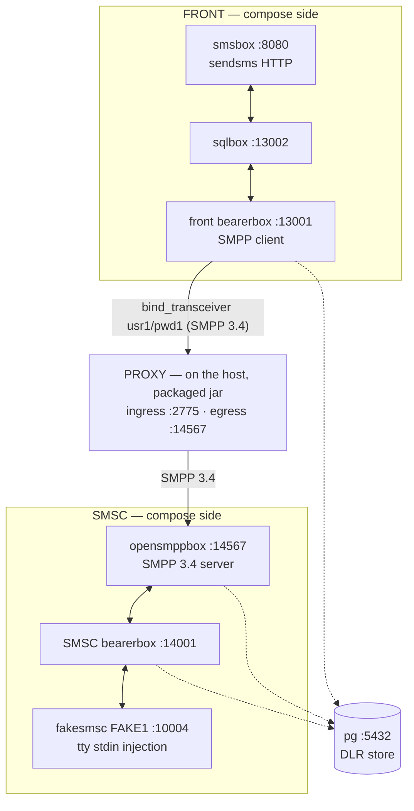

# The Kannel Sandbox — a real-SMPP rig for debugging and correctness proof

> **Status:** Story 6.3, task T1 (2026-09-17) — the Kannel rig itself: compose file, pinned-source
> Dockerfile, `conf/`, `init.sql`, and this bring-up guide. The remaining story tasks append to this
> page in order: **T2** adds the compose Keycloak service (the ROPC adjudication the reverse cell
> requires, AD-17 fail-closed — no auth-bypass exists) and the host-run proxy launch recipe; **T3**
> adds the correctness journeys with expected observations per hop. Spec:
> `_bmad-output/implementation-artifacts/6-3-kannel-sandbox.md`. The sandbox is developer tooling,
> not shipped product: it changes zero main-source lines, is inert to Gradle (`./gradlew clean build`
> untouched), wires into no CI, and publishes no performance numbers (Epic 7 owns measurement).
> Русский перевод: [`README.ru.md`](README.ru.md).

## 1. What this rig is

A docker-compose chain of **Kannel 1.5.0** on both sides of the proxy, ported from the proven
pre-project playground (`/home/ildar/Documents/smpp-sandbox` — the repo's origin playground, whose
plan item 3 is literally this proxy). Until now the proxy's interop evidence rested on in-repo mocks
(`MockSmsc` on this repo's own codec) plus jSMPP 3.0.2 as the independent oracle; this rig adds the
missing tier — a REAL, unmodified, third-party SMPP 3.4 stack (COMP-1 context). It **complements,
never replaces**, the automated oracles: the in-repo suites stay the machine-checked conformance
surface; Kannel is the real-stack, human-driven debugging and correctness tier.

The chain, with the proxy wedged in the middle (the front bearerbox's SMPP client dials the proxy's
host ingress instead of straight at opensmppbox — the ONE wiring delta from the ported source):



Everything compose-side speaks `host.docker.internal` and every inter-service hop hairpins through
the host's published ports — the ported pattern that lets the host-run proxy sit in the chain with a
single conf re-point. The proxy itself runs on the **host** as the packaged jar
(`java -jar` under the ONE operator flag set, reverse.mode-b — the [B] topology's plaintext
posture, an accepted risk whose WARN banner is part of the documented launch; the recipe lands with
T2). Keeping the proxy on the host is the point of the sandbox: debugger and flag access.

**Why the proxy runs on the host (`java -jar`) rather than as a docker-packaged service.** The
sandbox exists to DEBUG the proxy against a real SMPP stack — the component under study runs where
it can be instrumented. The host launch gives IDE-debugger attach, the full JDK toolbox (`jcmd`,
JFR, heap dumps), and instant operator-flag edits on the exact `java -jar` launch contract (the
`PackagedBootSmokeTest` idiom); the Epic-5 distroless image is deliberately minimal — no shell, no
JDK tooling — and debugging inside it would mean JDWP/entrypoint drift away from the shipped deploy
shape. Everything else in the chain (Kannel, pg, Keycloak) is fixed infrastructure, which is what
compose is for. The docker-packaged proxy is not rejected — Story 6.2's E2E already proved the
two-container shape end-to-end (allow + auth-DENY) — and T2 documents it as an optional variant for
a one-command, all-compose run (owner decision ratified 2026-09-17: host stays the default).

## 2. Layout

| File | What it is |
|------|------------|
| `compose.yml` | The 7-service chain: `pg`, front side (`front-bearer-box`, `front-sql-box`, `front-sms-box`), SMSC side (`smsc-bearer-box`, `smsc-opensmpp-box`, `smsc-fake-smsc`), healthchecks on `pg` + both bearerboxes, `smsc-fake-smsc` tty-attached for `deliver_sm` injection. |
| `kannel/Dockerfile` | The Kannel 1.5.0 pinned-source build, ported byte-for-byte from the playground (gateway-1.5.0.tar.gz, `--with-pgsql`, `test/fakesmsc`, addons opensmppbox + sqlbox; UBI10 builder / UBI10-minimal runtime, including the automake-1.11 symlink bootstrap quirk). No version drift, no distro swap. |
| `conf/front-kannel.conf` | Front bearerbox + smsbox: the SMPP-**transceiver** `group = smsc` (`usr1`/`pwd1`, `interface-version = 34`) that dials the proxy at `host.docker.internal:2775`, and the `sendsms` HTTP user (`user`/`password`). |
| `conf/front-sqlbox.conf` | Front sqlbox (smsbox → sqlbox → bearerbox routing leg). |
| `conf/smsc-kannel.conf` | SMSC-side bearerbox: admin 14000, fake SMSC `FAKE1` on 10004, pgsql DLR (`smsc_bearer_dlr`). |
| `conf/smsc-opensmppbox.conf` | opensmppbox on 14567: `smpp-logins` from `smsc-users.txt`, `route-to-smsc = FAKE1`, pgsql DLR (`smsc_smpp_dlr`). This box is the real SMSC the proxy's egress dials. |
| `conf/smsc-users.txt` | opensmppbox's SMPP credential list (`usr1 pwd1 smsc1 *.*.*.*`) — the SMSC-side authority the deny journeys exercise (AD-32 case 4). |
| `conf/db.conf` | Shared pgsql connection (via `host.docker.internal`). |
| `init.sql` | The pgsql DLR tables (`front_bearer_dlr`, `smsc_bearer_dlr`, `smsc_smpp_dlr`), applied by the postgres entrypoint at every fresh container boot (the anonymous-volume lifetime — §6). |

### 2.1 Why opensmppbox is required — fakesmsc is not an SMPP endpoint

The proxy's egress speaks SMPP 3.4 and must dial an SMPP **server**. fakesmsc cannot be that server
at any port: it is a *client* that connects INTO a bearerbox's `smsc = fake` port and speaks
Kannel's internal box protocol — it never listens for SMPP and never parses a PDU. Pointing the
proxy's egress at anything fakesmsc-side is a category error, not a configuration option.

opensmppbox is the only SMPP 3.4 listener in the rig, and it carries three jobs nothing else can:

1. **Terminate the proxy's egress dial** — the real-SMPP-server face: it answers
   `bind_transceiver`, authenticates against `smpp-logins` (`conf/smsc-users.txt`), and is the
   SMSC-side credential authority the wrong-credential deny journey exercises (AD-32 case 4: its
   non-ROK `bind_resp` must forward verbatim through the proxy).
2. **Translate SMPP ↔ Kannel box protocol** — `submit_sm` arriving from the proxy is routed
   (`route-to-smsc = FAKE1`) through the SMSC bearerbox to fakesmsc, and an MO message typed into
   fakesmsc's stdin rides back as a real `deliver_sm` toward the ESME through the proxy (the A-1
   session-affinity property against a real stack).
3. **Own its DLR hop** — `smsc_smpp_dlr` in pg is one of the observable hops of the DLR round
   trip (the pgsql wiring the pinned Dockerfile exists to provide).

The division of labor, then: **opensmppbox is the SMSC-side SMPP face; fakesmsc is the terminal
fake center behind the bearerbox** (MO injection via stdin, MT receipt printed to its tty). Drop
opensmppbox and the proxy has no SMPP peer at all — the deny, affinity, and DLR journeys become
unprovable, and fakesmsc cannot serve any of them alone.

## 3. Prerequisites

- Docker Engine with the compose plugin (verified on Docker 29.6.1 / compose v5.3.1).
- These **host ports free** (the rig publishes them; the hairpin pattern depends on them):

| Port | Used by | Role |
|------|---------|------|
| 5432 | `pg` | DLR store (also reachable from the host for the DLR journey observations) |
| 8080 | `front-sms-box` | `sendsms` HTTP ingress — the journey entry point |
| 13000 | `front-bearer-box` | Front admin status page |
| 13001 | `front-bearer-box` | Front box port (sqlbox dials it via the host) |
| 13002 | `front-sql-box` | sqlbox port (smsbox dials it via the host) |
| 10004 | `smsc-bearer-box` | The fake SMSC port `fakesmsc` connects to |
| 14000 | `smsc-bearer-box` | SMSC-side admin status page |
| 14001 | `smsc-bearer-box` | SMSC-side box port (opensmppbox dials it via the host) |
| 14567 | `smsc-opensmpp-box` | The REAL SMSC listener — the proxy's egress target |
| 2775 | — | Must stay free: the host-run proxy's SMPP ingress (the SMPP-standard port) |

## 4. Bring-up (zero → rig healthy)

From `sandbox/`:

```bash
docker compose up -d --build   # first run compiles Kannel from the pinned source — be patient;
                               # subsequent runs hit the build cache and are fast
docker compose ps              # wait for pg, front-bearer-box, smsc-bearer-box to show (healthy)
```

Readiness per service:

| Service | How you know it is up |
|---------|----------------------|
| `pg` | compose healthcheck (`pg_isready`) green. |
| `front-bearer-box` | compose healthcheck green — `curl "http://127.0.0.1:13000/status.txt?password=test"` answers; its `Box connections:` list shows `smsbox:sqlbox1` and `smsbox:smsbox1` on-line. |
| `smsc-bearer-box` | compose healthcheck green — `curl "http://127.0.0.1:14000/status.txt?password=test"` answers, and its `SMSC connections:` list shows `FAKE1 ... (online ...)`. |
| `front-sql-box` | No admin page exists (sqlbox has none); gated on `front-bearer-box: healthy`. Connected once the front status page lists `smsbox:sqlbox1`; its tables (`front_sms_log`, `front_sms_insert`) exist in `pg`. |
| `front-sms-box` | No healthcheck (gated on `front-sql-box`); answers HTTP on 8080 — a `sendsms` curl gets an smsbox answer (202 Accepted/queued while the SMSC leg is down — Kannel queues; connection-refused would mean it is not up). |
| `smsc-opensmpp-box` | No admin page; listening on 14567 (the port the proxy's egress will dial); `docker compose logs smsc-opensmpp-box` shows `Connected to bearerbox at host.docker.internal port 14001`. |
| `smsc-fake-smsc` | Stays attached (tty) once connected to 10004; `docker compose logs smsc-fake-smsc` shows `Entering interactive mode`, and `FAKE1` appears online in the SMSC status page. |

Only the services with admin status pages carry compose healthchecks (that is the ported pattern:
`pg` + the two bearerboxes); the rest are ordered by `depends_on` and verified by their function,
per the table above.

At-a-glance smoke (all observed on the verified bring-up):

```bash
curl "http://127.0.0.1:13000/status.txt?password=test"   # front: boxes on-line, DLR using pgsql
curl "http://127.0.0.1:14000/status.txt?password=test"   # SMSC: FAKE1 online
curl "http://127.0.0.1:8080/cgi-bin/sendsms?user=user&pass=password&from=79876543210&coding=0&to=79033374423&text=hello"   # -> 202
docker compose exec pg psql -U postgres -d postgres -c '\dt'   # the DLR + sqlbox tables
```

**Expected state at T1 — the front SMSC is DOWN until the proxy launches.** The front bearerbox
dials `host.docker.internal:2775`, and the proxy is not part of the compose file (it runs on the
host; the launch recipe lands with T2). Until then the bearerbox retries every 10 s — the log names
it exactly:

```text
ERROR: error connecting to server `host.docker.internal' at port `2775'
ERROR: SMPP[smsc1]: Couldn't connect to SMS center (retrying in 10 seconds).
```

That is the rig being honest, not a fault, and `front-bearer-box` still reports healthy (its
healthcheck is the admin page, not the SMSC link). The couple happens when the proxy is launched
per the T2 recipe; the front bearerbox rebinds on its own retry schedule above.

## 5. Bring-up troubleshooting — failures are named, never hidden

| Symptom | What broke | Where to look / what to do |
|---------|-----------|----------------------------|
| `docker compose up` fails with `bind: address already in use` for a port in §3 | A host process (most often a local postgres on 5432) owns the port | Free the port or remap the publish — do NOT delete the publish: the hairpin pattern means a unpublished port silently breaks the box that dials it through the host (next row) |
| A box's log shows it failing to connect to `host.docker.internal:<port>` | The matching publish was removed/changed, or the target service is down | Each conf names its targets (§2); restore the publish or the target service — the conf files are the port map's source of truth |
| `pg` never turns healthy | Postgres not accepting connections (failed volume init, low disk) | `docker compose logs pg` — note `init.sql` runs on every FRESH container boot (anonymous volume, §6): a `down`/`up` cycle re-creates the tables empty; only `stop`/`start` preserves rows |
| `front-bearer-box` / `smsc-bearer-box` stuck `starting`, then `unhealthy`, or `exited` | Bearerbox refused its conf (syntax, unreadable mount) or crashed after start — the healthcheck curls the admin page, so no admin page = no health | `docker compose logs <service>` — Kannel names the offending group, file, and line before exiting (`Group '...' is no valid group identifier. Error found on line N of file '/etc/kannel/front-kannel.conf'`, exit 1; verified by the T1 mutation run). With no restart policy the container stays exited until you fix the conf and run `docker compose up -d` |
| `front-sql-box` / `front-sms-box` `exited (0)` | Kannel boxes terminate cleanly when they lose their bearerbox — if `front-bearer-box` exited (row above), the dependents go with it | Bring the bearerbox back first, then `docker compose up -d` restores the dependents (verified: both re-registered as box connections within seconds) |
| `front-sql-box` / `front-sms-box` crash-loop | Same conf-refusal class (they mount the same `./conf`), or their upstream box port is unreachable | `docker compose logs <service>`; then the box-port rows above |
| `smsc-opensmpp-box` exits | `smpp-users.txt` missing/unreadable in the mounted conf, or 14001 unreachable | `docker compose logs smsc-opensmpp-box`; the logins file and bearerbox port are named in `conf/smsc-opensmppbox.conf` |
| `smsc-fake-smsc` exits immediately | 10004 unreachable (smsc-bearer-box down) — fakesmsc dies fast when its connect fails | Bring `smsc-bearer-box` healthy first (compose ordering does this; a manual `docker compose start smsc-fake-smsc` re-attaches after a crash) |
| Front status page shows `smsc1` reconnecting forever | EXPECTED while the proxy is down (see §4) — or the proxy is up but not listening on 2775 | This is the T2 recipe's precondition, not a rig bug: the couple is observed in the proxy's logs + `/metrics` once launched |
| `smsc-opensmpp-box` log shows `ERROR: Invalid SMPP PDU received` | A zero-byte/blind TCP probe hit 14567 (e.g. a port scanner, or your own `nc`/TCP liveness check) — opensmppbox treats the immediate close as a zero-length PDU and logs it per-connection thread | Probe artifact, not a rig fault; the box keeps serving (its own bearerbox connection is unaffected). Interop note (COMP-1 flavor): expect these lines whenever something polls 14567 without speaking SMPP |
| `sendsms` curl returns 403 Authorization failed | Wrong sendsms credentials | The `sendsms-user` is `user`/`password` (`conf/front-kannel.conf`) |

## 6. Teardown

The ported compose gives `pg` no named volume (the playground pattern, kept as-is), so postgres
data lives in an anonymous volume whose lifetime is the CONTAINER, not the project. Verified
behavior (T1 bring-up, probe rows inserted and observed):

```bash
docker compose stop        # pause: containers kept — the DLR store SURVIVES stop/start
docker compose start       # resume with the data intact

docker compose down        # containers + network gone; pg's anonymous volume is left orphaned
                           # and a fresh `up` starts a NEW EMPTY store (init.sql re-runs) — for
                           # practical purposes `down` WIPES the DLR observations, which is also
                           # the reproducible-from-clean posture for a correctness rig
docker compose down -v     # additionally removes the anonymous volume — no orphan left behind
```

The host-run proxy (once launched per the T2 recipe) is torn down separately with SIGTERM — the
AD-22 graceful drain, already proven in Story 5.1 and re-observed as part of the launch recipe.

## 7. Deltas from the ported source (honesty list)

The porting source is the proven playground chain; these are ALL the deltas, so the rig never
drifts silently:

1. **`conf/front-kannel.conf`, the ONE wiring delta:** the front `group = smsc` `port` re-pointed
   `14567 → 2775` (`host` stays `host.docker.internal`) — the front bearerbox binds THROUGH the
   host-run proxy instead of straight at opensmppbox. A sandbox with two wiring deltas is a
   different rig; there is exactly one.
2. **`compose.yml` identity:** an explicit project `name: smpp-bmad-sandbox` (the compose default
   would otherwise be the checkout directory name — and would collide with the playground's own
   compose project on this machine), and `build: ./kannel` (the self-contained `sandbox/` layout;
   the Dockerfile itself is ported byte-for-byte).
3. **Keycloak + the proxy launch recipe:** land with T2; the secrets then follow AD-18 even here
   (the OIDC client secret rides a gitignored file consumed by path — the sandbox is a debug
   replica of the deploy contract, never a place where a secret value is "just sandbox data").
4. **The journeys:** land with T3.

## 8. Findings discipline

- A proxy defect surfaced via Kannel is bounced to the owning epic (the honest-exception pattern)
  and recorded in deferred-work — it is never patched inside the sandbox, and never tuned away.
- A genuine Kannel quirk becomes an interop note in this README (COMP-1 context).
- Submit lost/duplicated/corrupted in transit is a REL-1 defect — bounced, never tuned away.
