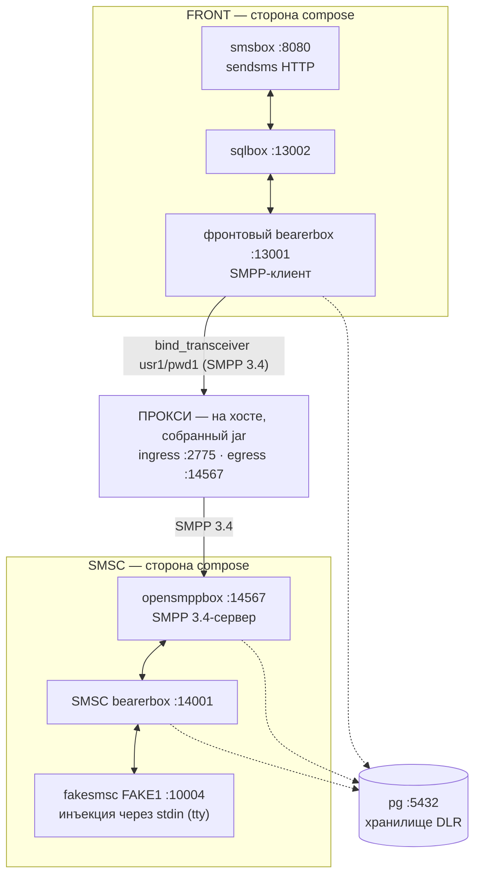

# Стенд Kannel — реальный SMPP-окружение для отладки и доказательства корректности

> **Статус:** оригинал написан в рамках задачи T1 Story 6.3 (2026-09-17); русский перевод —
> 2026-09-17, нормативен [английский оригинал](README.md) — при расхождении истина в оригинале,
> автоматической сверки нет, согласованность «перевод ↔ оригинал» — обязанность ревью; оригинал
> дополняется задачами T2 (Keycloak + рецепт запуска прокси) и T3 (сценарии проверки), перевод
> обновляется вслед за ним · **Аудитория:** разработчики, отлаживающие релей/адъюдикацию прокси
> против реального стороннего SMPP-стека · **Оракул:** сам стенд — `docker compose up` в `sandbox/`
> плюс спецификация `_bmad-output/implementation-artifacts/6-3-kannel-sandbox.md`.

Стенд — это инструмент разработчика, а не поставляемый продукт: он не меняет ни одной строки
main-кода, инертен к Gradle (`./gradlew clean build` не затрагивается), не подключается к CI и не
публикует показателей производительности (измерениями владеет Epic 7).

## 1. Что это за стенд

Цепочка docker-compose из **Kannel 1.5.0** по обе стороны прокси, портированная из
проверенного предпроектного окружения (`/home/ildar/Documents/smpp-sandbox` — origin-площадка
репозитория, чей пункт плана 3 — буквально этот прокси). До сих пор доказательства
interop-совместимости прокси опирались на внутрирепозиторные моки (`MockSmsc` на собственном
кодеке репозитория) плюс jSMPP 3.0.2 как независимый оракул; этот стенд добавляет недостающий
уровень — РЕАЛЬНЫЙ, немодифицированный сторонний SMPP 3.4-стек (контекст COMP-1). Он
**дополняет, но не заменяет** автоматические оракулы: внутрирепозиторные наборы тестов остаются
машинно-проверяемой поверхностью конформности; Kannel — уровень ручной отладки и проверки
корректности на реальном стеке.

Цепочка с прокси в середине (SMPP-клиент фронтового bearerbox звонит на host-ingress прокси,
а не напрямую в opensmppbox — ЕДИНСТВЕННАЯ правка проводки от портированного источника):



Всё compose-стороны говорит через `host.docker.internal`, и каждый межсервисный переход
«шпилькой» проходит через опубликованные порты хоста — портированный паттерн, позволяющий
запущенному на хосте прокси встать в цепочку единственной правкой конфигурации. Сам прокси
работает на **хосте** как собранный jar (`java -jar` под ЕДИНСТВЕННЫМ набором операторских
флагов, reverse.mode-b — plaintext-поза топологии [B], принятый риск, чей WARN-баннер — часть
документированного запуска; рецепт появляется в T2). Прокси на хосте — и есть смысл стенда:
доступ к отладчику и флагам.

**Почему прокси работает на хосте (`java -jar`), а не как docker-упакованный сервис.** Стенд
существует, чтобы ОТЛАЖИВАТЬ прокси против реального SMPP-стека — исследуемый компонент работает
там, где его можно инструментировать. Запуск на хосте даёт подключение отладчика IDE, полный
набор инструментов JDK (`jcmd`, JFR, дампы кучи) и мгновенное изменение операторских флагов на том
самом `java -jar`-контракте запуска (идиома `PackagedBootSmokeTest`); distroless-образ Epic-5
намеренно минимален — без оболочки и без JDK-инструментария, — а отладка внутри него означала бы
дрейф JDWP/entrypoint от поставляемой формы развёртывания. Всё остальное в цепочке (Kannel, pg,
Keycloak) — фиксированная инфраструктура, для которой compose и предназначен. Docker-упакованный
прокси не отвергнут — E2E Story 6.2 уже доказал двухконтейнерную форму end-to-end (allow +
auth-DENY) — и T2 задокументирует её как опциональный вариант для однокомандного all-compose
запуска (решение владельца ратифицировано 2026-09-17: хост остаётся умолчанием).

## 2. Состав

| Файл | Что это |
|------|---------|
| `compose.yml` | Цепочка из 7 сервисов: `pg`, фронтовая сторона (`front-bearer-box`, `front-sql-box`, `front-sms-box`), сторона SMSC (`smsc-bearer-box`, `smsc-opensmpp-box`, `smsc-fake-smsc`), healthcheck на `pg` + обоих bearerbox, `smsc-fake-smsc` подключён к tty для инъекций `deliver_sm`. |
| `kannel/Dockerfile` | Сборка Kannel 1.5.0 из зафиксированного исходника, портирована байт-в-байт из предпроектного окружения (gateway-1.5.0.tar.gz, `--with-pgsql`, `test/fakesmsc`, аддоны opensmppbox + sqlbox; UBI10 builder / UBI10-minimal runtime, включая quirk с симлинками automake-1.11). Без дрейфа версий, без смены дистрибутива. |
| `conf/front-kannel.conf` | Фронтовый bearerbox + smsbox: SMPP-**transceiver** `group = smsc` (`usr1`/`pwd1`, `interface-version = 34`), звонящий прокси на `host.docker.internal:2775`, и HTTP-пользователь `sendsms` (`user`/`password`). |
| `conf/front-sqlbox.conf` | Фронтовый sqlbox (плечо маршрутизации smsbox → sqlbox → bearerbox). |
| `conf/smsc-kannel.conf` | Bearerbox стороны SMSC: admin 14000, fake-SMSC `FAKE1` на 10004, pgsql-DLR (`smsc_bearer_dlr`). |
| `conf/smsc-opensmppbox.conf` | opensmppbox на 14567: `smpp-logins` из `smsc-users.txt`, `route-to-smsc = FAKE1`, pgsql-DLR (`smsc_smpp_dlr`). Этот бокс — реальный SMSC, на который звонит egress прокси. |
| `conf/smsc-users.txt` | Список SMPP-учётных данных opensmppbox (`usr1 pwd1 smsc1 *.*.*.*`) — авторитет стороны SMSC, который прокачивают сценарии отказа (AD-32 случай 4). |
| `conf/db.conf` | Общее pgsql-соединение (через `host.docker.internal`). |
| `init.sql` | Таблицы pgsql-DLR (`front_bearer_dlr`, `smsc_bearer_dlr`, `smsc_smpp_dlr`), применяются postgres-entrypoint при каждом свежем старте контейнера (время жизни анонимного тома — §6). |

### 2.1 Почему opensmppbox необходим — fakesmsc не является SMPP-конечной точкой

Egress прокси говорит на SMPP 3.4 и должен звонить SMPP-**серверу**. fakesmsc не может быть этим
сервером ни на каком порту: он — *клиент*, подключающийся К bearerbox на его порт `smsc = fake` и
говорящий на внутреннем box-протоколе Kannel — он никогда не слушает SMPP и не разбирает PDU.
Указать egress прокси на что-либо «в сторону fakesmsc» — категориальная ошибка, а не вариант
конфигурации.

opensmppbox — единственный SMPP 3.4-listener в стенде, и он несёт три работы, которые больше
никто не может выполнить:

1. **Принимает исходящий звонок egress прокси** — лицо реального SMPP-сервера: отвечает на
   `bind_transceiver`, аутентифицирует по `smpp-logins` (`conf/smsc-users.txt`) и является
   авторитетом учётных данных стороны SMSC, который прокачивает сценарий отказа при неверном
   пароле (AD-32 случай 4: его non-ROK `bind_resp` должен пройти через прокси дословно).
2. **Трансслирует SMPP ↔ box-протокол Kannel** — `submit_sm`, пришедший от прокси,
   маршрутизируется (`route-to-smsc = FAKE1`) через SMSC-bearerbox в fakesmsc, а MO-сообщение,
   введённое в stdin fakesmsc, возвращается настоящим `deliver_sm` в сторону ESME через прокси
   (свойство A-1 — привязка к соединению — на реальном стеке).
3. **Владеет своим плечом DLR** — `smsc_smpp_dlr` в pg — одно из наблюдаемых плеч DLR-кругооборота
   (именно под эту pgsql-проводку и существует зафиксированный Dockerfile).

Разделение труда, итого: **opensmppbox — SMPP-лицо стороны SMSC; fakesmsc — терминальный
фейковый центр за bearerbox** (инъекция MO через stdin, печать принятых MT в свой tty). Убрать
opensmppbox — и у прокси не останется SMPP-пира: сценарии отказа, привязки и DLR станут
недоказуемы, а fakesmsc в одиночку не может обслужить ни один из них.

## 3. Предусловия

- Docker Engine с плагином compose (проверено на Docker 29.6.1 / compose v5.3.1).
- Эти **порты хоста свободны** (стенд их публикует; паттерн «шпилька» зависит от них):

| Порт | Кто использует | Роль |
|------|----------------|------|
| 5432 | `pg` | Хранилище DLR (также доступно с хоста для наблюдений DLR-сценария) |
| 8080 | `front-sms-box` | HTTP-вход `sendsms` — точка входа сценария |
| 13000 | `front-bearer-box` | Фронтовая admin-страница статуса |
| 13001 | `front-bearer-box` | Порт фронтового бокса (sqlbox звонит на него через хост) |
| 13002 | `front-sql-box` | Порт sqlbox (smsbox звонит на него через хост) |
| 10004 | `smsc-bearer-box` | Порт fake-SMSC, к которому подключается fakesmsc |
| 14000 | `smsc-bearer-box` | Admin-страница статуса стороны SMSC |
| 14001 | `smsc-bearer-box` | Порт бокса стороны SMSC (opensmppbox звонит на него через хост) |
| 14567 | `smsc-opensmpp-box` | РЕАЛЬНЫЙ SMSC-listener — цель egress прокси |
| 2775 | — | Должен оставаться свободным: SMPP-ingress прокси, запущенного на хосте (стандартный порт SMPP) |

## 4. Подъём (ноль → здоровый стенд)

Из `sandbox/`:

```bash
docker compose up -d --build   # первый запуск компилирует Kannel из зафиксированного исходника —
                               # запаситесь терпением; последующие попадают в кэш сборки и быстры
docker compose ps              # дождитесь (healthy) у pg, front-bearer-box, smsc-bearer-box
```

Готовность по сервисам:

| Сервис | Как понять, что он поднялся |
|--------|------------------------------|
| `pg` | compose-healthcheck (`pg_isready`) зелёный. |
| `front-bearer-box` | compose-healthcheck зелёный — отвечает `curl "http://127.0.0.1:13000/status.txt?password=test"`; его список `Box connections:` содержит `smsbox:sqlbox1` и `smsbox:smsbox1` on-line. |
| `smsc-bearer-box` | compose-healthcheck зелёный — отвечает `curl "http://127.0.0.1:14000/status.txt?password=test"`, а список `SMSC connections:` содержит `FAKE1 ... (online ...)`. |
| `front-sql-box` | Admin-страницы нет (у sqlbox её не существует); зависит от `front-bearer-box: healthy`. Подключён, как только фронтовая страница статуса показывает `smsbox:sqlbox1`; его таблицы (`front_sms_log`, `front_sms_insert`) есть в `pg`. |
| `front-sms-box` | Без healthcheck (зависит от `front-sql-box`); отвечает по HTTP на 8080 — curl `sendsms` получает ответ smsbox (202 Accepted/поставлено в очередь, пока плечо SMSC недоступно — Kannel копит в очередь; connection-refused означал бы, что он не поднялся). |
| `smsc-opensmpp-box` | Admin-страницы нет; слушает 14567 (порт, на который будет звонить egress прокси); `docker compose logs smsc-opensmpp-box` показывает `Connected to bearerbox at host.docker.internal port 14001`. |
| `smsc-fake-smsc` | Остаётся подключённым (tty) к 10004; `docker compose logs smsc-fake-smsc` показывает `Entering interactive mode`, а `FAKE1` появляется online на странице статуса SMSC. |

Healthcheck в compose несут только сервисы с admin-страницами статуса (это портированный
паттерн: `pg` + два bearerbox); остальные упорядочены `depends_on` и проверяются своей функцией,
по таблице выше.

Экспресс-проверка (всё наблюдено на проверенном подъёме):

```bash
curl "http://127.0.0.1:13000/status.txt?password=test"   # фронт: боксы on-line, DLR через pgsql
curl "http://127.0.0.1:14000/status.txt?password=test"   # SMSC: FAKE1 online
curl "http://127.0.0.1:8080/cgi-bin/sendsms?user=user&pass=password&from=79876543210&coding=0&to=79033374423&text=hello"   # -> 202
docker compose exec pg psql -U postgres -d postgres -c '\dt'   # таблицы DLR + sqlbox
```

**Ожидаемое состояние на T1 — фронтовый SMSC недоступен, пока не запущен прокси.** Фронтовый
bearerbox звонит на `host.docker.internal:2775`, а прокси не входит в compose-файл (он работает
на хосте; рецепт запуска появляется в T2). До этого bearerbox повторяет попытку каждые 10 с —
журнал называет это дословно:

```text
ERROR: error connecting to server `host.docker.internal' at port `2775'
ERROR: SMPP[smsc1]: Couldn't connect to SMS center (retrying in 10 seconds).
```

Это стенд, честно сообщающий состояние, а не поломка, и `front-bearer-box` остаётся healthy
(его healthcheck — admin-страница, а не SMPP-линк). Сопряжение происходит, когда прокси запущен
по рецепту T2; фронтовый bearerbox переподключится сам, по своему циклу повторных попыток выше.

## 5. Устранение неполадок подъёма — сбои называются, не прячутся

| Симптом | Что сломалось | Куда смотреть / что делать |
|---------|---------------|----------------------------|
| `docker compose up` падает с `bind: address already in use` по порту из §3 | Порт занят процессом хоста (чаще всего локальным postgres на 5432) | Освободите порт или перемапьте публикацию — НЕ удаляйте её: в паттерне «шпилька» непубликуемый порт молча ломает бокс, звонящий на него через хост (строка ниже) |
| Журнал бокса показывает неудачу подключения к `host.docker.internal:<порт>` | Соответствующая публикация удалена/изменена либо целевой сервис лежит | Каждый conf называет свои цели (§2); верните публикацию или целевой сервис — conf-файлы являются источником истины карты портов |
| `pg` не становится healthy | Postgres не принимает соединения (неудачная инициализация тома, мало места) | `docker compose logs pg` — учтите: `init.sql` выполняется при каждом СВЕЖЕМ старте контейнера (анонимный том, §6): цикл `down`/`up` пересоздаёт таблицы пустыми; строки сохраняет только `stop`/`start` |
| `front-bearer-box` / `smsc-bearer-box` висит в `starting`, потом `unhealthy` или `exited` | Bearerbox отверг conf (синтаксис, нечитаемое монтирование) или упал после старта — healthcheck опрашивает curl-ом admin-страницу, нет страницы — нет здоровья | `docker compose logs <сервис>` — Kannel называет виновную группу, файл и строку перед выходом (`Group '...' is no valid group identifier. Error found on line N of file '/etc/kannel/front-kannel.conf'`, exit 1; проверено мутационным прогоном T1). Без restart-политики контейнер остаётся exited, пока вы не поправите conf и не выполните `docker compose up -d` |
| `front-sql-box` / `front-sms-box` `exited (0)` | Боксы Kannel корректно завершаются, потеряв bearerbox — если `front-bearer-box` exited (строка выше), зависимые уходят с ним | Сначала верните bearerbox, затем `docker compose up -d` восстанавливает зависимых (проверено: оба перерегистрировались как box-соединения за секунды) |
| `front-sql-box` / `front-sms-box` падает циклически | Тот же класс отвержения conf (монтируется тот же `./conf`) либо недостижим порт вышел стоящего бокса | `docker compose logs <сервис>`; затем строки о портах боксов выше |
| `smsc-opensmpp-box` завершается | `smpp-users.txt` отсутствует/нечитаем в монтируемом conf либо недостижим 14001 | `docker compose logs smsc-opensmpp-box`; файл logins и порт bearerbox названы в `conf/smsc-opensmppbox.conf` |
| `smsc-fake-smsc` завершается сразу | Недостижим 10004 (smsc-bearer-box лежит) — fakesmsc быстро умирает при неудачном подключении | Сначала поднимите `smsc-bearer-box` в healthy (порядок compose это делает; ручной `docker compose start smsc-fake-smsc` переподключает после падения) |
| Фронтовая страница статуса вечно показывает переподключение `smsc1` | ОЖИДАЕТСЯ, пока прокси не поднят (см. §4) — либо прокси поднят, но не слушает 2775 | Это предусловие рецепта T2, а не баг стенда: сопряжение наблюдается в журналах прокси + `/metrics` после запуска |
| Журнал `smsc-opensmpp-box` показывает `ERROR: Invalid SMPP PDU received` | В 14567 ткнули нульбайтовым/слепым TCP-пробом (порт-сканер или ваш собственный `nc`/TCP-тест живости) — opensmppbox трактует мгновенное закрытие как PDU нулевой длины и пишет это в нити соединений | Артефакт проба, не поломка стенда; бокс продолжает обслуживать (его собственное соединение с bearerbox не затронуто). Interop-заметка (в духе COMP-1): ждите эти строки всегда, когда что-то опрашивает 14567, не говоря на SMPP |
| `sendsms`-curl отвечает 403 Authorization failed | Неверные учётные данные sendsms | `sendsms-user` — `user`/`password` (`conf/front-kannel.conf`) |

## 6. Демонтаж

Портированный compose не даёт `pg` именованного тома (паттерн окружения-источника, сохранён
как есть), поэтому данные postgres живут в анонимном томе, чьё время жизни — КОНТЕЙНЕР, а не
проект. Проверенное поведение (подъём T1, пробные строки вставлены и наблюдены):

```bash
docker compose stop        # пауза: контейнеры сохранены — хранилище DLR ПЕРЕЖИВАЕТ stop/start
docker compose start       # продолжение с целыми данными

docker compose down        # контейнеры + сеть удалены; анонимный том pg остаётся осиротевшим,
                           # а свежий `up` стартует НОВОЕ ПУСТОЕ хранилище (init.sql выполняется
                           # заново) — на практике `down` СТИРАЕТ наблюдения DLR, что заодно и
                           # поза воспроизводимости-с-чистого-листа для стенда проверки
                           # корректности
docker compose down -v     # дополнительно удаляет анонимный том — без сирот
```

Запущенный на хосте прокси (по рецепту T2) демонтируется отдельно по SIGTERM — graceful-drain
AD-22, уже доказанный в Story 5.1 и повторно наблюдаемый как часть рецепта запуска.

## 7. Отличия от портированного источника (список честности)

Источник портирования — проверенная цепочка предпроектного окружения; вот ВСЕ отличия, чтобы
стенд не дрейфовал молча:

1. **`conf/front-kannel.conf`, ЕДИНСТВЕННАЯ правка проводки:** порт фронтового `group = smsc`
   перепрошит `14567 → 2775` (`host` остаётся `host.docker.internal`) — фронтовый bearerbox
   сопрягается ЧЕРЕЗ запущенного на хосте прокси вместо прямого захода в opensmppbox. Стенд с
   двумя правками проводки — другой стенд; правка ровно одна.
2. **Идентичность `compose.yml`:** явное имя проекта `name: smpp-bmad-sandbox` (дефолт compose —
   имя каталога чекаута — пересеклось бы с compose-проектом самого окружения-источника на этой
   машине) и `build: ./kannel` (самодостаточная раскладка `sandbox/`; сам Dockerfile портирован
   байт-в-байт).
3. **Keycloak + рецепт запуска прокси:** появляются в T2; секреты тогда следуют AD-18 и здесь
   (секрет OIDC-клиента едет в gitignored-файле, потребляемом по пути — стенд есть отладочная
   реплика deploy-контракта, а не место, где секрет — «просто песочные данные»).
4. **Сценарии проверки:** появляются в T3.
5. **Русский перевод этого README** (`README.ru.md`) и mermaid-схема цепочки — владелец,
   2026-09-17; нормативен английский оригинал.

## 8. Дисциплина находок

- Дефект прокси, всплывший через Kannel, возвращается (bounce) во владеющий эпик — паттерн
  честного исключения — и записывается в deferred-work: он никогда не чинится внутри стенда и
  никогда не подстраивается под желаемый результат.
- Подлинный quirk Kannel становится interop-заметкой в этом README (контекст COMP-1).
- Потерянный/удвоенный/искажённый в транзите Submit — дефект REL-1: возвращается (bounce) во
  владеющий эпик, не подстраивается.
