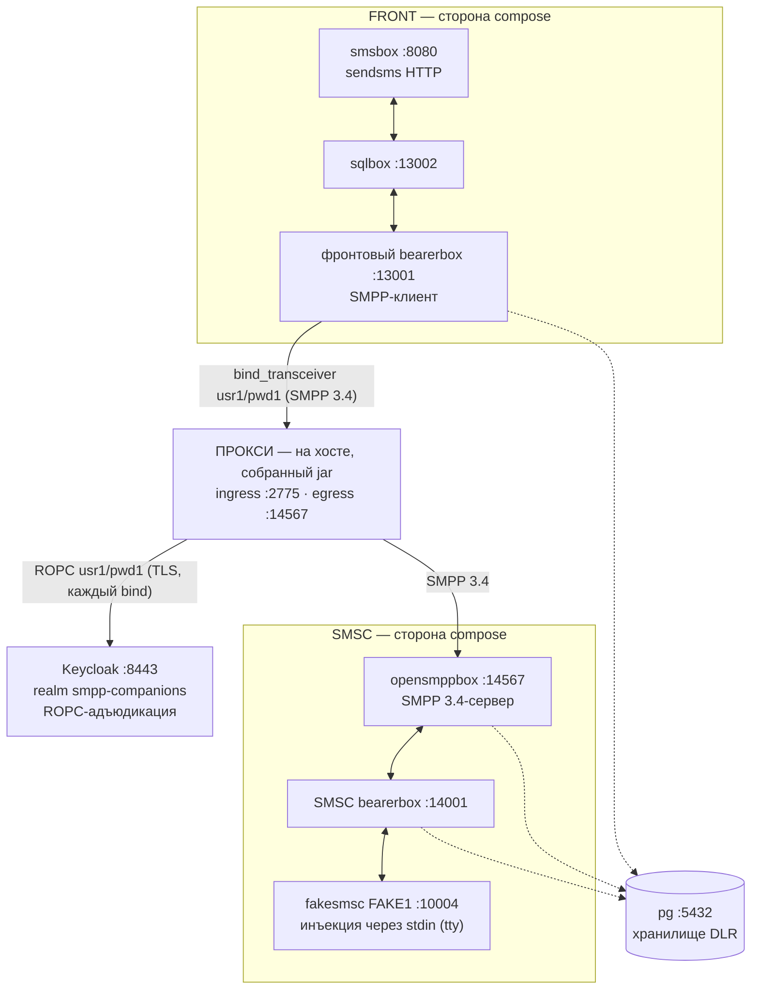

# Стенд Kannel — реальный SMPP-окружение для отладки и доказательства корректности

> **Статус:** оригинал написан в рамках задач T1+T2 Story 6.3 (2026-09-17); русский перевод —
> 2026-09-17, нормативен [английский оригинал](README.md) — при расхождении истина в оригинале,
> автоматической сверки нет, согласованность «перевод ↔ оригинал» — обязанность ревью; T1 — сам
> Kannel-стенд, T2 — сервис Keycloak в compose (ROPC-адъюдикация, которую требует reverse-ячейка,
> AD-17 fail-closed — обхода аутентификации не существует) и рецепт запуска прокси на хосте (§5,
> машинно исполнен с этой страницы). Оставшиеся задачи дописывают страницу по порядку: **T3** —
> сценарии проверки с ожидаемыми наблюдениями на каждом плече, **T4** — закрытие
> доказательства/каталог/леджер; перевод обновляется вслед за оригиналом · **Аудитория:**
> разработчики, отлаживающие релей/адъюдикацию прокси против реального стороннего SMPP-стека ·
> **Оракул:** сам стенд — `docker compose up` в `sandbox/` плюс спецификация
> `_bmad-output/implementation-artifacts/6-3-kannel-sandbox.md`.

Стенд — это инструмент разработчика, а не поставляемый продукт: он не меняет ни одной строки
main-кода, инертен к Gradle (`./gradlew clean build` не затрагивается), не подключается к CI и не
публикует показателей производительности (измерениями владеет Epic 7).

## 1. Что это за стенд

Цепочка docker-compose из **Kannel 1.5.0** по обе стороны прокси, портированная из
проверенного предпроектного окружения (`/home/ildar/Documents/smpp-sandbox` — origin-площадка
репозитория, чей пункт плана 3 — буквально этот прокси). До сих пор доказательства
interop-совместимости прокси опирались на внутрирепозиторные моки (`MockSmsc` на собственном
кодеке репозитория) плюс jSMPP 3.0.2 как независимый оракул; этот стенд добавляет недостающий
уровень — РЕАЛЬНЫЙ, немодифицированный сторонний SMPP 3.4-стек (контекст COMP-1). Он
**дополняет, но не заменяет** автоматические оракулы: внутрирепозиторные наборы тестов остаются
машинно-проверяемой поверхностью конформности; Kannel — уровень ручной отладки и проверки
корректности на реальном стеке.

Цепочка с прокси в середине (SMPP-клиент фронтового bearerbox звонит на host-ingress прокси,
а не напрямую в opensmppbox — ЕДИНСТВЕННАЯ правка проводки от портированного источника), а
compose-Keycloak адъюдирует каждый bind по ROPC:



Всё compose-стороны говорит через `host.docker.internal`, и каждый межсервисный переход
«шпилькой» проходит через опубликованные порты хоста — портированный паттерн, позволяющий
запущенному на хосте прокси встать в цепочку единственной правкой конфигурации. Сам прокси
работает на **хосте** как собранный jar (`java -jar` под ЕДИНСТВЕННЫМ набором операторских
флагов, reverse.mode-b — plaintext-поза топологии [B], принятый риск, чей WARN-баннер — часть
документированного запуска; рецепт — §5). Прокси на хосте — и есть смысл стенда:
доступ к отладчику и флагам.

**Почему прокси работает на хосте (`java -jar`), а не как docker-упакованный сервис.** Стенд
существует, чтобы ОТЛАЖИВАТЬ прокси против реального SMPP-стека — исследуемый компонент работает
там, где его можно инструментировать. Запуск на хосте даёт подключение отладчика IDE, полный
набор инструментов JDK (`jcmd`, JFR, дампы кучи) и мгновенное изменение операторских флагов на том
самом `java -jar`-контракте запуска (идиома `PackagedBootSmokeTest`); distroless-образ Epic-5
намеренно минимален — без оболочки и без JDK-инструментария, — а отладка внутри него означала бы
дрейф JDWP/entrypoint от поставляемой формы развёртывания. Всё остальное в цепочке (Kannel, pg,
Keycloak) — фиксированная инфраструктура, для которой compose и предназначен. Docker-упакованный
прокси не отвергнут — E2E Story 6.2 уже доказал двухконтейнерную форму end-to-end (allow +
auth-DENY) — и §5.5 документирует её как опциональный вариант для однокомандного all-compose
запуска (решение владельца ратифицировано 2026-09-17: хост остаётся умолчанием).

## 2. Состав

| Файл | Что это |
|------|---------|
| `compose.yml` | Цепочка из 8 сервисов: портированные 7 — `pg`, фронтовая сторона (`front-bearer-box`, `front-sql-box`, `front-sms-box`), сторона SMSC (`smsc-bearer-box`, `smsc-opensmpp-box`, `smsc-fake-smsc`) — плюс `keycloak` (T2); healthcheck на `pg` + обоих bearerbox + TCP-проба `keycloak`, `smsc-fake-smsc` подключён к tty для инъекций `deliver_sm`. |
| `kannel/Dockerfile` | Сборка Kannel 1.5.0 из зафиксированного исходника, портирована байт-в-байт из предпроектного окружения (gateway-1.5.0.tar.gz, `--with-pgsql`, `test/fakesmsc`, аддоны opensmppbox + sqlbox; UBI10 builder / UBI10-minimal runtime, включая quirk с симлинками automake-1.11). Без дрейфа версий, без смены дистрибутива. |
| `conf/front-kannel.conf` | Фронтовый bearerbox + smsbox: SMPP-**transceiver** `group = smsc` (`usr1`/`pwd1`, `interface-version = 34`), звонящий прокси на `host.docker.internal:2775`, и HTTP-пользователь `sendsms` (`user`/`password`). |
| `conf/front-sqlbox.conf` | Фронтовый sqlbox (плечо маршрутизации smsbox → sqlbox → bearerbox). |
| `conf/smsc-kannel.conf` | Bearerbox стороны SMSC: admin 14000, fake-SMSC `FAKE1` на 10004, pgsql-DLR (`smsc_bearer_dlr`). |
| `conf/smsc-opensmppbox.conf` | opensmppbox на 14567: `smpp-logins` из `smsc-users.txt`, `route-to-smsc = FAKE1`, pgsql-DLR (`smsc_smpp_dlr`). Этот бокс — реальный SMSC, на который звонит egress прокси. |
| `conf/smsc-users.txt` | Список SMPP-учётных данных opensmppbox (`usr1 pwd1 smsc1 *.*.*.*`) — авторитет стороны SMSC, который прокачивают сценарии отказа (AD-32 случай 4). |
| `conf/db.conf` | Общее pgsql-соединение (через `host.docker.internal`). |
| `init.sql` | Таблицы pgsql-DLR (`front_bearer_dlr`, `smsc_bearer_dlr`, `smsc_smpp_dlr`), применяются postgres-entrypoint при каждом свежем старте контейнера (время жизни анонимного тома — §7). |
| `keycloak/realm-smpp-companions.json` | Realm-экспорт, который сервис `keycloak` импортирует при старте (T2): зеркалирует форму realm'а тестового `KeycloakFixture` — realm `smpp-companions`, конфиденциальный клиент `smpp-client-confidential` с ВКЛЮЧЁННЫМ Direct Access Grants (per-client, выключен по умолчанию с KC 26.2), ROPC-пользователи (§5.1). Намеренно НЕ содержит секрета клиента: Keycloak генерирует его при импорте — ЕДИНСТВЕННЫЙ секрет AD-18 в стенде, забираемый в `secrets/` (§5.1). |
| `keycloak/certs/` | TLS-материал Keycloak, скопированный байт-в-байт из зафиксированных тестовых фикстур (`proxy/src/test/resources/keycloak/certs/`): `server.pem`/`server-key.pem` (SAN `localhost`, `keycloak`, `127.0.0.1` — запущенный на хосте прокси звонит на `localhost:8443`, опциональный docker-вариант — на `keycloak:8443`), `truststore.p12` (пароль `smpp-test` — trust-якорь прокси для IdP), `ca.pem` (для проверки `curl --cacert` с хоста). Фикстурный тестовый PKI, а НЕ продакшн-секреты — тот же класс материала, который коммитит тестовый уровень; единственный настоящий секрет-по-пути стенда — секрет клиента. |
| `secrets/` | Создаётся оператором (gitignored, AD-18): `oidc-client-secret` — сгенерированный секрет клиента Keycloak, записывается бутстрапом §5.1. Сюда не попадает ничего коммитимого. |

### 2.1 Почему opensmppbox необходим — fakesmsc не является SMPP-конечной точкой

Egress прокси говорит на SMPP 3.4 и должен звонить SMPP-**серверу**. fakesmsc не может быть этим
сервером ни на каком порту: он — *клиент*, подключающийся К bearerbox на его порт `smsc = fake` и
говорящий на внутреннем box-протоколе Kannel — он никогда не слушает SMPP и не разбирает PDU.
Указать egress прокси на что-либо «в сторону fakesmsc» — категориальная ошибка, а не вариант
конфигурации.

opensmppbox — единственный SMPP 3.4-listener в стенде, и он несёт три работы, которые больше
никто не может выполнить:

1. **Принимает исходящий звонок egress прокси** — лицо реального SMPP-сервера: отвечает на
   `bind_transceiver`, аутентифицирует по `smpp-logins` (`conf/smsc-users.txt`) и является
   авторитетом учётных данных стороны SMSC, который прокачивает сценарий отказа при неверном
   пароле (AD-32 случай 4: его non-ROK `bind_resp` должен пройти через прокси дословно).
2. **Трансслирует SMPP ↔ box-протокол Kannel** — `submit_sm`, пришедший от прокси,
   маршрутизируется (`route-to-smsc = FAKE1`) через SMSC-bearerbox в fakesmsc, а MO-сообщение,
   введённое в stdin fakesmsc, возвращается настоящим `deliver_sm` в сторону ESME через прокси
   (свойство A-1 — привязка к соединению — на реальном стеке).
3. **Владеет своим плечом DLR** — `smsc_smpp_dlr` в pg — одно из наблюдаемых плеч DLR-кругооборота
   (именно под эту pgsql-проводку и существует зафиксированный Dockerfile).

Разделение труда, итого: **opensmppbox — SMPP-лицо стороны SMSC; fakesmsc — терминальный
фейковый центр за bearerbox** (инъекция MO через stdin, печать принятых MT в свой tty). Убрать
opensmppbox — и у прокси не останется SMPP-пира: сценарии отказа, привязки и DLR станут
недоказуемы, а fakesmsc в одиночку не может обслужить ни один из них.

## 3. Предусловия

- Docker Engine с плагином compose (проверено на Docker 29.6.1 / compose v5.3.1).
- Эти **порты хоста свободны** (стенд их публикует; паттерн «шпилька» зависит от них):

| Порт | Кто использует | Роль |
|------|----------------|------|
| 5432 | `pg` | Хранилище DLR (также доступно с хоста для наблюдений DLR-сценария) |
| 8080 | `front-sms-box` | HTTP-вход `sendsms` — точка входа сценария |
| 13000 | `front-bearer-box` | Фронтовая admin-страница статуса |
| 13001 | `front-bearer-box` | Порт фронтового бокса (sqlbox звонит на него через хост) |
| 13002 | `front-sql-box` | Порт sqlbox (smsbox звонит на него через хост) |
| 10004 | `smsc-bearer-box` | Порт fake-SMSC, к которому подключается fakesmsc |
| 14000 | `smsc-bearer-box` | Admin-страница статуса стороны SMSC |
| 14001 | `smsc-bearer-box` | Порт бокса стороны SMSC (opensmppbox звонит на него через хост) |
| 14567 | `smsc-opensmpp-box` | РЕАЛЬНЫЙ SMSC-listener — цель egress прокси |
| 8443 | `keycloak` | HTTPS-порт realm'а ROPC-адъюдикатора (запущенный на хосте прокси звонит на него как `localhost:8443`; фиксированный бинд держит issuer детерминированным, зеркалируя координаты тестовой фикстуры) |
| 2775 | — | Должен оставаться свободным: SMPP-ingress прокси, запущенного на хосте (стандартный порт SMPP) |
| 9090 | — (прокси на хосте) | Read-only `/metrics` прокси, биндится на литерал `127.0.0.1` внутри собственного процесса прокси — занят только пока прокси работает (точка наблюдения §5.3; compose ничего здесь не публикует) |

У строки 8443 есть одно столкновение, о котором надо знать: `KeycloakContainer` тестового уровня
биндит ТОТ ЖЕ фиксированный `localhost:8443` — Keycloak стенда и одновременно идущий `:proxy:test`
live-набор соревнуются за него. Гасите одно перед другим (тестовый контейнер ждёт до своего
startup-timeout и затем валит свой тест-кейс — громко, не молча).

## 4. Подъём (ноль → здоровый стенд)

Из `sandbox/`:

```bash
docker compose up -d --build   # первый запуск компилирует Kannel из зафиксированного исходника —
                               # запаситесь терпением; последующие попадают в кэш сборки и быстры
docker compose ps              # дождитесь (healthy) у pg, front-bearer-box, smsc-bearer-box
```

Готовность по сервисам:

| Сервис | Как понять, что он поднялся |
|--------|------------------------------|
| `pg` | compose-healthcheck (`pg_isready`) зелёный. |
| `front-bearer-box` | compose-healthcheck зелёный — отвечает `curl "http://127.0.0.1:13000/status.txt?password=test"`; его список `Box connections:` содержит `smsbox:sqlbox1` и `smsbox:smsbox1` on-line. |
| `smsc-bearer-box` | compose-healthcheck зелёный — отвечает `curl "http://127.0.0.1:14000/status.txt?password=test"`, а список `SMSC connections:` содержит `FAKE1 ... (online ...)`. |
| `front-sql-box` | Admin-страницы нет (у sqlbox её не существует); зависит от `front-bearer-box: healthy`. Подключён, как только фронтовая страница статуса показывает `smsbox:sqlbox1`; его таблицы (`front_sms_log`, `front_sms_insert`) есть в `pg`. |
| `front-sms-box` | Без healthcheck (зависит от `front-sql-box`); отвечает по HTTP на 8080 — curl `sendsms` получает ответ smsbox (202 Accepted/поставлено в очередь, пока плечо SMSC недоступно — Kannel копит в очередь; connection-refused означал бы, что он не поднялся). |
| `smsc-opensmpp-box` | Admin-страницы нет; слушает 14567 (порт, на который будет звонить egress прокси); `docker compose logs smsc-opensmpp-box` показывает `Connected to bearerbox at host.docker.internal port 14001`. |
| `smsc-fake-smsc` | Остаётся подключённым (tty) к 10004; `docker compose logs smsc-fake-smsc` показывает `Entering interactive mode`, а `FAKE1` появляется online на странице статуса SMSC. |
| `keycloak` | Compose-healthcheck зелёный — TCP-подключение к HTTPS-listener'у (Keycloak стенда работает только по HTTPS, а в образе нет TLS-способного клиента, поэтому healthcheck утверждает listener; см. комментарий к сервису в `compose.yml`). ГОТОВНОСТЬ realm'а доказывается discovery-curl'ом из §5.1, который бутстрап секрета и так выполняет. |

Healthcheck в compose несут только сервисы с admin-страницами статуса (это портированный
паттерн: `pg` + два bearerbox; `keycloak` присоединяется к ним со своей TCP-пробой — сильнейший
проб, который допускает его HTTPS-only образ без клиента); остальные упорядочены `depends_on`
и проверяются своей функцией, по таблице выше.

Экспресс-проверка (всё наблюдено на проверенном подъёме):

```bash
curl "http://127.0.0.1:13000/status.txt?password=test"   # фронт: боксы on-line, DLR через pgsql
curl "http://127.0.0.1:14000/status.txt?password=test"   # SMSC: FAKE1 online
curl "http://127.0.0.1:8080/cgi-bin/sendsms?user=user&pass=password&from=79876543210&coding=0&to=79033374423&text=hello"   # -> 202
docker compose exec pg psql -U postgres -d postgres -c '\dt'   # таблицы DLR + sqlbox
curl --cacert keycloak/certs/ca.pem https://localhost:8443/realms/smpp-companions/.well-known/openid-configuration   # -> JSON, "password" в grant_types_supported
```

**Ожидаемое состояние после §4 — фронтовый SMSC недоступен, пока не запущен прокси.** Фронтовый
bearerbox звонит на `host.docker.internal:2775`, а прокси не входит в compose-файл (он работает
на хосте; рецепт запуска — §5). До этого bearerbox повторяет попытку каждые 10 с —
журнал называет это дословно:

```text
ERROR: error connecting to server `host.docker.internal' at port `2775'
ERROR: SMPP[smsc1]: Couldn't connect to SMS center (retrying in 10 seconds).
```

Это стенд, честно сообщающий состояние, а не поломка, и `front-bearer-box` остаётся healthy
(его healthcheck — admin-страница, а не SMPP-линк). Сопряжение происходит, когда прокси запущен
по рецепту §5; фронтовый bearerbox переподключится сам, по своему циклу повторных попыток выше.

## 5. Рецепт запуска прокси (Keycloak + собранный jar)

Поставка T2, машинно исполнена с этой страницы на проверенном подъёме (каждое наблюдение ниже
наблюдалось вживую; таблица мутаций в §5.4 прогнана так же). Рецепт запускает РЕАЛЬНЫЙ артефакт —
собранный boot-jar под ЕДИНСТВЕННЫМ набором операторских флагов, `reverse.mode-b` (в точности
plaintext-поза топологии [B]) — с ingress 2775 для фронтового bearerbox, egress на
опубликованный opensmppbox 14567 и OIDC на compose-Keycloak. WARN-баннер Mode B — часть
документированного запуска с принятым риском, а не шум, который надо заглушить.

### 5.1 Сервис Keycloak и однократный бутстрап секрета (AD-18)

Compose-сервис `keycloak` (T2) зеркалирует форму realm'а тестового `KeycloakFixture`, чтобы IdP
стенда совпадал с тем, против которого прокси уже доказан: зафиксированный
`quay.io/keycloak/keycloak:26.7.0` (пол ≥26.7.0 из вердикта жизнеспособности 3.1), проверенный
запуск `start --import-realm --hostname-strict=false` с серверным сертификатом фикстуры (SAN
`localhost`/`keycloak`/`127.0.0.1`), только-HTTPS (`KC_HTTP_ENABLED=false` — линк к провайдеру
обязан быть TLS, SEC-053) и фиксированный бинд `8443:8443`, держащий issuer детерминированным
(`https://localhost:8443/realms/smpp-companions`). Две намеренные позы, отличные от тестового
контейнера, обе прокомментированы в `compose.yml`: SSLContext продакшн-прокси к IdP —
только-trust (без клиентского сертификата к провайдеру — клиентской аутентификацией является
ROPC `client_secret`), поэтому `KC_HTTPS_CLIENT_AUTH` не задаётся; и admin-окружение использует
bootstrap-написание KC 26 (`KC_BOOTSTRAP_ADMIN_*`), чтобы не получать deprecation-предупреждение
устаревшего `KEYCLOAK_ADMIN`.

Принципалы realm'а (в `keycloak/realm-smpp-companions.json`, зеркалирует realm фикстуры с
собственными пользователями стенда):

| Принципал | Значение | Роль в стенде |
|-----------|----------|---------------|
| Клиент | `smpp-client-confidential` — конфиденциальный, DAG **включён** (`directAccessGrantsEnabled: true` — per-client и ВЫКЛЮЧЕН по умолчанию с KC 26.2; без него каждый bind отказывает на первом же bind) | ROPC-клиент прокси; его секрет — ЕДИНСТВЕННЫЙ секрет AD-18 в стенде |
| Пользователь | `usr1` / `pwd1` | Счастливый путь — в точности `smsc-username/-password` фронтового bearerbox (`conf/front-kannel.conf`), поэтому ОБА авторитета принимают: ROPC разрешает, а `smsc-users.txt` opensmppbox (`usr1 pwd1 …`) отвечает ROK → bind сопрягается |
| Пользователь | `usr2` / `pwd2` | Сценарий отказа при неверном SMSC-креде (T3): валиден в realm (ROPC разрешает), ОТСУТСТВУЕТ в `smsc-users.txt` (opensmppbox отвечает non-ROK → проходит дословно, AD-32 случай 4). Положен сейчас, потому что правка realm'а запускает цикл перезапроса секрета ниже |

**Единственный секрет — по пути (AD-18).** Realm-экспорт намеренно НЕ содержит секрета клиента:
Keycloak ГЕНЕРИРУЕТ его при импорте, а оператор забирает его в gitignored
`sandbox/secrets/oidc-client-secret` (каталог игнорируется через `.gitignore`; `git status`
никогда не видит файл). Стенд — отладочная реплика deploy-контракта, а не место, где значение
секрета — «просто песочные данные». Бутстрап (из `sandbox/`, один раз на свежий контейнер
Keycloak):

```bash
# (a) готовность realm'а, авторитетно — discovery-документ по TLS, заякорен коммитнутым CA:
curl --cacert keycloak/certs/ca.pem \
     https://localhost:8443/realms/smpp-companions/.well-known/openid-configuration
# -> JSON с "issuer":"https://localhost:8443/realms/smpp-companions" и "password" в grant_types_supported

# (b) вход kcadm (коммитнутый truststore заякоривает self-signed сертификат сервера внутри контейнера):
docker compose exec keycloak /opt/keycloak/bin/kcadm.sh config truststore \
     /opt/keycloak/conf/truststore.p12 --trustpass smpp-test
docker compose exec keycloak /opt/keycloak/bin/kcadm.sh config credentials \
     --server https://localhost:8443 --realm master --user admin --password admin

# (c) забрать СГЕНЕРИРОВАННЫЙ секрет и записать в gitignored-файл (AD-18):
CID=$(docker compose exec -T keycloak /opt/keycloak/bin/kcadm.sh get clients -r smpp-companions \
      -q clientId=smpp-client-confidential --fields id --format csv --noquotes)
docker compose exec -T keycloak /opt/keycloak/bin/kcadm.sh get "clients/$CID/client-secret" -r smpp-companions
#   -> {"type":"secret","value":"<сгенерирован>"} — затем:
mkdir -p secrets && printf '%s\n' '<сгенерирован>' > secrets/oidc-client-secret && chmod 0600 secrets/oidc-client-secret
```

Семантика регенерации (та же форма, что у pg, §7): `stop`/`start` сохраняет импортированный realm
и его секрет; пересоздание (`down` и затем `up`) переимпортирует коммитнутый realm и
РЕГЕНЕРИРУЕТ секрет — прокси после этого отказывает каждому bind (401 `invalid_client`), пока вы
не повторите (b)+(c). Конфиг `kcadm` (truststore + сессия) тоже живёт внутри контейнера и умирает
вместе с ним — повторяйте оба шага после любого пересоздания. Альтернатива (c) без инструментария:
admin-консоль `https://localhost:8443/admin` (admin/admin) → Clients → `smpp-client-confidential`
→ Credentials → скопировать секрет в файл.

### 5.2 Сборка и запуск

Из **корня репозитория** (путь к jar и пути секретов ниже — от корня):

```bash
./gradlew :proxy:bootJar
java --enable-preview -XX:+UseZGC -XX:MaxDirectMemorySize=6442450944 -Djava.net.preferIPv4Stack=true \
     -jar proxy/build/libs/proxy.jar \
     --companion.bind.host=0.0.0.0 \
     --companion.bind.port=2775 \
     --companion.reverse.mode-b.smsc.host=127.0.0.1 \
     --companion.reverse.mode-b.smsc.port=14567 \
     --companion.reverse.mode-b.acknowledged=true \
     --companion.reverse.mode-b.oidc.provider-url=https://localhost:8443/realms/smpp-companions \
     --companion.reverse.mode-b.oidc.client-id=smpp-client-confidential \
     --companion.reverse.mode-b.oidc.client-secret-path=sandbox/secrets/oidc-client-secret \
     --companion.reverse.mode-b.oidc.trust-store.path=sandbox/keycloak/certs/truststore.p12 \
     --companion.reverse.mode-b.oidc.trust-store.password=smpp-test \
     --companion.reverse.mode-b.oidc.timeout=4s \
     --companion.reverse.mode-b.oidc.max-in-flight=64
```

Четыре JVM-флага — ЕДИНСТВЕННЫЙ операторский набор: эта страница ссылается на
[`docs/operator-jvm-flag-contract.md`](../docs/operator-jvm-flag-contract.md) и никогда не
дублирует его обоснование (смена флага — это история, затрагивающая страницу контракта, константу
smoke-теста, ENTRYPOINT Docker-образа — и, по обязанности ревью, этот рецепт). Gradle-задача
`bootJar` отслеживает свои входы, поэтому обычный путь никогда не подаёт устаревший jar
(проводка `PackagedBootSmokeTest` — второе плечо §5.4 потому достижимо только если намеренно
указать путь `-jar` куда-то устаревшее).

Почему именно эти параметры ячейки (каждый отражает факт проводки стенда):

| Параметр | Почему |
|----------|--------|
| `bind.host=0.0.0.0` | Фронтовый bearerbox достигает прокси через `host.docker.internal` → адрес шлюза хоста — listener не должен быть ограничен loopback. Это plaintext-плечо Mode B, биндящее все интерфейсы: поза стенда (совет deployment guide по ограничению области применим к реальным развёртываниям). |
| `bind.port=2775` | Контракт проводки стенда (`conf/front-kannel.conf` звонит на `host.docker.internal:2775`). Это же умолчание yml — указано для самодокументирования. |
| `smsc.host=127.0.0.1`, `smsc.port=14567` | Прокси звонит на compose-опубликованный opensmppbox по loopback хоста — реальный SMPP 3.4-сервер стороны SMSC (§2.1). |
| `acknowledged=true` | Opt-in Mode B (SEC-052) — без него загрузка отказывает; с ним — WARN-баннер ниже. |
| `provider-url=https://localhost:8443/realms/smpp-companions` | База realm'а compose-Keycloak (именно БАЗА REALM, а не корень хоста — token-endpoint выводится как `<provider-url>/protocol/openid-connect/token`). SAN `localhost` серверного сертификата удовлетворяет hostname-верификации JDK HttpClient против выделенного trust-store. |
| `client-secret-path` | Файл из §5.1 — канал AD-18 deploy-контракта, в стенде без изменений. |
| `trust-store.path`/`password` | Коммитнутый фикстурный PKI (`keycloak/certs/truststore.p12`, пароль `smpp-test`), заякоривающий CA стенда — никогда JDK `cacerts` (AD-13). |
| `timeout=4s`, `max-in-flight=64` | Документированные умолчания адаптера, указаны явно (должны укладываться в бюджет adjudication-deadline). |

Всё остальное едет на умолчаниях `application.yml` jar'а (`companion.metrics.port=9090`,
`companion.shutdown.drain-timeout=10s`, тройка memory с `budget-check: fail`, списки TLS) — те же
умолчания, на которые опирается каждый документированный запуск.

### 5.3 Ожидаемые наблюдения (по порядку — доказательство рецепта)

На stdout прокси (чистый поток JSON-lines):

1. **Баннер Mode B** — ОДНА WARN-строка JSON с дословным текстом `MODE B (plaintext) is ACTIVE on
   a REVERSE instance` (`CompanionModeBWarning`) — поза принятого риска, часть запуска.
2. **Строка готовности** — `"event":"startup_summary"` с `"role":"reverse"`, `"mode":"b"`,
   `"smpp_bind_host":"0.0.0.0"`, `"smpp_bind_port":2775`, `"metrics_port":9090`,
   `"routing_system_ids":[]` и интерлок AD-30 `"memory_budget_bytes":6442450944` ==
   `"direct_memory_ceiling_bytes":6442450944` (вывод умолчаний yml 65536 × 64 × 1024 × 1.5 против
   флага контракта — сам факт достижения ready ЕСТЬ прохождение `budget-check: fail`).
3. **Сопряжение, в пределах ~10 с** (интервал повторных попыток фронтового bearerbox):
   `"event":"bind_accept"`, `"system_id":"usr1"`, `"outcome":"coupled"` — bind фронта пересёк
   прокси, ROPC-успех против compose-Keycloak (секрет из §5.1 делает реальную работу), дозвон до
   opensmppbox и сопряжение по его ROK.

Затем тот же факт с двух других точек наблюдения:

4. **`/metrics`** (loopback, read-only): `relay_binds_unknown_total 1.0`. Заметка честности:
   I/O-матрица спецификации формулирует это как "`relay_binds_accepted_total` в `/metrics`" — на
   REVERSE-ячейке у счётчика accepted нет предрегистрированного ряда, потому что reverse-ячейки не
   несут таблицы маршрутизации, а AD-19 запрещает свободные метки `system_id`; сопряжение поэтому
   попадает в немаркированный счётчик вне таблицы (`relay.binds.unknown` →
   `relay_binds_unknown_total`). Маркированный ряд `relay_binds_accepted_total{system_id=…}`
   существует только на forward-ячейках с таблицами маршрутизации. После первого интервала
   keepalive подрастают `relay_pdus_total{direction="INGRESS"}` и `{direction="EGRESS"}` —
   `enquire_link` Kannel проходит сопряжённую пару в обе стороны (keepalive-сценарий T3, здесь
   уже виден).
5. **Страница статуса фронта** — `curl "http://127.0.0.1:13000/status.txt?password=test"` теперь
   показывает `smsc1[smsc1]    SMPP:host.docker.internal:2775/2775:usr1:smsc1 (online …)` —
   взгляд самого Kannel на сопряжение. ERROR-строки переподключения из §4 прекращаются.
6. **Журнал opensmppbox** — ответ реального SMSC на relayed-bind:
   `docker compose logs smsc-opensmpp-box` показывает дамп PDU `bind_transceiver_resp` с
   `command_id: 2147483657 = 0x80000009`, `command_status: 0 = 0x00000000` — ROK, пересёкший
   прокси обратно к фронту.

Демонтаж (проход AD-22, здесь повторно наблюдаемый как часть рецепта): `kill -TERM <pid>` →
WARN-drain — `shutdown drain deadline (PT10S) expired — force-closed 1 live pair(s) as
SHUTDOWN_DRAIN (OBS-020: …)` (Kannel никогда не полузакрывает свою сторону, поэтому проход всегда
форс-закрывает на дедлайне — здесь это ожидаемо, а не поломка) → процесс завершается с кодом
**143** (JVM-конвенция hook-completed-SIGTERM; крэш — 1, форс-килл — 137). Фронтовый bearerbox
возвращается к циклу повторных попыток из §4 и переподключится при следующем запуске.

### 5.4 Когда рецепт падает громко (проверено вживую — мутационный прогон T2 и прогоны отказов)

Шаги ожидаемых наблюдений рецепта и есть детектор отказа — запуск, который не сопрягается,
громко отсутствует везде, где должен присутствовать. Плечи неверного порта, неверного секрета и
лежачего Keycloak прогнаны вживую на этом стенде; последние две строки опираются на
машинно-закреплённые внутрирепозиторные доказательства (проводка no-stale-jar из
`PackagedBootSmokeTest`; живые тексты отказов DEPLOY-009):

| Сломанный вход | Что наблюдается (все три точки наблюдения) |
|----------------|---------------------------------------------|
| **Неверный порт egress** (живой прогон: `smsc.port=14568` — никто не слушает) | Stdout прокси: `startup_summary` появляется, затем ТИШИНА — `bind_accept` нет никогда (и нет `bind_reject`: вердикт был Allow, сбой — послевердиктный дозвон — закреплённые триггеры AD-27 логируют только вердикты верификатора). Журнал фронта, каждые 10 с: `ERROR: SMPP[smsc1]: SMSC rejected login to transmit, code 0x0000000d (Bind Failed).` — коллапсированный генерический код AD-33 на проводе. `/metrics`: `relay_connections_closed_total{direction="INGRESS",reason="EGRESS_CONNECT_FAILED"}` растёт на 1 за попытку; `relay_binds_*` остаются 0. |
| **Устаревший jar** (путь `-jar` указан на старую сборку) | Структурно предотвращено на обычном пути — `./gradlew :proxy:bootJar` отслеживает входы и пересобирает при любом изменении исходников (проводка no-stale-jar из `PackagedBootSmokeTest`). Если намеренно указать путь на устаревшее, сопряжение падает ровно как плечо неверного порта выше (факты проводки jar'а больше не соответствуют стенду). |
| **Несовпадение секрета** (живой прогон: запуск указан на файл с неверным значением — случай устаревания после пересоздания из §5.1) | ROPC 401 `invalid_client` → JSON-строки `bind_reject` на каждую попытку фронта: `verdict":"DenyInvalid"` + `bind_resp_command_status":"0x0000000D"`; `relay_binds_rejected_total` растёт. Строка фронта на проводе — ТОТ ЖЕ `code 0x0000000d (Bind Failed)`, что и у плеча неверного порта — отказ богат только в журналах прокси. |
| **Keycloak лежит / недостижим** (живой прогон: `docker compose stop keycloak`, секрет верный) | Сетевая ошибка ROPC → `bind_reject` (`verdict":"DenyIndeterminate"`) на каждую попытку, на проводе `0x0000000D` — НА ПРОВОДЕ неотличимо от плеча 401 (AD-33; нет перечисления доступности IdP); два плеча различаются ТОЛЬКО полем вердикта в журнальных строках прокси. |
| **Отсутствует/нечитаем файл секрета** | Сама загрузка отказывает до бинда любого listener'а — exit 1 с отказом SEC-060/AD-18, называющим путь (таблица §6). |

### 5.5 Опциональный вариант — прокси в compose (docker)

Ратифицированное умолчание — запуск на хосте выше. Для однокомандного all-compose запуска
distroless-образ Epic-5 может занять место прокси в той же цепочке (форму, которую E2E Story 6.2
уже доказал end-to-end — allow + auth-DENY + drain; этот вариант документирован, а не
перепроверен здесь, и отличия проводки — ровно эти):

```bash
./gradlew :proxy:dockerImage        # собирает и тегирует smpp-proxy:local (те же байты jar'а)
docker run -d --name smpp-proxy \
      --network smpp-bmad-sandbox_default \
      -p 2775:2775 \
      -v "$(pwd)/sandbox/secrets/oidc-client-secret:/run/secrets/oidc-client-secret:ro" \
      -v "$(pwd)/sandbox/keycloak/certs/truststore.p12:/run/secrets/idp-truststore.p12:ro" \
      smpp-proxy:local \
      --companion.bind.host=0.0.0.0 \
      --companion.reverse.mode-b.smsc.host=smsc-opensmpp-box \
      --companion.reverse.mode-b.smsc.port=14567 \
      --companion.reverse.mode-b.acknowledged=true \
      --companion.reverse.mode-b.oidc.provider-url=https://keycloak:8443/realms/smpp-companions \
      --companion.reverse.mode-b.oidc.client-id=smpp-client-confidential \
      --companion.reverse.mode-b.oidc.client-secret-path=/run/secrets/oidc-client-secret \
      --companion.reverse.mode-b.oidc.trust-store.path=/run/secrets/idp-truststore.p12 \
      --companion.reverse.mode-b.oidc.trust-store.password=smpp-test \
      --companion.reverse.mode-b.oidc.timeout=4s \
      --companion.reverse.mode-b.oidc.max-in-flight=64
```

Отличия от рецепта на хосте, каждое несущее нагрузку: контейнер присоединяется к compose-сети
стенда (явное имя проекта → `smpp-bmad-sandbox_default`), поэтому резолвит `keycloak` и
`smsc-opensmpp-box` ПО ИМЕНАМ СЕРВИСОВ — SAN `keycloak` серверного сертификата существует ровно
для этого, а дозвон к SMSC минует «шпильку» через хост; `-p 2775:2775` перепубликует ingress для
`host.docker.internal:2775` фронтового bearerbox (conf без изменений); два файла секретов
монтируются read-only по конвенционным путям `/run/secrets` (режим `0444` на файлах хоста, чтобы
UID 65532 мог их читать — правила монтирования deployment guide также запрещают JVM-флаги через
env и ограничения памяти ниже бюджета AD-30). Наблюдения — список §5.3, где stdout — это
`docker logs smpp-proxy`, а демонтаж — `docker stop --timeout 30 smpp-proxy` (exit 143). Что
ТЕРЯЕТСЯ — и есть смысл §1: ни отладчика, ни набора инструментов JDK, ни правок флагов — поэтому
умолчанием остаётся запуск на хосте.

## 6. Устранение неполадок подъёма — сбои называются, не прячутся

| Симптом | Что сломалось | Куда смотреть / что делать |
|---------|---------------|----------------------------|
| `docker compose up` падает с `bind: address already in use` по порту из §3 | Порт занят процессом хоста (чаще всего локальным postgres на 5432) | Освободите порт или перемапьте публикацию — НЕ удаляйте её: в паттерне «шпилька» непубликуемый порт молча ломает бокс, звонящий на него через хост (строка ниже) |
| Журнал бокса показывает неудачу подключения к `host.docker.internal:<порт>` | Соответствующая публикация удалена/изменена либо целевой сервис лежит | Каждый conf называет свои цели (§2); верните публикацию или целевой сервис — conf-файлы являются источником истины карты портов |
| `pg` не становится healthy | Postgres не принимает соединения (неудачная инициализация тома, мало места) | `docker compose logs pg` — учтите: `init.sql` выполняется при каждом СВЕЖЕМ старте контейнера (анонимный том, §7): цикл `down`/`up` пересоздаёт таблицы пустыми; строки сохраняет только `stop`/`start` |
| `front-bearer-box` / `smsc-bearer-box` висит в `starting`, потом `unhealthy` или `exited` | Bearerbox отверг conf (синтаксис, нечитаемое монтирование) или упал после старта — healthcheck опрашивает curl-ом admin-страницу, нет страницы — нет здоровья | `docker compose logs <сервис>` — Kannel называет виновную группу, файл и строку перед выходом (`Group '...' is no valid group identifier. Error found on line N of file '/etc/kannel/front-kannel.conf'`, exit 1; проверено мутационным прогоном T1). Без restart-политики контейнер остаётся exited, пока вы не поправите conf и не выполните `docker compose up -d` |
| `front-sql-box` / `front-sms-box` `exited (0)` | Боксы Kannel корректно завершаются, потеряв bearerbox — если `front-bearer-box` exited (строка выше), зависимые уходят с ним | Сначала верните bearerbox, затем `docker compose up -d` восстанавливает зависимых (проверено: оба перерегистрировались как box-соединения за секунды) |
| `front-sql-box` / `front-sms-box` падает циклически | Тот же класс отвержения conf (монтируется тот же `./conf`) либо недостижим порт вышел стоящего бокса | `docker compose logs <сервис>`; затем строки о портах боксов выше |
| `smsc-opensmpp-box` завершается | `smpp-users.txt` отсутствует/нечитаем в монтируемом conf либо недостижим 14001 | `docker compose logs smsc-opensmpp-box`; файл logins и порт bearerbox названы в `conf/smsc-opensmppbox.conf` |
| `smsc-fake-smsc` завершается сразу | Недостижим 10004 (smsc-bearer-box лежит) — fakesmsc быстро умирает при неудачном подключении | Сначала поднимите `smsc-bearer-box` в healthy (порядок compose это делает; ручной `docker compose start smsc-fake-smsc` переподключает после падения) |
| Фронтовая страница статуса вечно показывает переподключение `smsc1` | ОЖИДАЕТСЯ, пока прокси не поднят (см. §4) — либо прокси поднят, но не слушает 2775 | Это предусловие §5, а не баг стенда: сопряжение наблюдается в журналах прокси + `/metrics` после запуска. Если прокси ПОДНЯТ, таблица §5.4 называет сигнатуры сломанного входа |
| Журнал `smsc-opensmpp-box` показывает `ERROR: Invalid SMPP PDU received` | В 14567 ткнули нульбайтовым/слепым TCP-пробом (порт-сканер или ваш собственный `nc`/TCP-тест живости) — opensmppbox трактует мгновенное закрытие как PDU нулевой длины и пишет это в нити соединений | Артефакт проба, не поломка стенда; бокс продолжает обслуживать (его собственное соединение с bearerbox не затронуто). Interop-заметка (в духе COMP-1): ждите эти строки всегда, когда что-то опрашивает 14567, не говоря на SMPP |
| `sendsms`-curl отвечает 403 Authorization failed | Неверные учётные данные sendsms | `sendsms-user` — `user`/`password` (`conf/front-kannel.conf`) |
| `keycloak` никогда не становится healthy | HTTPS-listener так и не поднялся — нечитаемое монтирование сертификата/ключа, порт 8443 занят на хосте или контейнер упал при старте | `docker compose logs keycloak` (отказы называют файл/опцию); проверьте строку 8443 в §3 — включая одновременно идущий набор `:proxy:test`, чей `KeycloakContainer` биндит тот же фиксированный порт |
| Discovery-curl из §5.1 падает (404 / TLS-ошибка / connection refused) | 404: realm не импортировался (плохой JSON — при успехе журнал содержит `Realm 'smpp-companions' imported`); TLS-ошибка: несовпадение hostname/сертификата (используйте `--cacert keycloak/certs/ca.pem` против `localhost`, а не IP или другого имени); refused: контейнер лежит | `docker compose logs keycloak`; curl — авторитетная проба готовности realm'а (compose-healthcheck утверждает только listener — см. комментарий к сервису в `compose.yml`) |
| Прокси отказывает при загрузке: `…client-secret-path=… does not exist (OIDC client secret file missing) — refusing to start (SEC-060/AD-18)` | Бутстрап §5.1 пропущен (или файл переехал) — AD-18 делает путь необязательным к отсутствию | Выполните шаги §5.1; отказ срабатывает ДО бинда любого listener'а (exit 1, без `startup_summary` — никакого частичного старта) |
| Прокси поднят, но каждый bind отказывает: строки `bind_reject`, вердикт `DenyInvalid`, код на проводе 0x0d | Секрет клиента Keycloak в `sandbox/secrets/oidc-client-secret` устарел — пересоздание контейнера регенерировало его (семантика регенерации §5.1) | Повторите забор из §5.1 и перезапишите файл; следующая попытка фронта сопряжётся |

## 7. Демонтаж

Портированный compose не даёт `pg` именованного тома (паттерн окружения-источника, сохранён
как есть), поэтому данные postgres живут в анонимном томе, чьё время жизни — КОНТЕЙНЕР, а не
проект. Проверенное поведение (подъём T1, пробные строки вставлены и наблюдены):

```bash
docker compose stop        # пауза: контейнеры сохранены — хранилище DLR ПЕРЕЖИВАЕТ stop/start
docker compose start       # продолжение с целыми данными

docker compose down        # контейнеры + сеть удалены; анонимный том pg остаётся осиротевшим,
                           # а свежий `up` стартует НОВОЕ ПУСТОЕ хранилище (init.sql выполняется
                           # заново) — на практике `down` СТИРАЕТ наблюдения DLR, что заодно и
                           # поза воспроизводимости-с-чистого-листа для стенда проверки
                           # корректности
docker compose down -v     # дополнительно удаляет анонимный том — без сирот
```

Состояние Keycloak следует той же форме: его хранилище H2 живёт в контейнере (без тома), поэтому
`stop`/`start` сохраняет импортированный realm И сгенерированный секрет клиента, а любое
пересоздание (`down` и затем `up`) переимпортирует коммитнутый realm с РЕГЕНЕРИРОВАННЫМ секретом —
применяются семантика регенерации и шаги перезапроса из §5.1 после каждого пересоздания.

Запущенный на хосте прокси (по рецепту §5.2) демонтируется отдельно по SIGTERM — graceful-drain
AD-22, доказанный в Story 5.1 и повторно наблюдаемый как часть доказательства рецепта §5.3:
WARN-drain, форс-закрывающий живую пару на дедлайне PT10S (Kannel никогда не полузакрывает —
ожидаемо), затем exit 143.

## 8. Отличия от портированного источника (список честности)

Источник портирования — проверенная цепочка предпроектного окружения; вот ВСЕ отличия, чтобы
стенд не дрейфовал молча:

1. **`conf/front-kannel.conf`, ЕДИНСТВЕННАЯ правка проводки:** порт фронтового `group = smsc`
   перепрошит `14567 → 2775` (`host` остаётся `host.docker.internal`) — фронтовый bearerbox
   сопрягается ЧЕРЕЗ запущенного на хосте прокси вместо прямого захода в opensmppbox. Стенд с
   двумя правками проводки — другой стенд; правка ровно одна.
2. **Идентичность `compose.yml`:** явное имя проекта `name: smpp-bmad-sandbox` (дефолт compose —
   имя каталога чекаута — пересеклось бы с compose-проектом самого окружения-источника на этой
   машине) и `build: ./kannel` (самодостаточная раскладка `sandbox/`; сам Dockerfile портирован
   байт-в-байт).
3. **Сервис Keycloak + рецепт запуска прокси (T2, как записано):** compose-сервис `keycloak`,
   зеркалирующий запуск/realm тестового `KeycloakFixture` (с двумя позами, прокомментированными
   в `compose.yml`), коммитнутый материал `keycloak/` (realm-экспорт + фикстурный PKI,
   скопированный байт-в-байт из `proxy/src/test/resources/keycloak/certs/`), gitignored
   `sandbox/secrets/oidc-client-secret` (AD-18 — стенд есть отладочная реплика deploy-контракта,
   а не место, где значение секрета — «просто песочные данные»), запись `.gitignore`, его
   покрывающая, и рецепт §5. Keycloak никогда не был частью источника портирования — это
   недостающий адъюдикатор reverse-ячейки, а не порт.
4. **Сценарии проверки:** появляются в T3.
5. **Русский перевод этого README** (`README.ru.md`) и mermaid-схема цепочки — владелец,
   2026-09-17; нормативен английский оригинал.

## 9. Дисциплина находок

- Дефект прокси, всплывший через Kannel, возвращается (bounce) во владеющий эпик — паттерн
  честного исключения — и записывается в deferred-work: он никогда не чинится внутри стенда и
  никогда не подстраивается под желаемый результат.
- Подлинный quirk Kannel становится interop-заметкой в этом README (контекст COMP-1).
- Потерянный/удвоенный/искажённый в транзите Submit — дефект REL-1: возвращается (bounce) во
  владеющий эпик, не подстраивается.
