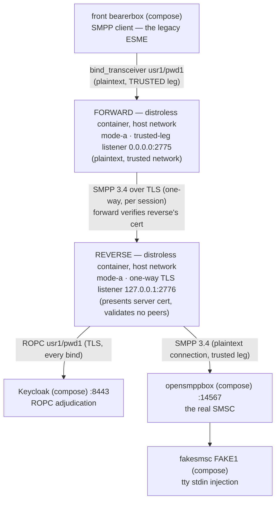

# Runbook — the `forward.mode-a` + `reverse.mode-a` use case (plaintext trusted leg, one-way-TLS connection)

> One of the three docker runbooks, one per use case (role + mode) — siblings: [the lone reverse, Mode B](reverse-mode-b.md) ·
> [forward+reverse, Mode C](forward-reverse-mode-c.md). For the host-run `java -jar` recipe (the debugger
> posture) see the [sandbox README](../README.md) §5. Every expected observation below was executed live on
> the rig, 2026-09-18. Documentation only — nothing parses this page.
> Русский перевод: [`forward-reverse-mode-a.ru.md`](forward-reverse-mode-a.ru.md).

## What it's for

Your ESMEs live on a trusted network, but the adjudicating proxy tier and the SMSC sit across
an untrusted stretch. Mode B (all plaintext) isn't acceptable there; Mode C (per-forward client
certificates) is more PKI than you want to operate. Mode A splits the difference with **two**
instances:

- a **forward** on the trusted network — a plaintext listener your legacy clients connect to
  (unchanged clients), which connects to the reverse over **one-way TLS** per SMPP session, so
  passwords never cross the untrusted stretch in the clear;
- a **reverse** at the far end — presents its server certificate, adjudicates every bind over
  ROPC at your IdP (the sole enforcement point before the SMSC), connects to the SMSC on its
  trusted leg.

The forward carries no OIDC material — the reverse is the enforcement point. The forward's
routing table says where to connect: `usr1 → localhost:2776`.



- **You accept** (the risk the reverse's banner names): one-way TLS cannot authenticate *which*
  forward connects — any peer that reaches the reverse's listener can submit binds through the
  ROPC screen. Mitigate by ACL-isolating the listener (`companion.bind.host`), or step up to
  Mode C. This runbook shows the mitigation live: the reverse's listener is scoped to
  `127.0.0.1` — in the host-network shape, only the co-located forward can connect to it.
- **You get:** no SMPP password in the clear between the proxies; no client certificate on the
  forward (one server cert + one trust store on the connect side); the couple observable on both
  instances.

## Quick start

Preconditions: the rig healthy, the OIDC client secret bootstrapped, the image and jar built —
steps 1–2 of the [Mode B runbook](reverse-mode-b.md)'s Quick start cover all of it (including
the `chmod 0444` on the secret).

From the **repository root**, launch the reverse first — its listener must exist before the
forward's first connection (the front's retry makes the order forgiving, but keep it).

**The port plan** — the two-instance layout is where ports have to move:

| Port | Bound by | Why |
|------|----------|-----|
| 2775 | the forward (`0.0.0.0`) | The port the front conf connects to — same as the lone-reverse rig; the forward takes it, the front conf doesn't change. |
| 2776 | the reverse (`127.0.0.1`) | The composed reverse moves off 2775. Loopback-scoped on purpose — the ACL mitigation, live: only the co-located forward can connect to it. |
| 9090 | the forward's `/metrics` | Default. |
| 9091 | the reverse's `/metrics` | Must move — two proxy processes share the host loopback; a second 9090 bind refuses. `--companion.metrics.port=9091` is load-bearing. |

```bash
docker run -d --name sandbox-reverse-a --network host \
      -v "$(pwd)/proxy/build/libs/proxy.jar:/opt/proxy.jar:ro" \
      -v "$(pwd)/sandbox/secrets/oidc-client-secret:/run/secrets/oidc-client-secret:ro" \
      -v "$(pwd)/sandbox/keycloak/certs/truststore.p12:/run/secrets/idp-truststore.p12:ro" \
      -v "$(pwd)/sandbox/certs/smpp-reverse-server.pem:/run/secrets/smpp-reverse-server.pem:ro" \
      -v "$(pwd)/sandbox/certs/smpp-reverse-server-key.pem:/run/secrets/smpp-reverse-server-key.pem:ro" \
      smpp-proxy:local \
      --companion.bind.host=127.0.0.1 \
      --companion.bind.port=2776 \
      --companion.metrics.port=9091 \
      --companion.reverse.mode-a.smsc.host=127.0.0.1 \
      --companion.reverse.mode-a.smsc.port=14567 \
      --companion.reverse.mode-a.server-cert.cert-path=/run/secrets/smpp-reverse-server.pem \
      --companion.reverse.mode-a.server-cert.key-path=/run/secrets/smpp-reverse-server-key.pem \
      --companion.reverse.mode-a.oidc.provider-url=https://localhost:8443/realms/smpp-companions \
      --companion.reverse.mode-a.oidc.client-id=smpp-client-confidential \
      --companion.reverse.mode-a.oidc.client-secret-path=/run/secrets/oidc-client-secret \
      --companion.reverse.mode-a.oidc.trust-store.path=/run/secrets/idp-truststore.p12 \
      --companion.reverse.mode-a.oidc.trust-store.password=smpp-test \
      --companion.reverse.mode-a.oidc.timeout=4s \
      --companion.reverse.mode-a.oidc.max-in-flight=64

docker run -d --name sandbox-forward-a --network host \
      -v "$(pwd)/proxy/build/libs/proxy.jar:/opt/proxy.jar:ro" \
      -v "$(pwd)/sandbox/certs/smpp-truststore.p12:/run/secrets/smpp-truststore.p12:ro" \
      smpp-proxy:local \
      --companion.bind.host=0.0.0.0 \
      --companion.bind.port=2775 \
      --companion.forward.mode-a.trust-store.path=/run/secrets/smpp-truststore.p12 \
      --companion.forward.mode-a.trust-store.password=smpp-test \
      '--companion.forward.mode-a.routing[0].system-id=usr1' \
      '--companion.forward.mode-a.routing[0].host=localhost' \
      '--companion.forward.mode-a.routing[0].port=2776'
```

Note what the cells structurally refuse (useful if you hand-edit the args): the forward carries
no `oidc` and no `smsc` node — its routing entry *is* the connect target; the reverse carries no
`trust-store` on its own branch — one-way TLS never validates peers, and a stray key refuses.
The quoting on the `routing[0].*` args matters for your shell, not for Spring.

✅ **You're up when** `bind_accept` with `"system_id":"usr1"`, `"outcome":"coupled"` appears on
**both** stdouts — within ~10 s of the forward's start (the reverse's line lands first: the
chain couples SMSC-side-out).

## What you should see

| Check | What you should see |
|-------|---------------------|
| `docker logs sandbox-reverse-a` (boot) | One WARN line — the Mode A banner, `MODE A (one-way TLS) is ACTIVE on a REVERSE instance … ACL-isolate the listener (companion.bind.host) or use Mode C mTLS` — then `startup_summary` with `"role":"reverse"`, `"mode":"a"`, `"smpp_bind_host":"127.0.0.1"`, `"smpp_bind_port":2776`, `"metrics_port":9091`. |
| `docker logs sandbox-forward-a` (boot) | No banner (Mode A's accepted risk is the reverse's) — `startup_summary` with `"role":"forward"`, `"mode":"a"`, `"smpp_bind_port":2775`, `"metrics_port":9090`, `"routing_system_ids":["usr1"]`. |
| The couple — within ~10 s of the forward's start | `bind_accept`, `"system_id":"usr1"`, `"outcome":"coupled"` on both stdouts; the reverse's line lands first (observed 3 ms apart), the forward's completes the ESME leg. |
| Metrics, one port per instance | Forward `curl -s http://127.0.0.1:9090/metrics`: `relay_binds_accepted_total{system_id="usr1"} 1.0` — the labeled routing-table series only a forward has. Reverse `curl -s http://127.0.0.1:9091/metrics`: `relay_binds_unknown_total 1.0`. The rig's Prometheus (UI `http://127.0.0.1:9095`) always configures both ports as its `smpp-proxy` targets: 9091 is UP only while the reverse runs, DOWN otherwise — for good on single-instance rigs ([README §5.3](../README.md), item 7). |
| `curl "http://127.0.0.1:13000/status.txt?password=test"` | `smsc1 … (online …)` — the same front conf, now coupled through two proxies. |
| `docker compose -f sandbox/compose.yml logs smsc-opensmpp-box` | `bind_transceiver` → `bind_transceiver_resp` with `command_status: 0` — the ROK that crossed both hops. |
| A send — optional | HTTP 202; fakesmsc prints the text byte-intact; both instances' counters move 2/2 per leg for the journey (submit + resp, then the DLR pair) — beyond that, keepalive. The front counts `sent: sms 1 / rcvd: dlr 2`. Full journey: [README §6.1](../README.md). |

## Troubleshooting

| Symptom | What it means · what to do |
|---------|----------------------------|
| The reverse container is down (or its port/cert is wrong) | The forward logs nothing per retry (it has no adjudication); its `relay_connections_closed_total{direction="INGRESS",reason="EGRESS_CONNECT_FAILED"}` climbs +1 per front retry; the front wire shows the collapsed `SMSC rejected login to transmit, code 0x0000000d (Bind Failed)` every 10 s. `docker start sandbox-reverse-a` re-couples within one retry. Cross-check the port plan and that `routing[0].host` (`localhost`) matches the server cert's SAN. |
| Stale Keycloak secret / Keycloak down | The [README §5.4](../README.md) signatures on the **reverse's** stdout only (`bind_reject` `DenyInvalid` / `DenyIndeterminate`); the forward stays silent; the front sees the same collapsed 0x0d. |
| A mounted key file unreadable by UID 65532 (a `0600` copy) | The boot refuses, exit 1, no `startup_summary`, the refusal naming the path. `sandbox/certs/` ships `0644` — keep it that way. |
| Both metrics on 9090 | The second container's boot refuses with a bind-in-use refusal naming `metrics.port` — loud, before any listener. That's why the reverse gets 9091. |
| An off-table `system_id` at the front (e.g. `usr2`) | The **forward** denies the bind itself, before it connects or adjudicates: generic 0x0d on the wire, one log-only WARN on its stdout (`routing miss: system_id not in the routing table — AD-33 deny (AD-29/AD-11): usr2`), nothing anywhere else. So the wrong-SMSC-credential journey (README §6.4 D1) belongs to the single-proxy use cases (README §5 host launch, the [`reverse.mode-b` runbook](reverse-mode-b.md)); D2 — a wrong password for the routed `usr1` — still crosses and denies at the reverse. |

## Logs

| Surface | How |
|---------|-----|
| The proxies' JSON stdout | `docker logs sandbox-forward-a` / `docker logs sandbox-reverse-a`. Deny verdicts live only on the reverse (the forward carries no adjudication). These are plain `docker run` containers — `docker compose logs` does not cover them. |
| The proxies' `/metrics` | Forward `curl -s http://127.0.0.1:9090/metrics`, reverse `curl -s http://127.0.0.1:9091/metrics`. |
| Keycloak | `docker compose -f sandbox/compose.yml logs keycloak` — the reverse is its only consumer. |
| Kannel, both sides | `docker compose -f sandbox/compose.yml logs front-bearer-box` / `smsc-opensmpp-box` / … — the wire tap around both proxies ([README §7](../README.md)). |

## Teardown

Stop the **forward** first — it holds the live pair toward both the ESME and the reverse:

```bash
docker stop --timeout 30 sandbox-forward-a   # exit 143; its stdout carries the ordered stream
docker inspect --format '{{.State.ExitCode}}' sandbox-forward-a   # 143
docker stop --timeout 30 sandbox-reverse-a   # exit 143
docker inspect --format '{{.State.ExitCode}}' sandbox-reverse-a   # 143
docker rm sandbox-forward-a sandbox-reverse-a
```

Exit codes are deterministic (143 both). The drain WARN is not: the forward, stopped with the
live pair, always shows it (the `shutdown drain deadline (PT10S) expired …` line); whether the
reverse shows its own WARN depends on how the forward's teardown propagated — observed both
ways (empty registry → clean 143, no WARN; a pair still draining → the WARN then 143). Either
is a correct walk: read the WARN as "1 pair was still live at the deadline", never as a fault.

## Details & references

### The TLS material

All committed under `sandbox/certs/` — byte-identical copies of the test-tier fixtures; the CA
behind them is `CN=smpp-test-ca`, store password `smpp-test`.

| File | Used by | Role |
|------|---------|------|
| `smpp-reverse-server.pem` / `-key.pem` | the reverse | Its server certificate — SANs `DNS:localhost, IP:127.0.0.1` (the forward connects to `localhost` with hostname verification on). |
| `smpp-truststore.p12` | the forward | Its connect-side anchor for that same CA. |

Keep the files world-readable (`0644`) — the image's UID 65532 reads the mounts.

### Swapping the jar

Same story as the [Mode B runbook](reverse-mode-b.md) ("Swapping the jar"), twice: rebuild
`./gradlew :proxy:bootJar`, then `docker restart` each container.

### References

- Rig bring-up, the secret bootstrap, failure signatures, the journeys:
  the [sandbox README](../README.md) (§4–§9).
- The cell's configuration keys: [docs/configuration.md](../../docs/configuration.md); the
  image's facts: [docs/deployment-guide.md](../../docs/deployment-guide.md),
  [docs/operator-jvm-flag-contract.md](../../docs/operator-jvm-flag-contract.md).
