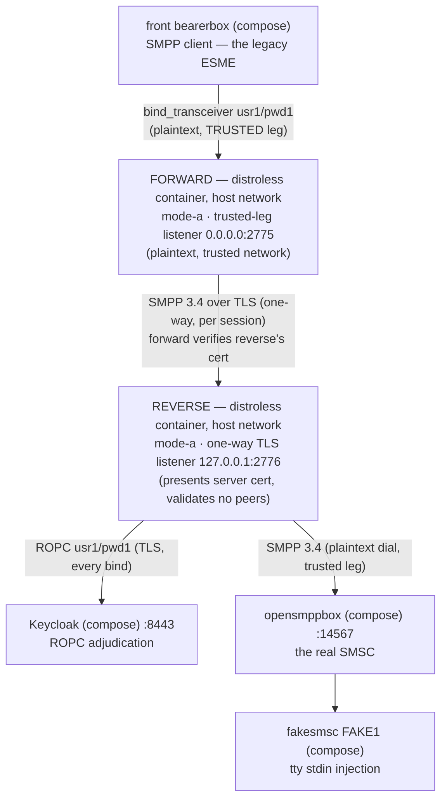

# Runbook — the dockerized forward+reverse **mode A** combo (plaintext trusted leg, one-way-TLS dial)

> **Status:** Story 6.3 T5 (2026-09-18). One of the three docker-packaged combo runbooks beside
> the sandbox's host-run `java -jar` recipe (README §5 — that recipe stays the debugger posture).
> This page is documentation only; nothing in the repository parses it. The cell's authoritative
> key reference is [`docs/configuration.md`](../../docs/configuration.md) (the AD-17 role × mode
> matrix); the image's facts live in
> [`docs/deployment-guide.md`](../../docs/deployment-guide.md) and
> [`docs/operator-jvm-flag-contract.md`](../../docs/operator-jvm-flag-contract.md).
> Русский перевод: [`forward-reverse-mode-a.ru.md`](forward-reverse-mode-a.ru.md).
> Every expected observation in this runbook was executed live on 2026-09-18's rig.

## 1. The use case — what operator problem this combo solves

Your ESMEs live on a **trusted network**, but the proxy tier that adjudicates and reaches the
SMSC sits across an **untrusted stretch** — and running Mode B (all plaintext) is not
acceptable there, while running per-forward client certificates (Mode C) is more PKI than you
want to operate. Mode A splits the difference with TWO proxy instances:

- a **forward.mode-a** on the trusted network: a PLAINTEXT listener your legacy clients dial
  (unchanged clients, exactly Mode B's client story), which dials the reverse over **one-way
  TLS** per SMPP session — the passwords never cross the untrusted stretch in the clear;
- a **reverse.mode-a** at the far end: presents its server certificate, validates no peers,
  still ROPC-adjudicates every bind (the sole enforcement point before the SMSC, AD-12), and
  dials the SMSC on its trusted leg.

What you accept (the registered risk the reverse's banner names): one-way TLS means the reverse
**cannot authenticate WHICH forward connects** — any peer that reaches the listener can submit
binds through the ROPC screen (a submission oracle, not a harvest point). The remediation is
the banner's own line: **ACL-isolate the listener (`companion.bind.host`) or use Mode C** —
this runbook demonstrates the mitigation live by scoping the reverse's listener to `127.0.0.1`,
which in the host-network shape only the co-located forward can dial. The mode C runbook is
the no-ACL-strong-gate alternative.

What you get: the SMPP password is never plaintext on the wire between the two proxies, the
forward needs no client certificate (one server cert + one trust store on the dial side), and
each instance keeps its own JSON-lines + `/metrics` surface — the couple is observable on BOTH.

## 2. The chain



The forward holds NO OIDC material (the trusted-side relay; the reverse adjudicates — AD-12
amended) and its routing table IS the dial map: `usr1 → localhost:2776`.

### The port plan (two host-network listeners — the plan that avoids the collisions)

| Port | Bound by | Notes |
|------|----------|-------|
| 2775 | the FORWARD container (`0.0.0.0`) | The front conf (`host.docker.internal:2775`) stays BYTE-IDENTICAL to the lone-reverse rig — the forward simply takes the port the reverse holds in the §5 cell. Documented, not discovered |
| 2776 | the REVERSE container (`127.0.0.1`) | **The composed cells' reverse moves off 2775.** Loopback-scoped on purpose: the Mode A banner's ACL-isolate mitigation, live — with `network_mode: host` the only dialer that can reach `127.0.0.1:2776` is the co-located forward container (the Kannel side hairpins to the gateway address, not loopback, and cannot touch it) |
| 9090 | the FORWARD container (`127.0.0.1`, `/metrics`) | Default port — scrape from the host |
| 9091 | the REVERSE container (`127.0.0.1`, `/metrics`) | **Must move:** two proxy processes share the host loopback, and both would otherwise bind `127.0.0.1:9090` — the second boot refuses. `--companion.metrics.port=9091` is load-bearing |

The TLS material (both committed under `sandbox/certs/`, byte-identical copies of the test-tier
fixtures in `proxy/src/test/resources/keycloak/certs/`; the CA behind them is `CN=smpp-test-ca`,
password `smpp-test`): `smpp-reverse-server.pem`/`-key.pem` — the reverse's server certificate,
SANs `DNS:localhost, IP:127.0.0.1` (the forward dials `localhost` with hostname verification
ON — AD-20, the committed PKI re-pointed, never weakened); `smpp-truststore.p12` — the
forward's dial-side anchor for that same CA. The files must be world-readable (`0644`) so the
image's UID 65532 can read the mounts.

## 3. Bring-up (zero → `bind_accept coupled`)

Preconditions are the shared ones (README §4 rig healthy, §5.1 secret bootstrapped,
`chmod 0444 sandbox/secrets/oidc-client-secret`, image + jar built — the mode B runbook's §3
lists the exact commands). From the **repository root**, reverse first (its listener must exist
before the forward's first dial; the front's retry makes the order forgiving, but keep it):

```bash
docker run -d --name sandbox-reverse-a --network host \
      -v "$(pwd)/proxy/build/libs/proxy.jar:/opt/proxy.jar:ro" \
      -v "$(pwd)/sandbox/secrets/oidc-client-secret:/run/secrets/oidc-client-secret:ro" \
      -v "$(pwd)/sandbox/keycloak/certs/truststore.p12:/run/secrets/idp-truststore.p12:ro" \
      -v "$(pwd)/sandbox/certs/smpp-reverse-server.pem:/run/secrets/smpp-reverse-server.pem:ro" \
      -v "$(pwd)/sandbox/certs/smpp-reverse-server-key.pem:/run/secrets/smpp-reverse-server-key.pem:ro" \
      smpp-proxy:local \
      --companion.bind.host=127.0.0.1 \
      --companion.bind.port=2776 \
      --companion.metrics.port=9091 \
      --companion.reverse.mode-a.smsc.host=127.0.0.1 \
      --companion.reverse.mode-a.smsc.port=14567 \
      --companion.reverse.mode-a.server-cert.cert-path=/run/secrets/smpp-reverse-server.pem \
      --companion.reverse.mode-a.server-cert.key-path=/run/secrets/smpp-reverse-server-key.pem \
      --companion.reverse.mode-a.oidc.provider-url=https://localhost:8443/realms/smpp-companions \
      --companion.reverse.mode-a.oidc.client-id=smpp-client-confidential \
      --companion.reverse.mode-a.oidc.client-secret-path=/run/secrets/oidc-client-secret \
      --companion.reverse.mode-a.oidc.trust-store.path=/run/secrets/idp-truststore.p12 \
      --companion.reverse.mode-a.oidc.trust-store.password=smpp-test \
      --companion.reverse.mode-a.oidc.timeout=4s \
      --companion.reverse.mode-a.oidc.max-in-flight=64

docker run -d --name sandbox-forward-a --network host \
      -v "$(pwd)/proxy/build/libs/proxy.jar:/opt/proxy.jar:ro" \
      -v "$(pwd)/sandbox/certs/smpp-truststore.p12:/run/secrets/smpp-truststore.p12:ro" \
      smpp-proxy:local \
      --companion.bind.host=0.0.0.0 \
      --companion.bind.port=2775 \
      --companion.forward.mode-a.trust-store.path=/run/secrets/smpp-truststore.p12 \
      --companion.forward.mode-a.trust-store.password=smpp-test \
      '--companion.forward.mode-a.routing[0].system-id=usr1' \
      '--companion.forward.mode-a.routing[0].host=localhost' \
      '--companion.forward.mode-a.routing[0].port=2776'
```

Note what the cells structurally refuse (the AD-17 matrix): the forward carries NO `oidc` node
and NO `smsc` node (the routing entry IS the dial target); the reverse.mode-a carries NO
`trust-store` on its branch (one-way TLS never validates peers — a stray key refuses). The
quoting on the `routing[0].*` args matters for your shell, not for Spring.

## 4. How to check — the expected observation per step (all live-observed 2026-09-18)

| Step | Expected observation |
|------|----------------------|
| `docker logs sandbox-reverse-a` — boot | ONE WARN JSON line, the MODE A banner verbatim (`MODE A (one-way TLS) is ACTIVE on a REVERSE instance … ACL-isolate the listener (companion.bind.host) or use Mode C mTLS` — `CompanionModeAWarning`), then `startup_summary` with `"role":"reverse"`, `"mode":"a"`, `"smpp_bind_host":"127.0.0.1"`, `"smpp_bind_port":2776`, `"metrics_port":9091` |
| `docker logs sandbox-forward-a` — boot | NO banner (mode A's accepted risk is the reverse's), then `startup_summary` with `"role":"forward"`, `"mode":"a"`, `"smpp_bind_port":2775`, `"metrics_port":9090`, `"routing_system_ids":["usr1"]` |
| The couple — within ~10 s of the forward's start | `bind_accept` `"system_id":"usr1"`, `"outcome":"coupled"` on BOTH stdouts — the REVERSE's line lands first (observed 3 ms apart: the chain couples SMSC-side-out), the forward's completes the ESME leg |
| The metrics, one port per instance | `curl -s http://127.0.0.1:9090/metrics` (forward): `relay_binds_accepted_total{system_id="usr1"} 1.0` — the LABELED routing-table series only a forward cell has; `curl -s http://127.0.0.1:9091/metrics` (reverse): `relay_binds_unknown_total 1.0` — the honest reverse-cell counter (AD-19) |
| `curl "http://127.0.0.1:13000/status.txt?password=test"` | `smsc1 … (online …)` — the front conf byte-identical, now coupled THROUGH TWO proxies |
| `docker compose -f sandbox/compose.yml logs smsc-opensmpp-box` | `bind_transceiver` → `bind_transceiver_resp`, `command_status: 0` — the ROK that crossed both hops |
| A send (README §6.1's journey, unchanged) | HTTP 202; fakesmsc prints the text byte-intact (`modeA-combo` in the live run); BOTH instances' `relay_pdus_total{direction}` move per §6.1's accounting — +1 `INGRESS` (the `submit_sm`) and +1 `EGRESS` (its `submit_sm_resp`), then +1/+1 more when the DLR returns (the `deliver_sm` arriving on the EGRESS leg, its resp crossing INGRESS): 2/2 per leg for the whole journey, identically on each instance. Ticks beyond that 2/2 are keepalive — `enquire_link` adds +1/+1 per ~30 s interval on a coupled session (README §6.3; the live run's 4/4 scrape was the journey's 2/2 plus the keepalive ticks that had landed in the meantime). The front counts `sent: sms 1 / rcvd: dlr 2` |

## 5. Where the logs live

| Surface | How |
|---------|-----|
| The proxies' JSON stdout | `docker logs sandbox-forward-a` / `docker logs sandbox-reverse-a` — the deny verdicts live ONLY on the reverse (the forward carries no adjudication); `docker compose logs` does not cover these two (they are plain `docker run` containers, not compose services) |
| The proxies' `/metrics` | forward `curl -s http://127.0.0.1:9090/metrics`, reverse `curl -s http://127.0.0.1:9091/metrics` (host loopback, one port per instance — the port plan above) |
| Keycloak | `docker compose -f sandbox/compose.yml logs keycloak` — the reverse is its only consumer |
| Kannel (both sides) | `docker compose -f sandbox/compose.yml logs front-bearer-box` / `smsc-opensmpp-box` / … — the wire tap AROUND both proxies (README §7) |

## 6. When it fails loudly (live-observed arms + the §5.4 derivations)

| Broken input | What you observe |
|--------------|------------------|
| The reverse container is down (live run: `docker stop sandbox-reverse-a` with the pair live) | The forward logs NOTHING per retry (no verdict — it has no adjudication); its `relay_connections_closed_total{direction="INGRESS",reason="EGRESS_CONNECT_FAILED"}` climbs +1 per front retry; the front wire shows the collapsed `SMSC rejected login to transmit, code 0x0000000d (Bind Failed)` every 10 s. `docker start sandbox-reverse-a` → the chain re-couples within one retry (observed) |
| Wrong reverse port in `routing[0].port` / cert mismatch | Same surface as the row above at boot of the first bind — the TLS dial is the egress; cross-check the port plan and that `routing[0].host` (`localhost`) matches the server cert's SAN |
| Stale Keycloak secret / Keycloak down | README §5.4's signatures on the REVERSE's stdout only (`bind_reject` `DenyInvalid` / `DenyIndeterminate`), the forward stays silent, the front sees the same collapsed 0x0d |
| A mounted key file unreadable by UID 65532 (a `0600` copy) | The boot refuses, exit 1, no `startup_summary`, the refusal naming the path (SEC-060) — `sandbox/certs/` ships `0644`; keep it that way |
| Both metrics on 9090 (the port-plan miss) | The SECOND container's boot refuses with the bind-in-use refusal naming `metrics.port` — loud, before any listener |
| An off-table `system_id` at the front — §6.4 D1's `usr2`/`pwd2` run against a composed combo (arm code-pinned: the forward's routing-miss deny; not re-run live on this rig) | The FORWARD denies the bind itself, before any dial and any adjudication: the AD-33 generic 0x0d on the wire, ONE log-only WARN on the forward's stdout — `routing miss: system_id not in the routing table — AD-33 deny (AD-29/AD-11): usr2` — and NOTHING anywhere else (the reverse's `relay_binds_*` unmoved, zero `bind_transceiver` at opensmppbox). `usr2` is simply not in the forward's routing table (`usr1` is its one entry), so the AD-32 case-4 verbatim non-ROK forward of §6.4 D1 is unreachable in the composed shape — D1 belongs to the single-proxy postures (§5's host launch; the mode B runbook). D2 (a wrong password for the ROUTED `usr1`) does cross the forward and deny at the reverse — §6.4's D2 shape unchanged |

## 7. Teardown (and the jar-swap debug story)

Stop the FORWARD first — it holds the live pair toward both the ESME and the reverse:

```bash
docker stop --timeout 30 sandbox-forward-a   # exit 143; its stdout carries the ordered stream
docker inspect --format '{{.State.ExitCode}}' sandbox-forward-a   # 143
docker stop --timeout 30 sandbox-reverse-a   # exit 143
docker inspect --format '{{.State.ExitCode}}' sandbox-reverse-a   # 143
docker rm sandbox-forward-a sandbox-reverse-a
```

Exit codes are deterministic (143 both — java is PID 1 via the exec-form ENTRYPOINT). The drain
WARN is not: the forward, stopped with the live pair, always shows it (the OBS-020 line at the
PT10S deadline); the reverse's pair dies with the forward's teardown, and whether its own
registry is already empty at its stop depends on how that teardown propagated — observed BOTH
ways across this rig's runs (empty registry → clean 143, no WARN; a pair still draining → the
WARN then 143). Either is a correct walk; read the WARN as "1 pair was still live at the
deadline", never as a fault.

The jar-swap story is the mode B runbook's §5, twice: rebuild `./gradlew :proxy:bootJar`, then
`docker restart` each container (running containers keep the old inode; the restart re-resolves
the path — verified live on this host). The compose rig itself tears down per README §9.
