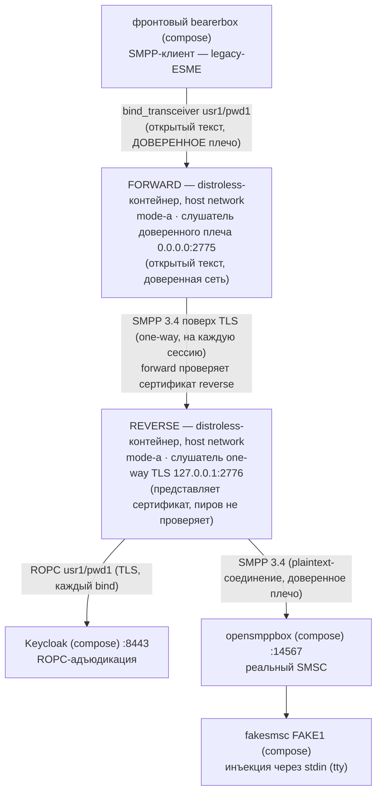

# Руководство — docker-вариант forward+reverse **mode A** (доверенное плечо открытым текстом, соединение one-way TLS)

> **Статус:** оригинал написан в рамках Story 6.3 T5 (2026-09-18); русский перевод — 2026-09-18,
> нормативен [английский оригинал](forward-reverse-mode-a.md) — при расхождении истина в
> оригинале. Одно из трёх руководств по docker-упакованным вариантам рядом с рецептом запуска
> прокси на хосте (README §5 — тот рецепт остаётся позой отладки). Страница — только
> документация. Авторитетный справочник ключей —
> [`docs/ru/configuration.md`](../../docs/ru/configuration.md) (матрица AD-17); факты образа —
> [английский `docs/deployment-guide.md`](../../docs/deployment-guide.md) и
> [`docs/ru/operator-jvm-flag-contract.md`](../../docs/ru/operator-jvm-flag-contract.md).
> Каждое ожидаемое наблюдение исполнено вживую на стенде 2026-09-18.

## 1. Сценарий использования — какую задачу оператора решает этот вариант

Ваши ESME находятся в **доверенной сети**, но уровень прокси, выполняющий адъюдикацию и достигающий
SMSC, стоит через **недоверенный участок** — Mode B (всё открытым текстом) там неприемлем, а
клиентские сертификаты на каждый forward (Mode C) — больше PKI, чем вы готовы обслуживать.
Mode A делит разницу ДВУМЯ инстансами прокси:

- **forward.mode-a** в доверенной сети: слушатель НА ОТКРЫТОМ ТЕКСТЕ, куда звонят ваши
  legacy-клиенты (клиенты не меняются — ровно клиентская история Mode B), и отдельное
  соединение к reverse на каждую SMPP-сессию поверх **one-way TLS** — пароли больше не
  пересекают недоверенный участок в ясном виде;
- **reverse.mode-a** на дальнем конце: представляет свой серверный сертификат, не проверяет
  пиров, по-прежнему адъюдирует каждый bind по ROPC (единственная точка контроля перед SMSC,
  AD-12) и соединяется с SMSC по доверенному плечу.

Что вы принимаете (зарегистрированный риск из баннера reverse): one-way TLS означает, что
reverse **не может аутентифицировать, КАКОЙ forward подключается** — любой пир, дотянувшийся до
слушателя, может прогонять бинды через экран ROPC (оракул подачи, не точка сбора). Средство —
строка самого баннера: **ACL-изолировать слушатель (`companion.bind.host`) или использовать
Mode C** — это руководство демонстрирует смягчение вживую, ограничив слушатель reverse петлёй
`127.0.0.1`, до которой в форме host-network дозванивается только соседний forward. Руководство
mode C — альтернатива без ACL с сильным затвором.

Что вы получаете: пароль SMPP никогда не идёт открытым текстом по проводу между двумя прокси,
forward не нуждается в клиентском сертификате (один серверный сертификат + один trust store на
стороне соединения), и у каждого инстанса своя поверхность JSON-lines + `/metrics` —
сопряжение наблюдаемо на ОБОИХ.

## 2. Цепочка



Forward не содержит НИКАКИХ OIDC-данных (релей доверенной стороны; адъюдирует reverse —
поправка AD-12), а его таблица маршрутизации и есть карта соединений: `usr1 → localhost:2776`.

### План портов (два слушателя в host network — план, снимающий коллизии)

| Порт | Кто слушает | Примечания |
|------|-------------|------------|
| 2775 | контейнер FORWARD (`0.0.0.0`) | Фронтовый конфиг (`host.docker.internal:2775`) остаётся БАЙТ-В-БАЙТ как в стенде с одиночным reverse — forward просто занимает порт, который reverse держит в варианте §5. Задокументировано, а не обнаружено на месте |
| 2776 | контейнер REVERSE (`127.0.0.1`) | **Reverse составных вариантов уходит с 2775.** Привязан к loopback намеренно: смягчение ACL-isolate из баннера Mode A, вживую — при `network_mode: host` единственный, кто дозванивается до `127.0.0.1:2776`, — соседний контейнер forward (сторона Kannel «шпилькой» попадает на адрес шлюза, не на loopback, и туда не достучится) |
| 9090 | контейнер FORWARD (`127.0.0.1`, `/metrics`) | Порт по умолчанию — читается с хоста |
| 9091 | контейнер REVERSE (`127.0.0.1`, `/metrics`) | **Обязан сдвинуться:** два процесса прокси делят loopback хоста, иначе оба займут `127.0.0.1:9090` — вторая загрузка откажет. `--companion.metrics.port=9091` критичен |

TLS-материал (всё закоммичено в `sandbox/certs/`, байт-в-байт копии тестовых фикстур из
`proxy/src/test/resources/keycloak/certs/`; CA за ними — `CN=smpp-test-ca`, пароль `smpp-test`):
`smpp-reverse-server.pem`/`-key.pem` — серверный сертификат reverse с SAN `DNS:localhost,
IP:127.0.0.1` (forward соединяется к `localhost` с ВКЛЮЧЁННОЙ проверкой имени хоста — AD-20,
закоммиченный PKI перепрошит, а не ослаблен); `smpp-truststore.p12` — якорь стороны соединения
forward для того же CA. Файлы должны быть читаемы всеми (`0644`), чтобы UID 65532 образа читал
монтирования.

## 3. Запуск (с нуля → `bind_accept coupled`)

Предусловия общие (стенд healthy по README §4, бутстрап секрета по §5.1,
`chmod 0444 sandbox/secrets/oidc-client-secret`, образ и jar собраны — точные команды в §3
руководства mode B). Из **корня репозитория**, сначала reverse (его слушатель должен
существовать до первого соединения forward; retry фронта прощает порядок, но держите его):

```bash
docker run -d --name sandbox-reverse-a --network host \
      -v "$(pwd)/proxy/build/libs/proxy.jar:/opt/proxy.jar:ro" \
      -v "$(pwd)/sandbox/secrets/oidc-client-secret:/run/secrets/oidc-client-secret:ro" \
      -v "$(pwd)/sandbox/keycloak/certs/truststore.p12:/run/secrets/idp-truststore.p12:ro" \
      -v "$(pwd)/sandbox/certs/smpp-reverse-server.pem:/run/secrets/smpp-reverse-server.pem:ro" \
      -v "$(pwd)/sandbox/certs/smpp-reverse-server-key.pem:/run/secrets/smpp-reverse-server-key.pem:ro" \
      smpp-proxy:local \
      --companion.bind.host=127.0.0.1 \
      --companion.bind.port=2776 \
      --companion.metrics.port=9091 \
      --companion.reverse.mode-a.smsc.host=127.0.0.1 \
      --companion.reverse.mode-a.smsc.port=14567 \
      --companion.reverse.mode-a.server-cert.cert-path=/run/secrets/smpp-reverse-server.pem \
      --companion.reverse.mode-a.server-cert.key-path=/run/secrets/smpp-reverse-server-key.pem \
      --companion.reverse.mode-a.oidc.provider-url=https://localhost:8443/realms/smpp-companions \
      --companion.reverse.mode-a.oidc.client-id=smpp-client-confidential \
      --companion.reverse.mode-a.oidc.client-secret-path=/run/secrets/oidc-client-secret \
      --companion.reverse.mode-a.oidc.trust-store.path=/run/secrets/idp-truststore.p12 \
      --companion.reverse.mode-a.oidc.trust-store.password=smpp-test \
      --companion.reverse.mode-a.oidc.timeout=4s \
      --companion.reverse.mode-a.oidc.max-in-flight=64

docker run -d --name sandbox-forward-a --network host \
      -v "$(pwd)/proxy/build/libs/proxy.jar:/opt/proxy.jar:ro" \
      -v "$(pwd)/sandbox/certs/smpp-truststore.p12:/run/secrets/smpp-truststore.p12:ro" \
      smpp-proxy:local \
      --companion.bind.host=0.0.0.0 \
      --companion.bind.port=2775 \
      --companion.forward.mode-a.trust-store.path=/run/secrets/smpp-truststore.p12 \
      --companion.forward.mode-a.trust-store.password=smpp-test \
      '--companion.forward.mode-a.routing[0].system-id=usr1' \
      '--companion.forward.mode-a.routing[0].host=localhost' \
      '--companion.forward.mode-a.routing[0].port=2776'
```

Заметьте, что варианты structurally отвергают (матрица AD-17): forward не содержит ни узла
`oidc`, ни узла `smsc` (запись маршрутизации и есть цель соединения); у reverse.mode-a на ветке
НЕТ `trust-store` (one-way TLS никогда не проверяет пиров — лишний ключ отказывает). Кавычки на
аргументах `routing[0].*` нужны вашей оболочке, а не Spring.

## 4. Как проверять — ожидаемое наблюдение на каждом шаге (всё исполнено вживую 2026-09-18)

| Шаг | Ожидаемое наблюдение |
|-----|----------------------|
| `docker logs sandbox-reverse-a` — загрузка | ОДНА WARN JSON-строка, баннер MODE A дословно (`MODE A (one-way TLS) is ACTIVE on a REVERSE instance … ACL-isolate the listener (companion.bind.host) or use Mode C mTLS` — `CompanionModeAWarning`), затем `startup_summary` с `"role":"reverse"`, `"mode":"a"`, `"smpp_bind_host":"127.0.0.1"`, `"smpp_bind_port":2776`, `"metrics_port":9091` |
| `docker logs sandbox-forward-a` — загрузка | БЕЗ баннера (принятый риск mode A — на стороне reverse), затем `startup_summary` с `"role":"forward"`, `"mode":"a"`, `"smpp_bind_port":2775`, `"metrics_port":9090`, `"routing_system_ids":["usr1"]` |
| Сопряжение — в пределах ~10 с от старта forward | `bind_accept` `"system_id":"usr1"`, `"outcome":"coupled"` на ОБОИХ stdout — строка REVERSE приходит первой (вживую разрыв 3 мс: цепочка сопрягается «от SMSC»), строка forward замыкает плечо ESME |
| Метрики — по порту на инстанс | `curl -s http://127.0.0.1:9090/metrics` (forward): `relay_binds_accepted_total{system_id="usr1"} 1.0` — ПРЕДСТАВЛЕННАЯ серия таблицы маршрутизации, которая есть только у forward; `curl -s http://127.0.0.1:9091/metrics` (reverse): `relay_binds_unknown_total 1.0` — честный счётчик reverse (AD-19) |
| `curl "http://127.0.0.1:13000/status.txt?password=test"` | `smsc1 … (online …)` — фронтовый конфиг байт-в-байт прежний, сопряжение ЧЕРЕЗ ДВА прокси |
| `docker compose -f sandbox/compose.yml logs smsc-opensmpp-box` | `bind_transceiver` → `bind_transceiver_resp`, `command_status: 0` — ROK, пересёкший оба плеча |
| Отправка (сценарий README §6.1, без изменений) | HTTP 202; fakesmsc печатает текст байт-в-байт (в живом прогоне — `modeA-combo`); `relay_pdus_total{direction}` ОБОИХ инстансов движется по бухгалтерии §6.1 — +1 `INGRESS` (`submit_sm`) и +1 `EGRESS` (его `submit_sm_resp`), затем ещё +1/+1 с возвратом DLR (`deliver_sm` приходит на плечо EGRESS, его resp пересекает INGRESS): итого 2/2 на плечо за весь сценарий, одинаково на каждом инстансе. Тики сверх этих 2/2 — keepalive: `enquire_link` добавляет +1/+1 за ~30 с интервала на сопряжённой сессии (README §6.3; скрейп 4/4 живого прогона — это 2/2 сценария плюс накопившиеся к тому моменту keepalive-тики). Фронт считает `sent: sms 1 / rcvd: dlr 2` |

## 5. Где описаны журналы

| Поверхность | Как |
|-------------|-----|
| JSON-stdout прокси | `docker logs sandbox-forward-a` / `docker logs sandbox-reverse-a` — вердикты отказа живут ТОЛЬКО на reverse (forward не выполняет адъюдикацию); `docker compose logs` этих двух не покрывает (это обычные контейнеры `docker run`, а не сервисы compose) |
| `/metrics` прокси | forward `curl -s http://127.0.0.1:9090/metrics`, reverse `curl -s http://127.0.0.1:9091/metrics` (loopback хоста, по порту на инстанс — план портов выше) |
| Keycloak | `docker compose -f sandbox/compose.yml logs keycloak` — его единственный потребитель reverse |
| Kannel (обе стороны) | `docker compose -f sandbox/compose.yml logs front-bearer-box` / `smsc-opensmpp-box` / … — проводной перехват ВОКРУГ обоих прокси (README §7) |

## 6. Когда отказывает громко (живые плечи + выводы из §5.4)

| Сломанный вход | Что наблюдается |
|----------------|-----------------|
| Контейнер reverse лежит (живой прогон: `docker stop sandbox-reverse-a` при живой паре) | Forward на каждый retry молчит (вердикта нет — адъюдикации нет); его `relay_connections_closed_total{direction="INGRESS",reason="EGRESS_CONNECT_FAILED"}` растёт на +1 за retry фронта; на проводе фронта — свёрнутое `SMSC rejected login to transmit, code 0x0000000d (Bind Failed)` каждые 10 с. `docker start sandbox-reverse-a` → цепочка пересопрягается в пределах одного retry (исполнено) |
| Неверный порт reverse в `routing[0].port` / несовпадение сертификата | Та же поверхность при первом бинде — соединение TLS и есть egress; сверьте план портов и что `routing[0].host` (`localhost`) попадает в SAN серверного сертификата |
| Устаревший секрет Keycloak / лежащий Keycloak | Сигнатуры README §5.4 ТОЛЬКО на stdout reverse (`bind_reject` `DenyInvalid` / `DenyIndeterminate`), forward молчит, фронт видит тот же свёрнутый 0x0d |
| Смонтированный ключ-файл нечитаем для UID 65532 (копия `0600`) | Загрузка отказывает, exit 1, без `startup_summary`, отказ называет путь (SEC-060) — `sandbox/certs/` поставляется как `0644`; так и держите |
| Обе метрики на 9090 (промах плана портов) | Загрузка ВТОРОГО контейнера отказывает с отказом bind-in-use, называющим `metrics.port` — громко, до всякого слушателя |
| `system_id` вне таблицы на фронте — `usr2`/`pwd2` из §6.4 D1 против составного варианта (плечо закреплено кодом: routing-miss-отказ forward; на этом стенде вживую не прогонялось) | FORWARD сам отказывает бину до всякого соединения и адъюдикации: генерический 0x0d AD-33 на проводе, ОДИН log-only WARN на stdout forward — `routing miss: system_id not in the routing table — AD-33 deny (AD-29/AD-11): usr2` — и БОЛЬШЕ НИЧЕГО нигде (`relay_binds_*` reverse не двигаются, ноль `bind_transceiver` в opensmppbox). `usr2` просто отсутствует в таблице маршрутизации forward (её единственная запись — `usr1`), поэтому дословный non-ROK-проброс AD-32 случай 4 из §6.4 D1 в составной форме недостижим — D1 принадлежит одно-проксивым позам (запуск на хосте из §5; руководство mode B). D2 (неверный пароль у маршрутного `usr1`) пересекает forward и отказывает на reverse — форма D2 из §6.4 без изменений |

## 7. Останов (и история отладки с подменой jar)

Сначала FORWARD — именно он держит живую пару к ESME и к reverse:

```bash
docker stop --timeout 30 sandbox-forward-a   # exit 143; stdout содержит упорядоченный поток
docker inspect --format '{{.State.ExitCode}}' sandbox-forward-a   # 143
docker stop --timeout 30 sandbox-reverse-a   # exit 143
docker inspect --format '{{.State.ExitCode}}' sandbox-reverse-a   # 143
docker rm sandbox-forward-a sandbox-reverse-a
```

Коды выхода детерминированы (143 у обоих — java является PID 1 благодаря exec-form ENTRYPOINT).
WARN дрейна — нет: forward, остановленный с живой парой, показывает его всегда (строка OBS-020
на дедлайне PT10S); пара reverse умирает вместе с разрушением forward, и был ли его собственный
реестр уже пуст к моменту остановки, зависит от того, как это разрушение распространилось — на
стенде наблюдали ОБА исхода (пустой реестр → чистый 143 без WARN; пара ещё в дрейне → WARN и
затем 143). Оба — корректные проходы; читайте WARN как «1 пара была ещё жива на дедлайне»,
никогда как сбой. История с подменой jar — §5 руководства mode B, дважды: пересобрать
`./gradlew :proxy:bootJar`, затем `docker restart` каждого контейнера (работающие контейнеры
держат старый inode; перезапуск заново разрешает путь — проверено вживую на этой машине). Сам
compose-стенд останавливается по README §9.
