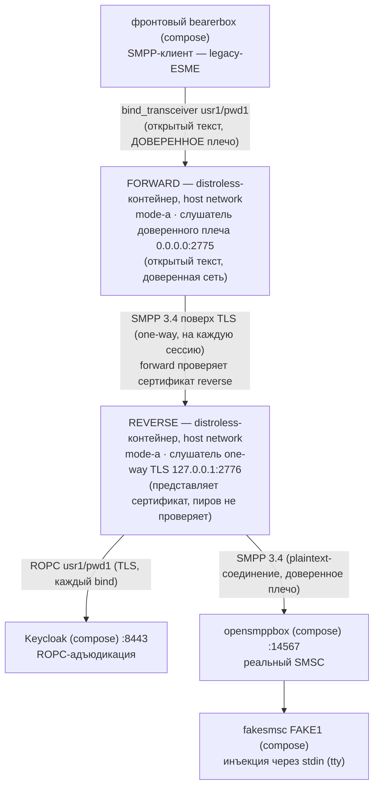

# Руководство — вариант использования `forward.mode-a` + `reverse.mode-a` (доверенное плечо открытым текстом, соединение one-way TLS)

> **Статус:** оригинал написан в рамках Story 6.3 T5 (2026-09-18), переструктурирован в T6
> (2026-09-19 — операторо-ориентированная структура, упрощённая проза); русский перевод —
> 2026-09-19, нормативен [английский оригинал](forward-reverse-mode-a.md) — при расхождении
> истина в оригинале, автоматической сверки нет, согласованность «перевод ↔ оригинал» —
> обязанность ревью. Это одно из трёх docker-руководств, по одному на вариант использования
> (роль + режим): [mode B](reverse-mode-b.ru.md) · [mode C](forward-reverse-mode-c.ru.md).
> Рецепт запуска прокси на хосте (`java -jar`, поза отладки) — [README
> песочницы](../README.ru.md) §5. Каждое ожидаемое наблюдение этой страницы исполнено вживую
> на стенде 2026-09-18. Страница — только документация, ничего в репозитории её не разбирает.

## Назначение

Ваши ESME живут в **доверенной сети**, а уровень прокси с адъюдикацией и SMSC — за
**недоверенным участком**. Mode B (всё открытым текстом) там неприемлем; Mode C (клиентские
сертификаты на каждый forward) — больше PKI, чем вы готовы обслуживать. Mode A делит разницу
**двумя** инстансами:

- **forward** в доверенной сети — слушатель на открытом тексте, к которому подключаются ваши
  legacy-клиенты (клиенты не меняются), и отдельное соединение к reverse поверх **one-way
  TLS** на каждую SMPP-сессию — пароли не пересекают недоверенный участок в ясном виде;
- **reverse** на дальнем конце — представляет свой серверный сертификат, адъюдирует каждый
  bind по ROPC в вашем IdP (единственная точка контроля перед SMSC), соединяется с SMSC по
  доверенному плечу.

Forward не содержит OIDC-данных — точка контроля это reverse. Таблица маршрутизации forward
говорит, куда соединяться: `usr1 → localhost:2776`.



- **Что вы принимаете** (риск, который называет баннер reverse): one-way TLS не может
  аутентифицировать, *какой* forward подключается, — любой пир, дотянувшийся до слушателя
  reverse, может прогонять бинды через экран ROPC. Смягчение — ACL-изолировать слушатель
  (`companion.bind.host`) или перейти на Mode C. Это руководство показывает смягчение вживую:
  слушатель reverse ограничен петлёй `127.0.0.1`, до которой в форме host-network дотягивается
  только соседний forward.
- **Что вы получаете:** пароль SMPP не идёт открытым текстом между прокси; на forward не нужен
  клиентский сертификат (один серверный сертификат + один trust store на стороне соединения);
  сопряжение наблюдаемо на обоих инстансах.

## Быстрый старт

Предусловия: стенд healthy, OIDC-секрет клиента забутстраплен, образ и jar собраны — шаги 1–2
«Быстрого старта» [руководства mode B](reverse-mode-b.ru.md) покрывают всё (включая
`chmod 0444` на секрете).

Из **корня репозитория** запускайте reverse первым — его слушатель должен существовать до
первого соединения forward (retry фронта прощает порядок, но держите его).

**План портов** — именно в варианте из двух инстансов порты вынуждены двигаться:

| Порт | Кто слушает | Почему |
|------|-------------|--------|
| 2775 | forward (`0.0.0.0`) | Порт, на который соединяется фронтовый конфиг, — как в стенде с одиночным reverse; forward занимает его, фронтовый конфиг не меняется. |
| 2776 | reverse (`127.0.0.1`) | Составной reverse уходит с 2775. Привязан к loopback намеренно — смягчение ACL вживую: дотянуться может только соседний forward. |
| 9090 | `/metrics` forward | По умолчанию. |
| 9091 | `/metrics` reverse | Обязан сдвинуться — два процесса прокси делят loopback хоста; вторая привязка 9090 откажет. `--companion.metrics.port=9091` критичен. |

```bash
docker run -d --name sandbox-reverse-a --network host \
      -v "$(pwd)/proxy/build/libs/proxy.jar:/opt/proxy.jar:ro" \
      -v "$(pwd)/sandbox/secrets/oidc-client-secret:/run/secrets/oidc-client-secret:ro" \
      -v "$(pwd)/sandbox/keycloak/certs/truststore.p12:/run/secrets/idp-truststore.p12:ro" \
      -v "$(pwd)/sandbox/certs/smpp-reverse-server.pem:/run/secrets/smpp-reverse-server.pem:ro" \
      -v "$(pwd)/sandbox/certs/smpp-reverse-server-key.pem:/run/secrets/smpp-reverse-server-key.pem:ro" \
      smpp-proxy:local \
      --companion.bind.host=127.0.0.1 \
      --companion.bind.port=2776 \
      --companion.metrics.port=9091 \
      --companion.reverse.mode-a.smsc.host=127.0.0.1 \
      --companion.reverse.mode-a.smsc.port=14567 \
      --companion.reverse.mode-a.server-cert.cert-path=/run/secrets/smpp-reverse-server.pem \
      --companion.reverse.mode-a.server-cert.key-path=/run/secrets/smpp-reverse-server-key.pem \
      --companion.reverse.mode-a.oidc.provider-url=https://localhost:8443/realms/smpp-companions \
      --companion.reverse.mode-a.oidc.client-id=smpp-client-confidential \
      --companion.reverse.mode-a.oidc.client-secret-path=/run/secrets/oidc-client-secret \
      --companion.reverse.mode-a.oidc.trust-store.path=/run/secrets/idp-truststore.p12 \
      --companion.reverse.mode-a.oidc.trust-store.password=smpp-test \
      --companion.reverse.mode-a.oidc.timeout=4s \
      --companion.reverse.mode-a.oidc.max-in-flight=64

docker run -d --name sandbox-forward-a --network host \
      -v "$(pwd)/proxy/build/libs/proxy.jar:/opt/proxy.jar:ro" \
      -v "$(pwd)/sandbox/certs/smpp-truststore.p12:/run/secrets/smpp-truststore.p12:ro" \
      smpp-proxy:local \
      --companion.bind.host=0.0.0.0 \
      --companion.bind.port=2775 \
      --companion.forward.mode-a.trust-store.path=/run/secrets/smpp-truststore.p12 \
      --companion.forward.mode-a.trust-store.password=smpp-test \
      '--companion.forward.mode-a.routing[0].system-id=usr1' \
      '--companion.forward.mode-a.routing[0].host=localhost' \
      '--companion.forward.mode-a.routing[0].port=2776'
```

Заметьте, что варианты structurally отвергают (полезно, если правите аргументы вручную):
forward не содержит ни узла `oidc`, ни узла `smsc` — его запись маршрутизации и есть цель
соединения; у reverse на его ветке нет `trust-store` — one-way TLS никогда не проверяет пиров,
лишний ключ отказывает. Кавычки на аргументах `routing[0].*` нужны вашей оболочке, а не Spring.

✅ **Всё поднято, когда** `bind_accept` с `"system_id":"usr1"`, `"outcome":"coupled"` появится
на **обоих** stdout — в пределах ~10 с от старта forward (строка reverse приходит первой:
цепочка сопрягается «от SMSC»).

## Что вы должны увидеть

| Проверка | Что вы должны увидеть |
|----------|----------------------|
| `docker logs sandbox-reverse-a` (загрузка) | Одна WARN-строка — баннер Mode A: `MODE A (one-way TLS) is ACTIVE on a REVERSE instance … ACL-isolate the listener (companion.bind.host) or use Mode C mTLS` — затем `startup_summary` с `"role":"reverse"`, `"mode":"a"`, `"smpp_bind_host":"127.0.0.1"`, `"smpp_bind_port":2776`, `"metrics_port":9091`. |
| `docker logs sandbox-forward-a` (загрузка) | Без баннера (принятый риск Mode A — на стороне reverse) — `startup_summary` с `"role":"forward"`, `"mode":"a"`, `"smpp_bind_port":2775`, `"metrics_port":9090`, `"routing_system_ids":["usr1"]`. |
| Сопряжение — в пределах ~10 с от старта forward | `bind_accept`, `"system_id":"usr1"`, `"outcome":"coupled"` на обоих stdout; строка reverse приходит первой (вживую разрыв 3 мс), строка forward замыкает плечо ESME. |
| Метрики — по порту на инстанс | Forward `curl -s http://127.0.0.1:9090/metrics`: `relay_binds_accepted_total{system_id="usr1"} 1.0` — маркированная серия, которая есть только у forward. Reverse `curl -s http://127.0.0.1:9091/metrics`: `relay_binds_unknown_total 1.0`. У Prometheus стенда (UI `http://127.0.0.1:9095`) оба порта всегда прописаны как цели job `smpp-proxy`: цель 9091 — UP только пока работает reverse, иначе DOWN (на одноинстансном стенде — навсегда; [README §5.3](../README.ru.md), пункт 7). |
| `curl "http://127.0.0.1:13000/status.txt?password=test"` | `smsc1 … (online …)` — тот же фронтовый конфиг, теперь сопряжение через два прокси. |
| `docker compose -f sandbox/compose.yml logs smsc-opensmpp-box` | `bind_transceiver` → `bind_transceiver_resp` с `command_status: 0` — ROK, пересёкший оба плеча. |
| Отправка — необязательно | HTTP 202; fakesmsc печатает текст байт-в-байт; счётчики обоих инстансов проходят 2/2 на плечо за весь сценарий (submit + resp, затем пара DLR) — сверх этого keepalive. Фронт считает `sent: sms 1 / rcvd: dlr 2`. Полный сценарий: [README §6.1](../README.ru.md). |

## Устранение проблем

| Симптом | Что это значит · что делать |
|---------|------------------------------|
| Контейнер reverse лежит (или у него неверный порт/сертификат) | Forward молчит на каждый retry (у него нет адъюдикации); его `relay_connections_closed_total{direction="INGRESS",reason="EGRESS_CONNECT_FAILED"}` растёт на +1 за retry фронта; на проводе фронта свёрнутое `SMSC rejected login to transmit, code 0x0000000d (Bind Failed)` каждые 10 с. `docker start sandbox-reverse-a` пересопрягает в пределах одного retry. Сверьте план портов и что `routing[0].host` (`localhost`) попадает в SAN серверного сертификата. |
| Устаревший секрет Keycloak / лежащий Keycloak | Сигнатуры [README §5.4](../README.ru.md) только на stdout **reverse** (`bind_reject` `DenyInvalid`/`DenyIndeterminate`); forward молчит; фронт видит тот же свёрнутый 0x0d. |
| Смонтированный ключ-файл нечитаем для UID 65532 (копия `0600`) | Загрузка отказывает, exit 1, без `startup_summary`, отказ называет путь. `sandbox/certs/` поставляется как `0644` — так и держите. |
| Обе метрики на 9090 | Загрузка второго контейнера отказывает с bind-in-use, называющим `metrics.port`, — громко, до всякого слушателя. Поэтому reverse получает 9091. |
| `system_id` вне таблицы на фронте (например, `usr2`) | **Forward** сам отказывает бину до всякого соединения и адъюдикации: генерический 0x0d на проводе, один log-only WARN на его stdout (`routing miss: system_id not in the routing table — AD-33 deny (AD-29/AD-11): usr2`) — и больше ничего нигде. Поэтому сценарий «неверные учётные данные SMSC» (README §6.4 D1) существует только в одно-проксивых вариантах использования (хостовый запуск README §5, [руководство mode B](reverse-mode-b.ru.md)); D2 — неверный пароль у маршрутного `usr1` — по-прежнему пересекает forward и отказывает на reverse. |

## Журналы

| Поверхность | Как |
|-------------|-----|
| JSON-stdout прокси | `docker logs sandbox-forward-a` / `docker logs sandbox-reverse-a`. Вердикты отказа живут только на reverse (forward не выполняет адъюдикацию). Это обычные контейнеры `docker run` — `docker compose logs` их не покрывает. |
| `/metrics` прокси | Forward `curl -s http://127.0.0.1:9090/metrics`, reverse `curl -s http://127.0.0.1:9091/metrics`. |
| Keycloak | `docker compose -f sandbox/compose.yml logs keycloak` — его единственный потребитель reverse. |
| Kannel, обе стороны | `docker compose -f sandbox/compose.yml logs front-bearer-box` / `smsc-opensmpp-box` / … — проводной перехват вокруг обоих прокси ([README §7](../README.ru.md)). |

## Останов

Сначала **forward** — именно он держит живую пару к ESME и к reverse:

```bash
docker stop --timeout 30 sandbox-forward-a   # exit 143; stdout несёт упорядоченный поток
docker inspect --format '{{.State.ExitCode}}' sandbox-forward-a   # 143
docker stop --timeout 30 sandbox-reverse-a   # exit 143
docker inspect --format '{{.State.ExitCode}}' sandbox-reverse-a   # 143
docker rm sandbox-forward-a sandbox-reverse-a
```

Коды выхода детерминированы (143 у обоих). WARN дрейна — нет: forward, остановленный с живой
парой, показывает его всегда (строка `shutdown drain deadline (PT10S) expired …`); покажет ли
reverse свой WARN, зависит от того, как распространилось разрушение forward — наблюдали оба
исхода (пустой реестр → чистый 143 без WARN; пара ещё в дрейне → WARN и затем 143). Оба —
корректные проходы: читайте WARN как «1 пара была ещё жива на дедлайне», никогда как сбой.

## Подробности и ссылки

### TLS-материал

Всё закоммичено в `sandbox/certs/` — байт-в-байт копии тестовых фикстур; CA за ними —
`CN=smpp-test-ca`, пароль хранилища `smpp-test`.

| Файл | Кто использует | Роль |
|------|----------------|------|
| `smpp-reverse-server.pem` / `-key.pem` | reverse | Его серверный сертификат — SAN `DNS:localhost, IP:127.0.0.1` (forward соединяется с `localhost` с включённой проверкой имени хоста). |
| `smpp-truststore.p12` | forward | Его якорь стороны соединения для того же CA. |

Держите файлы читаемыми всеми (`0644`) — их читает UID 65532 образа.

### Подмена jar

Та же история, что в [руководстве mode B](reverse-mode-b.ru.md) («Подмена jar»), дважды:
пересобрать `./gradlew :proxy:bootJar`, затем `docker restart` каждого контейнера.

### Ссылки

- Поднятие стенда, бутстрап секрета, сигнатуры отказов, сценарии корректности —
  [README песочницы](../README.ru.md) (§4–§9).
- Ключи варианта: [docs/ru/configuration.md](../../docs/ru/configuration.md); факты образа:
  [docs/deployment-guide.md](../../docs/deployment-guide.md) (EN),
  [docs/ru/operator-jvm-flag-contract.md](../../docs/ru/operator-jvm-flag-contract.md).
