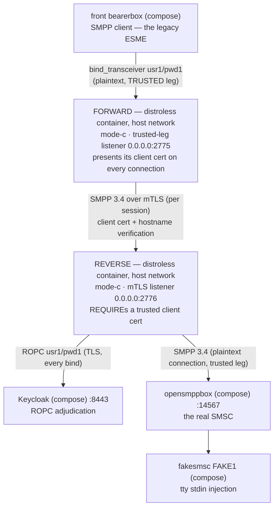

# Runbook — the `forward.mode-c` + `reverse.mode-c` use case (the mTLS connection)

> One of the three docker runbooks, one per use case (role + mode) — siblings: [the lone reverse, Mode B](reverse-mode-b.md) ·
> [forward+reverse, Mode A](forward-reverse-mode-a.md). For the host-run `java -jar` recipe (the debugger
> posture) see the [sandbox README](../README.md) §5. Every expected observation below was executed live on
> the rig, 2026-09-18. Documentation only — nothing parses this page.
> Русский перевод: [`forward-reverse-mode-c.ru.md`](forward-reverse-mode-c.ru.md).

## What it's for

The same two-hop problem as Mode A — legacy ESMEs on a trusted network, the adjudicating proxy
and the SMSC across an untrusted stretch — answered with the strongest leg the product ships:
**mutual TLS between the two proxies**. The reverse's listener *REQUIREs* a client certificate
anchored against its own trust store, so it cryptographically knows **which** forward is
connecting to it; the forward presents its own **per-instance** client certificate (one cert per
runtime instance, never a shared golden-image key) and verifies the reverse's server
certificate with hostname checking on.

No ACL isolation is needed to compensate for the leg — the handshake itself is the gate. That
is why this runbook binds the reverse's listener to `0.0.0.0` and lets the REQUIRE do the work
(Mode A scopes its listener instead — the two pages show the two ends of that trade).

This is the topology Story 6.2's E2E already proved against the jSMPP oracle; what this page
adds is the same cells against the real Kannel chain, with the compose Keycloak adjudicating
real ROPC.



- **You accept:** operating per-instance client certificates — rotation is a re-deploy.
- **You get:** no accepted-risk banner on either instance (nothing was weakened to get here);
  no submission oracle on the leg — a peer without a valid certificate never completes TLS,
  never reaches a single SMPP byte; the couple observable on both instances.

## Quick start

Preconditions: the rig healthy, the OIDC client secret bootstrapped, the image and jar built —
steps 1–2 of the [Mode B runbook](reverse-mode-b.md)'s Quick start cover all of it (including
the `chmod 0444` on the secret).

From the **repository root**, launch the reverse first. The port plan is Mode A's, with one
deliberate difference:

| Port | Bound by | Why |
|------|----------|-----|
| 2775 | the forward (`0.0.0.0`) | The port the front conf connects to — the forward takes it, the front conf doesn't change. |
| 2776 | the reverse (`0.0.0.0`) | Wildcard **on purpose** — mTLS is the gate; a stranger reaching 2776 loses at the handshake, below SMPP (verified live — the gate probe below). |
| 9090 | the forward's `/metrics` | Default. |
| 9091 | the reverse's `/metrics` | Must move — two proxy processes share the host loopback; a second 9090 bind refuses. |

```bash
docker run -d --name sandbox-reverse-c --network host \
      -v "$(pwd)/proxy/build/libs/proxy.jar:/opt/proxy.jar:ro" \
      -v "$(pwd)/sandbox/secrets/oidc-client-secret:/run/secrets/oidc-client-secret:ro" \
      -v "$(pwd)/sandbox/keycloak/certs/truststore.p12:/run/secrets/idp-truststore.p12:ro" \
      -v "$(pwd)/sandbox/certs/smpp-reverse-server.pem:/run/secrets/smpp-reverse-server.pem:ro" \
      -v "$(pwd)/sandbox/certs/smpp-reverse-server-key.pem:/run/secrets/smpp-reverse-server-key.pem:ro" \
      -v "$(pwd)/sandbox/certs/smpp-truststore.p12:/run/secrets/smpp-truststore.p12:ro" \
      smpp-proxy:local \
      --companion.bind.host=0.0.0.0 \
      --companion.bind.port=2776 \
      --companion.metrics.port=9091 \
      --companion.reverse.mode-c.smsc.host=127.0.0.1 \
      --companion.reverse.mode-c.smsc.port=14567 \
      --companion.reverse.mode-c.server-cert.cert-path=/run/secrets/smpp-reverse-server.pem \
      --companion.reverse.mode-c.server-cert.key-path=/run/secrets/smpp-reverse-server-key.pem \
      --companion.reverse.mode-c.trust-store.path=/run/secrets/smpp-truststore.p12 \
      --companion.reverse.mode-c.trust-store.password=smpp-test \
      --companion.reverse.mode-c.oidc.provider-url=https://localhost:8443/realms/smpp-companions \
      --companion.reverse.mode-c.oidc.client-id=smpp-client-confidential \
      --companion.reverse.mode-c.oidc.client-secret-path=/run/secrets/oidc-client-secret \
      --companion.reverse.mode-c.oidc.trust-store.path=/run/secrets/idp-truststore.p12 \
      --companion.reverse.mode-c.oidc.trust-store.password=smpp-test \
      --companion.reverse.mode-c.oidc.timeout=4s \
      --companion.reverse.mode-c.oidc.max-in-flight=64

docker run -d --name sandbox-forward-c --network host \
      -v "$(pwd)/proxy/build/libs/proxy.jar:/opt/proxy.jar:ro" \
      -v "$(pwd)/sandbox/certs/smpp-forward-client.pem:/run/secrets/smpp-forward-client.pem:ro" \
      -v "$(pwd)/sandbox/certs/smpp-forward-client-key.pem:/run/secrets/smpp-forward-client-key.pem:ro" \
      -v "$(pwd)/sandbox/certs/smpp-truststore.p12:/run/secrets/smpp-truststore.p12:ro" \
      smpp-proxy:local \
      --companion.bind.host=0.0.0.0 \
      --companion.bind.port=2775 \
      --companion.forward.mode-c.client-cert.cert-path=/run/secrets/smpp-forward-client.pem \
      --companion.forward.mode-c.client-cert.key-path=/run/secrets/smpp-forward-client-key.pem \
      --companion.forward.mode-c.trust-store.path=/run/secrets/smpp-truststore.p12 \
      --companion.forward.mode-c.trust-store.password=smpp-test \
      '--companion.forward.mode-c.routing[0].system-id=usr1' \
      '--companion.forward.mode-c.routing[0].host=localhost' \
      '--companion.forward.mode-c.routing[0].port=2776'
```

Note what the cells structurally refuse (useful if you hand-edit the args): the forward carries
no `oidc` and no `smsc` node; the reverse carries no `routing` and no client material of its
own — the *forward* presents the certificate.

✅ **You're up when** `bind_accept` with `"system_id":"usr1"`, `"outcome":"coupled"` appears on
**both** stdouts — within ~10 s of the forward's start (the reverse's line lands first:
observed 3 ms apart).

## What you should see

| Check | What you should see |
|-------|---------------------|
| `docker logs sandbox-reverse-c` (boot) | No banner; `startup_summary` with `"role":"reverse"`, `"mode":"c"`, `"smpp_bind_host":"0.0.0.0"`, `"smpp_bind_port":2776`, `"metrics_port":9091`. |
| `docker logs sandbox-forward-c` (boot) | No banner; `startup_summary` with `"role":"forward"`, `"mode":"c"`, `"smpp_bind_port":2775`, `"metrics_port":9090`, `"routing_system_ids":["usr1"]`. |
| The couple — within ~10 s of the forward's start | `bind_accept`, `"system_id":"usr1"`, `"outcome":"coupled"` on both stdouts, the reverse's line first (observed 3 ms apart). |
| Metrics, one port per instance | Forward `curl -s http://127.0.0.1:9090/metrics`: `relay_binds_accepted_total{system_id="usr1"} 1.0`; reverse `curl -s http://127.0.0.1:9091/metrics`: `relay_binds_unknown_total 1.0`. |
| `curl "http://127.0.0.1:13000/status.txt?password=test"` | `smsc1 … (online …)` — through both proxies and the mTLS leg. |
| A send — optional | HTTP 202; fakesmsc prints the text byte-intact; both instances' counters move 2/2 per leg for the journey (submit + resp, then the DLR pair) — beyond that, keepalive. Full journey: [README §6.1](../README.md). |

**The mTLS gate — Mode C's own check** (run it once to see the certificate be the difference):

- A plaintext SMPP PDU sent straight at `127.0.0.1:2776` gets **nothing** back — the listener
  speaks TLS only.
- `openssl s_client -connect 127.0.0.1:2776` **without** a client cert: the server sends its
  `CertificateRequest`, the session never yields SMPP — the reverse's `bind_accept`/
  `bind_reject` counters do not move (no adjudication, no SMSC activity; the failed connects land on the
  INGRESS `relay_connections_closed_total` counters only).
- The same probe **with** `-cert sandbox/certs/smpp-forward-client.pem
  -key sandbox/certs/smpp-forward-client-key.pem` completes:
  `New, TLSv1.3, Cipher is TLS_AES_256_GCM_SHA384`.

## Troubleshooting

| Symptom | What it means · what to do |
|---------|----------------------------|
| The reverse container is down (or its port/cert is wrong) | The forward logs nothing per retry; its `relay_connections_closed_total{direction="INGRESS",reason="EGRESS_CONNECT_FAILED"}` climbs +1 per front retry; the front wire shows the collapsed `code 0x0000000d (Bind Failed)` every 10 s. `docker start sandbox-reverse-c` re-couples within one retry. |
| The forward presents no / a foreign client certificate | The connection dies at the REQUIRE handshake, below SMPP — the no-cert gate-probe signature above. |
| Cert/SAN mismatch on the reverse's server cert | The forward's connection fails hostname verification — same egress-failure surface as the reverse-down row. Check `routing[0].host` (`localhost`) against the SAN. |
| Stale Keycloak secret / Keycloak down | The [README §5.4](../README.md) signatures on the **reverse's** stdout only (`bind_reject` `DenyInvalid`/`DenyIndeterminate`); the forward stays silent; the front sees the collapsed 0x0d. |
| A mounted key file unreadable by UID 65532 (a `0600` copy) | The boot refuses, exit 1, no `startup_summary`, the refusal naming the path. `sandbox/certs/` ships `0644` — keep it that way. |
| Both metrics on 9090 | The second container's boot refuses naming `metrics.port` — the port plan exists to prevent this. |
| An off-table `system_id` at the front (e.g. `usr2`) | The **forward** denies the bind itself, before it connects or adjudicates: generic 0x0d on the wire, one log-only WARN on its stdout (`routing miss: system_id not in the routing table — AD-33 deny (AD-29/AD-11): usr2`), nothing anywhere else. So the wrong-SMSC-credential journey (README §6.4 D1) belongs to the single-proxy use cases (README §5 host launch, the [`reverse.mode-b` runbook](reverse-mode-b.md)); D2 — a wrong password for the routed `usr1` — still crosses and denies at the reverse. |

## Logs

| Surface | How |
|---------|-----|
| The proxies' JSON stdout | `docker logs sandbox-forward-c` / `docker logs sandbox-reverse-c`. Deny verdicts only ever on the reverse. These are plain `docker run` containers — `docker compose logs` does not cover them. |
| The proxies' `/metrics` | Forward `curl -s http://127.0.0.1:9090/metrics`, reverse `curl -s http://127.0.0.1:9091/metrics`. |
| Keycloak | `docker compose -f sandbox/compose.yml logs keycloak` — the reverse is its only consumer. |
| Kannel, both sides | `docker compose -f sandbox/compose.yml logs front-bearer-box` / `smsc-opensmpp-box` / … — the wire tap around both proxies ([README §7](../README.md)). |

## Teardown

Stop the **forward** first — it holds the live pair:

```bash
docker stop --timeout 30 sandbox-forward-c   # exit 143; its stdout carries the ordered stream:
                                             # startup_summary < bind_accept < the drain WARN
docker stop --timeout 30 sandbox-reverse-c   # exit 143
docker rm sandbox-forward-c sandbox-reverse-c
```

Whether the reverse shows its own drain WARN depends on how the forward's teardown propagated —
observed both ways (empty registry → clean 143, no WARN; a pair still draining → the WARN then
143); both are correct walks. The jar-swap story is the [Mode B
runbook](reverse-mode-b.md)'s ("Swapping the jar"), twice: rebuild `./gradlew :proxy:bootJar`,
then `docker restart` each container. The rig itself tears down per [sandbox README
§9](../README.md).

## Details & references

### The TLS material

All committed under `sandbox/certs/` — byte-identical copies of the test-tier fixtures; the CA
behind everything is `CN=smpp-test-ca`, store password `smpp-test`, files world-readable
(`0644`) for the image's UID 65532.

| File | Used by | Role |
|------|---------|------|
| `smpp-reverse-server.pem` / `-key.pem` | the reverse | Its server certificate — SANs `DNS:localhost, IP:127.0.0.1` (the forward connects to `localhost` with hostname verification on). |
| `smpp-forward-client.pem` / `-key.pem` | the forward | Its per-instance client certificate (`CN=smpp-forward-instance`, issued by `smpp-test-ca`). |
| `smpp-truststore.p12` | both — the forward's connect side, the reverse's REQUIRE side | One anchor, two jobs: the forward verifies the reverse's server cert; the reverse requires client certs chaining to the same CA. Distinct from the reverse's **second** trust store — `oidc.trust-store.*`, anchoring Keycloak: two stores, two anchors — do not merge them. |

### References

- Rig bring-up, the secret bootstrap, failure signatures, the journeys:
  the [sandbox README](../README.md) (§4–§9).
- The cell's configuration keys: [docs/configuration.md](../../docs/configuration.md); the
  image's facts: [docs/deployment-guide.md](../../docs/deployment-guide.md),
  [docs/operator-jvm-flag-contract.md](../../docs/operator-jvm-flag-contract.md).
