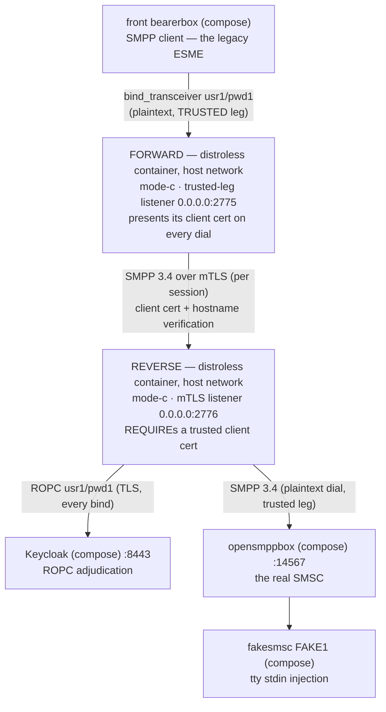

# Runbook — the dockerized forward+reverse **mode C** combo (the mTLS dial)

> **Status:** Story 6.3 T5 (2026-09-18). One of the three docker-packaged combo runbooks beside
> the sandbox's host-run `java -jar` recipe (README §5 — that recipe stays the debugger posture).
> This page is documentation only; nothing in the repository parses it. The cell's authoritative
> key reference is [`docs/configuration.md`](../../docs/configuration.md) (the AD-17 role × mode
> matrix); the image's facts live in
> [`docs/deployment-guide.md`](../../docs/deployment-guide.md) and
> [`docs/operator-jvm-flag-contract.md`](../../docs/operator-jvm-flag-contract.md).
> Русский перевод: [`forward-reverse-mode-c.ru.md`](forward-reverse-mode-c.ru.md).
> Every expected observation in this runbook was executed live on 2026-09-18's rig.

## 1. The use case — what operator problem this combo solves

Same two-hop problem as the mode A combo — legacy ESMEs on a trusted network, the adjudicating
proxy and the SMSC across an untrusted stretch — answered with the STRONGEST leg the product
ships: **mutual TLS between the two proxies**. The reverse's listener REQUIREs a client
certificate and anchors it against its own trust store (AD-13: REQUIRE, never WANT) — so the
reverse cryptographically authenticates WHICH forward instance is dialing it — and the forward
presents its **per-instance** client certificate (one cert per runtime instance, never a shared
golden-image key — FR-AUTH-3/SEC-098) while verifying the reverse's server certificate with
hostname checking ON (AD-20). No ACL isolation is needed to compensate for the leg: the
handshake itself is the gate, which is why this runbook binds the reverse's listener to
`0.0.0.0` and lets the REQUIRE do the work (the mode A runbook scopes its listener instead —
the two pages demonstrate the two ends of that trade).

This is the topology Story 6.2's E2E-001 proved in three rungs (in-JVM, JAR, and two
containers of this same image against the jSMPP oracle) — the `DockerRig.launchComposedModeCChain`
shape. What this runbook adds is the OTHER pairing: the same cells against the REAL Kannel
chain (a true third-party SMPP stack on the client side of the forward, COMP-1 context) and the
compose Keycloak adjudicating real ROPC.

What you accept: operating per-instance client certificates (rotation is re-deploy). What you
get: no accepted-risk banner on either instance, no submission oracle on the leg (a peer
without a valid certificate never completes TLS — never reaches a single SMPP byte), and the
same both-instance couple observability as mode A.

## 2. The chain



### The port plan (identical to the mode A combo's — two host-network listeners)

| Port | Bound by | Notes |
|------|----------|-------|
| 2775 | the FORWARD container (`0.0.0.0`) | The front conf stays BYTE-IDENTICAL (`host.docker.internal:2775`) — the forward takes the port the lone reverse holds in the §5 cell |
| 2776 | the REVERSE container (`0.0.0.0`) | **The composed cells' reverse moves off 2775.** Wildcard ON PURPOSE here: mTLS is the gate — a stranger reaching 2776 loses at the handshake, below SMPP (verified live — §4's gate probe) |
| 9090 | the FORWARD container (`127.0.0.1`, `/metrics`) | Default port — scrape from the host |
| 9091 | the REVERSE container (`127.0.0.1`, `/metrics`) | **Must move** (`--companion.metrics.port=9091`): two proxy processes share the host loopback; the second `127.0.0.1:9090` bind would refuse |

The TLS material (committed under `sandbox/certs/`, byte-identical copies of the test-tier
fixtures; the CA behind everything is `CN=smpp-test-ca`, store password `smpp-test`, files
world-readable `0644` for the image's UID 65532):

| File | Used by | Role |
|------|---------|------|
| `smpp-reverse-server.pem` / `-key.pem` | the reverse | Its server certificate — SANs `DNS:localhost, IP:127.0.0.1` (the forward dials `localhost` with hostname verification ON, AD-20) |
| `smpp-forward-client.pem` / `-key.pem` | the forward | Its PER-INSTANCE client certificate (`CN=smpp-forward-instance`, issued by `smpp-test-ca`) |
| `smpp-truststore.p12` | BOTH — the forward's dial side, the reverse's REQUIRE side | One anchor, two jobs: the forward verifies the reverse's server cert; the reverse REQUIREs client certs chaining to the same CA. (Distinct from the reverse's SECOND trust store — `oidc.trust-store.*` anchoring Keycloak; two stores, two anchors, do not merge them) |

## 3. Bring-up (zero → `bind_accept coupled`)

Preconditions are the shared ones (README §4 rig healthy, §5.1 secret bootstrapped,
`chmod 0444 sandbox/secrets/oidc-client-secret`, image + jar built — the mode B runbook's §3
lists the exact commands). From the **repository root**, reverse first:

```bash
docker run -d --name sandbox-reverse-c --network host \
      -v "$(pwd)/proxy/build/libs/proxy.jar:/opt/proxy.jar:ro" \
      -v "$(pwd)/sandbox/secrets/oidc-client-secret:/run/secrets/oidc-client-secret:ro" \
      -v "$(pwd)/sandbox/keycloak/certs/truststore.p12:/run/secrets/idp-truststore.p12:ro" \
      -v "$(pwd)/sandbox/certs/smpp-reverse-server.pem:/run/secrets/smpp-reverse-server.pem:ro" \
      -v "$(pwd)/sandbox/certs/smpp-reverse-server-key.pem:/run/secrets/smpp-reverse-server-key.pem:ro" \
      -v "$(pwd)/sandbox/certs/smpp-truststore.p12:/run/secrets/smpp-truststore.p12:ro" \
      smpp-proxy:local \
      --companion.bind.host=0.0.0.0 \
      --companion.bind.port=2776 \
      --companion.metrics.port=9091 \
      --companion.reverse.mode-c.smsc.host=127.0.0.1 \
      --companion.reverse.mode-c.smsc.port=14567 \
      --companion.reverse.mode-c.server-cert.cert-path=/run/secrets/smpp-reverse-server.pem \
      --companion.reverse.mode-c.server-cert.key-path=/run/secrets/smpp-reverse-server-key.pem \
      --companion.reverse.mode-c.trust-store.path=/run/secrets/smpp-truststore.p12 \
      --companion.reverse.mode-c.trust-store.password=smpp-test \
      --companion.reverse.mode-c.oidc.provider-url=https://localhost:8443/realms/smpp-companions \
      --companion.reverse.mode-c.oidc.client-id=smpp-client-confidential \
      --companion.reverse.mode-c.oidc.client-secret-path=/run/secrets/oidc-client-secret \
      --companion.reverse.mode-c.oidc.trust-store.path=/run/secrets/idp-truststore.p12 \
      --companion.reverse.mode-c.oidc.trust-store.password=smpp-test \
      --companion.reverse.mode-c.oidc.timeout=4s \
      --companion.reverse.mode-c.oidc.max-in-flight=64

docker run -d --name sandbox-forward-c --network host \
      -v "$(pwd)/proxy/build/libs/proxy.jar:/opt/proxy.jar:ro" \
      -v "$(pwd)/sandbox/certs/smpp-forward-client.pem:/run/secrets/smpp-forward-client.pem:ro" \
      -v "$(pwd)/sandbox/certs/smpp-forward-client-key.pem:/run/secrets/smpp-forward-client-key.pem:ro" \
      -v "$(pwd)/sandbox/certs/smpp-truststore.p12:/run/secrets/smpp-truststore.p12:ro" \
      smpp-proxy:local \
      --companion.bind.host=0.0.0.0 \
      --companion.bind.port=2775 \
      --companion.forward.mode-c.client-cert.cert-path=/run/secrets/smpp-forward-client.pem \
      --companion.forward.mode-c.client-cert.key-path=/run/secrets/smpp-forward-client-key.pem \
      --companion.forward.mode-c.trust-store.path=/run/secrets/smpp-truststore.p12 \
      --companion.forward.mode-c.trust-store.password=smpp-test \
      '--companion.forward.mode-c.routing[0].system-id=usr1' \
      '--companion.forward.mode-c.routing[0].host=localhost' \
      '--companion.forward.mode-c.routing[0].port=2776'
```

The structural refusals (AD-17 matrix) are the guardrails: the forward carries NO `oidc` and NO
`smsc` node; the reverse.mode-c carries NO `routing` and no client material of its own (the
FORWARD presents the certificate). Mode C boots carry NO accepted-risk banner on either
instance — nothing was weakened to get here.

## 4. How to check — the expected observation per step (all live-observed 2026-09-18)

| Step | Expected observation |
|------|----------------------|
| `docker logs sandbox-reverse-c` — boot | NO banner; `startup_summary` with `"role":"reverse"`, `"mode":"c"`, `"smpp_bind_host":"0.0.0.0"`, `"smpp_bind_port":2776`, `"metrics_port":9091` |
| `docker logs sandbox-forward-c` — boot | NO banner; `startup_summary` with `"role":"forward"`, `"mode":"c"`, `"smpp_bind_port":2775`, `"metrics_port":9090`, `"routing_system_ids":["usr1"]` |
| The couple — within ~10 s of the forward's start | `bind_accept` `"system_id":"usr1"`, `"outcome":"coupled"` on BOTH stdouts, the reverse's line first (observed 3 ms apart) |
| The metrics, one port per instance | forward (9090): `relay_binds_accepted_total{system_id="usr1"} 1.0`; reverse (9091): `relay_binds_unknown_total 1.0` |
| `curl "http://127.0.0.1:13000/status.txt?password=test"` | `smsc1 … (online …)` — through BOTH proxies and the mTLS leg |
| **The mTLS gate holds** (the mode-C-specific probe, live run) | (a) a plaintext SMPP PDU sent straight to `127.0.0.1:2776` gets NOTHING back — the listener speaks TLS only; (b) `openssl s_client -connect 127.0.0.1:2776` WITHOUT a client cert: the server sends its `CertificateRequest`, the session never yields SMPP — `bind_accept`/`bind_reject` counters on the reverse DO NOT MOVE (no adjudication, no SMSC activity; the dials land on the INGRESS `relay_connections_closed_total` counters only); (c) the SAME probe WITH `-cert sandbox/certs/smpp-forward-client.pem -key …-key.pem` completes `New, TLSv1.3, Cipher is TLS_AES_256_GCM_SHA384` — the certificate is the difference |
| A send (README §6.1's journey, unchanged) | HTTP 202; fakesmsc prints the text byte-intact (`modeC-combo` in the live run); BOTH instances' `relay_pdus_total{direction}` move symmetrically (+2/+2 per leg for the submit pair, +2/+2 more when the DLR returns) |

## 5. Where the logs live

| Surface | How |
|---------|-----|
| The proxies' JSON stdout | `docker logs sandbox-forward-c` / `docker logs sandbox-reverse-c` — deny verdicts only ever on the reverse; these are plain `docker run` containers, `docker compose logs` does not cover them |
| The proxies' `/metrics` | forward `curl -s http://127.0.0.1:9090/metrics`, reverse `curl -s http://127.0.0.1:9091/metrics` (host loopback, one port per instance) |
| Keycloak | `docker compose -f sandbox/compose.yml logs keycloak` — the reverse is its only consumer |
| Kannel (both sides) | `docker compose -f sandbox/compose.yml logs front-bearer-box` / `smsc-opensmpp-box` / … — the wire tap AROUND both proxies (README §7) |

## 6. When it fails loudly (live-observed arms + the §5.4 derivations)

| Broken input | What you observe |
|--------------|------------------|
| The reverse container is down (live run: `docker stop sandbox-reverse-c` with the pair live) | The forward logs NOTHING per retry; its `relay_connections_closed_total{direction="INGRESS",reason="EGRESS_CONNECT_FAILED"}` climbs +1 per front retry; the front wire shows the collapsed `code 0x0000000d (Bind Failed)` every 10 s. `docker start sandbox-reverse-c` → re-couples within one retry (observed) |
| The forward presents NO/foreign client material | The dial dies at the REQUIRE handshake, below SMPP — the gate-probe signature of §4 row (b), the in-JVM REQUIRE-negative row's behavior on the real rig |
| Cert/SAN mismatch on the reverse's server cert | The forward's dial fails hostname verification (AD-20) — same EGRESS-failure surface as the reverse-down row; check `routing[0].host` (`localhost`) against the SAN |
| Stale Keycloak secret / Keycloak down | README §5.4's signatures on the REVERSE only (`bind_reject` `DenyInvalid`/`DenyIndeterminate`); the forward stays silent; the front sees the collapsed 0x0d |
| A mounted key file unreadable by UID 65532 | Boot refuses, exit 1, no `startup_summary`, the refusal naming the path (SEC-060) — `sandbox/certs/` ships `0644` |
| Both metrics on 9090 | The second container's boot refuses naming `metrics.port` — the port plan exists to prevent this |

## 7. Teardown (and the jar-swap debug story)

Forward first (it holds the live pair):

```bash
docker stop --timeout 30 sandbox-forward-c   # exit 143 — its stdout carries the ordered stream:
                                             # startup_summary < bind_accept < the OBS-020 drain WARN
docker stop --timeout 30 sandbox-reverse-c   # exit 143
docker rm sandbox-forward-c sandbox-reverse-c
```

The reverse's own WARN depends on whether a pair is still live at its drain deadline after the
forward's teardown propagated (observed both ways on this rig — empty registry → no WARN; a
draining pair → the WARN then 143; both are correct walks). The jar-swap story is the mode B
runbook's §5, twice: `./gradlew :proxy:bootJar` + `docker restart` each container — running
containers keep the old inode, the restart re-resolves the path (verified live on this host).
The compose rig itself tears down per README §9.
