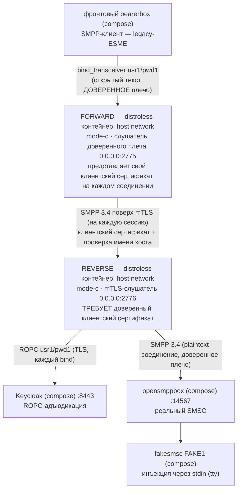

# Руководство — вариант использования `forward.mode-c` + `reverse.mode-c` (mTLS-соединение)

> **Статус:** оригинал написан в рамках Story 6.3 T5 (2026-09-18), переструктурирован в T6
> (2026-09-19 — операторо-ориентированная структура, упрощённая проза); русский перевод —
> 2026-09-19, нормативен [английский оригинал](forward-reverse-mode-c.md) — при расхождении
> истина в оригинале, автоматической сверки нет, согласованность «перевод ↔ оригинал» —
> обязанность ревью. Это одно из трёх docker-руководств, по одному на вариант использования
> (роль + режим): [mode B](reverse-mode-b.ru.md) · [mode A](forward-reverse-mode-a.ru.md).
> Рецепт запуска прокси на хосте (`java -jar`, поза отладки) — [README
> песочницы](../README.ru.md) §5. Каждое ожидаемое наблюдение этой страницы исполнено вживую
> на стенде 2026-09-18. Страница — только документация, ничего в репозитории её не разбирает.

## Назначение

Та же двухплечевая задача, что у Mode A — legacy-ESME в доверенной сети, прокси с адъюдикацией
и SMSC за недоверенным участком, — но с самым сильным плечом из тех, что продукт поставляет:
**взаимный TLS между двумя прокси**. Слушатель reverse *требует (REQUIRE)* клиентский
сертификат и якорит его в собственном trust store — reverse криптографически знает, **какой**
forward к нему соединяется; forward предъявляет свой **персональный** клиентский сертификат
(по одному на инстанс, никогда не общий ключ золотого образа) и проверяет серверный
сертификат reverse с включённой проверкой имени хоста.

ACL-изоляция для компенсации плеча не нужна — затвор и есть само рукопожатие. Поэтому это
руководство вешает слушатель reverse на `0.0.0.0` и позволяет REQUIRE делать работу (Mode A
ограничивает слушатель — две страницы показывают два конца этого компромисса).

Это топология, которую E2E Story 6.2 доказал против оракула jSMPP; эта страница добавляет
другую пару — те же варианты против реальной цепочки Kannel, с compose-Keycloak и настоящим
ROPC.



- **Что вы принимаете:** обслуживание персональных клиентских сертификатов — ротация это
  пере-развёртывание.
- **Что вы получаете:** баннера принятого риска нет ни на одном инстансе (ничего не ослабляли,
  чтобы сюда попасть); оракула подачи на плече нет — пир без действительного сертификата не
  завершает TLS и не достигает ни одного байта SMPP; сопряжение наблюдаемо на обоих инстансах.

## Быстрый старт

Предусловия: стенд healthy, OIDC-секрет клиента забутстраплен, образ и jar собраны — шаги 1–2
«Быстрого старта» [руководства mode B](reverse-mode-b.ru.md) покрывают всё (включая
`chmod 0444` на секрете).

Из **корня репозитория** запускайте reverse первым. План портов — как у Mode A, с одним
намеренным отличием:

| Порт | Кто слушает | Почему |
|------|-------------|--------|
| 2775 | forward (`0.0.0.0`) | Порт, на который соединяется фронтовый конфиг — forward занимает его, конфиг не меняется. |
| 2776 | reverse (`0.0.0.0`) | Внешний адрес **намеренно** — затвор это mTLS; чужак, дотянувшийся до 2776, проигрывает на рукопожатии, ниже SMPP (проверено вживую — проба затвора ниже). |
| 9090 | `/metrics` forward | По умолчанию. |
| 9091 | `/metrics` reverse | Обязан сдвинуться — два процесса прокси делят loopback хоста; вторая привязка 9090 откажет. |

```bash
docker run -d --name sandbox-reverse-c --network host \
      -v "$(pwd)/proxy/build/libs/proxy.jar:/opt/proxy.jar:ro" \
      -v "$(pwd)/sandbox/secrets/oidc-client-secret:/run/secrets/oidc-client-secret:ro" \
      -v "$(pwd)/sandbox/keycloak/certs/truststore.p12:/run/secrets/idp-truststore.p12:ro" \
      -v "$(pwd)/sandbox/certs/smpp-reverse-server.pem:/run/secrets/smpp-reverse-server.pem:ro" \
      -v "$(pwd)/sandbox/certs/smpp-reverse-server-key.pem:/run/secrets/smpp-reverse-server-key.pem:ro" \
      -v "$(pwd)/sandbox/certs/smpp-truststore.p12:/run/secrets/smpp-truststore.p12:ro" \
      smpp-proxy:local \
      --companion.bind.host=0.0.0.0 \
      --companion.bind.port=2776 \
      --companion.metrics.port=9091 \
      --companion.reverse.mode-c.smsc.host=127.0.0.1 \
      --companion.reverse.mode-c.smsc.port=14567 \
      --companion.reverse.mode-c.server-cert.cert-path=/run/secrets/smpp-reverse-server.pem \
      --companion.reverse.mode-c.server-cert.key-path=/run/secrets/smpp-reverse-server-key.pem \
      --companion.reverse.mode-c.trust-store.path=/run/secrets/smpp-truststore.p12 \
      --companion.reverse.mode-c.trust-store.password=smpp-test \
      --companion.reverse.mode-c.oidc.provider-url=https://localhost:8443/realms/smpp-companions \
      --companion.reverse.mode-c.oidc.client-id=smpp-client-confidential \
      --companion.reverse.mode-c.oidc.client-secret-path=/run/secrets/oidc-client-secret \
      --companion.reverse.mode-c.oidc.trust-store.path=/run/secrets/idp-truststore.p12 \
      --companion.reverse.mode-c.oidc.trust-store.password=smpp-test \
      --companion.reverse.mode-c.oidc.timeout=4s \
      --companion.reverse.mode-c.oidc.max-in-flight=64

docker run -d --name sandbox-forward-c --network host \
      -v "$(pwd)/proxy/build/libs/proxy.jar:/opt/proxy.jar:ro" \
      -v "$(pwd)/sandbox/certs/smpp-forward-client.pem:/run/secrets/smpp-forward-client.pem:ro" \
      -v "$(pwd)/sandbox/certs/smpp-forward-client-key.pem:/run/secrets/smpp-forward-client-key.pem:ro" \
      -v "$(pwd)/sandbox/certs/smpp-truststore.p12:/run/secrets/smpp-truststore.p12:ro" \
      smpp-proxy:local \
      --companion.bind.host=0.0.0.0 \
      --companion.bind.port=2775 \
      --companion.forward.mode-c.client-cert.cert-path=/run/secrets/smpp-forward-client.pem \
      --companion.forward.mode-c.client-cert.key-path=/run/secrets/smpp-forward-client-key.pem \
      --companion.forward.mode-c.trust-store.path=/run/secrets/smpp-truststore.p12 \
      --companion.forward.mode-c.trust-store.password=smpp-test \
      '--companion.forward.mode-c.routing[0].system-id=usr1' \
      '--companion.forward.mode-c.routing[0].host=localhost' \
      '--companion.forward.mode-c.routing[0].port=2776'
```

Заметьте, что варианты structurally отвергают (полезно, если правите аргументы вручную):
forward не содержит ни `oidc`, ни `smsc`; у reverse нет `routing` и собственных клиентских
данных — сертификат предъявляет *forward*.

✅ **Всё поднято, когда** `bind_accept` с `"system_id":"usr1"`, `"outcome":"coupled"` появится
на **обоих** stdout — в пределах ~10 с от старта forward (строка reverse первой: вживую
разрыв 3 мс).

## Что вы должны увидеть

| Проверка | Что вы должны увидеть |
|----------|----------------------|
| `docker logs sandbox-reverse-c` (загрузка) | Без баннера; `startup_summary` с `"role":"reverse"`, `"mode":"c"`, `"smpp_bind_host":"0.0.0.0"`, `"smpp_bind_port":2776`, `"metrics_port":9091`. |
| `docker logs sandbox-forward-c` (загрузка) | Без баннера; `startup_summary` с `"role":"forward"`, `"mode":"c"`, `"smpp_bind_port":2775`, `"metrics_port":9090`, `"routing_system_ids":["usr1"]`. |
| Сопряжение — в пределах ~10 с от старта forward | `bind_accept`, `"system_id":"usr1"`, `"outcome":"coupled"` на обоих stdout, строка reverse первой (вживую разрыв 3 мс). |
| Метрики — по порту на инстанс | Forward `curl -s http://127.0.0.1:9090/metrics`: `relay_binds_accepted_total{system_id="usr1"} 1.0`; reverse `curl -s http://127.0.0.1:9091/metrics`: `relay_binds_unknown_total 1.0`. У Prometheus стенда (UI `http://127.0.0.1:9095`) оба порта всегда прописаны как цели job `smpp-proxy`: цель 9091 — UP только пока работает reverse, иначе DOWN (на одноинстансном стенде — навсегда; [README §5.3](../README.ru.md), пункт 7). |
| `curl "http://127.0.0.1:13000/status.txt?password=test"` | `smsc1 … (online …)` — через обоих прокси и mTLS-плечо. |
| Отправка — необязательно | HTTP 202; fakesmsc печатает текст байт-в-байт; счётчики обоих инстансов проходят 2/2 на плечо за весь сценарий (submit + resp, затем пара DLR) — сверх этого keepalive. Полный сценарий: [README §6.1](../README.ru.md). |

**Затвор mTLS — собственная проверка Mode C** (прогоните раз, чтобы увидеть, что разница —
именно сертификат):

- Plaintext PDU SMPP, отправленный прямо на `127.0.0.1:2776`, не получает **ничего** в ответ —
  слушатель говорит только TLS.
- `openssl s_client -connect 127.0.0.1:2776` **без** клиентского сертификата: сервер посылает
  свой `CertificateRequest`, сессия никогда не даёт SMPP — счётчики `bind_accept`/`bind_reject`
  на reverse не двигаются (ни адъюдикации, ни активности SMSC; неудавшиеся соединения попадают
  только в счётчики INGRESS `relay_connections_closed_total`).
- Та же проба **с** `-cert sandbox/certs/smpp-forward-client.pem -key
  sandbox/certs/smpp-forward-client-key.pem` завершается: `New, TLSv1.3, Cipher is
  TLS_AES_256_GCM_SHA384`.

## Устранение проблем

| Симптом | Что это значит · что делать |
|---------|------------------------------|
| Контейнер reverse лежит (или у него неверный порт/сертификат) | Forward молчит на каждый retry; его `relay_connections_closed_total{direction="INGRESS",reason="EGRESS_CONNECT_FAILED"}` растёт на +1 за retry фронта; на проводе фронта свёрнутое `code 0x0000000d (Bind Failed)` каждые 10 с. `docker start sandbox-reverse-c` пересопрягает в пределах одного retry. |
| Forward предъявляет отсутствующие/чужие клиентские данные | Соединение умирает на рукопожатии REQUIRE, ниже SMPP — сигнатура пробы без сертификата выше. |
| Несовпадение SAN у серверного сертификата reverse | Соединение forward не проходит проверку имени хоста — та же поверхность отказа egress, что у строки «reverse лежит». Сверьте `routing[0].host` (`localhost`) с SAN. |
| Устаревший секрет Keycloak / лежащий Keycloak | Сигнатуры [README §5.4](../README.ru.md) только на **reverse** (`bind_reject` `DenyInvalid`/`DenyIndeterminate`); forward молчит; фронт видит свёрнутый 0x0d. |
| Смонтированный ключ-файл нечитаем для UID 65532 (копия `0600`) | Загрузка отказывает, exit 1, без `startup_summary`, отказ называет путь. `sandbox/certs/` поставляется как `0644` — так и держите. |
| Обе метрики на 9090 | Загрузка второго контейнера отказывает, называя `metrics.port`, — план портов существует, чтобы это предотвратить. |
| `system_id` вне таблицы на фронте (например, `usr2`) | **Forward** сам отказывает бину до всякого соединения и адъюдикации: генерический 0x0d на проводе, один log-only WARN на его stdout (`routing miss: system_id not in the routing table — AD-33 deny (AD-29/AD-11): usr2`) — и больше ничего нигде. Сценарий «неверные учётные данные SMSC» (README §6.4 D1) существует только в одно-проксивых вариантах использования (хостовый запуск README §5, [руководство mode B](reverse-mode-b.ru.md)); D2 — неверный пароль у маршрутного `usr1` — по-прежнему пересекает forward и отказывает на reverse. |

## Журналы

| Поверхность | Как |
|-------------|-----|
| JSON-stdout прокси | `docker logs sandbox-forward-c` / `docker logs sandbox-reverse-c`. Вердикты отказа живут только на reverse. Это обычные контейнеры `docker run` — `docker compose logs` их не покрывает. |
| `/metrics` прокси | Forward `curl -s http://127.0.0.1:9090/metrics`, reverse `curl -s http://127.0.0.1:9091/metrics`. |
| Keycloak | `docker compose -f sandbox/compose.yml logs keycloak` — его единственный потребитель reverse. |
| Kannel, обе стороны | `docker compose -f sandbox/compose.yml logs front-bearer-box` / `smsc-opensmpp-box` / … — проводной перехват вокруг обоих прокси ([README §7](../README.ru.md)). |

## Останов

Сначала **forward** — он держит живую пару:

```bash
docker stop --timeout 30 sandbox-forward-c   # exit 143; stdout несёт упорядоченный поток:
                                             # startup_summary < bind_accept < WARN дрейна
docker stop --timeout 30 sandbox-reverse-c   # exit 143
docker rm sandbox-forward-c sandbox-reverse-c
```

Покажет ли reverse собственный WARN дрейна, зависит от того, как распространилось разрушение
forward (наблюдали оба исхода: пустой реестр → чистый 143 без WARN; пара в дрейне → WARN и
затем 143) — оба прохода корректны. Подмена jar — «Подмена jar» [руководства
mode B](reverse-mode-b.ru.md), дважды: `./gradlew :proxy:bootJar` + `docker restart` каждого
контейнера. Стенд останавливается по [README §9](../README.ru.md).

## Подробности и ссылки

### TLS-материал

Всё закоммичено в `sandbox/certs/` — байт-в-байт копии тестовых фикстур; CA за всем —
`CN=smpp-test-ca`, пароль хранилища `smpp-test`, файлы читаемы всеми (`0644`) для UID 65532
образа.

| Файл | Кто использует | Роль |
|------|----------------|------|
| `smpp-reverse-server.pem` / `-key.pem` | reverse | Его серверный сертификат — SAN `DNS:localhost, IP:127.0.0.1` (forward соединяется с `localhost` с включённой проверкой имени хоста). |
| `smpp-forward-client.pem` / `-key.pem` | forward | Его персональный клиентский сертификат (`CN=smpp-forward-instance`, выдан `smpp-test-ca`). |
| `smpp-truststore.p12` | оба — сторона соединения forward, сторона REQUIRE reverse | Один якорь, две работы: forward проверяет серверный сертификат reverse; reverse требует клиентские сертификаты, цепочающиеся к тому же CA. Отличен от **второго** trust store reverse — `oidc.trust-store.*`, якорящего Keycloak: два хранилища, два якоря — не смешивайте их. |

### Ссылки

- Поднятие стенда, бутстрап секрета, сигнатуры отказов, сценарии корректности —
  [README песочницы](../README.ru.md) (§4–§9).
- Ключи варианта: [docs/ru/configuration.md](../../docs/ru/configuration.md); факты образа:
  [docs/deployment-guide.md](../../docs/deployment-guide.md) (EN),
  [docs/ru/operator-jvm-flag-contract.md](../../docs/ru/operator-jvm-flag-contract.md).
