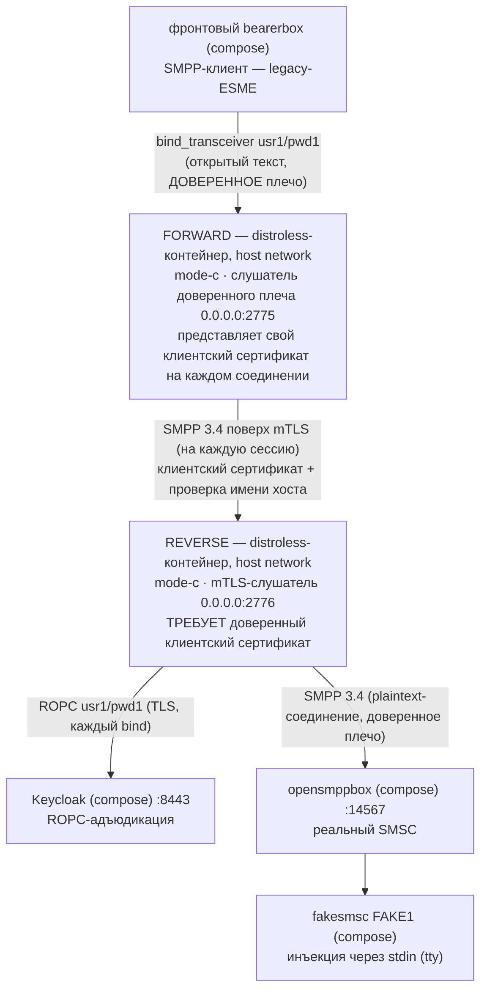

# Руководство — docker-вариант forward+reverse **mode C** (mTLS-соединение)

> **Статус:** оригинал написан в рамках Story 6.3 T5 (2026-09-18); русский перевод — 2026-09-18,
> нормативен [английский оригинал](forward-reverse-mode-c.md) — при расхождении истина в
> оригинале. Одно из трёх руководств по docker-упакованным вариантам рядом с рецептом запуска
> прокси на хосте (README §5 — тот рецепт остаётся позой отладки). Страница — только
> документация. Авторитетный справочник ключей —
> [`docs/ru/configuration.md`](../../docs/ru/configuration.md) (матрица AD-17); факты образа —
> [английский `docs/deployment-guide.md`](../../docs/deployment-guide.md) и
> [`docs/ru/operator-jvm-flag-contract.md`](../../docs/ru/operator-jvm-flag-contract.md).
> Каждое ожидаемое наблюдение исполнено вживую на стенде 2026-09-18.

## 1. Сценарий использования — какую задачу оператора решает этот вариант

Та же задача двух плеч, что у варианта mode A — legacy-ESME в доверенной сети, адъюдирующий
прокси и SMSC через недоверенный участок, — но ответ СИЛЬНЕЙШИМ плечом, которое вообще
поставляется: **взаимный TLS между двумя прокси**. Слушатель reverse ТРЕБУЕТ клиентский
сертификат и якорит его собственным trust store (AD-13: REQUIRE, никогда WANT) — reverse
криптографически аутентифицирует, КАКОЙ инстанс forward к нему соединяется, — а forward
представляет свой **персональный** клиентский сертификат (один сертификат на инстанс среды
исполнения, никогда общий golden-image ключ — FR-AUTH-3/SEC-098) и проверяет серверный
сертификат reverse с ВКЛЮЧЁННОЙ проверкой имени хоста (AD-20). ACL-изоляция для компенсации
плеча не нужна: сам рукопожатие и есть затвор — поэтому это руководство намеренно вешает
слушатель reverse на `0.0.0.0` и поручает работу REQUIRE (руководство mode A вместо этого
ограничивает свой слушатель — две страницы демонстрируют концы этого компромисса).

Это та топология, которую E2E-001 Story 6.2 доказал в трёх ступенях (in-JVM, JAR и два
контейнера этого же образа против оракула jSMPP) — форма `DockerRig.launchComposedModeCChain`.
Это руководство добавляет ДРУГУЮ пару: те же варианты против РЕАЛЬНОЙ цепочки Kannel
(настоящий сторонний SMPP-стек на клиентской стороне forward, контекст COMP-1) и compose-
Keycloak, адъюдирующий настоящий ROPC.

Что вы принимаете: обслуживание персональных клиентских сертификатов (ротация — повторное
развёртывание). Что вы получаете: баннера принятого риска нет ни на одном инстансе, оракула
подачи на плече нет (пир без действительного сертификата не завершает TLS — не достигает ни
одного байта SMPP) и ту же наблюдаемость сопряжения на обоих инстансах, что в mode A.

## 2. Цепочка



### План портов (тот же, что у варианта mode A — два слушателя в host network)

| Порт | Кто слушает | Примечания |
|------|-------------|------------|
| 2775 | контейнер FORWARD (`0.0.0.0`) | Фронтовый конфиг остаётся БАЙТ-В-БАЙТ (`host.docker.internal:2775`) — forward занимает порт, который одиночный reverse держит в варианте §5 |
| 2776 | контейнер REVERSE (`0.0.0.0`) | **Reverse составных вариантов уходит с 2775.** Здесь намеренно wildcard: затвор — mTLS; чужак, дотянувшийся до 2776, проигрывает на рукопожатии, ниже SMPP (проверено вживую — проба затвора в §4) |
| 9090 | контейнер FORWARD (`127.0.0.1`, `/metrics`) | Порт по умолчанию — читается с хоста |
| 9091 | контейнер REVERSE (`127.0.0.1`, `/metrics`) | **Обязан сдвинуться** (`--companion.metrics.port=9091`): два процесса прокси делят loopback хоста; второй bind `127.0.0.1:9090` откажет |

TLS-материал (закоммичен в `sandbox/certs/`, байт-в-байт копии тестовых фикстур; CA за всем —
`CN=smpp-test-ca`, пароль хранилища `smpp-test`, файлы читаемы всеми `0644` для UID 65532
образа):

| Файл | Кто использует | Роль |
|------|----------------|------|
| `smpp-reverse-server.pem` / `-key.pem` | reverse | Его серверный сертификат — SAN `DNS:localhost, IP:127.0.0.1` (forward соединяется к `localhost` с включённой проверкой имени хоста, AD-20) |
| `smpp-forward-client.pem` / `-key.pem` | forward | Его ПЕРСОНАЛЬНЫЙ клиентский сертификат (`CN=smpp-forward-instance`, выдан `smpp-test-ca`) |
| `smpp-truststore.p12` | ОБА — сторона соединения forward и сторона REQUIRE reverse | Один якорь, две работы: forward проверяет серверный сертификат reverse; reverse ТРЕБУЕТ клиентские сертификаты, цепляющиеся к тому же CA. (Не путать со ВТОРЫМ trust store reverse — `oidc.trust-store.*`, якорящим Keycloak; два хранилища, два якоря, не сливать) |

## 3. Запуск (с нуля → `bind_accept coupled`)

Предусловия общие (стенд healthy по README §4, бутстрап секрета по §5.1,
`chmod 0444 sandbox/secrets/oidc-client-secret`, образ и jar собраны — точные команды в §3
руководства mode B). Из **корня репозитория**, сначала reverse:

```bash
docker run -d --name sandbox-reverse-c --network host \
      -v "$(pwd)/proxy/build/libs/proxy.jar:/opt/proxy.jar:ro" \
      -v "$(pwd)/sandbox/secrets/oidc-client-secret:/run/secrets/oidc-client-secret:ro" \
      -v "$(pwd)/sandbox/keycloak/certs/truststore.p12:/run/secrets/idp-truststore.p12:ro" \
      -v "$(pwd)/sandbox/certs/smpp-reverse-server.pem:/run/secrets/smpp-reverse-server.pem:ro" \
      -v "$(pwd)/sandbox/certs/smpp-reverse-server-key.pem:/run/secrets/smpp-reverse-server-key.pem:ro" \
      -v "$(pwd)/sandbox/certs/smpp-truststore.p12:/run/secrets/smpp-truststore.p12:ro" \
      smpp-proxy:local \
      --companion.bind.host=0.0.0.0 \
      --companion.bind.port=2776 \
      --companion.metrics.port=9091 \
      --companion.reverse.mode-c.smsc.host=127.0.0.1 \
      --companion.reverse.mode-c.smsc.port=14567 \
      --companion.reverse.mode-c.server-cert.cert-path=/run/secrets/smpp-reverse-server.pem \
      --companion.reverse.mode-c.server-cert.key-path=/run/secrets/smpp-reverse-server-key.pem \
      --companion.reverse.mode-c.trust-store.path=/run/secrets/smpp-truststore.p12 \
      --companion.reverse.mode-c.trust-store.password=smpp-test \
      --companion.reverse.mode-c.oidc.provider-url=https://localhost:8443/realms/smpp-companions \
      --companion.reverse.mode-c.oidc.client-id=smpp-client-confidential \
      --companion.reverse.mode-c.oidc.client-secret-path=/run/secrets/oidc-client-secret \
      --companion.reverse.mode-c.oidc.trust-store.path=/run/secrets/idp-truststore.p12 \
      --companion.reverse.mode-c.oidc.trust-store.password=smpp-test \
      --companion.reverse.mode-c.oidc.timeout=4s \
      --companion.reverse.mode-c.oidc.max-in-flight=64

docker run -d --name sandbox-forward-c --network host \
      -v "$(pwd)/proxy/build/libs/proxy.jar:/opt/proxy.jar:ro" \
      -v "$(pwd)/sandbox/certs/smpp-forward-client.pem:/run/secrets/smpp-forward-client.pem:ro" \
      -v "$(pwd)/sandbox/certs/smpp-forward-client-key.pem:/run/secrets/smpp-forward-client-key.pem:ro" \
      -v "$(pwd)/sandbox/certs/smpp-truststore.p12:/run/secrets/smpp-truststore.p12:ro" \
      smpp-proxy:local \
      --companion.bind.host=0.0.0.0 \
      --companion.bind.port=2775 \
      --companion.forward.mode-c.client-cert.cert-path=/run/secrets/smpp-forward-client.pem \
      --companion.forward.mode-c.client-cert.key-path=/run/secrets/smpp-forward-client-key.pem \
      --companion.forward.mode-c.trust-store.path=/run/secrets/smpp-truststore.p12 \
      --companion.forward.mode-c.trust-store.password=smpp-test \
      '--companion.forward.mode-c.routing[0].system-id=usr1' \
      '--companion.forward.mode-c.routing[0].host=localhost' \
      '--companion.forward.mode-c.routing[0].port=2776'
```

Structural-отказы (матрица AD-17) здесь — ограждения: forward не содержит ни узла `oidc`, ни
узла `smsc`; у reverse.mode-c нет `routing` и своих клиентских данных (сертификат представляет
FORWARD). Загрузка mode C не содержит баннера принятого риска ни на одном инстансе — сюда не
пришли, ничего не ослабляя.

## 4. Как проверять — ожидаемое наблюдение на каждом шаге (всё исполнено вживую 2026-09-18)

| Шаг | Ожидаемое наблюдение |
|-----|----------------------|
| `docker logs sandbox-reverse-c` — загрузка | БЕЗ баннера; `startup_summary` с `"role":"reverse"`, `"mode":"c"`, `"smpp_bind_host":"0.0.0.0"`, `"smpp_bind_port":2776`, `"metrics_port":9091` |
| `docker logs sandbox-forward-c` — загрузка | БЕЗ баннера; `startup_summary` с `"role":"forward"`, `"mode":"c"`, `"smpp_bind_port":2775`, `"metrics_port":9090`, `"routing_system_ids":["usr1"]` |
| Сопряжение — в пределах ~10 с от старта forward | `bind_accept` `"system_id":"usr1"`, `"outcome":"coupled"` на ОБОИХ stdout, строка reverse первой (вживую разрыв 3 мс) |
| Метрики — по порту на инстанс | forward (9090): `relay_binds_accepted_total{system_id="usr1"} 1.0`; reverse (9091): `relay_binds_unknown_total 1.0` |
| `curl "http://127.0.0.1:13000/status.txt?password=test"` | `smsc1 … (online …)` — через ОБОИХ прокси и mTLS-плечо |
| **Затвор mTLS держит** (проба, специфичная для mode C; живой прогон) | (а) plaintext PDU SMPP, отправленный прямо на `127.0.0.1:2776`, не получает НИЧЕГО — слушатель говорит только TLS; (б) `openssl s_client -connect 127.0.0.1:2776` БЕЗ клиентского сертификата: сервер посылает свой `CertificateRequest`, сессия никогда не даёт SMPP — счётчики `bind_accept`/`bind_reject` на reverse НЕ ДВИГАЮТСЯ (ни адъюдикации, ни активности SMSC; эти dial попадают только в счётчики INGRESS `relay_connections_closed_total`); (в) ТА ЖЕ проба С `-cert sandbox/certs/smpp-forward-client.pem -key …-key.pem` завершается `New, TLSv1.3, Cipher is TLS_AES_256_GCM_SHA384` — разница ровно в сертификате |
| Отправка (сценарий README §6.1, без изменений) | HTTP 202; fakesmsc печатает текст байт-в-байт (в живом прогоне — `modeC-combo`); `relay_pdus_total{direction}` ОБОИХ инстансов движутся симметрично (+2/+2 на плечо для пары submit и ещё +2/+2 с возвратом DLR) |

## 5. Где описаны журналы

| Поверхность | Как |
|-------------|-----|
| JSON-stdout прокси | `docker logs sandbox-forward-c` / `docker logs sandbox-reverse-c` — вердикты отказа бывают только на reverse; это обычные контейнеры `docker run`, `docker compose logs` их не покрывает |
| `/metrics` прокси | forward `curl -s http://127.0.0.1:9090/metrics`, reverse `curl -s http://127.0.0.1:9091/metrics` (loopback хоста, по порту на инстанс) |
| Keycloak | `docker compose -f sandbox/compose.yml logs keycloak` — его единственный потребитель reverse |
| Kannel (обе стороны) | `docker compose -f sandbox/compose.yml logs front-bearer-box` / `smsc-opensmpp-box` / … — проводной перехват ВОКРУГ обоих прокси (README §7) |

## 6. Когда отказывает громко (живые плечи + выводы из §5.4)

| Сломанный вход | Что наблюдается |
|----------------|-----------------|
| Контейнер reverse лежит (живой прогон: `docker stop sandbox-reverse-c` при живой паре) | Forward на каждый retry молчит; его `relay_connections_closed_total{direction="INGRESS",reason="EGRESS_CONNECT_FAILED"}` растёт на +1 за retry фронта; на проводе фронта свёрнутое `code 0x0000000d (Bind Failed)` каждые 10 с. `docker start sandbox-reverse-c` → пересопряжение в пределах одного retry (исполнено) |
| Forward представляет чужие/отсутствующие клиентские данные | Соединение умирает на рукопожатии REQUIRE, ниже SMPP — сигнатура пробы (б) из §4, поведение in-JVM REQUIRE-negative строки на реальном стенде |
| Несовпадение SAN у серверного сертификата reverse | Соединение forward не проходит проверку имени хоста (AD-20) — та же поверхность отказа egress, что у строки «reverse лежит»; сверьте `routing[0].host` (`localhost`) с SAN |
| Устаревший секрет Keycloak / лежащий Keycloak | Сигнатуры README §5.4 ТОЛЬКО на reverse (`bind_reject` `DenyInvalid`/`DenyIndeterminate`); forward молчит; фронт видит свёрнутый 0x0d |
| Смонтированный ключ-файл нечитаем для UID 65532 | Загрузка отказывает, exit 1, без `startup_summary`, отказ называет путь (SEC-060) — `sandbox/certs/` поставляется как `0644` |
| Обе метрики на 9090 | Загрузка второго контейнера отказывает, называя `metrics.port` — план портов существует, чтобы это предотвратить |

## 7. Останов (и история отладки с подменой jar)

Сначала forward (он держит живую пару):

```bash
docker stop --timeout 30 sandbox-forward-c   # exit 143 — stdout содержит упорядоченный поток:
                                             # startup_summary < bind_accept < WARN дрейна OBS-020
docker stop --timeout 30 sandbox-reverse-c   # exit 143
docker rm sandbox-forward-c sandbox-reverse-c
```

Собственный WARN reverse зависит от того, осталась ли живая пара на дедлайне его дрейна после
распространения разрушения forward (на стенде наблюдали оба исхода — пустой реестр → без WARN;
пара в дрейне → WARN и затем 143; оба прохода корректны). История с подменой jar — §5
руководства mode B, дважды: `./gradlew :proxy:bootJar` + `docker restart` каждого контейнера —
работающие контейнеры держат старый inode, перезапуск заново разрешает путь (проверено вживую
на этой машине). Сам compose-стенд останавливается по README §9.
