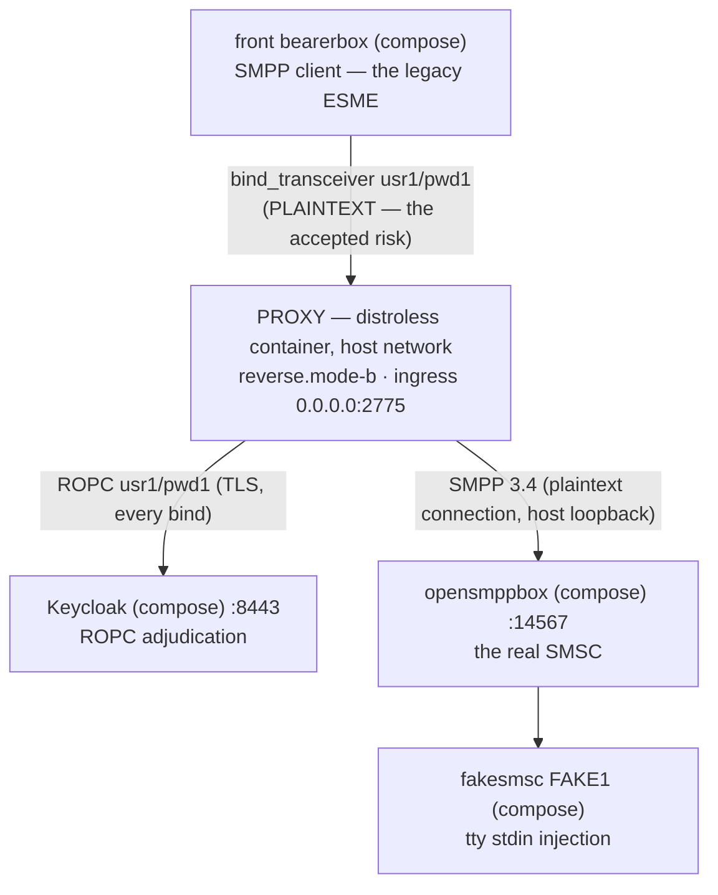

# Runbook — the `reverse.mode-b` use case (the lone reverse; legacy clients direct)

> One of the three docker runbooks, one per use case (role + mode) — siblings: [forward+reverse, Mode A](forward-reverse-mode-a.md) ·
> [forward+reverse, Mode C](forward-reverse-mode-c.md). For the host-run `java -jar` recipe (the debugger
> posture) see the [sandbox README](../README.md) §5. Every expected observation below was executed live on
> the rig, 2026-09-18. Documentation only — nothing parses this page.
> Русский перевод: [`reverse-mode-b.ru.md`](reverse-mode-b.ru.md).

## What it's for

You have legacy ESMEs that speak plaintext SMPP and cannot be changed, and you want every bind's
password checked at your IdP before it reaches the SMSC. Mode B is the cheapest use case that does
it: **one** proxy instance, the clients connect directly to it, every bind is adjudicated over
ROPC at your IdP, and the SMSC keeps the last word on credentials beyond it (`smsc-users.txt`
decides).

In this rig the "legacy ESME" is the front Kannel bearerbox (`usr1`/`pwd1`), the SMSC is
opensmppbox + fakesmsc, and the IdP is the compose Keycloak.



- **You accept:** the client-facing leg is plaintext — SMPP passwords cross it in the clear.
  That is the registered accepted risk: the launch refuses without the explicit
  `acknowledged=true` opt-in and boots with a loud WARN banner. The banner is part of the
  contract, not noise to silence.
- **You get:** central adjudication; every proxy-side denial collapses to the same generic wire
  code, so an attacker learns nothing from the response; the SMSC's own verdicts forwarded
  verbatim; full JSON logs + `/metrics` — and zero certificates to manage.

## Quick start

Run everything from the **repository root** (the `-v` mounts are root-relative). Docker must be
up. Once per machine, build the image and jar:

```bash
./gradlew :proxy:bootJar :proxy:dockerImage   # -> proxy/build/libs/proxy.jar + smpp-proxy:local
```

**1 — Start the rig** (full bring-up guide: [sandbox README §4](../README.md)):

```bash
cd sandbox && docker compose up -d --build && cd ..
# wait for pg + both bearerboxes + keycloak healthy: docker compose ps
```

**2 — Fetch the OIDC client secret.** Fresh Keycloak containers regenerate it, so re-run this
after any `down` + `up` cycle (the full guide, including the admin-console alternative, is
README §5.1):

```bash
curl --cacert sandbox/keycloak/certs/ca.pem \
     https://localhost:8443/realms/smpp-companions/.well-known/openid-configuration
docker compose -f sandbox/compose.yml exec keycloak /opt/keycloak/bin/kcadm.sh config truststore \
     /opt/keycloak/conf/truststore.p12 --trustpass smpp-test
docker compose -f sandbox/compose.yml exec keycloak /opt/keycloak/bin/kcadm.sh config credentials \
     --server https://localhost:8443 --realm master --user admin --password admin
CID=$(docker compose -f sandbox/compose.yml exec -T keycloak /opt/keycloak/bin/kcadm.sh get clients \
      -r smpp-companions -q clientId=smpp-client-confidential --fields id --format csv --noquotes)
docker compose -f sandbox/compose.yml exec -T keycloak /opt/keycloak/bin/kcadm.sh get \
      "clients/$CID/client-secret" -r smpp-companions
mkdir -p sandbox/secrets && printf '%s\n' '<generated>' > sandbox/secrets/oidc-client-secret
chmod 0444 sandbox/secrets/oidc-client-secret   # 0444, not §5.1's 0600: the container's UID 65532 must read it
```

**3 — Launch the proxy.** Nothing collides in this use case: the proxy takes 2775 (the port the
front conf connects to) and 9090 (`/metrics`). It's the two-instance use cases whose ports move — see
their runbooks.

```bash
docker run -d --name sandbox-proxy-b --network host \
      -v "$(pwd)/proxy/build/libs/proxy.jar:/opt/proxy.jar:ro" \
      -v "$(pwd)/sandbox/secrets/oidc-client-secret:/run/secrets/oidc-client-secret:ro" \
      -v "$(pwd)/sandbox/keycloak/certs/truststore.p12:/run/secrets/idp-truststore.p12:ro" \
      smpp-proxy:local \
      --companion.bind.host=0.0.0.0 \
      --companion.bind.port=2775 \
      --companion.reverse.mode-b.smsc.host=127.0.0.1 \
      --companion.reverse.mode-b.smsc.port=14567 \
      --companion.reverse.mode-b.acknowledged=true \
      --companion.reverse.mode-b.oidc.provider-url=https://localhost:8443/realms/smpp-companions \
      --companion.reverse.mode-b.oidc.client-id=smpp-client-confidential \
      --companion.reverse.mode-b.oidc.client-secret-path=/run/secrets/oidc-client-secret \
      --companion.reverse.mode-b.oidc.trust-store.path=/run/secrets/idp-truststore.p12 \
      --companion.reverse.mode-b.oidc.trust-store.password=smpp-test \
      --companion.reverse.mode-b.oidc.timeout=4s \
      --companion.reverse.mode-b.oidc.max-in-flight=64
```

✅ **You're up when** `docker logs sandbox-proxy-b` shows `"event":"bind_accept"`,
`"system_id":"usr1"`, `"outcome":"coupled"` — within ~10 s.

## What you should see

| Check | What you should see |
|-------|---------------------|
| `docker logs sandbox-proxy-b` (boot) | One WARN line — the Mode B banner, `MODE B (plaintext) is ACTIVE on a REVERSE instance` — then `"event":"startup_summary"` with `"role":"reverse"`, `"mode":"b"`, `"smpp_bind_host":"0.0.0.0"`, `"smpp_bind_port":2775`, `"metrics_port":9090`, and `memory_budget_bytes` == `direct_memory_ceiling_bytes` == `6442450944`. |
| The couple — within ~10 s (observed ~4 s after ready) | `"event":"bind_accept"`, `"system_id":"usr1"`, `"outcome":"coupled"` — the bind crossed the proxy, passed ROPC at Keycloak, connected to opensmppbox, coupled on its ROK. |
| `curl -s http://127.0.0.1:9090/metrics` (from the host) | `relay_binds_unknown_total 1.0` — the reverse cell's couple counter (no routing table here; the labeled `relay_binds_accepted_total{system_id=…}` series exists only on forward cells). Keepalives add +1 to `relay_pdus_total{direction}` per leg every ~30 s (Kannel's `enquire_link`). The rig's Prometheus (always-on) scrapes this same endpoint every 5 s — the matching `smpp-proxy` target reads UP in its UI at `http://127.0.0.1:9095`; the always-configured 9091 target reads DOWN in this posture — expected ([README §5.3](../README.md), item 7). |
| `curl "http://127.0.0.1:13000/status.txt?password=test"` | `smsc1 … SMPP:host.docker.internal:2775/2775:usr1:smsc1 (online …)` — and the reconnect ERROR lines stop. |
| `docker compose -f sandbox/compose.yml logs smsc-opensmpp-box` | The `bind_transceiver_resp` PDU dump with `command_status: 0` — the ROK that crossed the proxy back. |
| A send — optional | `curl ".../cgi-bin/sendsms?...&dlr-mask=31...&text=hello"` → HTTP 202; fakesmsc prints the text intact; counters move 2/2 per leg for the journey (submit + resp, then the DLR pair) — beyond that, keepalive (`enquire_link`). Full journey: [README §6.1](../README.md). |

## Troubleshooting

| Symptom | What it means · what to do |
|---------|----------------------------|
| Boots, but never couples — silence, no `bind_accept` | The classic arms (wrong egress port, stale secret, Keycloak down) produce exactly the signatures in [sandbox README §5.4](../README.md) — same cell, same args; only the stdout surface is `docker logs`. |
| Boot refuses, exit 1, refusal names the secret path | The mounted secret file is unreadable by the image's UID 65532 — check the mode: `0444`, not `0600`. No `startup_summary` appears; nothing partially starts. |
| Boot refuses: `is a directory, not a file (OIDC client secret)` | A typo'd `-v` source — Docker silently creates a **directory** at a missing path. Fix the path, remove the stray directory. |

## Logs

| Surface | How |
|---------|-----|
| The proxy's JSON stdout | `docker logs sandbox-proxy-b` — grep `"event":` (`startup_summary`, `bind_accept`/`bind_reject`, the WARN catalog). |
| The proxy's `/metrics` | `curl -s http://127.0.0.1:9090/metrics` (host loopback — directly scrapeable in this shape). |
| Keycloak | `docker compose -f sandbox/compose.yml logs keycloak` (`Realm 'smpp-companions' imported` at boot). ROPC traffic is not logged per-bind — the proxy's verdict lines are that surface. |
| Kannel, both sides | `docker compose -f sandbox/compose.yml logs front-bearer-box` / `smsc-opensmpp-box` / … — full SMPP PDU dumps; the wire tap around the proxy. |
| pg / fakesmsc | The entry-point table in [sandbox README §7](../README.md). |

## Teardown

```bash
docker stop --timeout 30 sandbox-proxy-b   # -> exit 143 (docker inspect --format '{{.State.ExitCode}}' sandbox-proxy-b)
docker rm sandbox-proxy-b
```

The 30 s wait is deliberate — the shutdown walk can spend the full 10 s drain deadline plus
release; a shorter wait lets the daemon SIGKILL mid-drain (exit 137). Expected stream order:
`startup_summary` < `bind_accept` < the drain WARN (`shutdown drain deadline (PT10S) expired —
force-closed 1 live pair(s) as SHUTDOWN_DRAIN (OBS-020: …)`) — Kannel never half-closes, so the
force-close at the deadline is the norm here — then exit 143. The front bearerbox returns to its
retry loop and re-couples on the next launch. The rig itself tears down per
[sandbox README §9](../README.md).

## Details & references

### Why `--network host`

- The proxy shares the host's network stack: its `127.0.0.1` connections reach the compose-published
  opensmppbox (14567) and Keycloak (8443) directly.
- Its 2775 listener is the host's own 2775 — the one the front conf connects to via
  `host.docker.internal` (which hairpins into it). No `-p` publish exists or is needed.
- Its loopback `/metrics` is scrapeable straight from your shell.

### Swapping the jar

The image's `/opt/proxy.jar` is bind-mounted over, so the container runs your **host build** —
the image itself can go stale without the rig noticing:

```bash
./gradlew :proxy:bootJar          # rebuild after any source edit (inputs tracked — no stale jar)
docker restart sandbox-proxy-b    # a running container keeps the OLD jar until the restart
```

A bind mount pins the source file's inode and Gradle replaces the file atomically — a running
container keeps the old bytes; the restart re-resolves the path (verified live: a restart
re-couples within one front retry, no image rebuild in the loop). What you lose versus the host
launch is the IDE debugger and the JDK toolbox (`jcmd`, JFR) — [sandbox README §5](../README.md)
is the recipe for those sessions.

### Notes

- The JVM flag set rides the image's exec-form ENTRYPOINT — you never pass JVM flags in the
  `docker run` (the contract: [docs/operator-jvm-flag-contract.md](../../docs/operator-jvm-flag-contract.md)).
- The two `:ro` secret mounts are the by-path channel — `docker inspect` carries paths, never
  values.
- The use case's arguments are exactly the README §5.2 host-launch set; the authoritative key
  reference is [docs/configuration.md](../../docs/configuration.md).

### References

- Rig bring-up, the secret bootstrap in full, failure signatures, the correctness journeys,
  debugging: the [sandbox README](../README.md) (§4–§9).
- The image's facts: [docs/deployment-guide.md](../../docs/deployment-guide.md),
  [docs/operator-jvm-flag-contract.md](../../docs/operator-jvm-flag-contract.md).
