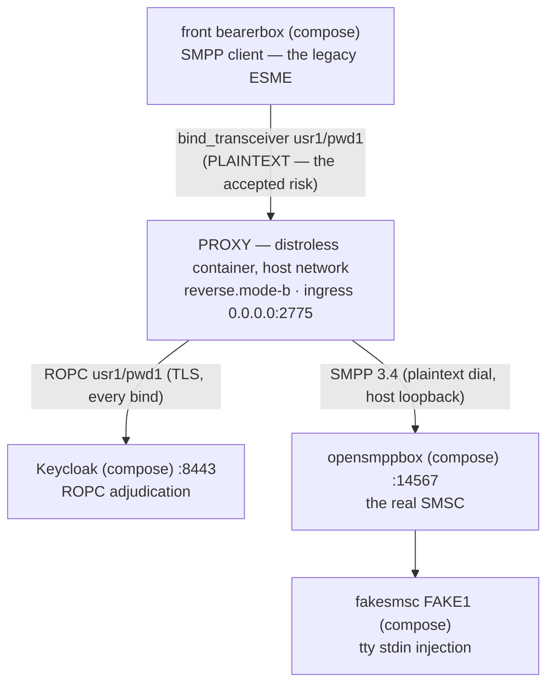

# Runbook — the dockerized `reverse.mode-b` combo (the lone reverse, legacy clients direct)

> **Status:** Story 6.3 T5 (2026-09-18). One of the three docker-packaged combo runbooks beside the
> sandbox's host-run `java -jar` recipe (README §5 — that recipe stays the debugger posture; these
> runbooks are the deployment-shaped way to run the same rig). This page is documentation only;
> nothing in the repository parses it. The cell's authoritative key reference is
> [`docs/configuration.md`](../../docs/configuration.md) (the AD-17 role × mode matrix); the image's
> facts live in [`docs/deployment-guide.md`](../../docs/deployment-guide.md) and
> [`docs/operator-jvm-flag-contract.md`](../../docs/operator-jvm-flag-contract.md).
> Русский перевод: [`reverse-mode-b.ru.md`](reverse-mode-b.ru.md).
> Every expected observation in this runbook was executed live on 2026-09-18's rig.

## 1. The use case — what operator problem this combo solves

You have **legacy ESMEs that speak plaintext SMPP and cannot be changed** (no TLS stack, no cert
management), and one aggregator SMSC whose credential authority you must put behind a central
adjudication screen. `reverse.mode-b` is the cheapest cell that solves it: ONE proxy instance,
the clients connect DIRECTLY to it (there is no forward tier in Mode B — it is reverse-only by
structure), every bind's password is adjudicated over ROPC at your IdP, and the SMSC stays the
sole credential authority beyond it (`smsc-users.txt` decides the last word, AD-32 case 4).

What you accept: the client-facing leg is PLAINTEXT — SMPP passwords transit it in the clear.
That is the registered accepted risk; the launch refuses without the explicit
`acknowledged=true` opt-in (SEC-052) and boots with the loud MODE B WARN banner as part of the
contract. What you get: central adjudication, the AD-33 collapsed wire deny (no enumeration
oracle for attackers), verbatim forwarding of the SMSC's own verdicts, and the full JSON-lines +
`/metrics` observability surface — with zero certificates to manage.

In this rig the "legacy ESME" is the front Kannel bearerbox (`usr1`/`pwd1` over
`host.docker.internal:2775`), the SMSC is opensmppbox + fakesmsc, and the IdP is the compose
Keycloak. It is README §5's cell exactly — one deployment shape over: the distroless image
instead of the host `java -jar`.

## 2. The chain



### The port plan (collision-checked — this combo has none)

| Port | Bound by | Notes |
|------|----------|-------|
| 2775 | the proxy container (`0.0.0.0`, host network) | The rig's wiring contract — the front conf dials `host.docker.internal:2775`; with `network_mode: host` the listener binds the host's own stack, so NO `-p` publish exists or is needed |
| 9090 | the proxy container (`127.0.0.1`, `/metrics`) | Host-network bonus over the bridge shape: the loopbound endpoint is scrapeable from the HOST directly — `curl http://127.0.0.1:9090/metrics` |
| 14567, 8443, others | the compose rig | Untouched — see README §3 |

One proxy listener + one metrics bind: nothing collides. The two-instance combos (mode A/C
runbooks) are where the port plan has to move things — see their tables.

## 3. Bring-up (zero → `bind_accept coupled`)

Run everything from the **repository root** (the `-v` sources are root-relative). Preconditions:
Docker up; once per machine, the image and jar built:

```bash
./gradlew :proxy:bootJar :proxy:dockerImage   # -> proxy/build/libs/proxy.jar + smpp-proxy:local
```

Then the rig + the one secret (README §4 and §5.1 are the full guides; the essentials):

```bash
cd sandbox && docker compose up -d --build && cd ..
# wait for pg + both bearerboxes + keycloak healthy: docker compose ps
# the §5.1 secret bootstrap (fresh keycloak containers REGENERATE the client secret):
curl --cacert sandbox/keycloak/certs/ca.pem \
     https://localhost:8443/realms/smpp-companions/.well-known/openid-configuration
docker compose -f sandbox/compose.yml exec keycloak /opt/keycloak/bin/kcadm.sh config truststore \
     /opt/keycloak/conf/truststore.p12 --trustpass smpp-test
docker compose -f sandbox/compose.yml exec keycloak /opt/keycloak/bin/kcadm.sh config credentials \
     --server https://localhost:8443 --realm master --user admin --password admin
CID=$(docker compose -f sandbox/compose.yml exec -T keycloak /opt/keycloak/bin/kcadm.sh get clients \
      -r smpp-companions -q clientId=smpp-client-confidential --fields id --format csv --noquotes)
docker compose -f sandbox/compose.yml exec -T keycloak /opt/keycloak/bin/kcadm.sh get \
      "clients/$CID/client-secret" -r smpp-companions
mkdir -p sandbox/secrets && printf '%s\n' '<generated>' > sandbox/secrets/oidc-client-secret
chmod 0444 sandbox/secrets/oidc-client-secret   # 0444, not §5.1's 0600: the container's UID 65532 must read it
```

Launch the combo:

```bash
docker run -d --name sandbox-proxy-b --network host \
      -v "$(pwd)/proxy/build/libs/proxy.jar:/opt/proxy.jar:ro" \
      -v "$(pwd)/sandbox/secrets/oidc-client-secret:/run/secrets/oidc-client-secret:ro" \
      -v "$(pwd)/sandbox/keycloak/certs/truststore.p12:/run/secrets/idp-truststore.p12:ro" \
      smpp-proxy:local \
      --companion.bind.host=0.0.0.0 \
      --companion.bind.port=2775 \
      --companion.reverse.mode-b.smsc.host=127.0.0.1 \
      --companion.reverse.mode-b.smsc.port=14567 \
      --companion.reverse.mode-b.acknowledged=true \
      --companion.reverse.mode-b.oidc.provider-url=https://localhost:8443/realms/smpp-companions \
      --companion.reverse.mode-b.oidc.client-id=smpp-client-confidential \
      --companion.reverse.mode-b.oidc.client-secret-path=/run/secrets/oidc-client-secret \
      --companion.reverse.mode-b.oidc.trust-store.path=/run/secrets/idp-truststore.p12 \
      --companion.reverse.mode-b.oidc.trust-store.password=smpp-test \
      --companion.reverse.mode-b.oidc.timeout=4s \
      --companion.reverse.mode-b.oidc.max-in-flight=64
```

The shape, in one breath: `--network host` puts the proxy in the host's network namespace — its
`127.0.0.1` dials reach the compose-published opensmppbox (14567) and Keycloak (8443), its 2775
listener is the host's 2775 (which `host.docker.internal` hairpins into), and its loopbound
`/metrics` is scrapeable from your shell. The jar bind-mount over `/opt/proxy.jar` (the image's
own copy of the same bytes) is the debug story — §5 below. The cell args are README §5.2's
exactly: the ONE flag set rides the image's exec-form ENTRYPOINT (never repeated here), the
`acknowledged=true` opt-in is the Mode B contract, and the two `:ro` secret mounts are the AD-18
by-path channel (`docker inspect` carries paths only, never values).

## 4. How to check — the expected observation per step (all live-observed 2026-09-18)

| Step | Expected observation |
|------|----------------------|
| `docker logs sandbox-proxy-b` — boot | ONE WARN JSON line, the MODE B banner text verbatim (`MODE B (plaintext) is ACTIVE on a REVERSE instance` — `CompanionModeBWarning`; it is part of the contract, not noise to silence), then `"event":"startup_summary"` with `"role":"reverse"`, `"mode":"b"`, `"smpp_bind_host":"0.0.0.0"`, `"smpp_bind_port":2775`, `"metrics_port":9090`, and the AD-30 interlock `"memory_budget_bytes":6442450944` == `"direct_memory_ceiling_bytes":6442450944` |
| The couple — within ~10 s (the front bearerbox's retry interval; observed ~4 s after ready) | `"event":"bind_accept"`, `"system_id":"usr1"`, `"outcome":"coupled"` — the front's bind crossed the container, ROPC-succeeded at the compose Keycloak, dialed opensmppbox, coupled on its ROK |
| `curl -s http://127.0.0.1:9090/metrics` (from the HOST — the host-network bonus) | `relay_binds_unknown_total 1.0` (the honest reverse-cell couple counter — no routing table, AD-19; `relay_binds_accepted_total{system_id=…}` is a forward-cell series). Keepalives tick `relay_pdus_total{direction}` +1 per leg per ~30 s (Kannel's `enquire_link`) |
| `curl "http://127.0.0.1:13000/status.txt?password=test"` | `smsc1 … SMPP:host.docker.internal:2775/2775:usr1:smsc1 (online …)` — and the §4 reconnect ERROR lines stop |
| `docker compose -f sandbox/compose.yml logs smsc-opensmpp-box` | the `bind_transceiver_resp` PDU dump with `command_status: 0` — the ROK that crossed the proxy back |
| A send (optional — README §6.1's journey) | `curl ".../cgi-bin/sendsms?...&dlr-mask=31...&text=hello"` → HTTP 202, fakesmsc prints the text intact, `relay_pdus_total` +2/+2 per leg for the submit pair, +2/+2 more when the DLR returns |

The failure arms (wrong egress port, stale secret, Keycloak down, missing secret file) produce
exactly README §5.4's signatures — same cell, same args, only the stdout surface is
`docker logs` instead of a terminal. Two arms are docker-specific (both pinned by the 5.2
Docker suites): a mounted secret file UID 65532 cannot read → the boot itself refuses, exit 1,
no `startup_summary`, the refusal naming the path (SEC-060); a typo'd `-v` source → Docker
silently creates a DIRECTORY there and the proxy answers `is a directory, not a file (OIDC
client secret) — refusing to start (SEC-060/AD-18)` instead of a mount error.

## 5. The debug story — swap the jar, restart the container

The image's `/opt/proxy.jar` is bind-mounted over, so the jar your container runs is the HOST
build output — the image itself can go stale without the rig noticing:

```bash
./gradlew :proxy:bootJar          # rebuild after any source edit (inputs tracked — no stale jar)
docker restart sandbox-proxy-b    # the running container keeps the OLD inode until the restart
```

The mechanics (verified live on this host, 2026-09-18): a bind mount pins the source file's
inode, and Gradle's jar write replaces the file atomically — a RUNNING container keeps reading
the old inode; `docker restart` re-resolves the source PATH and the next boot runs the new
bytes. Observed on this exact combo: first start couples (`bind_accept` #1), `docker restart`
re-couples within one front retry (`bind_accept` #2) — no image rebuild anywhere in the loop.
What you still lose versus README §5's host launch is the IDE debugger and the JDK toolbox
(`jcmd`, JFR) — when a session needs them, that recipe is the posture; this runbook is the
deployment-shaped one.

## 6. Where the logs live

| Surface | How |
|---------|-----|
| The proxy's JSON stdout | `docker logs sandbox-proxy-b` — the event spine (`startup_summary`, `bind_accept`/`bind_reject`, the WARN catalog); grep `"event":` |
| The proxy's `/metrics` | `curl -s http://127.0.0.1:9090/metrics` (host loopback — the host-network shape makes it directly scrapeable) |
| Keycloak | `docker compose -f sandbox/compose.yml logs keycloak` (`Realm 'smpp-companions' imported` at boot; ROPC traffic is not logged per-bind — the proxy's verdict lines are that surface) |
| Kannel (both sides) | `docker compose -f sandbox/compose.yml logs front-bearer-box` / `smsc-opensmpp-box` / … — full SMPP PDU dumps (`log-level = 4`), the wire tap AROUND the proxy |
| pg / fakesmsc | README §7's entry-point table |

## 7. Teardown

```bash
docker stop --timeout 30 sandbox-proxy-b   # -> exit 143 (docker inspect --format '{{.State.ExitCode}}')
docker rm sandbox-proxy-b
```

`--timeout 30` is deliberate (the deployment guide's rule): the walk can spend the full 10s
drain deadline plus release — a shorter wait lets the daemon SIGKILL mid-drain (exit 137).
Expected stream order (live-observed): `startup_summary` < `bind_accept` < the drain WARN
`shutdown drain deadline (PT10S) expired — force-closed 1 live pair(s) as SHUTDOWN_DRAIN
(OBS-020: …)` — Kannel never half-closes, so the force-close at the deadline is the norm here —
then exit 143. The front bearerbox returns to its §4 retry loop and re-couples on the next
launch. The compose rig itself tears down per README §9.
