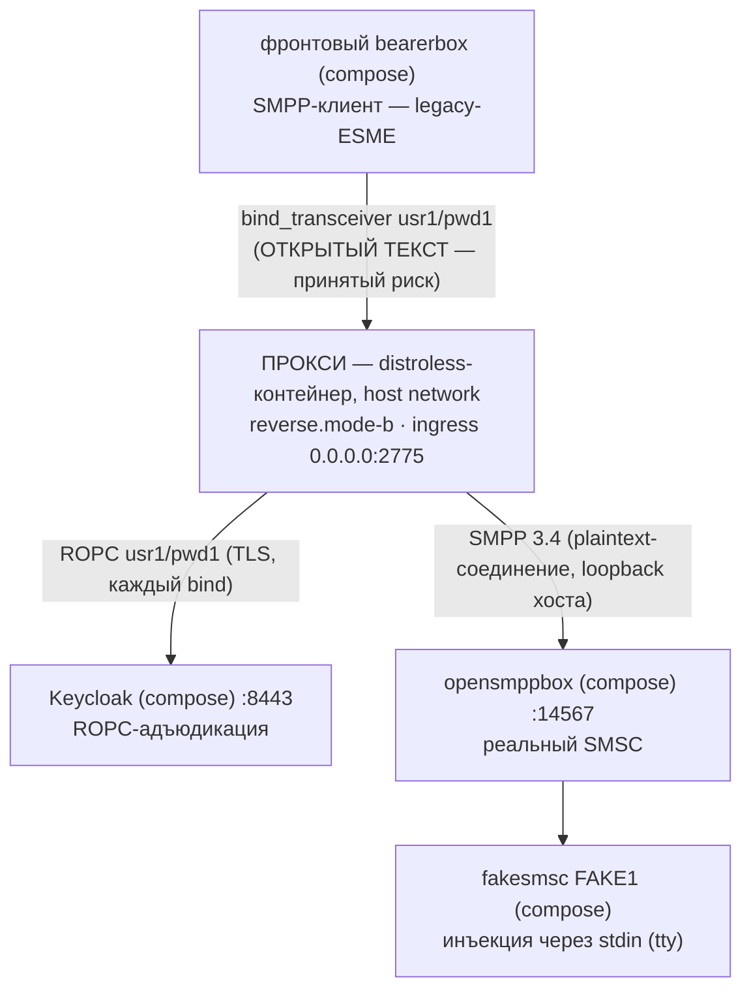

# Руководство — docker-вариант `reverse.mode-b` (одинокий reverse, legacy-клиенты напрямую)

> **Статус:** оригинал написан в рамках Story 6.3 T5 (2026-09-18); русский перевод — 2026-09-18,
> нормативен [английский оригинал](reverse-mode-b.md) — при расхождении истина в оригинале,
> автоматической сверки нет, согласованность «перевод ↔ оригинал» — обязанность ревью. Это одно
> из трёх руководств по docker-упакованным вариантам рядом с рецептом запуска прокси на хосте
> (README §5 — тот рецепт остаётся позой отладки). Страница — только документация, ничего в
> репозитории её не разбирает. Авторитетный справочник ключей варианта —
> [`docs/ru/configuration.md`](../../docs/ru/configuration.md) (матрица ролей × режимов AD-17);
> факты образа описаны в [английском `docs/deployment-guide.md`](../../docs/deployment-guide.md)
> и [`docs/ru/operator-jvm-flag-contract.md`](../../docs/ru/operator-jvm-flag-contract.md).
> Каждое ожидаемое наблюдение этой страницы исполнено вживую на стенде 2026-09-18.

## 1. Сценарий использования — какую задачу оператора решает этот вариант

У вас **legacy-ESME, говорящие на открытом тексте SMPP и не поддающиеся изменению** (нет
TLS-стека, нет управления сертификатами), и один агрегирующий SMSC, чей авторитет учётных
данных нужно поставить за центральный экран адъюдикации. `reverse.mode-b` — самый дешёвый
вариант, который это решает: ОДИН инстанс прокси, клиенты подключаются к нему НАПРЯМУЮ (в Mode B
нет уровня forward — он structurally только reverse), пароль каждого бина адъюдируется по ROPC
в вашем IdP, а SMSC остаётся единственным авторитетом учётных данных за ним (`smsc-users.txt`
говорит последнее слово, AD-32 случай 4).

Что вы принимаете: плечо к клиентам — ОТКРЫТЫЙ ТЕКСТ, пароли SMPP ходят по нему в ясном виде.
Это зарегистрированный принятый риск; запуск отказывает без явного opt-in `acknowledged=true`
(SEC-052) и поднимается с громким WARN-баннером MODE B как частью контракта. Что вы получаете:
центральную адъюдикацию, свёрнутый wire-deny AD-33 (перечисление учётных данных не даёт
оракула атакующему), verbatim-пересылку собственных вердиктов SMSC и полную поверхность
наблюдаемости JSON-lines + `/metrics` — без единого сертификата, которым нужно управлять.

В этом стенде «legacy-ESME» — фронтовый bearerbox Kannel (`usr1`/`pwd1` через
`host.docker.internal:2775`), SMSC — opensmppbox + fakesmsc, IdP — compose-Keycloak. Это в
точности вариант README §5 — одна форма развёртывания поверх: distroless-образ вместо
`java -jar` на хосте.

## 2. Цепочка



### План портов (проверен на коллизии — у этого варианта их нет)

| Порт | Кто слушает | Примечания |
|------|-------------|------------|
| 2775 | контейнер прокси (`0.0.0.0`, host network) | Контракт коммутации стенда — фронтовый конфиг звонит на `host.docker.internal:2775`; при `network_mode: host` слушатель встаёт в собственный стек хоста, поэтому НЕ нужен ни один `-p` |
| 9090 | контейнер прокси (`127.0.0.1`, `/metrics`) | Бонус host-network перед bridge-формой: endpoint на loopback читается НАПРЯМУЮ с хоста — `curl http://127.0.0.1:9090/metrics` |
| 14567, 8443, остальные | compose-стенд | Не трогаются — см. README §3 |

Один слушатель прокси + один metrics-bind: коллизий нет. Там, где варианты из ДВУХ инстансов
(руководства mode A/C), план портов вынужден двигать — см. их таблицы.

## 3. Запуск (с нуля → `bind_accept coupled`)

Все команды — из **корня репозитория** (источники `-v` относительны корня). Предусловия:
Docker поднят; один раз на машину собираются образ и jar:

```bash
./gradlew :proxy:bootJar :proxy:dockerImage   # -> proxy/build/libs/proxy.jar + smpp-proxy:local
```

Затем стенд и единственный секрет (README §4 и §5.1 — полные руководства; самое главное):

```bash
cd sandbox && docker compose up -d --build && cd ..
# дождаться pg + обоих bearerboxes + keycloak healthy: docker compose ps
# бутстрап секрета §5.1 (свежие контейнеры keycloak РЕГЕНЕРИРУЮТ секрет клиента):
curl --cacert sandbox/keycloak/certs/ca.pem \
     https://localhost:8443/realms/smpp-companions/.well-known/openid-configuration
docker compose -f sandbox/compose.yml exec keycloak /opt/keycloak/bin/kcadm.sh config truststore \
     /opt/keycloak/conf/truststore.p12 --trustpass smpp-test
docker compose -f sandbox/compose.yml exec keycloak /opt/keycloak/bin/kcadm.sh config credentials \
     --server https://localhost:8443 --realm master --user admin --password admin
CID=$(docker compose -f sandbox/compose.yml exec -T keycloak /opt/keycloak/bin/kcadm.sh get clients \
      -r smpp-companions -q clientId=smpp-client-confidential --fields id --format csv --noquotes)
docker compose -f sandbox/compose.yml exec -T keycloak /opt/keycloak/bin/kcadm.sh get \
      "clients/$CID/client-secret" -r smpp-companions
mkdir -p sandbox/secrets && printf '%s\n' '<generated>' > sandbox/secrets/oidc-client-secret
chmod 0444 sandbox/secrets/oidc-client-secret   # 0444, а не 0600 из §5.1: UID 65532 контейнера должен читать файл
```

Запуск варианта:

```bash
docker run -d --name sandbox-proxy-b --network host \
      -v "$(pwd)/proxy/build/libs/proxy.jar:/opt/proxy.jar:ro" \
      -v "$(pwd)/sandbox/secrets/oidc-client-secret:/run/secrets/oidc-client-secret:ro" \
      -v "$(pwd)/sandbox/keycloak/certs/truststore.p12:/run/secrets/idp-truststore.p12:ro" \
      smpp-proxy:local \
      --companion.bind.host=0.0.0.0 \
      --companion.bind.port=2775 \
      --companion.reverse.mode-b.smsc.host=127.0.0.1 \
      --companion.reverse.mode-b.smsc.port=14567 \
      --companion.reverse.mode-b.acknowledged=true \
      --companion.reverse.mode-b.oidc.provider-url=https://localhost:8443/realms/smpp-companions \
      --companion.reverse.mode-b.oidc.client-id=smpp-client-confidential \
      --companion.reverse.mode-b.oidc.client-secret-path=/run/secrets/oidc-client-secret \
      --companion.reverse.mode-b.oidc.trust-store.path=/run/secrets/idp-truststore.p12 \
      --companion.reverse.mode-b.oidc.trust-store.password=smpp-test \
      --companion.reverse.mode-b.oidc.timeout=4s \
      --companion.reverse.mode-b.oidc.max-in-flight=64
```

Форма одним абзацем: `--network host` ставит прокси в сетевой namespace хоста — его dial на
`127.0.0.1` достигает опубликованных compose-портов opensmppbox (14567) и Keycloak (8443), его
слушатель 2775 — это 2775 самого хоста (куда «шпилькой» попадает `host.docker.internal`), а его
`/metrics` на loopback читается из вашей оболочки. Bind-mount jar поверх `/opt/proxy.jar`
(собственной копии образа из тех же байтов) — это и есть история отладки, §5 ниже. Аргументы
варианта — в точности из README §5.2: ЕДИНСТВЕННЫЙ набор флагов едет в exec-form ENTRYPOINT
образа (здесь никогда не повторяется), `acknowledged=true` — контракт Mode B, а два секретных
монтирования `:ro` — канал «по пути» AD-18 (`docker inspect` содержит только пути, никогда
значения).

## 4. Как проверять — ожидаемое наблюдение на каждом шаге (всё исполнено вживую 2026-09-18)

| Шаг | Ожидаемое наблюдение |
|-----|----------------------|
| `docker logs sandbox-proxy-b` — загрузка | ОДНА WARN JSON-строка с текстом баннера MODE B дословно (`MODE B (plaintext) is ACTIVE on a REVERSE instance` — `CompanionModeBWarning`; это часть контракта, а не шум), затем `"event":"startup_summary"` с `"role":"reverse"`, `"mode":"b"`, `"smpp_bind_host":"0.0.0.0"`, `"smpp_bind_port":2775`, `"metrics_port":9090` и интерлоком AD-30 `"memory_budget_bytes":6442450944` == `"direct_memory_ceiling_bytes":6442450944` |
| Сопряжение — в пределах ~10 с (интервал retry фронтового bearerbox; вживую ~4 с после готовности) | `"event":"bind_accept"`, `"system_id":"usr1"`, `"outcome":"coupled"` — bind фронта пересёк контейнер, ROPC прошёл в compose-Keycloak, dial в opensmppbox, сопряжение на его ROK |
| `curl -s http://127.0.0.1:9090/metrics` (с ХОСТА — бонус host-network) | `relay_binds_unknown_total 1.0` (честный счётчик сопряжения reverse-варианта — без таблицы маршрутизации, AD-19; `relay_binds_accepted_total{system_id=…}` — серия forward-варианта). Keepalive тикают `relay_pdus_total{direction}` по +1 на плечо каждые ~30 с (`enquire_link` Kannel) |
| `curl "http://127.0.0.1:13000/status.txt?password=test"` | `smsc1 … SMPP:host.docker.internal:2775/2775:usr1:smsc1 (online …)` — и строки ERROR переподключения из §4 прекращаются |
| `docker compose -f sandbox/compose.yml logs smsc-opensmpp-box` | дамп `bind_transceiver_resp` с `command_status: 0` — ROK, вернувшийся через прокси |
| Отправка (необязательно — сценарий README §6.1) | `curl ".../cgi-bin/sendsms?...&dlr-mask=31...&text=hello"` → HTTP 202, fakesmsc печатает текст нетронутым; `relay_pdus_total` движется по бухгалтерии §6.1 — +1 `INGRESS` (`submit_sm`) и +1 `EGRESS` (его `submit_sm_resp`), затем ещё +1/+1 с возвратом DLR (`deliver_sm` приходит на плечо EGRESS, его resp пересекает INGRESS): итого 2/2 на плечо за весь сценарий. Всё сверх этого — keepalive-трафик из метрики-строки выше (`enquire_link`, +1/+1 за ~30 с на сопряжённой сессии, README §6.3) |

Плечи отказа (неверный порт egress, устаревший секрет, недоступный Keycloak, отсутствующий
файл секрета) дают в точности сигнатуры README §5.4 — тот же вариант, те же аргументы, меняется
лишь поверхность stdout: `docker logs` вместо терминала. Два плеча специфичны для docker (оба
закреплены docker-наборами 5.2): смонтированный файл секрета, нечитаемый для UID 65532 → отказ
при самом старте, exit 1, без `startup_summary`, отказ называет путь (SEC-060); опечатка в
источнике `-v` → Docker молча создаёт там КАТАЛОГ, и прокси отвечает `is a directory, not a
file (OIDC client secret) — refusing to start (SEC-060/AD-18)` вместо ошибки монтирования.

## 5. История отладки — пересобрать jar, перезапустить контейнер

`/opt/proxy.jar` образа перекрыт bind-mount'ом, поэтому jar, который исполняет контейнер, —
хостовой артефакт сборки; сам образ может устареть, и стенд этого не заметит:

```bash
./gradlew :proxy:bootJar          # пересборка после любой правки кода (входы отслеживаются — устаревшего jar не будет)
docker restart sandbox-proxy-b    # работающий контейнер держит СТАРЫЙ inode до перезапуска
```

Механика (проверена вживую на этой машине, 2026-09-18): bind-mount закрепляет inode файла-источника,
а запись jar в Gradle заменяет файл атомарно — РАБОТАЮЩИЙ контейнер продолжает читать старый
inode; `docker restart` заново разрешает ПУТЬ источника, и следующая загрузка исполняет новые
байты. Наблюдено на этом самом варианте: первый старт сопрягается (`bind_accept` №1),
`docker restart` пересопрягается в пределах одного retry фронта (`bind_accept` №2) — без
пересборки образа где-либо в цикле. Что всё ещё теряется относительно запуска на хосте из
README §5 — отладчик IDE и инструментарий JDK (`jcmd`, JFR); когда сессии нужны они, поза —
тот рецепт; это руководство — форма развёртывания.

## 6. Где описаны журналы

| Поверхность | Как |
|-------------|-----|
| JSON-stdout прокси | `docker logs sandbox-proxy-b` — хребет событий (`startup_summary`, `bind_accept`/`bind_reject`, каталог WARN); grep `"event":` |
| `/metrics` прокси | `curl -s http://127.0.0.1:9090/metrics` (loopback хоста — форма host-network делает его читаемым напрямую) |
| Keycloak | `docker compose -f sandbox/compose.yml logs keycloak` (`Realm 'smpp-companions' imported` при старте; трафик ROPC поштучно не журналируется — эта поверхность у строк-вердиктов прокси) |
| Kannel (обе стороны) | `docker compose -f sandbox/compose.yml logs front-bearer-box` / `smsc-opensmpp-box` / … — полные дампы SMPP PDU (`log-level = 4`), проводной перехват ВОКРУГ прокси |
| pg / fakesmsc | таблица точек входа README §7 |

## 7. Останов

```bash
docker stop --timeout 30 sandbox-proxy-b   # -> exit 143 (docker inspect --format '{{.State.ExitCode}}')
docker rm sandbox-proxy-b
```

`--timeout 30` выбран намеренно (правило руководства по развёртыванию): проход может израсходовать
весь 10-секундный дедлайн дрейна плюс освобождение — более короткое ожидание позволит демону
SIGKILL посреди дрейна (exit 137). Ожидаемый порядок потока (исполнено вживую):
`startup_summary` < `bind_accept` < WARN дрейна `shutdown drain deadline (PT10S) expired —
force-closed 1 live pair(s) as SHUTDOWN_DRAIN (OBS-020: …)` — Kannel никогда не полузакрывает
свою сторону, поэтому принудительное закрытие по дедлайну здесь норма — затем exit 143.
Фронтовый bearerbox возвращается к циклу retry из §4 и пересопрягается при следующем запуске.
Сам compose-стенд останавливается по README §9.
