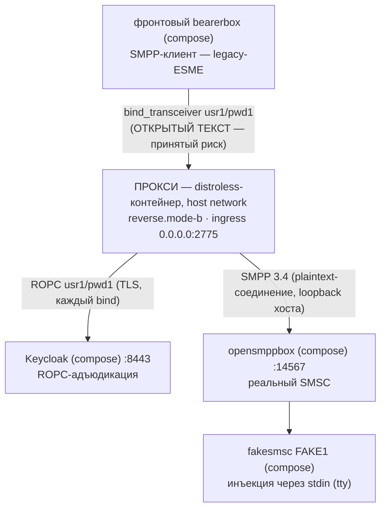

# Руководство — вариант использования `reverse.mode-b` (одинокий reverse; legacy-клиенты напрямую)

> **Статус:** оригинал написан в рамках Story 6.3 T5 (2026-09-18), переструктурирован в T6
> (2026-09-19 — операторо-ориентированная структура, упрощённая проза); русский перевод —
> 2026-09-19, нормативен [английский оригинал](reverse-mode-b.md) — при расхождении истина в
> оригинале, автоматической сверки нет, согласованность «перевод ↔ оригинал» — обязанность
> ревью. Это одно из трёх docker-руководств, по одному на вариант использования (роль + режим):
> [mode A](forward-reverse-mode-a.ru.md) · [mode C](forward-reverse-mode-c.ru.md). Рецепт
> запуска прокси на хосте (`java -jar`, поза отладки) — [README песочницы](../README.ru.md) §5.
> Каждое ожидаемое наблюдение этой страницы исполнено вживую на стенде 2026-09-18. Страница —
> только документация, ничего в репозитории её не разбирает.

## Назначение

У вас **legacy-ESME, говорящие на открытом тексте SMPP и не поддающиеся изменению**, и вы
хотите, чтобы пароль каждого бина проверялся в вашем IdP до того, как что-то достигнет SMSC.
Mode B — самый дешёвый вариант использования, который это делает: **один** инстанс прокси,
клиенты подключаются к нему напрямую, каждый bind адъюдируется по ROPC в вашем IdP, а SMSC
сохраняет последнее слово по учётным данным за ним (решает `smsc-users.txt`).

В этом стенде «legacy-ESME» — фронтовый bearerbox Kannel (`usr1`/`pwd1`), SMSC — opensmppbox +
fakesmsc, IdP — compose-Keycloak.



- **Что вы принимаете:** плечо к клиентам — открытый текст: пароли SMPP ходят по нему в ясном
  виде. Это зарегистрированный принятый риск: запуск отказывает без явного opt-in
  `acknowledged=true` и поднимается с громким WARN-баннером. Баннер — часть контракта, не шум,
  который надо глушить.
- **Что вы получаете:** центральную адъюдикацию; каждое собственное отрицание прокси
  сворачивается в один и тот же общий код на проводе — атакующий не получает из ответа ничего;
  собственные вердикты SMSC пересылаются verbatim; полные JSON-журналы + `/metrics` — и ни
  одного сертификата, которым нужно управлять.

## Быстрый старт

Все команды — из **корня репозитория** (источники `-v` относительны корня). Docker должен быть
поднят. Один раз на машину соберите образ и jar:

```bash
./gradlew :proxy:bootJar :proxy:dockerImage   # -> proxy/build/libs/proxy.jar + smpp-proxy:local
```

**1 — Поднимите стенд** (полное руководство: [README §4](../README.ru.md)):

```bash
cd sandbox && docker compose up -d --build && cd ..
# дождаться pg + обоих bearerboxes + keycloak healthy: docker compose ps
```

**2 — Заберите OIDC-секрет клиента.** Свежие контейнеры Keycloak регенерируют его, поэтому
повторяйте этот блок после каждого цикла `down` + `up` (полное руководство, включая альтернативу
через admin-console, — README §5.1):

```bash
curl --cacert sandbox/keycloak/certs/ca.pem \
     https://localhost:8443/realms/smpp-companions/.well-known/openid-configuration
docker compose -f sandbox/compose.yml exec keycloak /opt/keycloak/bin/kcadm.sh config truststore \
     /opt/keycloak/conf/truststore.p12 --trustpass smpp-test
docker compose -f sandbox/compose.yml exec keycloak /opt/keycloak/bin/kcadm.sh config credentials \
     --server https://localhost:8443 --realm master --user admin --password admin
CID=$(docker compose -f sandbox/compose.yml exec -T keycloak /opt/keycloak/bin/kcadm.sh get clients \
      -r smpp-companions -q clientId=smpp-client-confidential --fields id --format csv --noquotes)
docker compose -f sandbox/compose.yml exec -T keycloak /opt/keycloak/bin/kcadm.sh get \
      "clients/$CID/client-secret" -r smpp-companions
mkdir -p sandbox/secrets && printf '%s\n' '<generated>' > sandbox/secrets/oidc-client-secret
chmod 0444 sandbox/secrets/oidc-client-secret   # 0444, а не 0600 из §5.1: UID 65532 контейнера должен читать файл
```

**3 — Запустите прокси.** Коллизий в этом варианте использования нет: прокси занимает 2775
(порт, на который соединяется фронтовый конфиг) и 9090 (`/metrics`). Порты двигаются только в
вариантах из двух инстансов — см. их руководства.

```bash
docker run -d --name sandbox-proxy-b --network host \
      -v "$(pwd)/proxy/build/libs/proxy.jar:/opt/proxy.jar:ro" \
      -v "$(pwd)/sandbox/secrets/oidc-client-secret:/run/secrets/oidc-client-secret:ro" \
      -v "$(pwd)/sandbox/keycloak/certs/truststore.p12:/run/secrets/idp-truststore.p12:ro" \
      smpp-proxy:local \
      --companion.bind.host=0.0.0.0 \
      --companion.bind.port=2775 \
      --companion.reverse.mode-b.smsc.host=127.0.0.1 \
      --companion.reverse.mode-b.smsc.port=14567 \
      --companion.reverse.mode-b.acknowledged=true \
      --companion.reverse.mode-b.oidc.provider-url=https://localhost:8443/realms/smpp-companions \
      --companion.reverse.mode-b.oidc.client-id=smpp-client-confidential \
      --companion.reverse.mode-b.oidc.client-secret-path=/run/secrets/oidc-client-secret \
      --companion.reverse.mode-b.oidc.trust-store.path=/run/secrets/idp-truststore.p12 \
      --companion.reverse.mode-b.oidc.trust-store.password=smpp-test \
      --companion.reverse.mode-b.oidc.timeout=4s \
      --companion.reverse.mode-b.oidc.max-in-flight=64
```

✅ **Всё поднято, когда** `docker logs sandbox-proxy-b` покажет `"event":"bind_accept"`,
`"system_id":"usr1"`, `"outcome":"coupled"` — в пределах ~10 с.

## Что вы должны увидеть

| Проверка | Что вы должны увидеть |
|----------|----------------------|
| `docker logs sandbox-proxy-b` (загрузка) | Одна WARN-строка — баннер Mode B, `MODE B (plaintext) is ACTIVE on a REVERSE instance` — затем `"event":"startup_summary"` с `"role":"reverse"`, `"mode":"b"`, `"smpp_bind_host":"0.0.0.0"`, `"smpp_bind_port":2775`, `"metrics_port":9090` и `memory_budget_bytes` == `direct_memory_ceiling_bytes` == `6442450944`. |
| Сопряжение — в пределах ~10 с (вживую ~4 с после готовности) | `"event":"bind_accept"`, `"system_id":"usr1"`, `"outcome":"coupled"` — bind пересёк прокси, ROPC прошёл в Keycloak, соединение с opensmppbox, сопряжение на его ROK. |
| `curl -s http://127.0.0.1:9090/metrics` (с хоста) | `relay_binds_unknown_total 1.0` — счётчик сопряжений reverse-варианта (таблицы маршрутизации здесь нет; маркированная серия `relay_binds_accepted_total{system_id=…}` существует только у forward). Keepalive добавляют +1 к `relay_pdus_total{direction}` на плечо каждые ~30 с (`enquire_link` Kannel). Prometheus стенда (включён всегда) собирает метрики с того же эндпоинта каждые 5 с — соответствующая цель job `smpp-proxy` читается UP в его UI на `http://127.0.0.1:9095`; всегда прописанная цель 9091 в этой позе читается DOWN — ожидаемо ([README §5.3](../README.ru.md), пункт 7). |
| `curl "http://127.0.0.1:13000/status.txt?password=test"` | `smsc1 … SMPP:host.docker.internal:2775/2775:usr1:smsc1 (online …)` — и строки ERROR переподключения прекращаются. |
| `docker compose -f sandbox/compose.yml logs smsc-opensmpp-box` | Дамп `bind_transceiver_resp` с `command_status: 0` — ROK, вернувшийся через прокси. |
| Отправка — необязательно | `curl ".../cgi-bin/sendsms?...&dlr-mask=31...&text=hello"` → HTTP 202; fakesmsc печатает текст нетронутым; счётчики проходят 2/2 на плечо за весь сценарий (submit + resp, затем пара DLR) — сверх этого keepalive (`enquire_link`). Полный сценарий по шагам: [README §6.1](../README.ru.md). |

## Устранение проблем

| Симптом | Что это значит · что делать |
|---------|------------------------------|
| Запускается, но не сопрягается — тишина, нет `bind_accept` | Классические плечи (неверный порт egress, устаревший секрет, лежащий Keycloak) дают в точности сигнатуры из [README §5.4](../README.ru.md) — тот же вариант, те же аргументы; меняется только поверхность stdout: `docker logs`. |
| Отказ при старте, exit 1, отказ называет путь секрета | Смонтированный файл секрета нечитаем для UID 65532 образа — проверьте режим: `0444`, не `0600`. `startup_summary` не появляется; частичного старта не бывает. |
| Отказ при старте: `is a directory, not a file (OIDC client secret)` | Опечатка в источнике `-v` — Docker молча создаёт **каталог** по несуществующему пути. Исправьте путь, удалите лишний каталог. |

## Журналы

| Поверхность | Как |
|-------------|-----|
| JSON-stdout прокси | `docker logs sandbox-proxy-b` — grep `"event":` (`startup_summary`, `bind_accept`/`bind_reject`, каталог WARN). |
| `/metrics` прокси | `curl -s http://127.0.0.1:9090/metrics` (loopback хоста — в этой форме читается напрямую). |
| Keycloak | `docker compose -f sandbox/compose.yml logs keycloak` (`Realm 'smpp-companions' imported` при старте). Трафик ROPC поштучно не журналируется — эта поверхность у строк-вердиктов прокси. |
| Kannel, обе стороны | `docker compose -f sandbox/compose.yml logs front-bearer-box` / `smsc-opensmpp-box` / … — полные дампы SMPP PDU; проводной перехват вокруг прокси. |
| pg / fakesmsc | Таблица точек входа — [README §7](../README.ru.md). |

## Останов

```bash
docker stop --timeout 30 sandbox-proxy-b   # -> exit 143 (docker inspect --format '{{.State.ExitCode}}' sandbox-proxy-b)
docker rm sandbox-proxy-b
```

Ожидание 30 с выбрано намеренно: проход останова может израсходовать весь 10-секундный дедлайн
дрейна плюс освобождение; более короткое ожидание позволит демону SIGKILL посреди дрейна
(exit 137). Ожидаемый порядок потока: `startup_summary` < `bind_accept` < WARN дрейна
(`shutdown drain deadline (PT10S) expired — force-closed 1 live pair(s) as SHUTDOWN_DRAIN
(OBS-020: …)`) — Kannel никогда не полузакрывает свою сторону, поэтому принудительное закрытие
по дедлайну здесь норма — затем exit 143. Фронтовый bearerbox вернётся к своему циклу retry и
пересопряжётся при следующем запуске. Сам стенд останавливается по [README §9](../README.ru.md).

## Подробности и ссылки

### Почему `--network host`

- Прокси делит сетевой стек хоста: его соединения с `127.0.0.1` напрямую достигают
  опубликованных compose-портов opensmppbox (14567) и Keycloak (8443).
- Его слушатель 2775 — это собственный 2775 хоста: тот, на который соединяется фронтовый конфиг
  через `host.docker.internal` (он попадает туда «шпилькой»). Ни одного `-p` не существует и
  не нужно.
- Его `/metrics` на loopback читается прямо из вашей оболочки.

### Подмена jar

`/opt/proxy.jar` образа перекрыт bind-mount'ом, поэтому контейнер исполняет ваш **хостовой
артефакт сборки** — сам образ может устареть, и стенд этого не заметит:

```bash
./gradlew :proxy:bootJar          # пересборка после любой правки кода (входы отслеживаются — устаревшего jar не будет)
docker restart sandbox-proxy-b    # работающий контейнер держит СТАРЫЙ jar до перезапуска
```

Bind-mount закрепляет inode файла-источника, а запись jar в Gradle заменяет файл атомарно —
работающий контейнер продолжает читать старые байты; перезапуск заново разрешает путь
(проверено вживую: перезапуск пересопрягается в пределах одного retry фронта, без пересборки
образа). Относительно запуска на хосте из README §5 вы теряете отладчик IDE и инструментарий
JDK (`jcmd`, JFR) — [README §5](../README.ru.md) и есть рецепт для таких сессий.

### Примечания

- Набор JVM-флагов едет в exec-form ENTRYPOINT образа — JVM-флаги в `docker run` передавать
  не нужно (контракт: [docs/ru/operator-jvm-flag-contract.md](../../docs/ru/operator-jvm-flag-contract.md)).
- Два секретных монтирования `:ro` — канал «по пути»: `docker inspect` содержит только пути,
  никогда значения.
- Аргументы варианта использования — в точности набор хостового запуска из README §5.2;
  авторитетный справочник ключей — [docs/ru/configuration.md](../../docs/ru/configuration.md).

### Ссылки

- Поднятие стенда, полный бутстрап секрета, сигнатуры отказов, сценарии корректности,
  отладка — [README песочницы](../README.ru.md) (§4–§9).
- Факты образа: [docs/deployment-guide.md](../../docs/deployment-guide.md) (EN) и
  [docs/ru/operator-jvm-flag-contract.md](../../docs/ru/operator-jvm-flag-contract.md).
